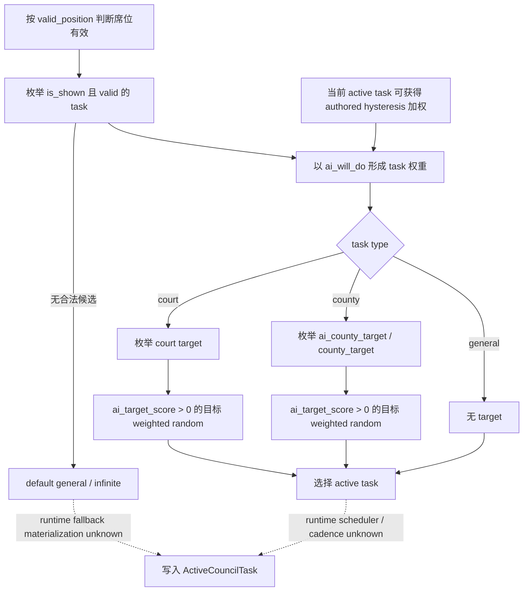
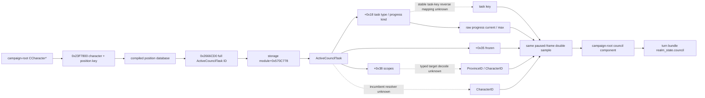

# CK3 1.19.0.6 内阁观测与发展任务原生入口

## 状态与施工范围

- **[static-confirmed; implementation/live pending]** 本专题冻结 G2-M1 当前统治者内阁观测所需的最小字段、首个可落地 native 入口和仍未闭合的边。本包只使用 exact-build EXE、随游戏发布的原版 council 定义与 GUI reflection 调用点，没有启动 CK3，也没有修改 bridge、MCP 或 planner。
- 目标是把 `campaign-root-context-v1` 与 `xar.ck3.turn-bundle/v1` 中当前 unavailable 的 council 输入变成同一 paused frame 的 typed observation。它不实现任命、换任务、发展策略或其它内阁动作。
- M1 首次 live gate 只要求当前封建统治者场景。游牧 kurultai、天朝 ministry 和 vizier 变体进入同一可扩展 schema，但不能由首个封建 fixture 冒充已经覆盖。
- 宫廷司祭只作为 opaque council position/task 被观察。信仰、教义、教义条目、宗教热情、改宗和宗教改革继续遵守 owner-deferred 边界。

## Exact-build 冻结

| 资产 | 精确值 |
|---|---|
| CK3 build | `1.19.0.6` |
| `binaries/ck3.exe` 大小 | `95,206,008` bytes |
| `binaries/ck3.exe` SHA-256 | `2D00FF3101EF70B566F2FCBAE292F09263199C80E9DC8F139B82D7D96F83DB86` |
| `launcher/launcher-settings.json` SHA-256 | `23085950A98A8A85059B6E5AEA87F8B8A5D2698AB5633C21CEE1FC5019691368` |

下述 RVA 均以这份 EXE 的模块基址为零点。EXE、build 或原版 council 数据变化后，地址、对象布局和 position/task vocabulary 一律失效，必须先重新定位再升级证据等级。

## 原版定义提供的稳定 vocabulary

### Position key

原版 `game/common/council_positions/` 在该 build 定义了 15 个稳定 key：

| 族 | position key | 生效边界 |
|---|---|---|
| 常规 | `councillor_chancellor`、`councillor_steward`、`councillor_marshal`、`councillor_spymaster`、`councillor_court_chaplain` | 常规统治者席位，具体有效性仍由各 position 的 `valid_position` 决定 |
| 配偶 / 摄政型 | `councillor_spouse`、`councillor_vizier` | 配偶为自动填充；vizier 要求 `may_appoint_viziers` government flag |
| 游牧 | `councillor_kurultai_1` 至 `councillor_kurultai_4` | `government_is_nomadic` |
| 天朝 ministry | `minister_personnel`、`minister_justice`、`minister_works`、`minister_grand_marshal` | `tgp_has_access_to_ministry_trigger` |

因此不能把“内阁”硬编码成固定五席，也不能用 GUI 当前可见行数定义完整性。首个实现应冻结这 15 个 key 的 exact-build allowlist，再由 native active-position/task 状态判定本角色的 effective set。

### Task type 与 progress kind

`game/common/council_tasks/_council_tasks.info` 直接定义：

- task type 只有 `general`、`county`、`court`；
- progress kind 只有 `infinite`、`percentage`、`value`；
- county task 的 typed scope 是目标 county 与其 capital province；
- court task 的 typed scope 是 `target_character`；
- `default_task` 只能是 `general + infinite`；
- `ai_target_score` 中权重大于零的目标进入 weighted random，`ai_will_do` 决定任务权重。

五个常规席位覆盖了 M1 所需的代表性形状：默认 general/infinite、steward 的 county/value `task_develop_county`、county/percentage 任务，以及 spymaster 的 court/percentage `task_find_secrets`。配偶、vizier、kurultai 与 ministry 另有各自 key，不能从常规五席外推其实机覆盖。

## 已闭合的 native 读取入口

### Character + position key -> ActiveCouncilTask

**[static-confirmed]** reflection 名 `GetCouncillorPosition` 的 canonical string 位于 RVA `0x430D258`。两个注册点分别位于 `0x4E3323` 和 `0x4E34A3`，注册函数范围为 `0x4E32B0..0x4E3428` 与 `0x4E3430..0x4E35B4`；对应 callback/thunk 为 `0x2435C00..0x2435C8B` 与 `0x2435C90..0x2435D35`，最终都到达 core `0x23F7800`。

`0x23F7800(CCharacter*, position_key)` 的已证行为是：

1. 以稳定 position key 查询 compiled council-position database；
2. 经 `0x2666CD0` 取得带 generation 的完整 `ActiveCouncilTask` ID；
3. 通过 storage pointer `module+0x570C778` 解引用；
4. 以对象 `+0x10` 的完整 ID 做 generation round-trip 校验；
5. 失败时走 `module+0x570C6D8` 的 canonical fallback pointer。

这条角色根对象路径是首个 production reader 的推荐入口。它复用 campaign-root 已经验证的 `CCharacter*` 根和同帧事务，不依赖 `CouncilWindow`、屏幕可见性、OCR 或焦点状态。

| 精确切片 | 长度 | SHA-256 |
|---|---:|---|
| core `0x23F7800..0x23F792D` | 302 | `A1635EE0E875A0D93B24894B88E71CDC86B60849ECA938C3B2877014D0FDF1F7` |
| thunk `0x2435C00..0x2435C8B` | 140 | `88D799FCD8E0CE9E4B1EEFD19A9D78824F66060D0CC9409DFBFE1C50C2FFB9DC` |
| thunk `0x2435C90..0x2435D35` | 166 | `4B29E80B8F2E02933508AEF467BA99E4CFB007C96E8A9FFB819D0F777E1C5E9C` |
| registration `0x4E32B0..0x4E3428` | 377 | `084A2DC06E381D34C4C726EABD4FEFBE0942B9226AFA1BC6FC2B940459257BEB` |
| registration `0x4E3430..0x4E35B4` | 389 | `9418521840D9B267426BDC69F731A2F8029E488AFAB4B90B9A37A4A7D176DFD8` |

### ActiveCouncilTask 最小布局与进度

**[static-confirmed]** 当前已闭合的直接字段为：

| 偏移 | 语义 | 证据边界 |
|---:|---|---|
| `+0x10` | full-generation ActiveCouncilTask ID | core 的对象 ID round-trip |
| `+0x18` | `CouncilTaskType*` | progress getter 读取其 `+0x4C` progress-kind enum |
| `+0x20` | 非 value 任务的 raw current progress | `GetProgressFloat` core |
| `+0x35` | `IsFrozen` byte | `0x23BABA0` 直接读 byte |
| `+0x38` | `CouncilTaskScopes` | value current/max evaluator 的 scope 参数 |

`GetProgressFloat` 注册名位于 `0x4306F18`，callback `0x23BBE30` 到 core `0x23BAC10`；`GetProgressMaxFloat` 注册名位于 `0x4306E68`，callback `0x23BBE70` 到 core `0x23BAC50`。两个 UI float getter 都把 raw 值按 Q100000 缩放。percentage 的 max raw 为 `10,000,000`，即 `100 * Q100000`；value 的 current/max 分别调用 `0x2D650A0` / `0x2D65390`，并传入 `task+0x38` scopes。

| 精确切片 | 长度 | SHA-256 |
|---|---:|---|
| current core `0x23BAC10..0x23BAC4E` | 63 | `2227E60C4BCA908F5D4F46859C837CD1445CE50284A02C020E19E040F00225D6` |
| max core `0x23BAC50..0x23BAC9E` | 79 | `AA79313B8F07F7E6652BC91EFD5D9B47B4A75B36B3A50508B2E812DD0D8282D0` |

`GetETA` callback 会返回 formatter/localization string，不适合作为 machine ABI。若以后需要 ETA，应从 typed raw progress 与已证 rate 计算，不能把本地化文本塞进状态合同。

### GUI 只作 reflection 佐证

**[static-confirmed]** 原版 `window_council.gui` 使用 `CouncilWindow.GetCouncillor(position_key)`、`GuiCouncilPosition.GetActiveCouncilTask`，随后读取 `ActiveCouncilTask.GetPositionType`、`GetCouncillor`、`GetTaskTypeOrDefault`、`GetTaskTarget`、`GetProgressFloat`、`GetProgressMaxFloat`、`GetETA` 和 `IsFrozen`。`shared/misc_components.gui` 还直接从 `GetPlayer.GetCouncillorPosition('councillor_court_chaplain')` 取得 active task。

这些调用确认 surface 存在，但 GUI 的 `GetTaskTarget` 和 `GetETA` 都面向显示文本，不能当 typed identity。首个 native reader 不应实例化或依赖 `CouncilWindow`。

## 原版任务选择树

下图来自 exact-build 原版 task 定义，描述 authored AI 数据的候选和权重语义。runtime scheduler、候选归一化与切换 cadence 尚未闭合，图中虚线分支保持 unknown。本包不设计 counter-policy。



## 推荐的 native 数据流



## 最小 schema 建议

`campaign-root-context-v1` 增加一个 `council` component，并沿用 application-main paused、同 public/native revision、同 snapshot/date 的两次相同采样事务。turn bundle 只投影这一份事实源，不另建第二个 council RPC。

```json
{
  "council": {
    "status": "available",
    "owner_character_id": 123,
    "positions": [
      {
        "position_key": "councillor_steward",
        "incumbent_character_id": 456,
        "task_key": "task_develop_county",
        "task_type": "county",
        "target": {
          "status": "available",
          "kind": "province",
          "province_id": 789
        },
        "frozen": false,
        "progress": {
          "status": "available",
          "kind": "value",
          "current_raw_q100000": 4200000,
          "max_raw_q100000": 10000000
        }
      }
    ]
  }
}
```

合同规则：

- 席位合法但空缺时仍保留 position row，`incumbent_character_id=null`；非法席位不能伪装成空缺。
- `general` task 的 target 为 `not_applicable`；`infinite` progress 的 current/max 为 `not_applicable`。
- `county` target 至少发布带 generation 校验的 `ProvinceID`；需要 county title 时可后续加 `county_title_id`，不能用显示名替代。
- `court` target 发布带 generation 校验的 `CharacterID`。
- position row 按 position key 的 unsigned UTF-8 byte order 排序；不要使用会随 government 和 UI layout 改变的屏幕顺序。
- 任一 required row 发生非法 ID、重复 key、task type 与 target kind 不符、首尾样本漂移或结构读取失败，整个 council component 返回 typed unavailable。不得用部分旧值补齐。
- `GetETA` 文本、GUI tooltip、main skill、powerful-vassal 标志均不进入 M1 最小合同。main skill 属于后续效果评估，powerful-vassal 属于治理/派系响应。

turn bundle 的 `realm_state.council` 应原样投影该 component。只有同时满足下列条件，`readiness.realm_council_ready` 才能变为 `true`：

1. council owner 与 played character 相同；
2. exact active-position set 中每个 effective seat 恰好出现一次；
3. 每行都有稳定 position key、incumbent 或已证空缺、稳定 task key/type、frozen，以及适用时的 typed target 和 typed progress；
4. 所有非空 CharacterID / ProvinceID 完成 full-generation round-trip；
5. 同一 paused frame 的两次采样逐字段相同。

首个 current-feudal live gate 应至少覆盖常规五席，以及该角色实际有效的 spouse 或 vizier row；它不把 nomad/ministry/vizier 未出现分支标成 live-complete。

## 仍需闭合的边

| 状态 | 缺口 | 下一项精确工作 |
|---|---|---|
| **[unknown]** | incumbent resolver / offset | 从 ActiveCouncilTask 对应的 `GetCouncillor` registration 隔离 leaf；同名 reflection 在多类上注册，不能直接选第一个 xref |
| **[unknown]** | `CouncilTaskType*` 到稳定 task key | 闭合 `GetTaskTypeOrDefault` 或 task database 的 pointer-to-key 反查，不发布地址或本地化名 |
| **[unknown]** | county/court typed target scope 布局 | 按 task type 分支解码 scopes，并对 ProvinceID / CharacterID 做 generation round-trip；不用 `GetTaskTarget` 显示字符串 |
| **[unknown]** | legal vacant 与 invalid-government position 的 fallback 差异 | 先静态闭合 `0x23F7800` caller/fallback 语义；仍不充分时才在一次既定 M1 paused fixture 中对照 |
| **[unknown]** | runtime scheduler/cadence | 只影响后续 counter-policy，不阻塞首个只读 snapshot；保留在原生树虚线分支 |
| **[live pending]** | feudal effective-seat completeness | 在既定两场景 M1 live 中做一次有界 paused query，不安排专用长跑 |
| **[live pending]** | nomad/ministry/vizier variants | 后续各自独立 fixture；不能由 feudal scene 推断 |

## 最小实施与验收顺序

1. 在现有 campaign-root mailbox 内增加 `CouncilSnapshotV1`，使用冻结的 15-key allowlist 和 `0x23F7800`，不创建新 service/RPC。
2. 静态闭合 effective-seat / fallback 语义、incumbent resolver、stable task-key reverse mapping，以及 general/county/court 三种 typed target。
3. 复用已有 CharacterID / ProvinceID generation 校验；增加 frozen 与 Q100000 raw progress；做同帧 double sample。
4. Python contract 先发布 campaign-root council，再让 turn bundle 原样投影；未全部闭合前继续 `realm_council_ready=false`。
5. 聚焦 fixture 只覆盖：一个常规封建已填充 council、一个空缺席位、一个 general/infinite、一个 county/value；失败例覆盖 generation mismatch、重复 position、target-type mismatch 与 sample drift。
6. 在已经要求的 M1 两场景 live 中做一次 paused 读取。原版 panel 只供人工对照，native typed row 才是验收事实；不为单字段另跑长期 campaign。

`task_develop_county` 解锁的是“知道当前 steward 正在何处发展、进度多少”的可见价值。是否应切换到该任务、如何挑县和何时换人仍需在本专题原生 runtime tree 继续闭合后再设计策略。

## 静态证据账本

| 文件 | SHA-256 | 用途 |
|---|---|---|
| `game/common/council_positions/_council_positions.info` | `3018B801E7FE01AAD8D8B2F78FA691DA4E6924737F4430F0ED19757F03D67B29` | position schema |
| `game/common/council_positions/00_council_positions.txt` | `8D667AFE296D987F2E849A5C55B17EF9A98E73B9E73E925898EA2986B3155909` | 常规、spouse、vizier、kurultai positions |
| `game/common/council_positions/01_ministry_positions.txt` | `891B6B129BE55D4BA4678A83B93A240BA53B3705C618C02B116F99C1A2E75272` | ministry positions |
| `game/common/council_tasks/_council_tasks.info` | `CA9BC5D06ADC414ED8A28B47E4D3BDACDBB30093E94FBD33FE1A80FE518B8A2A` | task type/progress/scope/AI authored contract |
| `game/common/council_tasks/00_chancellor_tasks.txt` | `503E04F591067DE14E8EC50D435717100BFC0BD678A032E7BF4052CB4FBF9A84` | chancellor tasks |
| `game/common/council_tasks/00_steward_tasks.txt` | `B3087378E04D0CDF7B1C1BEBF97FD17E36D8684DDD157D4FB0647B1D5681FC4B` | steward/development tasks |
| `game/common/council_tasks/00_marshal_tasks.txt` | `F0CB7FC6732DF1EF5F87AC26C5042F66CBE33F2501E15E4A3B7295E2921F94B9` | marshal tasks |
| `game/common/council_tasks/00_spymaster_tasks.txt` | `EBE10909D2618AE9B6360C738397F6304C6D61FA597DBA16232772C05B4E0613` | spymaster tasks |
| `game/common/council_tasks/00_court_chaplain_tasks.txt` | `FEC88B59DEE0187CBDED653B84731E14B8F64E445A11FF3CCFD52D7CBEC73089` | chaplain tasks |
| `game/common/council_tasks/00_spouse_tasks.txt` | `661F7E9867DE29132A73BFDCD12C497BCD3473C7782208EAF69DFA86A5AC4088` | spouse tasks |
| `game/common/council_tasks/00_vizier_tasks.txt` | `9B27DCD494F93ED0A451E1EA5CF6C78C99912AD750E5F4CF2453A321A7A57DF6` | vizier tasks |
| `game/common/council_tasks/00_kurultai_tasks.txt` | `CAFEEDBC72C11829CC15B1770992A0EA689ECF5A595EA7CF895998A26C07630F` | kurultai tasks |
| `game/common/council_tasks/01_ministry_tasks.txt` | `E34EFD72DE1175990B71A32B62D1EC98858A304E817FCC487E985EFC1AAB5E42` | ministry tasks |
| `game/gui/window_council.gui` | `AC142DC4D4F18EEEB241C7B9DBDE1F737DF8D0D7114FF4CA845DC3E9A230BAAE` | council reflection consumer |
| `game/gui/shared/value_breakdown.gui` | `46CF546F9A0DB824E5CE38FAC1B11593672962E3F3793B62E559435FB9D71525` | progress/max/ETA display consumer |
| `game/gui/shared/misc_components.gui` | `6FBD971001D40C23E79033EDDC0E53F32FE814DE056F6F2E67131ECF056196A1` | direct `GetPlayer.GetCouncillorPosition` consumer |

这里的 `game/...` 都是 `Crusader Kings III/game/...` 下的 exact-build 原版文件。固定 GUI 场景或既有 `opening_smoke.py` 只能证明特定画面流程，不能证明 native council completeness，因此不列作本专题的状态证据。
