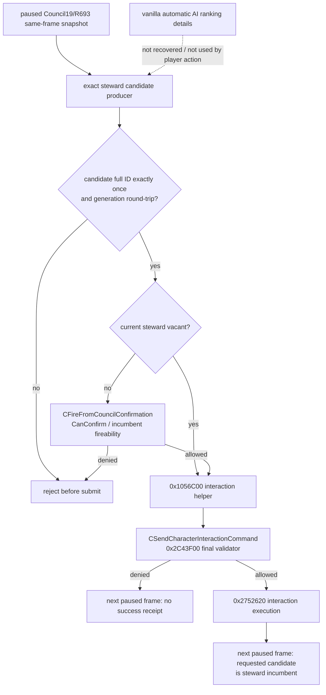

# 议会任命动作：原生调用链与私有语义合同

## 当前状态

**static-ready semantic core + exact submit adapter / private / unadvertised**。本专题冻结 CK3
`1.19.0.6` 中玩家为 `councillor_steward` 任命或替换人选的真实原生路径，实现最小动作核心，
并实现只接受 exact-build、application-main thread 和私有准入的 `0x1056C00` submit adapter。
R693 frame、incumbent 与最后一次 candidate/fireability 复核尚未组装成 production shared glue；它还没有
绑定到 bridge、MCP 或正式策略，也没有实机提交证据，因此不得把
`game.action.assign-councillor-v1` 广告为可用能力。

冻结版本：

- `ck3.exe`：`1.19.0.6`
- SHA-256：`2D00FF3101EF70B566F2FCBAE292F09263199C80E9DC8F139B82D7D96F83DB86`
- ABI 清单：
  `ck3_autonomous_player/native_bridge/research/council_assignment_action_1_19_0_6_abi.json`
- 只读复核：
  `py ck3_autonomous_player/native_bridge/research/verify_council_assignment_action_1_19_0_6.py --exe "Crusader Kings III/binaries/ck3.exe"`

本动作只覆盖普通非 guest 人选的总管席位。`swap_position`、招募 guest、已在议会中的人物调任，
以及其它 council position 均不在 v1 范围内。

## exact-build 原版输入

原版 `game/common/council_positions/00_council_positions.txt:142-270` 定义了
`councillor_steward`：主能力为 `stewardship`，席位对 landless adventurer 与 nomadic
government 无效；候选最终经过 `can_be_steward_trigger` 或天朝 ministry 的
`tgp_can_be_a_minister_trigger`。这些脚本定义是职位与候选门，不能替代原生命令。

原版 `game/gui/window_council_potential_councillor.gui:191-216` 给出玩家入口：

- 未在议会、非 guest 的人选点击 `set_position`；按钮还要求
  `PotentialCouncillorWindow.CanFireCouncillor` 且没有 pending interaction。
- 已在议会的人物也可点击 `set_position`，但这是 v1 明确排除的 reassign 路径。
- `swap_position` 与 guest recruitment 有各自独立入口，不能借用本合同。

R684/R693 的现有候选 reader 负责产生 `councillor_steward` 的 full CharacterID 集合。
本动作不会接受策略缓存中的任意人物 ID；提交前必须重新运行 exact producer，要求目标恰好出现一次，
并通过 generation round-trip。

## 原生任命与替换路径

`set_position` handler 位于 `0x10573C0..0x1057673`：

- 席位空缺时，`0x105752B` 直接调用 `0x1056C00(candidate_full_id,
  active_task_full_id)`。
- 席位有现任者时，handler 构造 `CFireFromCouncilConfirmation`。其主虚表
  `+0x38 -> 0x105C770` 是 `CanConfirm` 链；`+0x48 -> 0x105C940` 是确认提交。
  确认函数重新解析人物后，在 `0x105C9F8` 或 fallback `0x105CA0F` 调用同一
  `0x1056C00` helper。

`0x1056C00..0x1056DA3` 读取当前玩家，构造 interaction payload，把 active council task
full ID 写入 payload，构造 `CSendCharacterInteractionCommand`，再于 `0x1056D19` 交给
通用 command manager `0x973E00`。

`CSendCharacterInteractionCommand` RTTI 为
`.?AVCSendCharacterInteractionCommand@@`。它的 validator 虚表槽经
`0x26B3350 -> 0x2C43F00`，后者调用 `0x2C42A30` 重新执行原生 interaction
合法性；executor 经 `0x26B32D0 -> 0x26B30A0 -> 0x2752620` 进入 interaction
执行分派。这说明 helper 调用前的复核不能替代 command-time 原生最终合法性。

自动填充的完整 AI 排名细节本轮没有恢复；它不参与玩家正式策略的显式人选提交。正式策略的人选选择仍需
依据已冻结的原生候选集合和公开观测自行排序，未知的原版自动排名不得被臆测成已知评分。

## 私有动作合同

实现位于：

- `include/xar_bridge/council_assign_councillor_action_v1.hpp`
- `src/council_assign_councillor_action_v1.cpp`
- `src/council_assign_councillor_native_submit_adapter_v1.cpp`
- `src/council_assign_councillor_action_v1_test.cpp`

请求固定 `position_key=councillor_steward`，携带 candidate full ID，并绑定同一帧的
`snapshot_id/public_revision/native_revision/date_raw/owner_character_id` 与原 incumbent。
`PrepareCouncilAssignCouncillorActionRequestV1` 直接消费 COUNCIL19 的
`CouncilCompositionCandidatesPublicV1`：只有 public readiness 七项全部为真、目标 row 唯一且
`eligible=true`、row 与顶层 `assign/replace` route 一致时才产生请求。能力列表或手工拼接的 ID
不能绕过这个 typed 输入门。
动作核心执行以下顺序：

1. exact-build、私有候选开关、application-main thread 与 paused frame 门；
2. owner、active task、incumbent 的 full-ID generation round-trip；
3. exact candidate producer 的恰好一次命中及候选 round-trip；
4. 拒绝 current councillor、guest、pending interaction；替换时强制要求原生 incumbent
   fireability 已评估且允许；
5. 再捕获一次完全相同的前置帧，状态漂移则拒绝；
6. 仅调用 `candidate_full_id + active_task_full_id` 的原生 helper。

helper 是 `void`，而且没有传播 command manager 的返回值。因此即时 ACK 名称固定为
`native_helper_invoked_verification_pending`，`queue_acceptance_observed` 必须为 `false`。
任何代码都不得把这个 ACK 写成 assigned、applied、success 或 command accepted。

成功 receipt 必须来自**另一个** paused frame，同时满足：

- snapshot ID 已变化；public 与 native revision 都严格增加；日期不倒退；
- owner、position 与 active steward task 仍相同并完成 identity round-trip；
- `councillor_steward` incumbent 已变为请求的 candidate full ID，并完成 generation
  round-trip。

否则 receipt 是 `postcondition_failed`，策略不得因为 ACK 重复提交。

### 实际 binding 边界

本包已经绑定的 production seam 只有 `candidate_full_id + active_task_full_id -> module_base +
0x1056C00`。adapter 在非 exact build、非 application-main thread、未显式私有准入、ABI 未认证、
production 路径混入测试 override 时全部 fail-closed。Debug/Release fixture 只验证参数与门禁；它没有
调用 CK3，也不是 live action 证据。

尚未绑定的是动作核心的 `capture_frame` 与 `recheck_final_legality`：前者需要把 R693 reader、
Council19 incumbent 与 pending-interaction 状态锁到同一 paused revision；后者需要在提交当下重新运行
exact candidate producer，并为替换路径取得与 `CFireFromCouncilConfirmation::CanConfirm` 等价的
incumbent fireability 结果。只把这两个回调留给 fixture 不构成可执行动作。本包把它们保持显式依赖，
所以默认 production 无法越过 `callbacks_unavailable/private_candidate_not_admitted`。

## 正式接入前唯一动态观测点

下一步只需要一个 bounded paused-live shared-glue 候选：把本核心的两个未绑定回调接到 R693 reader
的同帧 owner/task/candidate、Council19 incumbent 与原生 fireability 复核；submit 复用本包已经冻结的
exact `0x1056C00` adapter。选择原生门允许的总管人选提交一次，随后读取新的
paused Council19 frame 验证 incumbent。该候选必须同时保留 helper-invoked ACK、原生日志与后置
incumbent 观测。

这次观测 GREEN 后才能增加私有 bridge/MCP 路由并进行正式策略消费验证；在此之前保持
`kCouncilAssignCouncillorAdvertisedByDefaultV1=false`。失败时保留 RED，并从 command-time
validator 或后置 incumbent 差异继续定位，不进行无修改重复提交。

## COUNCIL23 shared runtime 与 wire 冻结

COUNCIL23 已把 Council7 private read、Council21 enrichment/public projection 与
Council22 semantic submit/receipt 接入同一个 application-main executor。submit 会在同一执行事务内
捕获前置帧、重新运行 exact candidate producer、校验 candidate 唯一命中及 identity round-trip，
再执行 final-legality 回调；只有全部门通过才调用 `0x1056C00`。ACK 仍只表示
`native_helper_invoked_verification_pending`，绝不表示 command manager 已接受。receipt 使用独立、
更晚的 paused mailbox ticket，并仅在 candidate 已成为同一 active task 的 incumbent 时返回
`applied`。

worker wire 的 step 固定为：

- 查询：`query-council-composition-candidates-v1`；payload 为
  `council_composition_candidates`。
- 提交：`assign-councillor-v1`；payload 为 `council_assign_councillor_ack`。
- 收据：`query-assign-councillor-receipt-v1`；payload 为
  `council_assign_councillor_receipt`。

顶层 `request_id` 始终是当前 pipe 请求 ID。Council22 semantic request ID 在嵌套 ACK/receipt
中固定投影为 `action_request_id`；submit 的 semantic ID 等于该次 submit pipe ID。receipt v1
只允许一个 pending assignment，因此新 receipt 请求不再携带 action ID，嵌套 receipt 返回原 submit
的 `action_request_id`。`query_sequence` 是每次 mailbox ticket，submit 与 receipt 必须不同，不能拿它
做动作相关 ID。

当前真实未闭合点没有被隐藏：production 尚未提供同时覆盖
`candidate_already_councillor`、`candidate_is_guest`、
`pending_character_interaction` 及替换路径
`CFireFromCouncilConfirmation::CanConfirm` fireability 的 final-gate binding。因此
`CouncilApplicationMainActionRuntimeReadyV1` 在 production 配置下仍为 false，bridge 不注册、
不广告 action。offline fixture 的 GREEN 只证明事务顺序、拒绝路径、helper-only ACK 和独立后帧 receipt
合同；它不是 live action。下一步应只绑定这些现存 gate、注册 worker 路由并执行一次 bounded paused
候选，不扩张新能力。
