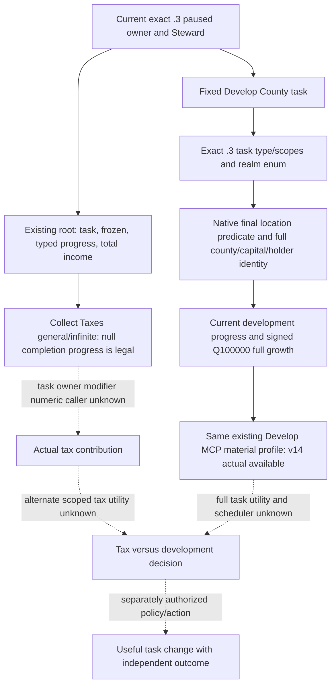

# Collect Taxes replacement value: exact-build probe

Status: **static research; native paired evaluator unresolved**. No CK3 session,
candidate DLL, action, or new gameplay capability was produced by this probe.
It is scoped to an occupied ordinary steward seat using `task_collect_taxes`.

2026-10-02 continuation: the paired tax evaluator remains unresolved. Existing
exact Steam1.20.0.3 root/task/income primitives have been sampled on the
current Murchad frame below. They do not turn skill into an isolated tax
effect or authorize a task switch.

## Frozen inputs

- CK3 `1.19.0.6`, `ck3.exe` SHA-256
  `2D00FF3101EF70B566F2FCBAE292F09263199C80E9DC8F139B82D7D96F83DB86`.
- `common/council_tasks/00_steward_tasks.txt` SHA-256
  `B3087378E04D0CDF7B1C1BEBF97FD17E36D8684DDD157D4FB0647B1D5681FC4B`:
  `task_collect_taxes` applies `domain_tax_mult=1`, scaled by
  `steward_collect_taxes_total_scale` in `council_owner_modifier`.
- `common/script_values/99_steward_values.txt` SHA-256
  `6A4AC7C1E575E54FBA4A3BE06F58146F753629622491FDDAE25D09C439699C3B`:
  lines 63-136 define base `stewardship / 2`, conditional tax-man,
  erudition, family-business, consulted-house and bookkeeping additions, then
  divide by 100. The family/house terms depend on the proposed councillor and
  owner relationship; a skill difference is not a full result.
- `common/scripted_triggers/00_councillor_triggers.txt` SHA-256
  `D7A10D08D2F73D770B56A375ECEBCBE02486038B4E9648B492BEE786A482C9C2`:
  lines 985-995 contain the candidate-dependent family-business and
  consulted-house predicates.
- R700 private same-frame final-gates artifact
  `g2-m4-council-r696-checkpoint-readonly-72882e69-v2/live-r700/raw-terminal-result.json`
  already exposes the occupied incumbent, candidate IDs, signed stewardship,
  candidate legality and fireability. In that frame incumbent `33433` has
  stewardship `16`, while candidate `32716` has `12`. Their base tax scales
  alone are `0.08` and `0.06` (Q100000 `8000` and `6000`); the full native
  values and opportunity costs were not observed. This R700 query also does
  not prove that `task_collect_taxes` was the active task in that frame; the
  pair is an illustrative target for a later task-bound read.

## Compiled entry search

The authored `task_collect_taxes` and
`steward_collect_taxes_total_scale` strings are absent from this EXE, as
expected for dynamically loaded script data. `council_owner_modifier` occurs
at RVA `0x429C578` and `0x4415D46`; the first is referenced in a global
name/ID table at RVA `0x42C1358` (ID `0x2E27`). No direct `.text` RIP reference
to that key establishes a task-specific evaluator.

`GetCouncilOwnerModifier` occurs only as the longer reflection name
`GetCouncilOwnerModifierDescFor` at RVA `0x4415BE0`. Its sole direct RIP use is
the registration sequence at RVA `0x59D429..0x59D46E`, whose helper is
`0x2D6F8F0`; this is a GUI description registration, not proof of a numeric
modifier value or an alternate-candidate scope. The adjacent reflection names
are `GetCouncilModifierDescFor` and `GetCouncillorModifierDescFor`. Similarly,
the only `GetModifierValue` prefix found is `GetModifierValueFor` at RVA
`0x440F218`, referenced at `0x58C8B6`. Neither name proves a paired numeric
evaluation contract.

The known `ActiveCouncilTask` value-progress evaluator `0x2D650A0` reads
`CouncilTaskType+0x14E0` and constructs active task scopes before calling
`0x9698B0` at `0x2D65291`; its callsites at `0x23BAC2A` and `0x27E8260`
serve progress, not the `council_owner_modifier` tax value. A scan of direct
relative calls to the generic script-value evaluator `0x3373000` found many
callers, but none is yet bound to this task field and candidate-scope context.
The older truce direct-evaluator experiment also exited before its first
return, so a standalone call must not be inferred safe from its signature.

## Decision boundary and next probe

The existing R700 reader already covers seat occupancy, ability and final
eligibility. Adding those fields again, or publishing a Q100000 result from
`stewardship/200` alone, would falsely imply that a replacement increases
taxes. No replacement is ready on this evidence.

The next bounded native probe should locate the `CouncilTaskType` owner
modifier field and its actual application callsite, then prove the caller's
owner/councillor scope objects and the returned numeric scale. Only after an
exact-build, side-effect-free paired read can a private projection compare
incumbent `33433` with R700 candidate `32716` and carry the incumbent-firing
cost. The public council query, action and advertisement remain OFF until
their existing gates are met.

## Current .3 task-value inputs and actual Murchad baseline

Current Steam CK3 is `1.20.0.3`, build `25652598`, EXE SHA
`94B55397ABB687A3DCD436805A5D885E6BE90FA6C693FEB44A9E3BBEEADE02A6`.
Current `00_steward_tasks.txt` still has SHA
`B3087378E04D0CDF7B1C1BEBF97FD17E36D8684DDD157D4FB0647B1D5681FC4B`.
Its authored Collect Taxes general/infinite and Develop County/value tasks
remain inputs to the existing native tree. Current values/triggers were
frozen separately because their whole-file bytes differ from old .19. Five
stock files, numbered excerpts, current source pins and already reviewed .3
reuse entries are in
`artifacts/g2-maintainer-2026-10-02/resume-12003/m4-council/task-value-observation/native-stock/NATIVE-STOCK-INPUTS.json`,
SHA `3237B2CF559F3FB4E2DF7DC1115F02C00842CA0536D437A1E724810ED70F9F2D`.
No full ABI audit or generic script-value call scan was repeated.

Root's actual `resume-12003/murchad-v10-council-task-01` SDK capture is GREEN
on frozen `production-source-0ccc3f00`. Root context004 and final gates006,
bracketed by snapshots005/007, observe actor31853/episode
`native-31853-af642d76cb41`, date53328600, native:15 and public revision2.
Steward39761 runs `task_collect_taxes`, type `general`, target null,
`frozen=false`, progress `infinite` with current/maximum null. These nulls
are the correct infinite-task result, not an unfinished progress reader.
The native role comparison remains `NO_CHANGE`.

Actual whole-player monthly income is signed Q100000
`{raw:353565, scale:100000}`; public current gold is
`{raw:62305241, scale:100000}`. They are actual resource inputs, not the
task's isolated tax contribution. An event modal remained present and did
not prevent readonly income/task queries. Normal final checkpoint packet009
is `saved`. The existing offline inspection passed once and recorded
source/packet hashes in
`task-value-observation/ACTUAL-V10-TASK-VALUE-OBSERVATION.json`. Root owned
all SDK/game operations; the Council worker performed zero live connections
or actions. This baseline adds no new capability or overall M4 completion.

Existing .3 reusable paths already supply current facts:

- Monthly income `0x2BCA960(out,character,null,null)` is the current complete
  player result.
- Owner/Steward lookup `0x2684F00` and task enumeration `0x2916CE0` supply
  actual full identities and current task/type/target.
- Value progress `0x31AB520/0x31AB840(task_type,out,task+0x40 scopes)` supplies
  current/maximum for a bound value task; it is not full target growth.
- Existing private Steward final gates supply effective stewardship and
  final appointment legality, not numeric task benefit.

These entries have reviewed PASS classifications in current
`ck3_1_20_0_3_abi_reuse.json`. The root SDK configuration is
`task-value-observation/ROOT-TASK-VALUE-READONLY-CALLS.json`, reusing the
public root tool and readonly private Steward query without an action.

## The next useful observation is a legal alternative task

Current stock `00_steward_tasks.txt:133-140` distinguishes player **realm**
targets from AI **domain** targets. Its `full_progress` reads actual
`county.development_rate`, separately from development current/max. The
legacy Develop County MCP facade is registered, but current .3 adapter
capabilities/action steps do not publish its query. Its old contract is
`1.19.0.6` / `exact_build_contract_fixture_pending_live_reader`; calling it
on current .3 fails at the existing service capability gate. No doomed game
query was attempted to reconfirm this source fact.

The authorized Council v13 observation (separate from the frontend/economy/Feast v12 bundle) reuses
`ck3_query_steward_develop_county_candidates_v1(expected_revision)` and its
existing application-main query slot. Its current-.3 material profile must
read current owner/Steward, native shown/valid task result, player-realm
county rows and native target predicates, full county/capital-province/holder
identities, and actual development progress/full current growth with the
proven native scale. Its collection scope is `player_realm`; false target
predicates remain observed rows. This target/growth profile remains separate
from old full-AI-input fixtures; missing AI inputs cannot be filled with
zero/null values and marked ready. Query readiness does not open the
change-task action.

Old enumerator `0x105B6A0`, first-hit caller `0x10545EA`, GUI all-row caller
`0x105629C` and location/legality locator `0x293B860` have only .19 evidence
and no .3 reuse entry. They are bounded locators, not callable current
addresses. Before reader code, current task-type/scopes and enum/identity,
readonly final location predicate, and full-growth numeric return/scale
must be frozen from their concrete current caller. Existing progress and
player income must not be reimplemented to hide these missing edges. The
separate tax seam remains `CouncilTaskType.council_owner_modifier` and its
actual modifier application caller, including owner/councillor scopes; old
description and progress getters cannot substitute for it.

Precise proposed native leaves and root-only integration are in
`task-value-observation/native-stock/NATIVE-WORK-PROPOSAL.md`; existing
Python DTO/SDK inventory and the three-leaf material route are in
`task-value-observation/python-dto/existing-contract-inventory.json`.
The initial input inventory was **research**, with no alternate task result,
task change or isolated income gain yet observed. Real empty legal targets
will be a valid observation after the reader exists; they cannot be assumed
in advance or replaced by an arbitrary task switch.

## Exact .3 material inputs closed before implementation

The three bounded current-PE edges are now closed. Type lookup uses database
slot `0x5C671D8`, hash `0x3F7E240` and lookup `0xCF1E80`; the task key is at
`+0x18`, county kind is1, and the player scope at `+0x4C` is realm2. The
complete refresh caller `0x115A16C` reaches enum `0x115F3C0`; the lower realm
enum is `0x2C48E80` and rows are actual `Province*`. Current GUI vector/scopes
offsets are `+0xD0/+0xF0`, unlike old `+0x100/+0x120`; the old observer cannot
be reused by changing only its function address.

Readonly native shown/valid are `0x31AC7B0/0x31AC680`; location predicate
`0x2C48970` reaches final task-target predicate `0x31ACEF0`. Identity decoding
round-trips Province `+0x848` to County, County `+0x18` full title ID through
Title database `0x5D1DAF8`, Title `+0x10` full identity and holder `+0x128`.
Full current growth `0x24CF900/0x24CFB50` returns signed int64 Q100000;
negative, zero and positive values are retained. It measures **current full
county growth**, not predicted growth after changing the task.

The exact caller/bytes/scales and immutable PE evidence are
`native-stock/enum-current-pe/NATIVE-PE-MAPPING.json` (SHA
`F461341CD907F5DE7B6386BB9629E9FA2B42D872970DD108DB28062E4C6C28C6`)
and `native-stock/legality-growth-current-pe/NATIVE-PE-MAPPING.json` (SHA
`FDEAA8AC3C68131F36E56A077E8A67A2AD1D1B83D7F433776C0FEE0CA71E5999`),
under the same task-value artifact. The narrow preimplementation ledger is
`NATIVE-12003-MATERIAL-INPUT-LEDGER.json`. No further generic PE scan or
revalidation of already admitted root/income inputs is required.

Native and Python owners agreed the same-MCP stage
`native_player_realm_develop_county_material_v1`, backend
`ck3-1.20.0.3-native-steward-develop-county-material-v1`, reader mode
`native_player_realm_enumerator_predicates_and_current_growth`. The material
rows expose `native_target_valid`, full identities/native ordinals, signed
`monthly_development_rate` and current/maximum `development_progress` as
Q100000 values. The current active binding retains the existing root shape.
Observation readiness means actual fields and declared-scope collection are
read: shown/valid false remains a real blocked observation with an empty
lawful collection. These predicates are not renamed `native_can_assign`,
which would falsely claim the whole change-task command preflight. Native
scratch implementation and the three approved Python leaves proceeded from
this frozen input ledger. Actual paused material remains pending.

The native candidate source is now frozen in ten specified paths (nine
changed, the legacy `.19` reader unchanged), with pins and patch at
`task-value-observation/native-stock/NATIVE-STABLE-DELIVERY.json` and
`NATIVE-SOURCE.patch`. The new reader fixture calls the same production
response codec as the bridge and exercises full-generation identities,
positive/zero/negative growth, observed false target predicates, blocked
task predicates and actual frame/numeric drift. Independent fresh native
focused validation and the genuine-wire Python SDK consumption test passed
once. The reader is now **static-ready**, with no new live frame or task
action yet.

The root-only integration patch is
`native-stock/root-integration/ROOT-ONLY-DEVELOP-MATERIAL-INTEGRATION.patch`.
The existing application-main submit/wait/completed-reply path is retained
unchanged; after an accepted submission, the single-call Python primitive
receives a completed seven-field native envelope. No new polling tool, action flag or task
transport is introduced. After v12 froze, root explicitly authorized the
nine tested native leaves to be projected to canonical; their original
before/source pins remain frozen in external scratch. Root alone integrates
the shared CMake/adapter/bridge patch and builds Council v13. The prepared
root SDK config and offline actual-frame inspector are
`ROOT-DEVELOP-MATERIAL-READONLY-CALLS.json` and
`inspect_develop_material_saved.py`, under the task-value artifact.

The independent native build used twelve fresh objects with `/W4 /WX
/UNDEBUG /O2`; all three focused executables compiled, linked and ran GREEN
on the first attempt. No old header objects or replacement dependency shims
were used. Receipt is
`task-value-observation/develop-focused-harness-01/FOCUSED-RESULT.json` (SHA
`74BD2BD2E5D892FC62001012BFE641CA6230F3156F0F07C4CF5A3885B27713DC`).
The actual production reader/common codec emitted available and blocked
packets in `native-fixtures/`: 2,475 bytes / SHA
`E16DB0F94A0E55084A2E658905066D7D54F3C345F1A5548713CC2D471506C586`
and 1,403 bytes / SHA
`4AA4E58F1127CE59F614B54D45D993F785A6D1046EB3321D9626EBFEC9049B32`.

The one Python focused run passed eleven primary tests plus six subtests
(seventeen JUnit entries), including the eight legacy query cases. It
consumes the byte-identical production packets through the existing native
query method, service and official in-process SDK. The fixture preserves
growth raw `[8250, -750, 0]`, target-valid `[true, true, false]`, a blocked
valid-false available/ready empty observation, and distinct frontend/native
revisions. The existing typed action consumer rejects this material profile
without any new gate. Receipt is `python-dto/python-focused-01-receipt.json`;
JUnit SHA is
`502332A62290B5D9B9EEEF524C6BC67BF6BDF6DF64D53CD8EA186A5443CE67E5`.
These are offline production-path fixtures. The root-owned merged DLL and
actual paused same-MCP capture are the next step; current growth remains
separate from proposed-task growth or tax-versus-development utility.

### First actual v13 query: executor registration gap

Root adopted source `176f0640` / 937 compiled inputs on PID 8600. The
closed SDK attempt `resume-12003/murchad-v13-current-material-01` is RED at
`006-ck3_query_steward_develop_county_candidates_v1.json`, whose exact error
is `application-main steward develop-county executor is unavailable`.
The successful existing root query `004` is reused: native snapshot 7 /
frontend revision 2, living paused Murchad 31853, date 53328600, episode
`native-31853-af642d76cb41`. It independently confirms Steward 39761,
`task_collect_taxes`, general/infinite progress, and income raw 353565 /
scale 100000. No material rows or task forecast were observed; the guest
baseline and normal final checkpoint were not reached in this attempt.

The actual source route is `WorkerMain -> InstallNewAdapter ->
BindThreadRuntimeImage -> PopulateNonwarRouterExecutors12002 ->
RegisterNonwarMailboxExecutorsV1`. The current installation populates
thirteen typed callbacks and the named semantic callback, then nonwar
callbacks, but omits the existing
`ExecuteStewardDevelopCountyCandidatesMailboxQueryV1`. The public handler
submits that callback at `bridge.cpp:16653`; production
`TrySubmitMainThreadQueryV1` rejects its absence from the permitted callback
set as `invalid_request` at `main_thread_query_mailbox_v1.cpp:1382`, which
the handler renders as this observed error. The application-main route is
already enabled. The old Steward enumerator probe flag is unrelated and
stays OFF; enabling it is not a fix for the missing production registration.

Root authorized a narrow correction in the existing nonwar registration
seam: a readonly callback field, mapping its nonnull value to the new
adapter's free existing slot 14, and setting it only for the `.3` descriptor
in root's shared bridge initialization. Legacy `.19` uses its independent
registration path. One direct production registration/submit/pump/completed
fixture would validate the actual omitted route. Original native reader /
codec three GREEN and Python eleven tests plus six subtests are reused;
their inputs and material profile have not changed. At this stage the reader remained
**static-ready with an actual query integration RED**, not a new
production-live material primitive. The one offline saved-packet report is
`task-value-observation/ACTUAL-V13-FIRST-REGISTRATION-RED.json`.

The correction then passed its one necessary focused production-path
fixture on the first build/run. Eleven fresh objects used the frozen three
file overlay and immutable `production-source-176f0640` with `/O2 /W4 /WX
/UNDEBUG`. The negative case retains the actual missing-registration
`invalid_request`; the corrected case executes real registration,
installation, submit, TLS/main-thread pump, completion, reclaim and
uninstall. Its actual current helper is intentionally unadmitted and returns
the typed `exact_build_not_admitted` result: this proves the callback route
without fabricating a positive paused game material frame. No legacy reader
is invoked in that case.

The focused receipt is
`task-value-observation/registration-focused-harness-01/FOCUSED-RESULT.json`
(SHA `FAD77046AC291AE25457B4AEEF261779CFCE24D380BF16D9BF440BFEB0B00122`),
and the frozen final source/patch record is
`native-stock/v13-executor-registration/FINAL-REGISTRATION-GREEN.json`
(SHA `5D64F7F818B9985E6BA4D4A2370035F3DE574EFE6340DE3DA51A0071427793FB`).
Root applied the three exact native leaves plus the two shared bridge/CMake
hunks after its successful apply check. At that stage the running immutable
v13 DLL was unchanged; the fix was **static-ready pending the combined v14
DLL and actual paused SDK retry**. Original reader/codec/Python source and PASS are reused.
The query material field paths, 19-field profile, task/location predicates,
signed Q100000 current-growth semantics and absence of action/forecast
claims remain unchanged. The initial actual RED remains retained.

### Actual v14 material observation

Root then adopted frozen source `7ebc43e0` / 937 compiled inputs and closed
the GREEN SDK capture `resume-12003/murchad-v14-cold-material-01`. Existing
offline inspector `inspect_develop_material_saved.py` passed once using the
normalizer from that frozen runtime. This verifies the actual material
body, not only transport acceptance: `status=available`, `readiness=true`,
`shown=true`, `valid=true`, complete `player_realm` collection and stable
same-frame source. Root query `018`, material query `020`, and surrounding
snapshots `019`/`021` identify living paused Murchad 31853, episode
`native-31853-af642d76cb41`, native snapshot/revision 1, public revision 2
and date 53329800. Both fresh revision bindings remain consistent.

The material's `current_active_task_binding` exactly matches the independent
root row: Steward 39761, `task_collect_taxes`, general/infinite progress,
null target/current/maximum and `frozen=false`. All three observed realm
county rows return `native_target_valid=true`; their actual material is:

| County title ID | Capital province ID | Holder | Player capital / directly held | Current monthly development growth | Current development progress |
| --- | --- | --- | --- | --- | --- |
| 525 | 45 | 31853 | true / true | 0.48 | 64.61 / 100 |
| 530 | 46 | 31853 | false / true | 0.24 | 23.95 / 100 |
| 533 | 49 | 39761 | false / false | 2.58795 | 36.724 / 100 |

Every growth/progress value above is decoded from signed raw Q100000 data;
the original raw values and native collection ordinals remain in the saved
report. Independent aggregate monthly income is raw 352147 / 100000
(3.52147), and gold is raw 52818557 / 100000 (528.18557). The paused frame
has no active event. Normal checkpoint `026` is saved at the same date,
history index 2077, with SHA
`18A78E68385137B7FE35679AA8CA6A60437DA760189F18EA4E084FA92D9D2577`.

The query now qualifies as **production-live primitive** for actual realm
target predicates and current county growth. A target predicate is not the
full assignment preflight, and current full growth is not the forecast
after switching Steward task. Collect Taxes' isolated contribution and
proposed-task growth/utility remain unobserved; no tax-versus-development
decision, task change, income gain, game-time advance or complete M4 credit
is assigned to this readonly capture. No action or policy changed. The
original v13 registration RED, the one fresh registration fixture and prior
reader/codec/Python PASS all remain available without rerunning them.

The single offline material report is
`task-value-observation/ACTUAL-V14-DEVELOP-MATERIAL-OBSERVATION.json`. Its
evidence pins link the five actual packets; external `REPORT-FIELDS.json`
records the live boundary for root's daily/weekly report integration.
