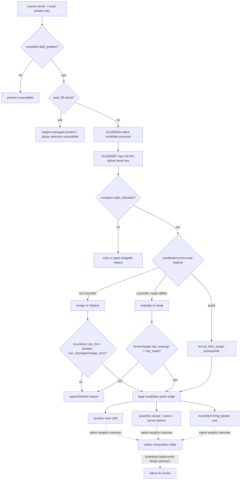

# CK3 1.19.0.6 内阁人选、合法性与强力封臣权衡

## 状态与范围

- **[static-confirmed / capture seam closed / implementation pending]** 本专题冻结常规内阁席位的人选集合入口、职位与候选合法性、解职/调任/交换门、主要能力，以及强力封臣席位压力。exact-build 候选 producer、唯一 GUI 列表调用点、临时输出布局与对象寿命已经闭合；建议的 `council-composition-candidates-v1` 仍未实现，也没有 production paused artifact。
- **[unknown]** exact-build EXE 明确保留 `ai_council.cpp` 子系统及 council AI 开关，但没有在脚本、define 或当前已闭合的 reflection/GUI 表面暴露“候选综合分数”、各输入权重、重排 cadence 或最终选择理由。本文不把职位主能力排序、`COUNCIL_TASK_SWITCH_SCORE` 或 GUI 顺序冒充原版人选 AI 公式。
- 本专题以现有 [内阁观测与发展任务](council-and-development.md) 的 active position/incumbent 结果为输入，增加人选与动作预检，不改变 `campaign-root-context-v1`。
- 宫廷司祭仅发布 position identity、最终候选合法性与不透明拒绝原因。信仰、教义、教义条目、宗教热情、改宗和宗教改革不进入合同或我方策略。
- 本工作只冻结只读查询和后续动作边界，不实现任命、换人、解职或招募宾客。

## Exact-build 冻结

| 资产 | 精确值 |
|---|---|
| CK3 build | `1.19.0.6` |
| `binaries/ck3.exe` 大小 | `95,206,008` bytes |
| `binaries/ck3.exe` SHA-256 | `2D00FF3101EF70B566F2FCBAE292F09263199C80E9DC8F139B82D7D96F83DB86` |
| 本专题 G2 集成基线 | `1957b6d0ce133f76d56552b76a3ec96f7c740135` |

下述 RVA 均以这份 EXE 的模块基址为零点。EXE、build、council position、government 或 scripted trigger 数据变化后，入口与语义必须重新定位。

## 已闭合的原版规则

### Position schema 是第一层门

`common/council_positions/_council_positions.info` 直接规定：

- `skill` 是候选列表的主能力；没有主能力时，GUI 才按全能力合计排序；
- `valid_position` 决定席位对 council owner 是否存在；
- `valid_character` 在候选出现在任命列表时和实际任命时都会检查；
- `can_fire`、`can_reassign`、`can_change_once` 分别控制解职、换人和“一生只能改一次”的席位；
- `auto_fill` 的空 trigger 按 `no` 处理，`can_fire` / `can_reassign` 的空 trigger 按 `yes` 处理；
- `fill_from_pool` 仅在 `auto_fill` 生效时选择生成池，否则从 court 与 vassals 中填充。

五个常规席位的主能力为：

| position key | 主能力 | 常规 position 边界 |
|---|---|---|
| `councillor_chancellor` | diplomacy | landed、非 nomadic，天朝 ministry 分支改走 minister trigger |
| `councillor_steward` | stewardship | 同上 |
| `councillor_marshal` | martial | 同上，候选额外排除 hostage |
| `councillor_spymaster` | intrigue | landed；候选规则有自己的较宽 gender 边界 |
| `councillor_court_chaplain` | learning | landed、非 nomadic；`fill_from_pool=yes`、clergy position，任免由不透明宗教规则和 ministry 分支决定 |

spouse 是自动填充且不可解职/调任；vizier 是自动填充且可解职/调任。kurultai、ministry 和 modded positions 继续使用动态 vocabulary，不能硬压成五席。当前 `campaign-root-context-v1` 对这些变体已有单独的 coverage 边界。

### 候选基本合法性

`common/scripted_triggers/00_councillor_triggers.txt` 的 `can_be_councillor_basics_trigger` 要求候选：

1. 成年、capable、未被监禁且当前 available；
2. 未与其 liege 交战；
3. 没有把当前 liege 写入 `block_hire_councillor`；
4. 没有 `travel_option_added_character` 标志。

职位 trigger 再加各自限制：常规 chancellor/steward/marshal 处理 council gender、nomadic、固定任命司祭、spouse 和 vizier-diarch 排斥；marshal 另排除 hostage；spymaster 没有照抄前三者的 gender/nomadic 组合；court chaplain 另检查 owner 对 clergy gender、同 faith、temporal theocracy、escaped imprisonment 与 excommunication 的规则。

合同不得自行重写这棵宗教树。对宫廷司祭只调用 exact native/compiled `valid_character`，输出 `eligible=true|false`；若唯一可得原因来自该分支，则给出稳定粗粒度 `chaplain_rule_denied` 和可选的原生展示 key，不发布 doctrine/tenet/fervor 细节。

### 解职、替换和调任

原版把候选能任职与当前席位能改变分成两层：

- `is_blocked_from_being_fired_from_council_trigger` 汇总 `council_task.can_fire_position=no` 与匹配 owner 的 `block_fire_councillor`；
- `can_be_fired_from_council_trigger` 先要求未被上述门阻止，再对宫廷司祭应用不透明任免规则；
- position 自身还有 `can_fire`、`can_reassign`、`can_change_once`；
- government schema 的 `ai_can_reassign_council_positions` 默认 `yes`，天朝 hegemon 的定义在持有 `h_china` 时把原版 AI 重排 minister 的能力关掉。它属于原版 AI 调度门，不等于玩家命令合法性；
- GUI 在任命普通非 councillor 时还要求当前 incumbent 可解职；调任现有 councillor、交换两个席位和招募 guest 使用不同路径；任一 candidate 有 pending interaction 时，普通任命按钮会禁用。

`window_council_potential_councillor.gui` 将这些路径明确分成：

| 路径 | 原版 GUI 表面 | 合同中的动作类别 |
|---|---|---|
| 填空缺/替换普通候选 | `set_position` + `CanFireCouncillor` | `assign` / `replace` |
| 把现有 councillor 调到目标席位 | `set_position` | `reassign` |
| 两位 councillor 交换席位 | `swap_position` + `can_swap` | `swap` |
| guest | `recruit_guest_interaction` | `recruit_then_assign`，两步动作，本合同只报告前置 |
| 单独解职 incumbent | `FireCouncillor` + `CanFireCouncillor` | `fire` |

后续 semantic action 必须在提交前重新执行相同 owner/position/candidate 的原生合法性检查，并在提交后重读 active position。不能以只读快照里的 `can_assign=true` 代替 commit-time 检查。

## 强力封臣压力和能力不是同一分数

原版可证事实如下：

- `cares_about_powerful_vassal_council_position` 要求候选通过 councillor basics，且不是 liege.diarch 或 designated diarch；它用于判断未获席位的强力封臣是否承受 opinion penalty；
- government 的 `deny_powerful_vassal=yes` 会使该政府角色永远不成为 powerful vassal，因此压力不能脱离 owner/candidate 的最终 engine flags 推导；
- `NOpinion.POWERFUL_VASSAL_WITHOUT_COUNCIL_POSITION=-40`；`NOpinion.IS_ON_THE_COUNCIL=10`；
- 被解职者获得 `fired_from_council_opinion=-20`，不衰减，持续 10 年；重新任命的原版 effect 会移除该解职意见；
- 原版概念和 important action 文案明确告诉玩家：强力封臣席位与实际能力之间存在选择，而且强力封臣可能多于席位。

这几项不能直接相加成通用的“+50 任命收益”。政府、`cares_about...`、当前席位和其它 opinion component 会改变实际结果；换人还会把 `-20/10y` 落到 incumbent。只读合同应同时发布主能力、最终 powerful-vassal/cares flags、实际 opinion 和换人代价，不生成未经验证的 `native_composition_score`。

原版没有在脚本或当前闭合入口中给出如下答案：

- AI 如何把主能力、强力封臣压力、incumbent 解职代价、spymaster 风险或其它关系输入合成一个 utility；
- AI 多久重算一次席位、何时容忍能力较差的强力封臣、是否有换人 hysteresis；
- 同分候选的 tie-break、随机性与 stable order；
- `last_appointed_councillor` 在调度中的确切作用。

`NDefines.NAI.COUNCIL_TASK_SWITCH_SCORE=1.25` 只描述 councillor **任务**切换需要比当前任务高 25%，不能用于人选/席位替换。

## Exact-build EXE 与 GUI 调用链

### 原版 AI 子系统边界

EXE 内嵌源码单元字符串 `C:\mnt\gsg\ck3\titus\source\logic\ai\ai_council.cpp`，字符串 RVA `0x419C7E8`，静态引用位于 `0x1904BE5`。`AI.ToggleCouncil` / `AI.ToggleCouncilTasks` 位于 RVA `0x41913E0` / `0x41913F8`，注册引用位于 `0x2F87BF..0x2F8AAC`。这证明 build 中存在独立 council AI 子系统及任务开关，但不证明其中任何候选评分公式。

二进制另含 `last_appointed_councillor` 与 `ai_can_reassign_council_positions` token。前者的读取/写入语义尚未闭合；后者已由 government schema 直接给出 authored 语义。

### 只读候选与合法性入口

`PotentialCouncillorWindow` 的类型注册切片为 `0x10600B0..0x10602CA`；`GuiCouncilPosition` 为 `0x10604F0..0x106070A`。已定位的 method registration 和 handler 如下：

| 表面 | registration / owner | handler | 已证边界 |
|---|---|---|---|
| `GetPotentialCouncillorList` | `0x143270..0x14347A` | `0xD49C00` thunk → `0xB75420` leaf | 返回 `CPotentialCouncillorWindow+0xF8` 内嵌的 `CPotentialCouncillorList*`；它只是 getter，不生产候选 |
| `CanFireCouncillor` | `0x1437F0..0x1438D4` | `0x105D690..0x105D6C8` | 当前 incumbent/position 的解职布尔值 |
| `GetFireCouncillorTooltip` | `0x1438E0..0x143A5D` | `0x105D960..0x105D9A2` | 解职失败的原生展示文本入口 |
| `CanReassignCouncillor` | `0x143A60..0x143B4D` | `0x105D9B0..0x105DA26` | 当前 position 的换人布尔值 |
| `FireCouncillor` | `0x142020..0x142188` | `0x105D200..0x105D21C` | mutation 表面，禁止在只读 query 中调用 |

候选 row 的 `set_position` / `swap_position` dispatcher 为 `0x10573C0..0x1057673`，tooltip dispatcher 为 `0x1057680..0x1057F01`，`can_swap` 为 `0x1057F10..0x10580EE`。dispatcher 会解析带 generation 的 character identity，并进入 mutation/交互 machinery；所以生产 query 应抽取其中的候选枚举与合法性 evaluator，不能通过“打开隐藏 GUI 后模拟点击”取得只读结果。

### 候选 producer、容器与唯一捕获点

RTTI 和构造函数把 getter 背后的对象关系闭合为：

- `CPotentialCouncillorWindow` TypeDescriptor / COL / vtable 分别位于 `0x5232A40` / `0x469D860` / `0x411BD70`；构造函数 `0x1058780..0x10589A6` 在 `0x105882E` 取 `window+0xF8`，随后于 `0x1058842` 写入 `CPotentialCouncillorList` vtable `0x411BB68`；
- 因而 list 是 window 的内嵌子对象，不是全局容器，也没有独立于 window 的寿命。`list+0x1B0` 是回指 owner window 的指针；`list+0x1B8` 是带 generation 的 active council task identity；
- list vtable slot 6 指向刷新函数 `0x10580F0..0x105841E`。只允许在该 GUI refresh 的调用线程同步观察；不得在后台线程持有或稍后解引用 window/list 指针。

刷新函数在 `0x105820A` 调用候选 producer `0x293BD00..0x293BF96`，返回点 `0x105820F` 是本 build 唯一有界的候选捕获 seam。调用现场为：

| 寄存器/栈槽 | 静态确认的值 |
|---|---|
| `RCX` | 当前 council owner 的 `CCharacter*`；generation 解析失败时使用引擎 fallback owner |
| `RDX` | 由 `list+0x1B8` generation 校验后得到的 active council task；`task+0x18 → +0x38` 给出 `CouncilPositionType*` |
| `R8B` | GUI 路径固定为 `1` |
| `R9` | 指向 `[rbp-0x80]` 临时输出头 |
| 返回后的 `[rbp-0x80]` | `data` qword；`[rbp-0x74]` 为非负 `count` dword；每项是 8-byte `CCharacter*` |

producer 从 owner land-state 的 `+0xA8` 与 `+0x218` 两个 authored identity 容器枚举，输入项为 4-byte full-generation ID。两个域都执行 generation 解析、排除 incumbent、排除 owner、直接关系 owner 校验，以及 position/candidate evaluator；第一个域还执行由 `R8B` 控制的额外 eligibility gate。当前静态证据不为这两个内部域编造“廷臣/封臣”等成员名。输出顺序保持 producer 的遍历顺序，`0x293BD00` 内没有排序；GUI 随后才构造 row，故该顺序也不能冒充原版 AI 分数。

刷新函数从 `0x105820F` 开始以 `data + count*8` 为界遍历，每项通过 `candidate+0x18` 读取 full `CharacterID`，再调用 `0xD05BE0` 构造/过滤 GUI row。临时输出在 `0x10583E5..0x1058402` 释放，仅在这一次 refresh 中有效。observer 必须在 `0x105820F` 立即复制 full IDs 和 owner/task/position 元数据到自有缓冲，不能保留任何 `CCharacter*`、task、window 或 list 指针。

对整个 `.text` 的直接 `call 0x293BD00` 扫描得到四处调用：`0x105820A`、`0x190691B`、`0x26A1FD4`、`0x27E7554`。后三处使用 `R8B=0` 且不属于 `CPotentialCouncillorList` refresh；全局 hook producer 会混入其它上下文。由包含函数、`R8B=1` 和 post-call RVA 三项共同限定的 `0x105820F` 才是本合同的唯一捕获点。静态扫描不声称排除所有可能的间接调用。

## 原版决策树



虚线分支只描述已确认存在、但仍未闭合的原版内部决策。它不阻塞我方基于公开输入实施一套可解释的最小策略。

## `council-composition-candidates-v1` 最小只读合同

建议 MCP tool 为 `ck3_query_council_composition_candidates_v1`，schema 为 `xar.ck3.council-composition-candidates/v1`。query 必须与现有 campaign-root 的 actual player、public/native revision、date、pause state 和 snapshot identity 同帧绑定。

```json
{
  "schema": "xar.ck3.council-composition-candidates/v1",
  "status": "available",
  "unavailable_reason": null,
  "snapshot": {
    "snapshot_id": "...",
    "public_revision": 0,
    "native_revision": 0,
    "date_raw": 0,
    "paused": true
  },
  "owner_character_id": 0,
  "coverage": {
    "position_coverage_key": "standard_landed_non_nomadic_core_v1",
    "candidate_collection_source": "potential_councillor_refresh_producer",
    "candidate_collection_complete": true
  },
  "opinion_constants": {
    "powerful_vassal_without_seat": -40,
    "on_council": 10,
    "fired_from_council": -20,
    "fired_from_council_years": 10
  },
  "positions": [
    {
      "position_key": "councillor_steward",
      "position_valid": true,
      "main_skill_key": "stewardship",
      "player_selectable": true,
      "auto_fill_active": false,
      "incumbent_character_id": 0,
      "incumbent_main_skill": 0,
      "can_fire_incumbent": true,
      "can_reassign_position": true,
      "change_once_locked": false,
      "position_block_reasons": [],
      "candidates": [
        {
          "character_id": 0,
          "main_skill": 0,
          "is_powerful_vassal": false,
          "cares_about_council_seat": false,
          "seat_pressure_active": false,
          "opinion_of_owner": 0,
          "is_current_councillor": false,
          "current_position_key": null,
          "is_guest": false,
          "action_kind": "assign",
          "legal": true,
          "requires_recruitment": false,
          "reason_codes": [],
          "native_reason_key": null
        }
      ]
    }
  ],
  "native_ai": {
    "composition_score_ready": false,
    "composition_score": null,
    "scheduler_ready": false,
    "selected_reason_codes": []
  },
  "readiness": {
    "identity_ready": true,
    "positions_ready": true,
    "candidate_collection_ready": true,
    "candidate_legality_ready": true,
    "main_skills_ready": true,
    "powerful_vassal_pressure_ready": true,
    "opinion_ready": true,
    "action_preview_ready": true,
    "native_ai_score_ready": false,
    "planner_ready": true
  }
}
```

### 字段约束

- positions 按 unsigned UTF-8 bytes 的 `position_key` 排序；candidates 按 unsigned full `CharacterID` 排序。collection source 固定映射到本 build 的 `0x105820A → 0x105820F` 调用点；producer 遍历顺序只能作为可选 `native_collection_ordinal`，不能作为稳定 ID、GUI 最终顺序或评分。
- identity 使用 full-generation ID，并在 candidate collection 后逐行 generation round-trip；一行 stale 会使整份 query typed unavailable，不能静默删行后宣称集合完整。
- `candidate_collection_complete=true` 只允许用于 exact native collection 成功、列表前后 owner/position/date/revision 稳定的场景。范围外 government/position 返回 `partial` 或 `unavailable`，沿用 campaign-root coverage reason。
- `position_block_reasons` 与 candidate `reason_codes` 是稳定 machine vocabulary；`native_reason_key` 只保存 exact evaluator 暴露的 key，不解析本地化成语义。
- `native_ai_score_ready=false` 不会自动拖低 `planner_ready`。我方 planner 使用已发布的事实做自己的可解释策略；只有调用方明确要求复现原版 AI 选择时，才因该字段返回 unavailable。
- 宫廷司祭 candidate 不增加 faith/doctrine 结构。最终 `legal` 可用时 planner 可消费；失败原因只给 `chaplain_rule_denied`。
- guest 的 `recruit_then_assign` 不等于任命 ready。后续需要独立招募 action 的接受度、成本、提交回执与 postcondition，才能形成完整动作链。

### 最小 reason vocabulary

| 层 | reason code | 触发边界 |
|---|---|---|
| query | `snapshot_identity_mismatch`、`not_paused`、`revision_drift`、`date_drift` | 无法与 campaign-root 同帧绑定 |
| collection | `position_outside_coverage`、`candidate_collection_unavailable`、`candidate_generation_mismatch`、`duplicate_candidate_id` | position 或候选集合不完整 |
| position | `position_invalid`、`position_auto_filled`、`position_fire_blocked`、`position_reassign_blocked`、`change_once_locked` | 席位当前不可改变 |
| basics | `candidate_unavailable`、`candidate_underage`、`candidate_incapable`、`candidate_imprisoned`、`candidate_at_war_with_liege`、`candidate_hire_blocked`、`candidate_travel_option` | `can_be_councillor_basics_trigger` 的稳定投影 |
| role | `candidate_role_invalid`、`candidate_hostage`、`candidate_mutually_exclusive_position`、`chaplain_rule_denied` | position-specific `valid_character` |
| action | `pending_interaction`、`swap_invalid`、`guest_requires_recruitment`、`incumbent_cannot_be_fired` | row/command 前置 |

只有能够从 native evaluator 或 compiled trigger 可靠区分的原因才能发布细分 code。若 evaluator 只返回 false 与整体 tooltip，则使用上层 `candidate_role_invalid` / `position_*_blocked`，保留 `native_reason_key`；不能从英文 tooltip 猜细分原因。

## 我方 planner 的可见结果

最小策略输出独立使用我方 `policy_score` 和原因列表，不占用 `native_ai.composition_score`：

1. **先填真实空缺。** 对 player-selectable 的空席，从 `legal=true` 中按主能力排序；同能力时，优先解决 active 强力封臣席位压力，再按 CharacterID 稳定 tie-break。
2. **换人必须覆盖成本。** 已占席位只有在新候选带来明确能力增益或显著政治风险下降，且 incumbent 可合法解职/调任时才建议动作。输出中逐项显示 skill delta、是否解决 `-40` 席位压力、incumbent 的 `-20/10y` 解职代价和动作类别。
3. **不盲目塞入低能力强力封臣。** 若职位能力损失明显、所有强力封臣多于席位，或合同缺 faction identity/power，planner 只能给“政治压力改善”与“能力下降”的并列证据，不能声称全局 faction 风险下降。
4. **spymaster 保留关系可见性。** 最小合同已有 `opinion_of_owner`，推荐结果需展示它；本专题没有证明原版 AI 如何加权该输入，也不为我方猜固定权重。
5. **宫廷司祭只消费最终合法性。** 不解释或优化教义分支。

建议的 planner-visible outcome：

```json
{
  "decision": "fill_vacancy",
  "position_key": "councillor_steward",
  "candidate_character_id": 123,
  "action_kind": "assign",
  "policy_score": 17000,
  "reasons": [
    "highest_legal_main_skill",
    "resolves_powerful_vassal_seat_pressure",
    "no_incumbent_firing_cost"
  ],
  "skill_delta": 17,
  "native_ai_parity_claimed": false
}
```

该输出会解锁玩家可见价值：自动玩家能指出具体席位、具体人选、能力变化、政治收益与换人代价，并在合法性不足时给出可读 blocker。它不等待原版隐藏总分闭合，也不把 recommendation 当作 action ACK。

## 唯一下一 probe 与后续实现边界

当前唯一下一 probe 是一个 **default-off、exact-build 绑定的 `0x105820F` post-return observer**。它只在模块 SHA、包含函数 hash、调用点字节和 application/UI calling thread 全部匹配时启用；在 producer 返回后、GUI row 构造前，同步复制 `{owner full ID, active-task full ID, position identity, R8B, count, candidate full IDs, calling thread ID}`，随后立即退出，不修改容器和游戏状态。一次 paused 手工打开目标席位候选窗的捕获必须证明：count 非负、所有 candidate generation round-trip 成功、没有 duplicate、空列表能与 UI 空状态对应、捕获线程与 GUI refresh 线程一致。该 observer 之外不并列其它猜测性 probe。

probe 通过后，生产 reader 仍须在 application-main paused transaction 中复用 campaign-root 的 owner、active positions、incumbents、date 与 revision，并对每个 position/candidate 调用 compiled `valid_position` / `valid_character` 与原生 fire/reassign/swap evaluator。之后才能冻结 ABI/fixture、发布只读 MCP、取得真实空缺和 occupied replacement 两个 paused artifact，再接最小 planner。任命 semantic action 保持独立工作包，需 commit-time 复检与 active-position postcondition；不得调用跳过规则的 script effect。

## 未闭合边界

| 状态 | 缺口 | 对当前合同的处理 |
|---|---|---|
| **[unknown]** | 原版 AI composition utility、输入权重和 tie-break | `native_ai_score_ready=false`；不阻塞我方 planner |
| **[unknown]** | 原版 AI 席位重算 cadence 与 `last_appointed_councillor` 语义 | 不推断换人时机；Mermaid 保留虚线 |
| **[static-confirmed / live probe pending]** | producer 的两个 owner land-state 容器成员名、运行时空列表与 generation 互证 | collection source、entry layout、生命周期和唯一 seam 已闭合；只执行上节唯一 observer，不手拼集合 |
| **[static entry only]** | fire/reassign/swap 的完整 machine reason | 允许稳定粗粒度 reason；禁止解析 loc 猜原因 |
| **[owner-deferred]** | 宫廷司祭通用信仰/教义策略 | 仅最终合法性和 opaque reason |
| **[not implemented]** | read-only MCP、planner 与 semantic action | 按上节顺序推进，状态不得写 live/action-ready |

## 精确切片账本

| 精确切片 | 长度 | SHA-256 |
|---|---:|---|
| `PotentialCouncillorWindow` type registration `0x10600B0..0x10602CA` | 538 | `B2C9AD2D30900BC38B424118F7793EB75BC9A0421761307B74DFAD3E5608C387` |
| `GuiCouncilPosition` type registration `0x10604F0..0x106070A` | 538 | `1CF986EF8B95505040DF14A4BC538D33A1302B46E38AED1ADB5B801643E534E9` |
| candidate-list registration `0x143270..0x14347A` | 522 | `E299496622FD4F85528161BCC38D1366CD8508BDC4E3C88845104FCD1562F700` |
| `GetPotentialCouncillorList` thunk `0xD49C00..0xD49C05`（bytes `E9 1B B8 E2 FF`） | 5 | `8A92A8AF50B3AE0D6E548147B0CDA1EC07790973D06D1E17A7A817F0DDEACF53` |
| getter leaf `0xB75420..0xB75428`（bytes `48 8D 81 F8 00 00 00 C3`） | 8 | `33B159575A0657705DC11673DE9520E8CC3CCE8C3547DC133D471E9C0EDC1A51` |
| `CPotentialCouncillorWindow` constructor `0x1058780..0x10589A6` | 550 | `A9BDFDC3E7728AA0358CDD247B48DD155682F7E301DB1060D7703561F1B329A6` |
| `CPotentialCouncillorList` vtable `0x411BB68..0x411BBF0` | 136 | `853D0D85B52B9659D570446AE20213904F89249B7825046CBDCD5A3F7E183D90` |
| candidate-list refresh `0x10580F0..0x105841E` | 814 | `E7D1A1C2A2ABF7D62478C06FFF7D592FE0CF7682F8CF53D84D90EFE8545B748A` |
| producer call/return slice `0x1058200..0x1058238`（prefix bytes `4C 8D 4D 80 41 B0 01 49 8B D2 E8 F1 3A 8E 01`） | 56 | `BB3B4F20EB48B3D57014EA59880AF2D8C127D40EFF825DF8BEFB50879629A251` |
| candidate producer `0x293BD00..0x293BF96` | 662 | `A2264828FA0A077650A1D74DD3C9861F81B7C219BC9D32DE7C11369BF6E890D8` |
| `CanFireCouncillor` registration `0x1437F0..0x1438D4` | 228 | `08A567710BB57BBBB21653EE252DC3B928FF03BDBA24E62056CBEF15507E7159` |
| `CanFireCouncillor` handler `0x105D690..0x105D6C8` | 56 | `BADEAB04A18F96BA6B1850E63F878B06F039018AF7571707F28378D5B106B878` |
| fire-tooltip registration `0x1438E0..0x143A5D` | 381 | `5005B0C97479A386C1DC2D0BA1D574414DF5B2D1CB7A93ACC85E81B1609B7DE3` |
| fire-tooltip handler `0x105D960..0x105D9A2` | 66 | `85472FDF93ED2C9357FBBB609A6585F9292F7E78764823681018A569A6752331` |
| `CanReassignCouncillor` registration `0x143A60..0x143B4D` | 237 | `1F1EE846B3B127F6FB260F141AB35C905CCBB2ED819C8D564B14941E484DA5C3` |
| `CanReassignCouncillor` handler `0x105D9B0..0x105DA26` | 118 | `597E41E91BAD2A0305C5E1FF1A22C21E67406370EF0D63BDC03FC4BB01F5D28C` |
| `FireCouncillor` registration `0x142020..0x142188` | 360 | `F518C43C0415F0DA44F2C6FBC357DA81FDA018294545E34047E8668BE2F90A0D` |
| `FireCouncillor` handler `0x105D200..0x105D21C` | 28 | `7BAFF5648D3C32E2B4CC23F514BCEB12488EA4367C766F35AA82373637F7373E` |
| `set_position` / `swap_position` dispatcher `0x10573C0..0x1057673` | 691 | `45D8C6440DF1F063F2788844596FD33A974B315497084FF808DC6578C888C128` |
| row tooltip dispatcher `0x1057680..0x1057F01` | 2,177 | `E83F74775440634FE4FAE361EA8D6026B1D989734D9201C2BC6523218C80356A` |
| `can_swap` handler `0x1057F10..0x10580EE` | 478 | `6DB4BCB1027A708C267DA213699AE7828E721ED55653C51E13F2C6EE2A78385E` |

## 原版文件证据账本

| 文件 | SHA-256 | 用途 |
|---|---|---|
| `game/common/council_positions/_council_positions.info` | `3018B801E7FE01AAD8D8B2F78FA691DA4E6924737F4430F0ED19757F03D67B29` | position schema、默认值、candidate list/assignment 复检语义 |
| `game/common/council_positions/00_council_positions.txt` | `8D667AFE296D987F2E849A5C55B17EF9A98E73B9E73E925898EA2986B3155909` | 常规职位、主能力、chaplain/spouse/vizier/kurultai 门 |
| `game/common/scripted_triggers/00_councillor_triggers.txt` | `D7A10D08D2F73D770B56A375ECEBCBE02486038B4E9648B492BEE786A482C9C2` | basics、role、fire trigger |
| `game/common/scripted_rules/00_rules.txt` | `F47917FE70AFC416A536096E8E051287AF567C807A90A43B2E974E8412B495BC` | powerful-vassal cares 与 fire rule |
| `game/common/defines/00_defines.txt` | `C1ECA141C71EC1E741CA5336E01BB538EEFAEC05B0684EDEC477CFC9053C3807` | `-40/+10` opinion defines |
| `game/common/defines/ai/00_ai.txt` | `C78F9CD8DF9938CC9F38E817BCB6E32CD13720B5BD9DE077B85E3E1C6F030293` | task-switch define；确认不能外推 composition |
| `game/common/opinion_modifiers/00_council_opinions.txt` | `9AD21551F4E6049C793868B409E8A117D9E633A8E4F1BD8DB593418D7515BFA4` | 解职 `-20/10y` |
| `game/common/scripted_effects/00_councillor_effects.txt` | `7CD27A8F1061E7881A5D629487005BB1784E58311E12F708F8E59F89A69D5D4E` | 任命/解职 opinion 与 council flag side effects |
| `game/common/governments/_governments.info` | `14CA628A2C68B9DF4F7D6EABD6ACC44BF32BCDAF62D59ABD758729D0C71AFE5F` | `deny_powerful_vassal`、`ai_can_reassign_council_positions` schema |
| `game/common/governments/00_government_types.txt` | `4AA234FD63CE8BBE73DAE4369A7E80FE8A33E779A22B41B80C3998F0FEE6D656` | government-specific reassign/powerful-vassal gates |
| `game/gui/window_council.gui` | `AC142DC4D4F18EEEB241C7B9DBDE1F737DF8D0D7114FF4CA845DC3E9A230BAAE` | select councillor 表面 |
| `game/gui/window_council_potential_councillor.gui` | `1D5F5B7422BADB13595D458F28D6A86BDF6162BA54350CF9EF32115BF556A956` | candidate list、assign/reassign/swap/recruit 分流 |
| `game/localization/english/gui/council_window_l_english.yml` | `5FAD0338FA3E381107AE253A0472F116B928C0189364E79EF49725B32DBEB221` | powerful-vassal count 与 fire/reassign 失败展示 |
| `game/localization/english/gui/potential_councillor_l_english.yml` | `EA90D73CF25220C9DCFC67C40693952260BA15F953DB811D29D03EB78DC48C80` | candidate/swap/no-candidate 文案 |
| `game/localization/english/important_actions_l_english.yml` | `7A3E3C5E59F2682F3097357761480CE95193C5331BA3496B63112088BC63C574` | 原版明确的能力与席位压力权衡 |
| `game/localization/english/game_concepts_l_english.yml` | `4EA186AE6B86576F2297BD812AE4A5D8AF5FDBE493ED652D8B9366921005B547` | councillor/powerful-vassal 玩家语义 |
| `game/localization/english/relations_l_english.yml` | `2B369151CE8D3363D35B02DCBAC742D235184EC0EA944038D412D280E9CE5385` | powerful-vassal 是否期待席位的展示语义 |

这里的 `game/...` 都是 `Crusader Kings III/game/...` 下的 exact-build 原版文件。静态 GUI/reflection 入口和 authored 数据把 reader 的施工入口闭合到可实现程度；只有生产 paused artifact 才能把 `council-composition-candidates-v1` 提升为 `production-live primitive`。

## COUNCIL3: default-off paused capture observer

The private observer for the frozen post-return seam is implemented behind
`XAR_CK3_ENABLE_COUNCIL_COMPOSITION_CANDIDATE_OBSERVER_V1`, which remains
`OFF` by default. It does not add a public MCP capability, schema, service, or
policy action. A capture is admitted only after the central adapter has matched
the 1.19.0.6 executable SHA, installation occurred while the primary thread was
suspended, the callback runs on the main-thread mailbox owner, the mailbox says
the game is paused, and the native vector has a bounded readable span.

The callback copies the owner full ID, active-task full ID, position key,
candidate full IDs, and each opaque eight-byte vector row into atomics during
the same frame. It never keeps a typed native pointer for later use. The private
heartbeat diagnostic explicitly carries `private_build=true`,
`advertised=false`, capture consistency, gate failures, duplicate-ID count and
opaque row bytes. Static source and ABI fixtures live beside the native bridge.

For the one paused capture candidate, configure a dedicated Release build with:

```powershell
cmake -S ck3_autonomous_player/native_bridge -B <private-build-dir> `
  -DXAR_CK3_ENABLE_COUNCIL_COMPOSITION_CANDIDATE_OBSERVER_V1=ON
```

This build is only a capture instrument. Readiness remains **static-ready**
until one real paused candidate window produces an artifact with a stable UI
thread, readable nonnegative count, full-ID rows, and no duplicate IDs. Only
that result can unlock the production reader and later public read-only query.
