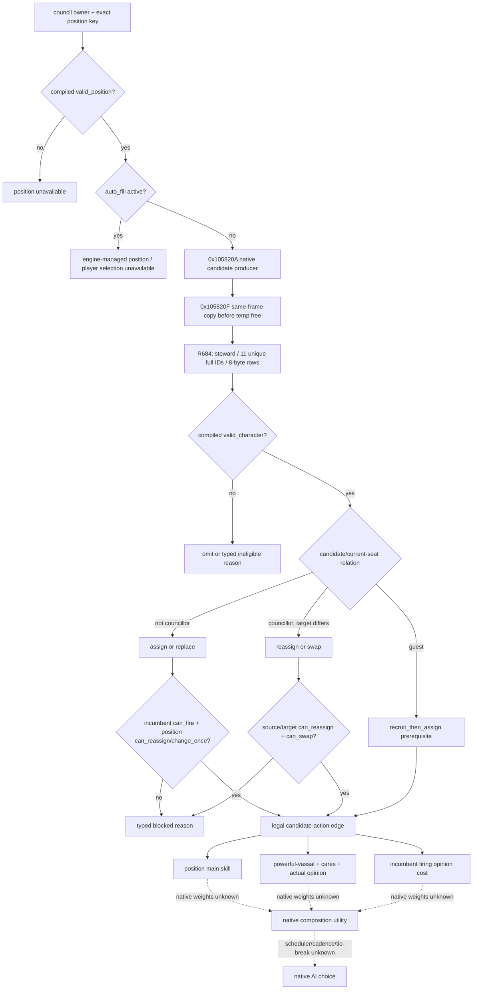

# CK3 1.19.0.6 内阁人选、合法性与强力封臣权衡

## 状态与范围

- **[private-live capture GREEN / private reader core static-ready / binding pending]** 本专题冻结常规内阁席位的人选集合入口、职位与候选合法性、解职/调任/交换门、主要能力，以及强力封臣席位压力。R684 已在 exact-build、paused、同线程条件下捕获 `councillor_steward` 的 11 行候选向量；COUNCIL6 已实现 fail-closed private reader core，生产绑定、公开 MCP、planner 与任命动作仍未实现。
- **[unknown]** exact-build EXE 明确保留 `ai_council.cpp` 子系统及 council AI 开关，但没有在脚本、define 或当前已闭合的 reflection/GUI 表面暴露“候选综合分数”、各输入权重、重排 cadence 或最终选择理由。本文不把职位主能力排序、`COUNCIL_TASK_SWITCH_SCORE` 或 GUI 顺序冒充原版人选 AI 公式。
- 本专题以现有 [内阁观测与发展任务](council-and-development.md) 的 active position/incumbent 结果为输入，增加人选与动作预检，不改变 `campaign-root-context-v1`。
- 宫廷司祭仅发布 position identity、最终候选合法性与不透明拒绝原因。信仰、教义、教义条目、宗教热情、改宗和宗教改革不进入合同或我方策略。
- 本工作只冻结只读查询和后续动作边界，不实现任命、换人、解职或招募宾客。

## Exact-build 冻结

| 资产 | 精确值 |
|---|---|
| CK3 build | `1.19.0.6` |
| `binaries/ck3.exe` 大小 | `95,206,008` bytes |
| `binaries/ck3.exe` SHA-256 | `2D00FF3101EF70B566F2FCBAE292F09263199C80E9DC8F139B82D7D96F83DB86` |
| 本专题 G2 集成基线 | `1957b6d0ce133f76d56552b76a3ec96f7c740135` |

下述 RVA 均以这份 EXE 的模块基址为零点。EXE、build、council position、government 或 scripted trigger 数据变化后，入口与语义必须重新定位。

## R684 private-live capture GREEN

R684 在候选构建 `bb5911cedc7af70c43312d16a88c75ec50aac4f6` 上只执行了一次 bounded paused 观察。候选窗目标为 `councillor_steward`；捕获点是冻结的 `0x105820A` producer 调用之后、GUI row 构造之前的 `0x105820F`。完整证据位于外部 artifact `g2-m4-r684-council-composition-observer-live-bb5911c`，仓内冻结投影为 `ck3_autonomous_player/native_bridge/research/fixtures/council_composition_steward_r684_live_capture_v1.json`。

| 证据 | R684 结果 |
|---|---|
| exact build | CK3 `1.19.0.6`；EXE SHA-256 `2D00FF3101EF70B566F2FCBAE292F09263199C80E9DC8F139B82D7D96F83DB86` |
| 同帧绑定 | snapshot `native:3`；public/native revision `4/3`；`date_raw=53178264`；paused |
| owner / task / position | `29829` / `7159` / `councillor_steward`；owner 与 episode character 相同 |
| observer | installed；private；read-only；未 advertised；call/accepted=`1/1`；两类 failure flags 均为 `0` |
| vector | capacity `64`；count/captured `11/11`；11 个唯一 full CharacterID；每行 8 字节；callback thread 等于 UI thread |
| 非变更边界 | 未推进日期、未提交 council action、源与目标存档 SHA 未变、退出后 CK3 inventory 为空 |
| 原始行 | 88 bytes；SHA-256 `328BB46BAA038A3021E0A94C802C0B8C3AF675B8B27C1A07E9244FD67B4EA50E` |
| capture/report | SHA-256 `F19AA907292EA53EB3D2F69658F59A871D34B5960200FA5F0DE68FEC096F3CAB` / `9215C1FED4EF164C5F4272250BB412E047DE1223A03BA93C9A71A3CEB58F9B6F` |

这项证据关闭的是**一个非空总管候选向量的 row stride、full-generation identity 与同帧寿命**。原始 8 字节行是瞬时 native pointer 表示，只作为 stride/逐行 identity 解析证据保留，绝不能进入公开查询。它不证明空列表、其它席位、GUI 最终排序、主能力、强力封臣压力、意见、guest 状态、候选合法性或原版 AI 总分。R684 也不是可按需调用的生产 reader；不得把 private capture 写成 public capability 或 planner-ready。

## COUNCIL6 private reader core

COUNCIL6 实现 `g2_council_composition_steward_candidates_reader_v1` 的 **static-ready private core**。核心只接收依赖注入的 exact-build environment 与 native callbacks，不注册 CMake、bridge、MCP 或公开 schema。它在一次函数调用内严格执行：校验 exact build 与 application-main → 捕获预期 paused frame/owner/active steward task → 以 `R8B=1` 调用 producer 一次 → 逐行复制 full CharacterID 并做 generation round-trip → 拒绝重复 ID → 在同一 transaction 内调用 release 一次 → 复读 frame binding → 按 unsigned full CharacterID 排序并保留 `native_collection_ordinal` → 最后发布。

R684 的 11 个 CharacterID 已作为聚焦 fixture 输入；成功输出包含同样 11 个 ID。producer 调用之后发生的 span、row、generation、duplicate 或 frame failure 都会先 release，再返回零行 unavailable；release 自身失败返回 `temporary_vector_release_failed`，不发布部分结果。离线空向量是 fixture-only 行为覆盖，不冒充 live empty-list 证据。

生产绑定尚未注册：`producer_address`、exact temporary-vector release、campaign-root active steward task resolution 与 mailbox glue 仍由下一工作包完成。因此公开 capability 不存在，production query 未通过，planner-ready 仍为 false。

## 已闭合的原版规则

### Position schema 是第一层门

`common/council_positions/_council_positions.info` 直接规定：

- `skill` 是候选列表的主能力；没有主能力时，GUI 才按全能力合计排序；
- `valid_position` 决定席位对 council owner 是否存在；
- `valid_character` 在候选出现在任命列表时和实际任命时都会检查；
- `can_fire`、`can_reassign`、`can_change_once` 分别控制解职、换人和“一生只能改一次”的席位；
- `auto_fill` 的空 trigger 按 `no` 处理，`can_fire` / `can_reassign` 的空 trigger 按 `yes` 处理；
- `fill_from_pool` 仅在 `auto_fill` 生效时选择生成池，否则从 court 与 vassals 中填充。

五个常规席位的主能力为：

| position key | 主能力 | 常规 position 边界 |
|---|---|---|
| `councillor_chancellor` | diplomacy | landed、非 nomadic，天朝 ministry 分支改走 minister trigger |
| `councillor_steward` | stewardship | 同上 |
| `councillor_marshal` | martial | 同上，候选额外排除 hostage |
| `councillor_spymaster` | intrigue | landed；候选规则有自己的较宽 gender 边界 |
| `councillor_court_chaplain` | learning | landed、非 nomadic；`fill_from_pool=yes`、clergy position，任免由不透明宗教规则和 ministry 分支决定 |

spouse 是自动填充且不可解职/调任；vizier 是自动填充且可解职/调任。kurultai、ministry 和 modded positions 继续使用动态 vocabulary，不能硬压成五席。当前 `campaign-root-context-v1` 对这些变体已有单独的 coverage 边界。

### 候选基本合法性

`common/scripted_triggers/00_councillor_triggers.txt` 的 `can_be_councillor_basics_trigger` 要求候选：

1. 成年、capable、未被监禁且当前 available；
2. 未与其 liege 交战；
3. 没有把当前 liege 写入 `block_hire_councillor`；
4. 没有 `travel_option_added_character` 标志。

职位 trigger 再加各自限制：常规 chancellor/steward/marshal 处理 council gender、nomadic、固定任命司祭、spouse 和 vizier-diarch 排斥；marshal 另排除 hostage；spymaster 没有照抄前三者的 gender/nomadic 组合；court chaplain 另检查 owner 对 clergy gender、同 faith、temporal theocracy、escaped imprisonment 与 excommunication 的规则。

合同不得自行重写这棵宗教树。对宫廷司祭只调用 exact native/compiled `valid_character`，输出 `eligible=true|false`；若唯一可得原因来自该分支，则给出稳定粗粒度 `chaplain_rule_denied` 和可选的原生展示 key，不发布 doctrine/tenet/fervor 细节。

### 解职、替换和调任

原版把候选能任职与当前席位能改变分成两层：

- `is_blocked_from_being_fired_from_council_trigger` 汇总 `council_task.can_fire_position=no` 与匹配 owner 的 `block_fire_councillor`；
- `can_be_fired_from_council_trigger` 先要求未被上述门阻止，再对宫廷司祭应用不透明任免规则；
- position 自身还有 `can_fire`、`can_reassign`、`can_change_once`；
- government schema 的 `ai_can_reassign_council_positions` 默认 `yes`，天朝 hegemon 的定义在持有 `h_china` 时把原版 AI 重排 minister 的能力关掉。它属于原版 AI 调度门，不等于玩家命令合法性；
- GUI 在任命普通非 councillor 时还要求当前 incumbent 可解职；调任现有 councillor、交换两个席位和招募 guest 使用不同路径；任一 candidate 有 pending interaction 时，普通任命按钮会禁用。

`window_council_potential_councillor.gui` 将这些路径明确分成：

| 路径 | 原版 GUI 表面 | 合同中的动作类别 |
|---|---|---|
| 填空缺/替换普通候选 | `set_position` + `CanFireCouncillor` | `assign` / `replace` |
| 把现有 councillor 调到目标席位 | `set_position` | `reassign` |
| 两位 councillor 交换席位 | `swap_position` + `can_swap` | `swap` |
| guest | `recruit_guest_interaction` | `recruit_then_assign`，两步动作，本合同只报告前置 |
| 单独解职 incumbent | `FireCouncillor` + `CanFireCouncillor` | `fire` |

后续 semantic action 必须在提交前重新执行相同 owner/position/candidate 的原生合法性检查，并在提交后重读 active position。不能以只读快照里的 `can_assign=true` 代替 commit-time 检查。

## 强力封臣压力和能力不是同一分数

原版可证事实如下：

- `cares_about_powerful_vassal_council_position` 要求候选通过 councillor basics，且不是 liege.diarch 或 designated diarch；它用于判断未获席位的强力封臣是否承受 opinion penalty；
- government 的 `deny_powerful_vassal=yes` 会使该政府角色永远不成为 powerful vassal，因此压力不能脱离 owner/candidate 的最终 engine flags 推导；
- `NOpinion.POWERFUL_VASSAL_WITHOUT_COUNCIL_POSITION=-40`；`NOpinion.IS_ON_THE_COUNCIL=10`；
- 被解职者获得 `fired_from_council_opinion=-20`，不衰减，持续 10 年；重新任命的原版 effect 会移除该解职意见；
- 原版概念和 important action 文案明确告诉玩家：强力封臣席位与实际能力之间存在选择，而且强力封臣可能多于席位。

这几项不能直接相加成通用的“+50 任命收益”。政府、`cares_about...`、当前席位和其它 opinion component 会改变实际结果；换人还会把 `-20/10y` 落到 incumbent。只读合同应同时发布主能力、最终 powerful-vassal/cares flags、实际 opinion 和换人代价，不生成未经验证的 `native_composition_score`。

原版没有在脚本或当前闭合入口中给出如下答案：

- AI 如何把主能力、强力封臣压力、incumbent 解职代价、spymaster 风险或其它关系输入合成一个 utility；
- AI 多久重算一次席位、何时容忍能力较差的强力封臣、是否有换人 hysteresis；
- 同分候选的 tie-break、随机性与 stable order；
- `last_appointed_councillor` 在调度中的确切作用。

`NDefines.NAI.COUNCIL_TASK_SWITCH_SCORE=1.25` 只描述 councillor **任务**切换需要比当前任务高 25%，不能用于人选/席位替换。

## Exact-build EXE 与 GUI 调用链

### 原版 AI 子系统边界

EXE 内嵌源码单元字符串 `C:\mnt\gsg\ck3\titus\source\logic\ai\ai_council.cpp`，字符串 RVA `0x419C7E8`，静态引用位于 `0x1904BE5`。`AI.ToggleCouncil` / `AI.ToggleCouncilTasks` 位于 RVA `0x41913E0` / `0x41913F8`，注册引用位于 `0x2F87BF..0x2F8AAC`。这证明 build 中存在独立 council AI 子系统及任务开关，但不证明其中任何候选评分公式。

二进制另含 `last_appointed_councillor` 与 `ai_can_reassign_council_positions` token。前者的读取/写入语义尚未闭合；后者已由 government schema 直接给出 authored 语义。

### 只读候选与合法性入口

`PotentialCouncillorWindow` 的类型注册切片为 `0x10600B0..0x10602CA`；`GuiCouncilPosition` 为 `0x10604F0..0x106070A`。已定位的 method registration 和 handler 如下：

| 表面 | registration / owner | handler | 已证边界 |
|---|---|---|---|
| `GetPotentialCouncillorList` | `0x143270..0x14347A` | `0xD49C00` thunk → `0xB75420` leaf | 返回 `CPotentialCouncillorWindow+0xF8` 内嵌的 `CPotentialCouncillorList*`；它只是 getter，不生产候选 |
| `CanFireCouncillor` | `0x1437F0..0x1438D4` | `0x105D690..0x105D6C8` | 当前 incumbent/position 的解职布尔值 |
| `GetFireCouncillorTooltip` | `0x1438E0..0x143A5D` | `0x105D960..0x105D9A2` | 解职失败的原生展示文本入口 |
| `CanReassignCouncillor` | `0x143A60..0x143B4D` | `0x105D9B0..0x105DA26` | 当前 position 的换人布尔值 |
| `FireCouncillor` | `0x142020..0x142188` | `0x105D200..0x105D21C` | mutation 表面，禁止在只读 query 中调用 |

候选 row 的 `set_position` / `swap_position` dispatcher 为 `0x10573C0..0x1057673`，tooltip dispatcher 为 `0x1057680..0x1057F01`，`can_swap` 为 `0x1057F10..0x10580EE`。dispatcher 会解析带 generation 的 character identity，并进入 mutation/交互 machinery；所以生产 query 应抽取其中的候选枚举与合法性 evaluator，不能通过“打开隐藏 GUI 后模拟点击”取得只读结果。

### 候选 producer、容器与唯一捕获点

RTTI 和构造函数把 getter 背后的对象关系闭合为：

- `CPotentialCouncillorWindow` TypeDescriptor / COL / vtable 分别位于 `0x5232A40` / `0x469D860` / `0x411BD70`；构造函数 `0x1058780..0x10589A6` 在 `0x105882E` 取 `window+0xF8`，随后于 `0x1058842` 写入 `CPotentialCouncillorList` vtable `0x411BB68`；
- 因而 list 是 window 的内嵌子对象，不是全局容器，也没有独立于 window 的寿命。`list+0x1B0` 是回指 owner window 的指针；`list+0x1B8` 是带 generation 的 active council task identity；
- list vtable slot 6 指向刷新函数 `0x10580F0..0x105841E`。只允许在该 GUI refresh 的调用线程同步观察；不得在后台线程持有或稍后解引用 window/list 指针。

刷新函数在 `0x105820A` 调用候选 producer `0x293BD00..0x293BF96`，返回点 `0x105820F` 是本 build 唯一有界的候选捕获 seam。调用现场为：

| 寄存器/栈槽 | 静态确认的值 |
|---|---|
| `RCX` | 当前 council owner 的 `CCharacter*`；generation 解析失败时使用引擎 fallback owner |
| `RDX` | 由 `list+0x1B8` generation 校验后得到的 active council task；`task+0x18 → +0x38` 给出 `CouncilPositionType*` |
| `R8B` | GUI 路径固定为 `1` |
| `R9` | 指向 `[rbp-0x80]` 临时输出头 |
| 返回后的 `[rbp-0x80]` | `data` qword；`[rbp-0x74]` 为非负 `count` dword；每项是 8-byte `CCharacter*` |

producer 从 owner land-state 的 `+0xA8` 与 `+0x218` 两个 authored identity 容器枚举，输入项为 4-byte full-generation ID。两个域都执行 generation 解析、排除 incumbent、排除 owner、直接关系 owner 校验，以及 position/candidate evaluator；第一个域还执行由 `R8B` 控制的额外 eligibility gate。当前静态证据不为这两个内部域编造“廷臣/封臣”等成员名。输出顺序保持 producer 的遍历顺序，`0x293BD00` 内没有排序；GUI 随后才构造 row，故该顺序也不能冒充原版 AI 分数。

刷新函数从 `0x105820F` 开始以 `data + count*8` 为界遍历，每项通过 `candidate+0x18` 读取 full `CharacterID`，再调用 `0xD05BE0` 构造/过滤 GUI row。临时输出在 `0x10583E5..0x1058402` 释放，仅在这一次 refresh 中有效。observer 必须在 `0x105820F` 立即复制 full IDs 和 owner/task/position 元数据到自有缓冲，不能保留任何 `CCharacter*`、task、window 或 list 指针。

对整个 `.text` 的直接 `call 0x293BD00` 扫描得到四处调用：`0x105820A`、`0x190691B`、`0x26A1FD4`、`0x27E7554`。后三处使用 `R8B=0` 且不属于 `CPotentialCouncillorList` refresh；全局 hook producer 会混入其它上下文。由包含函数、`R8B=1` 和 post-call RVA 三项共同限定的 `0x105820F` 才是本合同的唯一捕获点。静态扫描不声称排除所有可能的间接调用。

## 原版决策树



虚线分支只描述已确认存在、但仍未闭合的原版内部决策。它不阻塞我方基于公开输入实施一套可解释的最小策略。

## 最小下一阶段只读查询合同（尚未发布）

R684 解锁的是**总管候选 identity provider**，不是原先草案中的整套内阁决策查询。COUNCIL6 已实现 private `council_composition_steward_candidates_reader_v1` 核心：它在一个调用中完成 paused binding、producer、identity copy、generation round-trip、release、frame recheck 与原子发布。下一工作包只需把核心绑定到现有 application-main mailbox 的 campaign-root actual player、active `councillor_steward` task、exact producer 与 exact release；调用前后仍必须复核 owner、task、position、date、public/native revision 与 paused 状态。

该 provider 的最小结果投影如下；这是实现合同，不是已发布 schema：

```json
{
  "status": "available",
  "unavailable_reason": null,
  "snapshot": {
    "snapshot_id": "native:3",
    "public_revision": 4,
    "native_revision": 3,
    "date_raw": 53178264,
    "paused": true
  },
  "owner_character_id": 29829,
  "position_key": "councillor_steward",
  "candidate_collection_complete": true,
  "candidates": [
    {
      "character_id": 30784,
      "native_collection_ordinal": 0
    }
  ],
  "readiness": {
    "identity_ready": true,
    "candidate_collection_ready": true,
    "candidate_legality_ready": false,
    "main_skill_ready": false,
    "powerful_vassal_pressure_ready": false,
    "opinion_ready": false,
    "action_preview_ready": false,
    "native_ai_score_ready": false,
    "planner_ready": false
  }
}
```

字段和失败边界：

- 第一阶段 coverage 只有 `councillor_steward`。其它 position 必须返回 `position_outside_coverage`，不得由 R684 外推。
- 生产输出按 unsigned full CharacterID 排序；`native_collection_ordinal` 只保留 producer 顺序用于诊断，不表示 GUI 顺序、评分或 tie-break。
- identity 在复制后逐行做 generation round-trip。任何 stale 行、重复 ID、异常 capacity/count、不可读 span 或调用前后绑定漂移，都使整份结果 unavailable。
- 最小 unavailable vocabulary 是 `snapshot_identity_mismatch`、`not_paused`、`revision_drift`、`date_drift`、`active_steward_task_unavailable`、`position_outside_coverage`、`candidate_collection_unavailable`、`candidate_generation_mismatch`、`duplicate_candidate_id` 与 `temporary_vector_release_failed`。
- 公开结果禁止包含 native pointer、原始行字节或根据 tooltip/顺序猜测的合法性与原版 AI 分数。
- private provider 通过 source fixture 与 suspended fixture 后，才允许登记公开 `game.query.council-composition-candidates-v1` / `xar.ck3.council-composition-candidates/v1`；登记后还必须取得一次按需 query 的 paused artifact，才能把该窄 primitive 写为 production-live。

完整 planner 需要的 `valid_position`、`valid_character`、主能力、powerful-vassal/cares、意见、fire/reassign/swap 预检继续作为后续扩展字段。它们没有被 R684 观测，不得预先标成 ready。宫廷司祭仍只允许消费最终 opaque 合法性，不扩展 faith/doctrine 数据。

## 我方 planner 的可见结果

最小策略输出独立使用我方 `policy_score` 和原因列表，不占用 `native_ai.composition_score`：

1. **先填真实空缺。** 对 player-selectable 的空席，从 `legal=true` 中按主能力排序；同能力时，优先解决 active 强力封臣席位压力，再按 CharacterID 稳定 tie-break。
2. **换人必须覆盖成本。** 已占席位只有在新候选带来明确能力增益或显著政治风险下降，且 incumbent 可合法解职/调任时才建议动作。输出中逐项显示 skill delta、是否解决 `-40` 席位压力、incumbent 的 `-20/10y` 解职代价和动作类别。
3. **不盲目塞入低能力强力封臣。** 若职位能力损失明显、所有强力封臣多于席位，或合同缺 faction identity/power，planner 只能给“政治压力改善”与“能力下降”的并列证据，不能声称全局 faction 风险下降。
4. **spymaster 保留关系可见性。** 最小合同已有 `opinion_of_owner`，推荐结果需展示它；本专题没有证明原版 AI 如何加权该输入，也不为我方猜固定权重。
5. **宫廷司祭只消费最终合法性。** 不解释或优化教义分支。

建议的 planner-visible outcome：

```json
{
  "decision": "fill_vacancy",
  "position_key": "councillor_steward",
  "candidate_character_id": 123,
  "action_kind": "assign",
  "policy_score": 17000,
  "reasons": [
    "highest_legal_main_skill",
    "resolves_powerful_vassal_seat_pressure",
    "no_incumbent_firing_cost"
  ],
  "skill_delta": 17,
  "native_ai_parity_claimed": false
}
```

该输出会解锁玩家可见价值：自动玩家能指出具体席位、具体人选、能力变化、政治收益与换人代价，并在合法性不足时给出可读 blocker。它不等待原版隐藏总分闭合，也不把 recommendation 当作 action ACK。

## COUNCIL7：private production binding 已静态闭合

`council_composition_steward_candidates_binding_v1` 已把 COUNCIL6 core 的三项 native 依赖固定为 exact-build 私有绑定，但仍未登记 CMake、bridge command 或公开 MCP。producer 的真实第四参数不是 16-byte header，而是 24-byte 对象：`data + capacity + count + allocator*`。append helper `0x8154D0` 在扩容时读取 `vector+0x10`；因此 binding 持有完整 `0x18` 对象，不能把 core 的三字段镜像直接传给 `0x293BD00`。

临时 allocator 也已经闭合：对象大小 `0x210`，vtable 为 module base + `0x4098A20`，`+0x08` 起始的内联缓冲容纳 64 个 8-byte 指针，`+0x208` 指向 module base + `0x4FEBE00` 的 fallback allocator。初始化 leaf `0x91E320` 返回内联 data/capacity；release adapter `0x7E8FB0` 对内联地址 no-op，对扩容地址经 vtable `+0x38` 取得 fallback allocator，再调用其 `+0x10` 释放。binding 从一次 producer 入口到 Council6 的一次 release callback 独占该对象；producer 初始化后的失败同样配对 release，release 失败保持 RED/unavailable。

active steward task 不依赖 GUI list 指针。binding 从同帧 played `CCharacter+0x1B8` 读取 land state，再读取 `+0x230/+0x23C` 的 active-task full-ID vector，经 `0x570C778/0x570C6D8` storage/fallback 做 generation round-trip；只有 `task+0x18 -> task-type+0x38 -> position-type+0x18` 为 `councillor_steward` 且 `task+0x3C` owner full ID 等于 played owner 的唯一任务才可进入 producer。零匹配、重复匹配、generation 失配、owner 失配和畸形字符串全部 fail-closed。after-frame 会重新解析一次 task，COUNCIL6 再比较 snapshot、revision、date、owner 与 task identity。

本阶段通过了 MSVC x64 C++20 `/W4 /WX` 聚焦 fixture，以及 normal/`-O` source 与 exact-EXE slice 验证。能力状态仍是 **private static-ready binding / shared glue pending**；未运行 CK3，也未产生 production query artifact。唯一下一集成是独立 glue 工作包：把这两个私有源登记到共享构建，并把现有 application-main paused campaign frame callback 适配给 binding；之后只做一次按需 paused query，核对 R684 的 11 个身份或当前同帧合法变体、release receipt、frame binding 和零写入，不重跑 GUI 捕获长跑。

glue GREEN 后，再依次接：compiled `valid_position` / `valid_character`，主能力和政治输入，fire/reassign/swap preview，公开只读 MCP，真实空缺与 occupied replacement 两个代表性 paused artifact，最后才接最小 planner。任命 semantic action 保持独立工作包，提交前复检 owner/position/candidate，提交后重读 active position；不得调用绕过原版规则的 script effect。

## 未闭合边界

| 状态 | 缺口 | 对当前合同的处理 |
|---|---|---|
| **[unknown]** | 原版 AI composition utility、输入权重和 tie-break | `native_ai_score_ready=false`；不阻塞我方 planner |
| **[unknown]** | 原版 AI 席位重算 cadence 与 `last_appointed_councillor` 语义 | 不推断换人时机；Mermaid 保留虚线 |
| **[private binding static-ready / shared glue pending]** | 空列表与其它席位未实机互证；private binding 尚未进入共享构建/main-thread mailbox | R684 已关闭总管非空向量证据；COUNCIL6 core 与 COUNCIL7 exact producer/release/task binding 已闭合；下一步只做 shared glue 与一次按需 paused query |
| **[static entry only]** | fire/reassign/swap 的完整 machine reason | 允许稳定粗粒度 reason；禁止解析 loc 猜原因 |
| **[owner-deferred]** | 宫廷司祭通用信仰/教义策略 | 仅最终合法性和 opaque reason |
| **[not implemented]** | read-only MCP、planner 与 semantic action | 按上节顺序推进，状态不得写 live/action-ready |

## 精确切片账本

| 精确切片 | 长度 | SHA-256 |
|---|---:|---|
| `PotentialCouncillorWindow` type registration `0x10600B0..0x10602CA` | 538 | `B2C9AD2D30900BC38B424118F7793EB75BC9A0421761307B74DFAD3E5608C387` |
| `GuiCouncilPosition` type registration `0x10604F0..0x106070A` | 538 | `1CF986EF8B95505040DF14A4BC538D33A1302B46E38AED1ADB5B801643E534E9` |
| candidate-list registration `0x143270..0x14347A` | 522 | `E299496622FD4F85528161BCC38D1366CD8508BDC4E3C88845104FCD1562F700` |
| `GetPotentialCouncillorList` thunk `0xD49C00..0xD49C05`（bytes `E9 1B B8 E2 FF`） | 5 | `8A92A8AF50B3AE0D6E548147B0CDA1EC07790973D06D1E17A7A817F0DDEACF53` |
| getter leaf `0xB75420..0xB75428`（bytes `48 8D 81 F8 00 00 00 C3`） | 8 | `33B159575A0657705DC11673DE9520E8CC3CCE8C3547DC133D471E9C0EDC1A51` |
| `CPotentialCouncillorWindow` constructor `0x1058780..0x10589A6` | 550 | `A9BDFDC3E7728AA0358CDD247B48DD155682F7E301DB1060D7703561F1B329A6` |
| `CPotentialCouncillorList` vtable `0x411BB68..0x411BBF0` | 136 | `853D0D85B52B9659D570446AE20213904F89249B7825046CBDCD5A3F7E183D90` |
| candidate-list refresh `0x10580F0..0x105841E` | 814 | `E7D1A1C2A2ABF7D62478C06FFF7D592FE0CF7682F8CF53D84D90EFE8545B748A` |
| producer call/return slice `0x1058200..0x1058238`（prefix bytes `4C 8D 4D 80 41 B0 01 49 8B D2 E8 F1 3A 8E 01`） | 56 | `BB3B4F20EB48B3D57014EA59880AF2D8C127D40EFF825DF8BEFB50879629A251` |
| candidate producer `0x293BD00..0x293BF96` | 662 | `A2264828FA0A077650A1D74DD3C9861F81B7C219BC9D32DE7C11369BF6E890D8` |
| vector append helper `0x8154D0..0x8155B3` | 227 | `361BBFD83F5EE8F77E7AD7B5062AC5C47AEAB0DE4480E895282BC136FFE0546E` |
| inline allocator vtable `0x4098A20..0x4098A60` | 64 | `A35EE3D306E7DDD806647BC07F367E40B094A9C8BDDA24DE62A23D6935A4D49D` |
| inline span initializer `0x91E320..0x91E32F` | 15 | `18FDA0CA73D46F674A4278204F8F8A78D06621393FCC793F5ED706C7F95A2C46` |
| allocator release adapter `0x7E8FB0..0x7E8FEA` | 58 | `713F21ED3585FDF7D226EBEF14CDD488CBE394D4A489FDC3227BEA74F126A604` |
| refresh release sequence `0x10583E5..0x1058402` | 29 | `BB8A485A34258014E1FC024FE69822338841327CFF879FE683791CE3ACF15446` |
| active-task vector/identity/position slice `0x2666CDA..0x2666D79` | 159 | `D118CEC463355455CBA72038E4924940E12CDEBA10562044B4A303F24EB22E22` |
| `CanFireCouncillor` registration `0x1437F0..0x1438D4` | 228 | `08A567710BB57BBBB21653EE252DC3B928FF03BDBA24E62056CBEF15507E7159` |
| `CanFireCouncillor` handler `0x105D690..0x105D6C8` | 56 | `BADEAB04A18F96BA6B1850E63F878B06F039018AF7571707F28378D5B106B878` |
| fire-tooltip registration `0x1438E0..0x143A5D` | 381 | `5005B0C97479A386C1DC2D0BA1D574414DF5B2D1CB7A93ACC85E81B1609B7DE3` |
| fire-tooltip handler `0x105D960..0x105D9A2` | 66 | `85472FDF93ED2C9357FBBB609A6585F9292F7E78764823681018A569A6752331` |
| `CanReassignCouncillor` registration `0x143A60..0x143B4D` | 237 | `1F1EE846B3B127F6FB260F141AB35C905CCBB2ED819C8D564B14941E484DA5C3` |
| `CanReassignCouncillor` handler `0x105D9B0..0x105DA26` | 118 | `597E41E91BAD2A0305C5E1FF1A22C21E67406370EF0D63BDC03FC4BB01F5D28C` |
| `FireCouncillor` registration `0x142020..0x142188` | 360 | `F518C43C0415F0DA44F2C6FBC357DA81FDA018294545E34047E8668BE2F90A0D` |
| `FireCouncillor` handler `0x105D200..0x105D21C` | 28 | `7BAFF5648D3C32E2B4CC23F514BCEB12488EA4367C766F35AA82373637F7373E` |
| `set_position` / `swap_position` dispatcher `0x10573C0..0x1057673` | 691 | `45D8C6440DF1F063F2788844596FD33A974B315497084FF808DC6578C888C128` |
| row tooltip dispatcher `0x1057680..0x1057F01` | 2,177 | `E83F74775440634FE4FAE361EA8D6026B1D989734D9201C2BC6523218C80356A` |
| `can_swap` handler `0x1057F10..0x10580EE` | 478 | `6DB4BCB1027A708C267DA213699AE7828E721ED55653C51E13F2C6EE2A78385E` |

## 原版文件证据账本

| 文件 | SHA-256 | 用途 |
|---|---|---|
| `game/common/council_positions/_council_positions.info` | `3018B801E7FE01AAD8D8B2F78FA691DA4E6924737F4430F0ED19757F03D67B29` | position schema、默认值、candidate list/assignment 复检语义 |
| `game/common/council_positions/00_council_positions.txt` | `8D667AFE296D987F2E849A5C55B17EF9A98E73B9E73E925898EA2986B3155909` | 常规职位、主能力、chaplain/spouse/vizier/kurultai 门 |
| `game/common/scripted_triggers/00_councillor_triggers.txt` | `D7A10D08D2F73D770B56A375ECEBCBE02486038B4E9648B492BEE786A482C9C2` | basics、role、fire trigger |
| `game/common/scripted_rules/00_rules.txt` | `F47917FE70AFC416A536096E8E051287AF567C807A90A43B2E974E8412B495BC` | powerful-vassal cares 与 fire rule |
| `game/common/defines/00_defines.txt` | `C1ECA141C71EC1E741CA5336E01BB538EEFAEC05B0684EDEC477CFC9053C3807` | `-40/+10` opinion defines |
| `game/common/defines/ai/00_ai.txt` | `C78F9CD8DF9938CC9F38E817BCB6E32CD13720B5BD9DE077B85E3E1C6F030293` | task-switch define；确认不能外推 composition |
| `game/common/opinion_modifiers/00_council_opinions.txt` | `9AD21551F4E6049C793868B409E8A117D9E633A8E4F1BD8DB593418D7515BFA4` | 解职 `-20/10y` |
| `game/common/scripted_effects/00_councillor_effects.txt` | `7CD27A8F1061E7881A5D629487005BB1784E58311E12F708F8E59F89A69D5D4E` | 任命/解职 opinion 与 council flag side effects |
| `game/common/governments/_governments.info` | `14CA628A2C68B9DF4F7D6EABD6ACC44BF32BCDAF62D59ABD758729D0C71AFE5F` | `deny_powerful_vassal`、`ai_can_reassign_council_positions` schema |
| `game/common/governments/00_government_types.txt` | `4AA234FD63CE8BBE73DAE4369A7E80FE8A33E779A22B41B80C3998F0FEE6D656` | government-specific reassign/powerful-vassal gates |
| `game/gui/window_council.gui` | `AC142DC4D4F18EEEB241C7B9DBDE1F737DF8D0D7114FF4CA845DC3E9A230BAAE` | select councillor 表面 |
| `game/gui/window_council_potential_councillor.gui` | `1D5F5B7422BADB13595D458F28D6A86BDF6162BA54350CF9EF32115BF556A956` | candidate list、assign/reassign/swap/recruit 分流 |
| `game/localization/english/gui/council_window_l_english.yml` | `5FAD0338FA3E381107AE253A0472F116B928C0189364E79EF49725B32DBEB221` | powerful-vassal count 与 fire/reassign 失败展示 |
| `game/localization/english/gui/potential_councillor_l_english.yml` | `EA90D73CF25220C9DCFC67C40693952260BA15F953DB811D29D03EB78DC48C80` | candidate/swap/no-candidate 文案 |
| `game/localization/english/important_actions_l_english.yml` | `7A3E3C5E59F2682F3097357761480CE95193C5331BA3496B63112088BC63C574` | 原版明确的能力与席位压力权衡 |
| `game/localization/english/game_concepts_l_english.yml` | `4EA186AE6B86576F2297BD812AE4A5D8AF5FDBE493ED652D8B9366921005B547` | councillor/powerful-vassal 玩家语义 |
| `game/localization/english/relations_l_english.yml` | `2B369151CE8D3363D35B02DCBAC742D235184EC0EA944038D412D280E9CE5385` | powerful-vassal 是否期待席位的展示语义 |

这里的 `game/...` 都是 `Crusader Kings III/game/...` 下的 exact-build 原版文件。静态 GUI/reflection 入口和 authored 数据把 reader 的施工入口闭合到可实现程度；只有生产 paused artifact 才能把 `council-composition-candidates-v1` 提升为 `production-live primitive`。

## COUNCIL3: default-off paused capture observer

The private observer for the frozen post-return seam is implemented behind
`XAR_CK3_ENABLE_COUNCIL_COMPOSITION_CANDIDATE_OBSERVER_V1`, which remains
`OFF` by default. It does not add a public MCP capability, schema, service, or
policy action. A capture is admitted only after the central adapter has matched
the 1.19.0.6 executable SHA, installation occurred while the primary thread was
suspended, the callback runs on the main-thread mailbox owner, the mailbox says
the game is paused, and the native vector has a bounded readable span.

The callback copies the owner full ID, active-task full ID, position key,
candidate full IDs, and each opaque eight-byte vector row into atomics during
the same frame. It never keeps a typed native pointer for later use. The private
heartbeat diagnostic explicitly carries `private_build=true`,
`advertised=false`, capture consistency, gate failures, duplicate-ID count and
opaque row bytes. Static source and ABI fixtures live beside the native bridge.

For the one paused capture candidate, configure a dedicated Release build with:

```text
cmake -S ck3_autonomous_player/native_bridge -B <private-build-dir> -DXAR_CK3_ENABLE_COUNCIL_COMPOSITION_CANDIDATE_OBSERVER_V1=ON
```

This build is only a capture instrument. R684 satisfied that one-shot gate for
`councillor_steward`: one paused UI-thread callback copied 11 unique full IDs
from 11 eight-byte rows with zero observer/capture failures. The frozen evidence
is `fixtures/council_composition_steward_r684_live_capture_v1.json`. This closes
the private capture seam only; the production reader, public query, planner and
action remain unimplemented.

## COUNCIL8: default-off application-main reader glue

The Council6 reader and Council7 exact binding are now connected to the
existing application-main mailbox behind
`XAR_CK3_ENABLE_G2_COUNCIL_COMPOSITION_STEWARD_CANDIDATES_PRIVATE_PROBE_V1`.
The option is `OFF` by default. Enabling it adds one fixed mailbox executor and
one private heartbeat object; it does not add a hello capability, public MCP
method, public schema, planner input, or gameplay action.

The candidate runs one bounded transaction after the bridge worker has
published a paused, map-ready snapshot with a live played character:

1. The worker freezes the semantic snapshot, native bridge revision, date and
   owner, then submits the fixed council executor.
2. The executor admits only the proven application-main thread and the exact
   paused mailbox slot. It reads the semantic snapshot again and requires an
   exact match with the worker copy.
3. Council7 generation-resolves the played character and the unique active
   `councillor_steward` task. Council6 invokes the exact producer, copies every
   full CharacterID, generation-resolves every copied row, releases the
   temporary vector in the same transaction, and rechecks the complete frame.
4. The worker publishes either the complete typed result or one typed
   unavailable reason. Native pointers and raw row bytes never cross the
   application-main transaction.

The private heartbeat key is
`g2_council_composition_steward_candidates_private_probe_v1`. It records
`private_build=true`, `read_only=true`, `advertised=false`, mailbox submit/wait
receipts, the typed failure key, the copied IDs and
`temporary_vector_released`. The probe performs at most one successful or
terminal attempt per process lifetime. Transient `mailbox_busy` and missing
paused-owner observations remain retryable before that terminal publication.

This private probe owns only the bridge's native revision. It uses
`native:<revision>` as its snapshot ID and repeats that bridge revision in the
private `public_revision` and `native_revision` fields. The external host can
advance its envelope revision independently, so live acceptance must bind the
result to matching snapshot ID, date and owner instead of inferring that the
host envelope revision is identical. A future public query will receive both
caller revisions explicitly and must preserve the Council6 two-revision drift
checks.

Focused Release validation builds the reader, binding, mailbox and bridge with
MSVC `/W4 /WX`; the one-shot producer/copy/release fixture and the generic
suspended-injection fixture are GREEN. The self-contained candidate and its
SHA-256 manifest are external at
`Z:\ck3_mod_rewrite_process_assets\g2-m4-council8-glue-candidate-20260914`.
This is **private static-ready glue**, not production-live observation.

The next live step is one paused, no-date-advance, read-only query in a round no
earlier than R688. If it uses the same frozen save as R684, the expected
comparison is the same owner, steward task and 11 full IDs; a changed save may
legitimately produce another complete vector. Acceptance requires typed
`available`, a complete vector, a true release receipt, stable frame binding,
zero gameplay writes and retained cleanup evidence. Public MCP, legality,
skills, political inputs, planner and council actions remain later work
packages.

## COUNCIL10/11: R689 runner RED and the R690 readiness-call contract

Current round R689 did not reach the private Council heartbeat. The one-shot
runner launched CK3, then failed immediately with
`TypeError: _wait_for_readiness() got an unexpected keyword argument
'expected_character_id'`. The frozen RED is under
`g2-m4-council9-r689-prep-a04ee02/live-r689`; its artifact-manifest SHA-256 is
`C35876FDD3A817E872DF7987622C2B62FC56BEADF4E011A8A24CF98EE161939B`.
No raw probe was produced, both the source and target save remained at
`9104CCB8AE9D5776166FBBAEDA9B43BD08CBAA2CB5C057332EB8B7A1A212CC63`,
and process-tree cleanup returned CK3 and its bridge helpers to zero. This is a
harness RED; it neither passes nor disproves the private Council reader.

`validate_private_probe_readiness_contract.py` now compares an artifact-local
runner's one `_wait_for_readiness` call with the helper's actual source
signature. It freezes required and optional keyword-only arguments separately;
a runner must supply only `driver` positionally and every required keyword in
source order. Variadic and unsupported arguments are rejected. The later
master helper accepts `expected_character_id` as an optional input, but bounded
private probes deliberately forbid it so their owner binding remains an
independent observation after readiness. R689 used the older runtime signature,
where that same argument caused the preserved TypeError.

The owner binding remains mandatory and independent: after readiness returns,
the runner must take an internal semantic snapshot and compare its
`episode_character_id` with the frozen owner `29829`. The validator checks that
source order explicitly. Focused normal and optimized tests reproduce the R689
unsupported-keyword rejection and accept the corrected call plus the
post-readiness identity check. The next candidate is therefore R690 and remains
no-launch/static-ready until one new paused, zero-action live run records the
private heartbeat.

## COUNCIL12: R690 prelaunch BOM RED and reusable JSON input contract

The sealed COUNCIL11 R690 candidate reached no process-creation call. Its
artifact-local runner created an empty `live-r689/` directory and then parsed
`expected-steward-candidates.json` through `encoding="utf-8"`. The frozen input
starts with `EF BB BF`, so `json.loads` raised `JSONDecodeError: Unexpected
UTF-8 BOM`. CK3 was never created. The RED report SHA-256 is
`CE99DA6C7AF647A467764178D8B01B6E9E7951AB5903882A72AE1F161764D414`;
its artifact manifest SHA-256 is
`74A6D2400D44445C8DC2334DC45B6BE104EE861BF3C98CE84336933C5A1E3108`.
The sealed candidate, BOM input, and empty directory remain frozen evidence.

Artifact JSON consumers now share `json_input_contract.load_json_object`.
Its strict `utf-8-sig` decode accepts ordinary UTF-8 and exactly the reproduced
UTF-8-BOM input while malformed JSON, non-UTF-8 input, non-object roots, and
schema mismatches fail through one typed exception. Candidate materialization
copies only the old sealed inventory, advances the output directory to
`live-r690/`, binds a fresh harness commit and pipe, and seals a new manifest.
This is a harness recovery only: the private DLL, saved game, public schema,
and government/gameplay behavior do not change, and R690 remains unallocated
until the single CK3 owner performs a later live run.

## COUNCIL13: R690 driver-API RED and the R691 prelaunch contract

The actual R690 run preserved a second harness RED. CK3 started, reached the
stable-readiness return, and then the artifact runner called
`NativeHeadlessGameplayDriver.take_internal_semantic_snapshot()`. The operator
workspace class did not implement that method, so the run stopped with
`AttributeError` before the private Council heartbeat was read. The frozen
`live-r690/report.json` SHA-256 is
`E2D562A9BC88BFEA1752AAE55473B1148824B019917138FB3BF1B34D55C82F50`.
Cleanup proves that the CK3 process tree and watchdog are gone, while both the
source and target saves remain at
`9104CCB8AE9D5776166FBBAEDA9B43BD08CBAA2CB5C057332EB8B7A1A212CC63`.
This remains a harness RED and provides no Council capability result.

The integrated driver source at baseline
`a905af184798439a41cdc6f63bfeb47d67f62608` defines a synchronous, self-only
`take_internal_semantic_snapshot()` method. It reads
`self.state.semantic_snapshot()`, applies `_with_one_life_episode`, observes the
marriage outcome, and returns the semantic frame. Commit
`79b8d2acfbe1f80a7a7f88da3fed7cda1791017c` introduced this API. The reusable
validator now parses the operator workspace's actual `native_driver.py` as well
as the readiness helper and runner. It rejects a missing method, arguments
beyond `self`, a missing state semantic read or one-life projection, and a
runner that substitutes the transcript-bearing public `take_snapshot()` call.

Every COUNCIL13 invoke first runs this no-launch source contract against the
selected operator workspace. A failed contract returns before the artifact
runner and its process-creation path can run. The next actual round is R691,
with R690 as its old round. An earlier incompatible but unlaunched R691
candidate did not allocate or consume the round. The fresh Council candidate
uses its own hash-bound directory and named pipe; the R690 candidate and live
RED remain immutable.

## COUNCIL14: self-contained R691 runtime source

The COUNCIL13 no-launch check selected Python source through the operator
`workspace_root`. On the authorized Windows operator that value resolved to a
detached legacy checkout at `e9c8a229`; its driver SHA-256 began `8A3C` and it
lacked `take_internal_semantic_snapshot()`. Integrated master
`dd36d1b7e8e3a79260a888efaeadd4b922df5f7f` contains that API. This is the
source-selection defect behind the preserved harness RED; the private Council
reader still has no live result.

COUNCIL14 copies the complete tracked `ck3_autonomous_player/src` tree from
that master into `source-repo/` inside a new immutable candidate. A
candidate-local identity binds the Git commit, Git tree object, aggregate
path/size/content SHA-256, and the exact hashes of `native_driver`,
`native_auto_run`, `environment`, and `runtime`. The sealed prep manifest also
lists every copied source file. `environment.py` also imports the repository
release helper, so the closed runtime set includes the exact
`tools/build_release.py` blob from the same commit and records its Git blob OID
and SHA-256. No other repository directory is copied. Both preflight and the
live runner verify this identity before importing; after import they require
each module `__file__` and SHA-256 to match its candidate-local file. The
operator runtime config no longer contains `workspace_root`, so another
checkout cannot choose executable Python code. Python and CK3 installation
paths remain replaceable operator inputs and contain no credentials.

The normal and optimized contract tests cover commit/tree binding, byte drift,
module-path escape, and the internal snapshot API. The candidate verifier is
still no-launch: it checks the sealed inventory, local imports, and an empty
CK3 inventory. R691 remains unallocated until the single CK3 owner accepts and
runs this candidate. The earlier incompatible R691 candidates and the R690
runtime RED stay unchanged.

The first self-contained candidate `b311d31` preserved one further no-launch
RED: its source repository omitted `tools/build_release.py`, so isolated import
stopped at `ModuleNotFoundError` before any process-creation path. Its candidate
and separate RED receipt remain immutable; CK3 inventory was zero and R691 was
not allocated. The reusable closure test now builds a temporary candidate-local
`src` plus the one required tool blob, clears `PYTHONPATH`/`PYTHONHOME`, launches
Python with `-I`, imports all four runner modules and `build_release`, then
checks every imported `__file__` and SHA-256 against the sealed identity.

The replacement sealed candidate is
`g2-m4-council14-r691-self-contained-runtime-e5c6b4d`. Its candidate-manifest
SHA-256 is
`645CDCFA8A9B03E87C14E5D0C8967BA9783BD2AB08A75EA9C3A305C45B13FD02`
and its sealed-prep manifest SHA-256 is
`D585577C8A6AFF83537257DB4A26FF05EA2BD6EB479E4ACD46D8B847355C790C`.
The only formal no-launch preflight was GREEN: the isolated import probe bound
all five modules to candidate-local files, the 596-file sealed inventory
matched, and CK3 inventory remained zero. The unique proposed pipe is
`\\.\pipe\xar_ck3_bridge_g2_m4_council14_r691_e5c6b4d`; R691 remains
unallocated and no `live-r691` directory exists.
