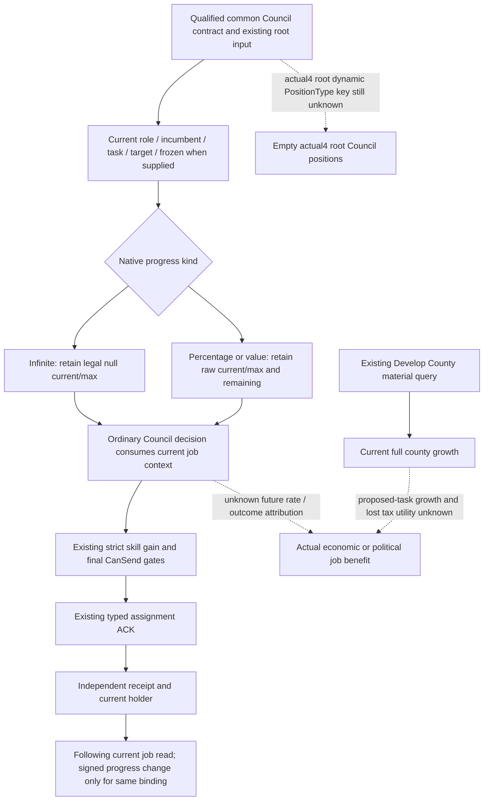

# Current Council job progress in the ordinary campaign

2026-10-08. Source baseline: `a59b2df4a2b3ab6a951bfdc4f12845faf27439d7`.
Status: source preparation, **SOURCE_NOTRUN**. The one new registered consumer
compound is Root-owned; this packet runs no compiler, test, import, SDK or game.

## Native inputs and their meaning

Reuse the qualified Council and full-campaign readers for CK3 **1.20.0.4**,
Steam **25734779**, EXE SHA
`98702F88A547CDE2EAF29A85F93B85F68EE4CF8148336A4F7AFAEB75319DD518`.
No EXE bytes or old qualification are reread.

[Current Council port](council-government-12004-adopted-mcp-port.md) binds the
active-task lookup at `2916CC0`, seat lookup at `2684EE0`, and effective skill
at `28B1690`. [Full campaign root](ck3-1.20.0.4-full-campaign-root.md) binds
value current/max evaluation at `31AB500/31AB820`. The common reader and strict
Python contract support each seat's incumbent, task, target, frozen state and
progress. The current actual4 full-root branch still publishes empty Council
positions with `actual4_council_position_key_source_unavailable`; this
consumer qualification does not establish actual4 job rows in production.
The existing private selected-seat query has a validated current task and
bypasses the dynamic PositionType key gap. Its numeric/context extension is
the [next current-task tax input](council-current-task-domain-tax-component-12004.md).

| Existing observation | Valid interpretation | Decision still missing |
| --- | --- | --- |
| `general/infinite`, current/max null | Task has no completion meter | Numeric owner benefit; null does not mean broken reader or zero output |
| `percentage`, current/max Q100000 | Remaining native task progress | Future rate, completion date and actual task effect |
| `value`, current/max Q100000 | Current task-defined value | Future rate and effect attribution |
| `task_develop_county` candidate material | Native shown/valid/location results and current county growth | Growth after a proposed switch and lost current-task utility |
| Holder plus independent assignment receipt | Useful Council assignment material | A vassal/faction intervention is a different M4 part |

The [development material port](ck3-1.20.0.4-steward-develop-county-material.md)
and `ck3_12004_steward_develop_county.hpp` hold shown `31AC790`, valid
`31AC660`, location `2C48950`, target enumeration `2C48E60`, current growth
`24CF8E0` and decay `24CFB30`. Current growth includes the current world and
task; it is not a counterfactual quote. A shown/valid observation is not the
complete change-task command preflight. The existing material profile remains
separate from the legacy full-AI-input/action profile.

## Minimum ordinary consumer change

The existing Council consumer acquired the independent root but published only
holder and skill selection. Its job fields were retained only as opaque
`independent_position` / `next_turn_position` records after assignment.

Reuse that same root and any existing same-frame root supplied by Service.
Publish `council_job_progress_observation` in the ordinary plan and selected
decision. Record the same projection alongside the independent assignment
receipt and following consumption. For a bounded task, expose the raw
remaining amount. For a later unchanged holder/task/type/target/progress kind,
retain elapsed game hours and the **signed observed progress difference**.
A reset or decreasing value is an observation, not an invented failure or a
causal effect of the appointment. Different bindings have no numeric delta.

This adds no native query, tool, CLI flag, persistent schema, selection gate,
task switch or deadline. It preserves occupied-Chancellor strict Diplomacy
gain, useful-Steward precedence, urgent-war precedence and existing receipt
credit. Infinite progress and frozen jobs do not veto a useful legal
assignment. Current progress is explanatory strategy input; it does not
claim benefit, predict completion or count a separate M4 intervention.

## M4 window and useful next operation

The machine requirement remains a useful verified construction, Council
assignment and real vassal/faction intervention in at most **17520 game
hours**. It does not require Council task completion or a new appointment
when the existing assignment was useful. The original useful Steward
appointment at raw **53286144** is inside the candidate interval
`[53286144, 53303664]`; its retained material joins are owned by the M4
reporter work package. At the last held R76 date **53288496**, 15168 hours
remained. Fresh R77 date comes from Root; this package does not fabricate it.

Keep Steward32440/skill11 when the strongest legal alternative ties at11.
Use the already prepared fresh occupied-Chancellor final-gates query for a
strict skill gain, without losing war priority. Inspect the job context to
understand what the seat is currently doing. Construction and a new genuine
vassal/faction intervention supply the remaining material parts; task
progress is not a substitute for either part.

## Single missing numeric observer construction entry

The concrete numeric gap for an active Collect Taxes Steward is its current
native **owner `domain_tax_mult` component**, not another progress getter.
The old paired-tax research has no proven numeric caller for this component;
do not return `stewardship/200` as a native tax quote.

Reuse the source-closed .3 owner-modifier application path from
[ReligiousRelations task value](religious-relations-task-value-native-ai-12003.md):
`291DED0 -> 31ABF40`, unfrozen actual task, owner/incumbent scopes,
TaskType `+438/+444` collection, owned outModifier and numeric lookup
`2303700`, followed by `9F24F0` cleanup. Its existing piety proof establishes
the method for **that build**, not the actual4 addresses or the tax modifier
ID. The precise current gap is actual4 mapping of those held owner methods
and the numeric `domain_tax_mult` ID; both are NOT_HELD here.

Next capability is one current-task read-only numeric leaf in the existing
campaign-root Council row, following the existing optional task-owner-piety
pattern. First reuse a held actual4 family map if Root has one; otherwise Root
can map only the corresponding complete cached .3 methods with a finite
manifest. Close actual owner/scopes, modifier ID, signed raw scale, allocator
and cleanup before calling. Publish native raw component for current
incumbent only, paired with current role/task identity; no hypothetical
candidate or switched-task result. This input can inform continued tax work
and resource decisions. It is not a new M4 admission gate, and it does not
prove tax-versus-development utility or full political scoring.

## New qualification only

ONE registered ordinary `ck3_plan_turn` / `ck3_auto_turn` compound will reuse
the existing Council Driver DTO fixture and real Service/consumer. Its new
scenes cover finite progress, infinite nulls, frozen context, same-binding
following delta, task/target change without attribution, unchanged strict
selection and urgent-war priority. These task poststates are explicit offline
fixtures. No existing qualified Council/native test is replayed. Root records
FIRST separately; source readiness is not live M4 completion.
