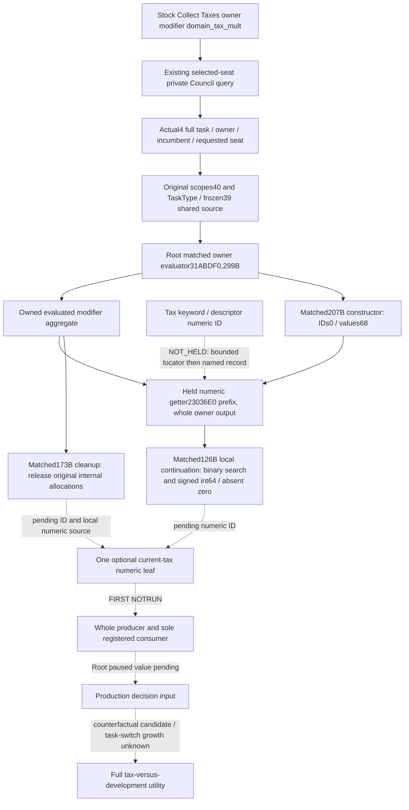

# Current Council task owner tax component, CK3 1.20.0.4

2026-10-08. Baseline `6ee7dea1b4d2fa4ecb05223f12c66b7afe72ac2d`.
Exact game: **1.20.0.4 / Steam25734779**, EXE SHA
`98702F88A547CDE2EAF29A85F93B85F68EE4CF8148336A4F7AFAEB75319DD518`.
Version/source pins are reused; this worker reads no EXE, starts no SDK/game,
and runs no build, project import or test.

The goal is the actual current task's evaluated owner `domain_tax_mult`
component. It is a multiplier before other owner/global aggregation, not gold
income and not a quote for another councillor or a task switch. The present
stage is **research/source capture**. No numeric leaf or live value is claimed.

## Stock and native source first

The installed stock `00_steward_tasks.txt:69–73` defines current Collect
Taxes owner modifier `domain_tax_mult=1`, scaled by
`steward_collect_taxes_total_scale`. `99_steward_values.txt:63–137` retains
the stewardship base plus owner/perk/house/culture conditions. These exact
selected stock lines were read; no stock/EXE hash or old matrix was rerun.
The existing [tax value topic](council-collect-taxes-value-probe-2026-09-29.md)
explains why a skill difference or `stewardship/200` is not a native quote.

| Input | Current evidence | Use |
| --- | --- | --- |
| Requested seat, actual task, owner/incumbent | Actual4 private selected-seat reader is source-closed and already qualified | Bind the current task to the existing native/public frame |
| Task key, frozen, original scopes | Shared actual4 county-conversion ABI: TaskType key18, ActiveTask frozen39, original scopes40 | Reuse the same ActiveTask source proof; no dynamic PositionType key read |
| Task owner evaluator | Root's first299B capture matched `31ABE10 -> 31ABDF0` | Current method source/ABI roles are now held; a match alone does not close every callee |
| Numeric getter | Held37B mapping plus Root matched local126B retry02 | Whole evaluated owner output is the receiver: IDs0/countC, values68; absent ID is native0 |
| Owned evaluated modifier cleanup | Root matched complete actual4 `9F24F0..9F259D`,173B | Release the original internal buffers and shared/string objects; outer storage stays caller-owned |
| Aggregate construction | Root matched actual207 semantic bytes at2872480 | Caller-owned output initialization: ID vector0, value vector68, SSO190, shared1B0 |
| Descriptor table locator | Root matched actual17B initializer at2C4DC3F, table480C2A0/count609 | Locate actual typed records; this supplies no tax numeric ID |
| Tax modifier numeric ID/keyword record | NOT_HELD | Resolve the selected typed descriptor; never borrow piety ID97 |

Root executed the owner299B capture once near **06:47:19Z**:
`SOURCE_CAPTURE_MATCHED`, complete old/new decode, normalized retained operands,
ordered edge shape and local flow equal; **299B / 1 fresh read**. No callback
was installed. Receipt:
`Z:/ck3_mod_rewrite_process_assets/g2-parallel-20261008/council-current-task-domain-tax/owner-map01/SELECTED-TASK-OWNER-CAPTURE.json`.

The actual body recursively follows TaskType+1358 clone, builds ScriptContext
from the original scopes' incumbent and owner IDs, evaluates collection+438
through **2872480**, cleans its local context, and returns caller-owned output.
Source uses shared context helpers889F60,373A0F0,889700,889780. Those role
references are recorded; new callee source is not implicitly authorized.
Root subsequently executed the cleanup173B and table-locator17B captures once,
both `SOURCE_CAPTURE_MATCHED`, about0.869s and0.696s respectively. These are
**190B / 2 fresh reads**, native calls0; the tax ID remains unproved. Receipts
are `cleanup-map01/SELECTED-FOLLOWON-CAPTURE.json` and
`tax-table-locator-map01/SELECTED-FOLLOWON-CAPTURE.json` in the same package.

Actual cleanup `9F24F0` decrements/releases owned shared object+1B0, destroys
SSO string+190 through the already-bound shared856050, releases sparse
numeric buffer+68 through its stored allocator+78, and releases the ID buffer
at0 through its original allocator+10. It leaves the caller's outer storage
intact. Shared ScriptContext cleanup889700/889780 remains a different object.
This method proof does not bind new callees or authorize a native invocation.

The17B actual initializer is at`2C4DC3F..2C4DC50`: its LEA resolves to typed
descriptor table`480C2A0`; the constructor count remains609. No descriptor,
localization literal or keyword bytes were included. Existing named cache
metadata contains no actual descriptor-prefix bytes and no named tax row.

Root then executed only207 semantic bytes of `2872480..287254F`, once,
`SOURCE_CAPTURE_MATCHED`, about0.8948s/1freshread/nativecalls0. Its result is
`aggregate-map01/SELECTED-AGGREGATE-CAPTURE.json`. It initializes the output's
ID and value buffers, evaluates each parsed declaration in the supplied
ScriptContext, merges/finalizes into that output and returns the output pointer.
Its constructor/declaration/merge/finalizer calls are recorded roles; this
capture does not separately qualify their bodies.

The numeric receiver distinction matters for this implementation. Cached
old ordinary-ID source searches uint16 IDs at`RCX+0`, count`RCX+C`, and reads
the matching int64 from the pointer at`RCX+68`. Therefore the standalone
owner output is passed **as a whole**, not as output+68. Existing
`battle_current_own_nested_modifier_reader.hpp` uses Character's outer
aggregate+68 to reach its nested modifier object; that outer offset does not
apply again to the independently constructed task owner output. Cleanup and
the actual constructor show the standalone0/68 parallel-buffer relationship.

The held37B getter source ends just after the ordinary branch's first
`movsxd r9,[RCX+C]`; only itsFFFF-to-zero return is wholly inside those37B.
Real tax IDs take the remaining local binary search. The next126B plan closes
that local branch without re-reading the prefix, expanding a callee or
replaying any qualified Army/Battle fixture.

## Smallest existing interface

Use existing `ck3_query_council_final_gates_private_v1(expected_revision,
position_key="councillor_steward")` or its underlying private composition
query. The final-gates operation first runs the same selected-seat transaction.

`ck3_12004_council_candidates.cpp:132–195` resolves the requested position
through2684EE0, round-trips the task ID, validates owner and PositionType
pointer, and copies the **requested** stable key. `before.active_task` and
validated incumbent are available near391–411; existing recapture471–478
remains the final transaction check. This bypasses the unresolved dynamic
PositionType CString key.

The current actual4 full-root `ReadCouncilProjection` at
`ck3_12004_campaign.cpp:1226–1243` instead returns empty positions with
`actual4_council_position_key_source_unavailable`. Therefore the qualified
ordinary job-progress consumer is source integration, not proof that actual4
full-root job rows are live. Do not reconstruct all positions for this tax
leaf. Current selected-seat task context can travel with the numeric leaf.

After native inputs close, add one optional current-task owner tax component
to the existing selected `position` DTO. Preserve task identity/key/frozen
with that observation; distinguish evaluated component from effective
application when frozen. Keep available signed raw/scale100000 and explicit
unavailable reason, including legal native zero. Do not change outer query
availability, CanSend, candidate selection, root readiness, CLI or tool list.

The insertion must survive `ProjectCouncilCompositionCandidatesPublicV1`
near516. The existing actual4 serializer521 and private mailbox codec carry
the whole DTO. Extend only the optional position field admission in
`council_composition_candidates_contract.py:58,216,324`; private transport
already forwards and normalizes complete `position` for both private tools.

## Remaining bounded source, no speculative call

External package:
`Z:/ck3_mod_rewrite_process_assets/g2-parallel-20261008/council-current-task-domain-tax/`.

Completed owner299B/cleanup173B/locator17B/constructor207B receipts are reused;
no recapture. `NEXT-NUMERIC-LOCAL-CONTINUATION-126B-PLAN.json` declares only
actual`[2303705,2303783)` corresponding to fully cached old
`[2303725,23037A3)`. New begin is the next PC of the held getter's ordinary
branch prefix; corresponding cached ordinal must agree. The126B old local
continuation has no call and ends atRET. The already-mapped prefix37B,13B
padding and following membership method are excluded.

`tax-id-metadata/NEXT-TAX-DESCRIPTOR-PREFIX-6272B-PLAN.json` declares a fixed
112 pointer-record prefix`[480C2A0,480DB20)`,56B per row, one read. This covers
the previous named resource group at ordinal105/106; it does not assert that
the tax row is inside. Each pointer record supplies localization VA at0,
uint16 numeric ID28 and uint32 keyword2C. No pointer is automatically followed.

Root executed that descriptor prefix once: **112 records /6272B /1read**,
`DESCRIPTOR_PREFIX_CAPTURED_TAX_ID_NOT_HELD`, at
`tax-id-metadata/prefix-first01/TAX-DESCRIPTOR-PREFIX-CAPTURE.json`. The actual
record payload and112 concrete label pointers are now cached. No label text
or script keyword has been read; an unnamed row still does not establish the
tax ID. The112 pointers form four bounded literal clusters totaling4000B;
the next metadata plan uses only those declared ranges, not a53KB enclosing
scan or an automatic pointer chase.

Numeric continuation first01 stopped **before reading**, `NOTMATCHED`,
fresh0B/0calls. Its exact artifact is
`numeric-continuation-map01/SELECTED-NUMERIC-CONTINUATION-CAPTURE.json`.
The candidate correctly agreed at2303705, but its cached unwind row120552 is
only8B`[2303705,230370D)`. The helper incorrectly required that one local
unwind shard to cover the entire126B branch. This is a helper range failure,
not a native semantic mismatch. Source repair retains prefix/ordinal
agreement and the same declared126B local window, using the central mapper's
existing image/section bounds; it adds no guard or wider role. The original
NOREAD artifact remains unchanged. Root's retry02 uses
`NUMERIC-LOCAL-CONTINUATION-126B-RETRY02-PLAN.json` and fresh output
`numeric-continuation-map02/`. Root executed that retry once: **126B/1read**,
`SOURCE_CAPTURE_MATCHED`,0.93286s, nativecalls0, with the exact retry receipt
`SELECTED-NUMERIC-CONTINUATION-CAPTURE.json`. The first01 pre-read failure
remains preserved and is not relabeled as a native capability mismatch.

Root's name pass executed **4000B/4reads**,112 named records, exact tax label
matches0: `NO_EXACT_DOMAIN_TAX_LABEL_IN_SELECTED_PREFIX`. Receipt is
`tax-id-metadata/names-plan01/labels-first01/SELECTED-DESCRIPTOR-LABELS-CAPTURE.json`.
Cached raw-byte search over all4000B, including bytes not referenced by those
112 records, also found no exact`MOD_DOMAIN_TAX_MULT`. This real MISS does not
provide a guessed tax ID or justify replaying the prefix/name capture.

Root subsequently captured the one remaining typed-table range
`[480DB20,48147D8)`, **497 rows112..608 /27832B /1read**, at
`tax-id-metadata/remainder-plan01/remaining-first01/REMAINING-DESCRIPTORS-CAPTURE.json`.
All609 descriptor records are now held without overlapping fresh reads.
Remaining names will use only the not-yet-held pointer windows, reusing old
4000B name bytes when they already cover a newly referenced pointer.

A separate metadata lane found no held descriptor-prefix bytes. Record reads alone
do not name the tax ID: the actual selected localization/keyword association
still needs its own exact literal/keyword source. There is no guessed tax row,
piety97 alias, automatic whole609-table scan or automatic pointer-following.

The same metadata lane found an already-held actual4 runtime keyword path:
`3F4F8E0`, complete292B`[3F4F8E0,3F4FA04)`, cached ordinal215482,
`const std::string* __fastcall(int32 token)`. Existing actual4
`ParameterTokenKey-DETAIL.json` and native-government source proof close the
getter; campaign and county-conversion code already bind it. The result is
an engine-owned CString, copied through existing size10/capacity18,
inline<=15/heap-pointer0 handling, with **no destructor/free** of the returned
object. Exact evidence and current copy seams are recorded in
`tax-id-metadata/keyword-source-prep/KEYWORD-SOURCE-PREP.json` and
`ROOT-NATIVE-KEYWORD-LINK-INTERFACE.json`.

After a unique actual`MOD_DOMAIN_TAX_MULT` descriptor label is identified,
the new leaf can reuse its uint16 numeric ID and uint32 keyword token through
this already-closed getter, copy and publish the **actual returned script key**,
then read the component for `domain_tax_mult`. A missing/mismatched returned
key affects this leaf only, without changing outer query/action readiness.
No new static keyword table locator/capture is necessary for that runtime
observation route. The actual returned tax keyword remains **NOT_HELD**:
no native call, compiled fixture or paused observation has occurred here.

These pending plans use Root central shared claims, retain member/immediate
operands, and stop on NOTMATCHED. Any additional necessary source gets a
separate finite manifest; method match labels do not close all callees.

## FIRST and capability boundary

The independent source-closed scalar reader is **AUTHORED_NOTRUN** in
`ck3_12004_council_task_owner_tax.{hpp,cpp}` with its small POD observation
model. It reuses original Task scopes40/type/key18/frozen39, copies the borrowed
native keyword CString, calls owner builder/getter/cleanup in order, and keeps
legal signed native zero. Its descriptor is an internal typed input; no tax ID
is guessed, no current MCP field is published, and no new TU is yet registered.
The current selected-seat DTO/Python hook awaits the actual named descriptor.

Integration and FIRST remain **NOTRUN**. Once the native numeric input and
owned lifetime close, one new whole producer must exercise actual
`ReadCouncilCandidates12004`, the leaf, `SerializeCouncilCandidates12004`
and private mailbox envelope. One new registered consumer consumes those
same compiled wires through real Driver private transport, strict position
normalizer, and existing private final-gates MCP tool. No hand-composed outer
wire or replay of old Council/piety/native GREEN cases supplies tax evidence.

This input supports current task benefit/resource decisions. It does not
pretend a new Council assignment, an applied gold delta, a vassal/faction
intervention, a paired replacement quote, or M4 completion. Ordinary mainline
gameplay and the existing explicit17520-hour M4 window continue independently.
