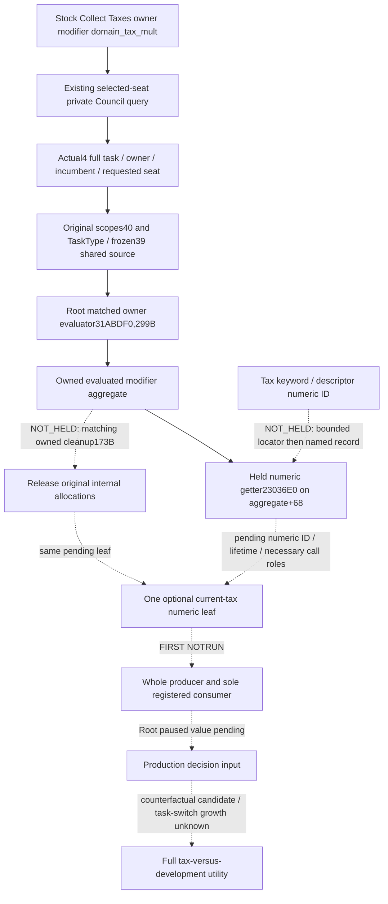

# Current Council task owner tax component, CK3 1.20.0.4

2026-10-08. Baseline `6ee7dea1b4d2fa4ecb05223f12c66b7afe72ac2d`.
Exact game: **1.20.0.4 / Steam25734779**, EXE SHA
`98702F88A547CDE2EAF29A85F93B85F68EE4CF8148336A4F7AFAEB75319DD518`.
Version/source pins are reused; this worker reads no EXE, starts no SDK/game,
and runs no build, project import or test.

The goal is the actual current task's evaluated owner `domain_tax_mult`
component. It is a multiplier before other owner/global aggregation, not gold
income and not a quote for another councillor or a task switch. The present
stage is **research/source capture**. No numeric leaf or live value is claimed.

## Stock and native source first

The installed stock `00_steward_tasks.txt:69–73` defines current Collect
Taxes owner modifier `domain_tax_mult=1`, scaled by
`steward_collect_taxes_total_scale`. `99_steward_values.txt:63–137` retains
the stewardship base plus owner/perk/house/culture conditions. These exact
selected stock lines were read; no stock/EXE hash or old matrix was rerun.
The existing [tax value topic](council-collect-taxes-value-probe-2026-09-29.md)
explains why a skill difference or `stewardship/200` is not a native quote.

| Input | Current evidence | Use |
| --- | --- | --- |
| Requested seat, actual task, owner/incumbent | Actual4 private selected-seat reader is source-closed and already qualified | Bind the current task to the existing native/public frame |
| Task key, frozen, original scopes | Shared actual4 county-conversion ABI: TaskType key18, ActiveTask frozen39, original scopes40 | Reuse the same ActiveTask source proof; no dynamic PositionType key read |
| Task owner evaluator | Root's first299B capture matched `31ABE10 -> 31ABDF0` | Current method source/ABI roles are now held; a match alone does not close every callee |
| Sparse numeric getter | Complete held37B mapping `2303700 -> 23036E0` | Read signed component at aggregate+68; absent native ID produces real0 |
| Owned evaluated modifier cleanup | Old complete173B source held; actual4 public binding NOT_HELD | A separate finite mapping precedes any callback invocation |
| Tax modifier numeric ID/keyword record | NOT_HELD | Resolve the selected typed descriptor; never borrow piety ID97 |

Root executed the owner299B capture once near **06:47:19Z**:
`SOURCE_CAPTURE_MATCHED`, complete old/new decode, normalized retained operands,
ordered edge shape and local flow equal; **299B / 1 fresh read**. No callback
was installed. Receipt:
`Z:/ck3_mod_rewrite_process_assets/g2-parallel-20261008/council-current-task-domain-tax/owner-map01/SELECTED-TASK-OWNER-CAPTURE.json`.

The actual body recursively follows TaskType+1358 clone, builds ScriptContext
from the original scopes' incumbent and owner IDs, evaluates collection+438
through **2872480**, cleans its local context, and returns caller-owned output.
Source uses shared context helpers889F60,373A0F0,889700,889780. Those role
references are recorded; new callee source is not implicitly authorized.
The output itself still requires its matching owned-storage cleanup.

## Smallest existing interface

Use existing `ck3_query_council_final_gates_private_v1(expected_revision,
position_key="councillor_steward")` or its underlying private composition
query. The final-gates operation first runs the same selected-seat transaction.

`ck3_12004_council_candidates.cpp:132–195` resolves the requested position
through2684EE0, round-trips the task ID, validates owner and PositionType
pointer, and copies the **requested** stable key. `before.active_task` and
validated incumbent are available near391–411; existing recapture471–478
remains the final transaction check. This bypasses the unresolved dynamic
PositionType CString key.

The current actual4 full-root `ReadCouncilProjection` at
`ck3_12004_campaign.cpp:1226–1243` instead returns empty positions with
`actual4_council_position_key_source_unavailable`. Therefore the qualified
ordinary job-progress consumer is source integration, not proof that actual4
full-root job rows are live. Do not reconstruct all positions for this tax
leaf. Current selected-seat task context can travel with the numeric leaf.

After native inputs close, add one optional current-task owner tax component
to the existing selected `position` DTO. Preserve task identity/key/frozen
with that observation; distinguish evaluated component from effective
application when frozen. Keep available signed raw/scale100000 and explicit
unavailable reason, including legal native zero. Do not change outer query
availability, CanSend, candidate selection, root readiness, CLI or tool list.

The insertion must survive `ProjectCouncilCompositionCandidatesPublicV1`
near516. The existing actual4 serializer521 and private mailbox codec carry
the whole DTO. Extend only the optional position field admission in
`council_composition_candidates_contract.py:58,216,324`; private transport
already forwards and normalizes complete `position` for both private tools.

## Bounded next mapping, no speculative call

External package:
`Z:/ck3_mod_rewrite_process_assets/g2-parallel-20261008/council-current-task-domain-tax/`.

1. `NEXT-MODIFIER-CLEANUP-173B-PLAN.json`: reuse complete cached old
   `[9F24F0,9F259D)`, central held ordinal candidate only, at most173B/1read.
   Existing scope-tail cleanup is a different object and cannot replace it.
2. `NEXT-TAX-MODIFIER-TABLE-LOCATOR-17B-PLAN.json`: reuse old cached initializer
   `[2C4DC5F,2C4DC70)` (LEA descriptor table, constructor argument store,
   declared609 record count), at most17B/1read. This finds the typed table
   locator only; it does not read the table, pick a guessed tax row or prove
   the tax ID. A subsequent named descriptor/keyword record needs its own
   finite plan after the actual locator is known.

Both use the existing Root central mapper/shared claims, retain absolute
member/immediate operands, and stop on NOTMATCHED. Neither expands a callee,
padding, full function, metadata scan, whole hash or native invocation.
The matched owner299B receipt is reused, not recaptured. If a required
evaluator/lifetime role is still unheld after these results, state its exact
call edge and prepare the next finite manifest rather than install a callback.

## FIRST and capability boundary

Implementation and FIRST remain **NOTRUN**. Once the native numeric input and
owned lifetime close, one new whole producer must exercise actual
`ReadCouncilCandidates12004`, the leaf, `SerializeCouncilCandidates12004`
and private mailbox envelope. One new registered consumer consumes those
same compiled wires through real Driver private transport, strict position
normalizer, and existing private final-gates MCP tool. No hand-composed outer
wire or replay of old Council/piety/native GREEN cases supplies tax evidence.

This input supports current task benefit/resource decisions. It does not
pretend a new Council assignment, an applied gold delta, a vassal/faction
intervention, a paired replacement quote, or M4 completion. Ordinary mainline
gameplay and the existing explicit17520-hour M4 window continue independently.
