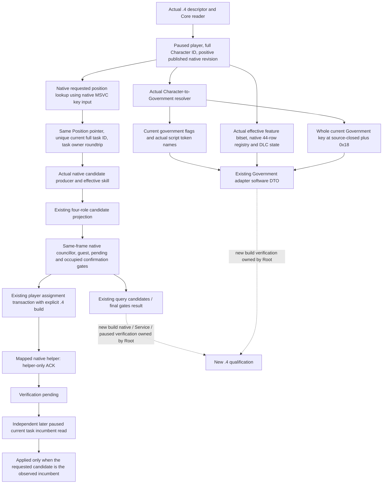

# Adopted Council and Government queries: actual 1.20.0.4 port

This work migrates the existing three Council ON flags and one Government ON flag recorded in `ADOPTED-MCP-COVERAGE-REMAINING-OWNERS.json`, whose exact source base is `caa4adc3d1278e324cf4ec19774028e9b9138e28`. It adds no Council role, government family, action permission or query. Root requires MCP migration verification before G2 resumes. Builds, SDK/game work and the shared adapter/bridge/CMake integration belong to Root and the designated integration owner.

The actual installed identity is CK3 `1.20.0.4`, Steam `25734779`, EXE `101040248 B`, SHA-256 `98702f88a547cde2eaf29a85f93b85f68ee4cf8148336a4f7afaeb75319dd518`. The authority is `artifacts/migrations/2026-10-07/installed-build/BUILD-FREEZE.json`; the cached native ASCII version is recorded in external `upstream-build-migration/global-pe-diff/NEW-PE-METADATA.json`, `embedded_versions.native_1_20_version_candidates[0]`, file offset `71866624` / RVA `71871232`. A new binder admits this actual SHA. It does not translate it into an old reviewed SHA or call an old binder.

The old source inputs are [Council candidates](ck3-1.20.0.2-council-candidates.md), [gates](ck3-1.20.0.2-council-gates.md), [assignment](ck3-1.20.0.2-council-assignment.md), [Council role coverage](ck3-1.20.0.3-council-role-coverage.md), [Government adapter](government-runtime-adapter-1.20.0.2.md) and [Government semantic capture](government-readonly-semantic-capture-12003.md). Historical live/fixture results are retained with their original identities and are not new `.4` qualification.

Council's source-closed producer is `0x2C47EA0`, corroborated by the mapped GUI caller. Its active task accessor is `0x2916CC0`; effective skill is `0x28B1690`. The allocator vtable is actually derived from the new GUI RIP operand at `0x452D0B8`, with its required leaf pointers read from that table. Requested position lookup is `0x2684EE0`, and owner validator `0x31B5430` proves the task's owner full ID at `+0x44`. The new collector uses the source-closed native lookup and compares the returned Position pointer across the owner's current tasks. It publishes the validated requested seat; it does not claim to read the unclosed raw Position key at `+0x18`. Existing steward, chancellor, spymaster and court chaplain coverage is preserved.

Council's actual gate functions are councillor `0x2917540`, guest `0x1A8F760` through role enum `0x28C1670`, pending setup `0x115CA80`, pending predicate `0x2A30790` and occupied confirmation `0x11604A0`. The complete setup preserves GameState `+0xA0` to pending data `+0xCF88/+0xCF94`, window `+0x5D8/+0x5E0` and manager owner `+0x8`. The confirmation retains its `0x140` footprint and incumbent/candidate fields `+0x130/+0x134`. Played ID is an actual int32 source use at `0x54DBC00`, reusing the independent Diplomacy source witness and Council's required callback operands rather than taking another raw global sample.

The actual assignment helper is `0x115AAA0`. The required shared context and complete CanSend bodies are reused from their current `.4` cache owner. The actual command validator is `0x2968280`, which reaches complete CanSend `0x307C020`; the native command wrapper reaches queue `0x37F06D0` and embedded object `0x5CC1240`. This port retains the void helper's ACK semantics and the independent later-frame incumbent receipt. It does not treat helper invocation as successful appointment.

Government's actual resolver is `0x28C2DF0`, returning the current Government pointer from a Character receiver. Its complete body proves Character full-ID/death/landed/unlanded behavior and Government fallback slot `0x5D1E2A8`; Character `+0x18` is not a Government key proof. The Government flag caller proves the Government vector at `+0x50`. Token names use complete actual resolver `0x3F4F8E0`; sorted int32 membership helper `0xB9DE80` proves vector data/count/stride, not a standalone count-function return. These facts reuse their owners' actual bodies.

The Government key is now closed as a combined source and typed runtime field observation. Current `.4` key-operation leaf `0x30A06A0` has the complete 29-byte `add RCX,0x18` / short-or-heap string / `strcmp` path. Root's actual Robert Government pointer leads to primary RTTI `CGovernmentType`, with `CGameDatabaseObject` at member displacement 0. Root then read only the string header and actual heap bytes at this typed object's `+0x18`: length 17, capacity 31, exact bytes `feudal_government`. The reader copies the whole current string for any observed government; it contains no observed-key allowlist. This evidence does not use a coincident Character or Doctrine offset. The mapped generic wrapper is not claimed as a separately proved current Government registration. The selected 128-byte primary-function fragment remains role unknown; failed and adjacent-vtable candidates receive no accessor credit.

The source-closed feature root is `0x5CB87F8`, actual native registry range `0x47334D0..0x4733580` with 44 entries, and script DLC object `0x5CC15E0`. Current effective feature fields and the used DLC hash-set operands are proved by finite mapped source, with the derived registry data read once. All required Government query inputs are implemented through an independent actual `.4` binder and the existing semantic source adapter. It uses only its required campaign fields, not a claim that the entire CampaignRoot or Snapshot has been ported.

Root's source-only paused memory locators are external `upstream-build-migration/government-fallback-live-locator/ROOT-LOCATOR.json` (16 bytes), `government-robert-live-locator/ROOT-LOCATOR.json` (52 bytes) and `government-robert-live-locator/ROOT-GOVERNMENT-KEY.json` (49 bytes). These 117 bytes supply source identity and field corroboration only; they are not a Government MCP query qualification or live-capability credit.

The existing Python private transports already choose exact build identity from the actual attached Hello. Council passes that version/SHA into its existing normalizers; Government checks dynamic native, campaign and feature backend identities. Namespace names of reused software DTOs are not ABI identities. No transport schema expansion is required solely to change the build, and no new facade is introduced.

Current source/ABI receipts are external under `Z:/ck3_mod_rewrite_process_assets/g2-migration-20261007/council-government/`, split into `native-candidates`, `native-gates-assign` and `native-government`. Council's ten leaves were released in `5a9a086c9be9122ccf8f24df4c1b9b24c90ebae1`; the eight Government leaves now close all required native inputs. A fresh `xar_ck3_12004_government_whole_first` fixture is prepared with two whole native wires. It reads fixture-owned full Character identity, a whole heap key, native flags, the 44-row registry, effective bits and DLC state through the real new collector, then the existing two-sample source adapter and `.4` serializer. Its second case changes the current Government key between captures and expects the existing typed drift result. This is prepared source, not executed or live evidence.

A fresh consumer source is `ck3_autonomous_player/native_bridge/research/fixtures/run_government_12004_registered_mcp_first.py`, accepting `--source-root`, `--native-wire-dir` and `--output-dir`. One compound method consumes the new available and key-drift whole frames through the real `MCPServer.call_tool`, registered Government callback, `NativeHeadlessGameplayDriver`, existing private transport and `NativeProtocolState`. `create_server` constructs the real `GameplayBridgeService`; the existing Government callback's direct Driver delegation is preserved. Only the outer request ID is correlated, while the complete native result body survives unchanged. This consumer is authored but not run; it produces no replacement native body and does not rerun the native producer.

All new-build compiled/MCP/live qualification remains explicitly pending and is Root-owned. No old suite or prior GREEN has been rerun or credited to `.4`. The capability readiness is `research` with implemented, source-closed candidates; `static-ready`, `fixture-live` and production readiness are not claimed before their corresponding fresh checks.
