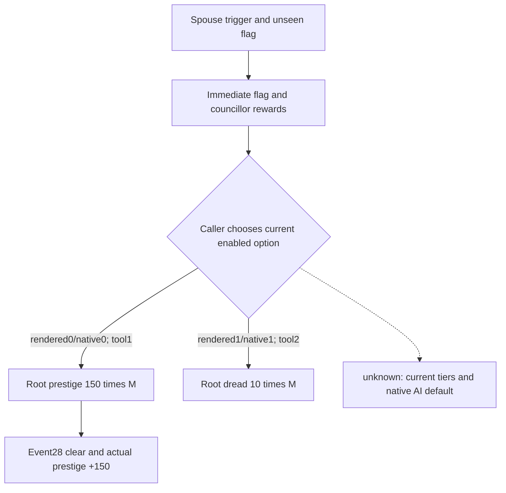

# councillor_spouse_martial.1002: source choice and Event28 loop

Finite production-live loop, 2026-10-05. Root assigned current official `.3` source; actual context/action version, EXE hash and event generation are unpublished. Connection generation is a separate field.

Source: `game/events/councillor_task_events/councillor_spouse_events/councillor_spouse_martial_events.txt:967-1103`, file SHA `f891a2bebca6dfe95b3967cbea2e972e6f568b8dea2aa002f5f447c237c8ef83`. Exact node/helper pins and full authored effects are in the external source package.

| Authored option | Direct effects |
|---|---|
| native0 `.a` | Root prestige `150 * M`; no authored cost |
| native1 `.b` | Root dread `10 * M`; no authored cost |
| native2 `.c`, sadistic trigger | Both rewards; councillor +40 stress and cruelty opinion -20 of root |

`M = 1 + tier2 + tier3`. The exact helper predicates use councillor opinion of liege, strategist/modifiers, martial thresholds and chivalry task; current M is unknown. Immediate separately authors a ten-year seen flag and councillor +75 prestige/+10 dread. No `ai_chance` is authored; native default choice remains unclosed.

Current context `native244/public2`: root29829, councillor34730, liege29829; two detailed shown/enabled rows at rendered/native 0/0 and 1/1. Earlier generic count3 is separate. Empty indicators are incomplete, not an effects proof. Root chose tool option1 from the source reward, without a new preview gate.

| Actual evidence | Result |
|---|---|
| Action structured payload | option1/native0; accepted/submitted/verified; event28->null; native246->247/public2->3 |
| Prestige readback, Q100000 | 288546020->303546020: actual +150 |
| Other readbacks | Action gold64433558/stress0 unchanged; Root independent piety40866250 unchanged |
| Root independent final | native247/public3, raw53264472, alive/paused/map-ready, event/interaction null |

Normal SAVE h8938: 98901909 B, SHA `6660c263ab62fb2a11b4369f11bdfc5bbc32efd5c85e60e15027d82dd5c3e626`. Root totals5006/resumed1853/Oct5+348; this loop adds zero days. Qualification covers source-grounded choice, independent clear, prestige readback and same-date SAVE. +150 does not certify current tier/traits; councillor rewards, dread and opinion were not observed. Full native AI policy remains partial.
