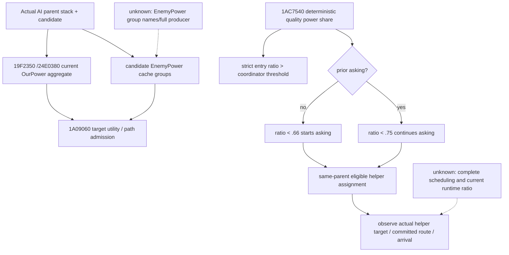
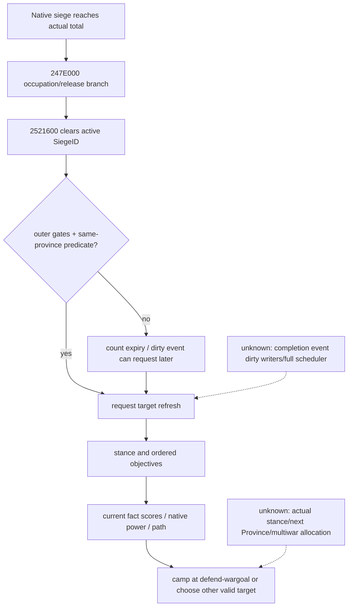
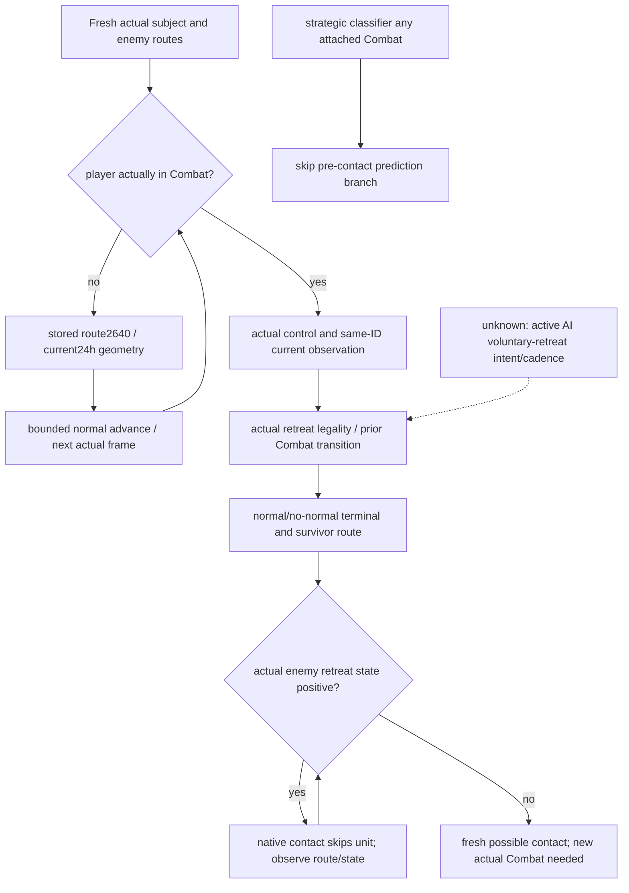

# CK3 1.20.0.3: counter-campaign enemy control and outcome branches

This research closes four concrete native branches for Robert's already selected2640 campaign. It does not choose a new destination, execute a game query or duplicate the mercenary/gathering-ETA work. Existing controller/campaign trees were read first; their1.19 addresses retain their old build scope. The new static edges below bind exact **1.20.0.3 / Steam25652598 / EXE SHA-25694B55397ABB687A3DCD436805A5D885E6BE90FA6C693FEB44A9E3BBEEADE02A6**.

Native source is frozen `g47/7a0bef46588292d26c74716a39fe02b348d3ee65`; Python source is `g48/451dde9915b6bac042f1cfc28364b2a4548f12e6`. Installed stock comes from `Z:/SteamLibrary/steamapps/common/Crusader Kings III/game`. Documentation reads usedg38, with per-file source hashes in each external evidence manifest.

The task relevance cutoff is **4025 saved days / raw53240928**, Robert29829, ordinary episode `native-29829-2bc2d599f7f9`. Root h5504 snapshot observes main83886367@2616 moving toward2640 on9 remaining hops/current2259; capital Siege318767158 is still active95.451%/ETA17, besieger473/owner70766, strength2508. This is the reused cutoff, not a statement that capital later fell or that Robert fought. Normal save SHA-256 `d5c1803c3e3eadd7dc0e618e66940173927398c805dc18f48bcafa89a954d8c0`.

The existing [Root handback recipe](Z:/ck3_mod_rewrite_process_assets/g2-resume-20261003/military-ooda-continuation/capital-countercampaign/entry/ROOT-HANDBACK-RECIPE.json) is reused unchanged:19564B/SHA-256`c33c6c16069ebd792fb8114e75dbeae71ecf89e03103707214aaa1103f687e5d`. Its baseline4024/raw53240904/h5489/95.169%/ETA18 is a different frame. No new helper, protocol, flag or gameplay gate is introduced.

## Engage, native power and same-parent help

Reuse [target triage](army-target-triage-1.20.0.3.md) and [relief tree](war-relief-siege-native-ai-12003.md). Current predictor0x1AC7540 is a deterministic quality power-share calculation, not Monte Carlo. Existing entry consumers0x1AC8A69/0x1AC8E76 compare strictly above coordinator+0x88; final-entry0x1AC92B2 is a separate consumer. Different target utility inputs must not be collapsed into this predictor or summed UI soldiers.

New current target-utility OurPower producer:0x1A05625 calls0x19F2350 withR8D=0. It traverses the actual AI parent stack's subunits, regular full-generation CUnits and CArmies, then0x24E0380 aggregates generation-valid ArmyRegiment+0x40. Candidate cache corrections begin0x1A08519;0x1A0876B/0x1A0883F/0x1A088E4 pass the resulting utility inputs to0x1A09060. This parent-stack native aggregate is neither a soldier count nor the single-player army's strength-row base power. EnemyPower inputs are located through coordinator+B60/0x19FB280 and cache+21F three groups; their complete producer and business group names remain unknown.

New same-parent help chain0x19F2750→0x1A1D420 closes the asking hysteresis:

- Subunit+0x48 bit0 is current asking; bit1 is assigned helper; parent+0x38 and help-target+0x40 are already read correctly by frozen g47's reinforcement-assignment query.
- Predictor mode0/flags3 at0x1A1D824 selects ASK slot0x5C68768/stock0.66 when prior asking=false and STOP slot0x5C68760/stock0.75 when prior asking=true. Signed strict-less comparison means equality does not start/continue asking.
- Bit4 is preserved as raw exact write sequence: prior is saved at0x1A1D624, bits0/4 are cleared and prior is written tobit4 at0x1A1D630–63C;0x1A1D862–87B uses the then-current bit0 XOR new result when finally writingbit4. It is not simply named an old-to-new asking flip.
- With more than one same-parent subunit and the relevant coordinator bit4 clear, dispatch scans stored order for the first asking/not-assigned requester and marks eligible other helpers assigned with target at the requester current Province. Other paths clear asking/assigned/override. Asking or assignment alone is not actual waiting, movement or reinforcement arrival.

Read actual enemy committed target/route and existing `ck3_query_battle_reinforcement_assignment_v1` when the selected subject resolves AI membership. Current runtime full predictor/target utility cache is not a published scalar. If a concrete enemy-intent decision needs it, extend the existing assignment query with the exact parent/coordinator cache receiver and bound native getter inputs; do not relabel base power as that ratio or require it for today's committed march.

## Capital completion and gated next-target refresh

New exact completion edges:

| Current .3 edge | Meaning |
|---|---|
|0x2521060 apply;0x25212C2 signed current/total compare|CSiege+3D0 must reach current native total; close-to100%/ETA alone does not prove completion|
|0x25212D2→0x247E000|Province completion happens before old siege deletion|
|0x247DC20→CArmy+124→canonical CUnit+174|Resolve the actual besieger owner CharacterID|
|0x247CCB0/writer247CCE0|Writes supplied occupier toProvince+73C under the native relation branch|
|0x247D140/writer247D1EB|Alternate completion branch writes occupier−1; legal title holder remains separate|
|0x25212EC→0x2521600/writer2521665|ClearsProvince+788 active SiegeID; a no-qualified-besieger cleanup path also uses it|

Current coordinator0x19FF515–740 can request refresh from target count+9C expiry or dirty+68 bit1. Positive+ B0/+C0 skips that check. Early stack validation additionally depends on actual assignment, prior score+74, cooldown+6C and other predicate branches. In0x19F1590's stationary/same-current-province path, a missing/invalid Province+788 SiegeID can return true to this outer request. That closes a useful completion→no-siege→conditional-refresh edge, not an unconditional immediate retarget after every capture.

0x19FF788→0x1A04F40 refresh resets target counter7 or lopsided14; stance uses its own30 counter. They are update-call counts:complete upstream cadence remains unclosed, so they are not promised7/14 days after capital fall. Target write0x1A050F5–FD stores accepted Province+60, assignment+78 and score+74 after objective expansion/local/stack score and bounded native path.

Installed attacker_offensive/stronger first block has wargoal500, goal/primary-attacker-area hostile250 and enemy capital150. Attacker_defensive/weaker has visible hostile500 and wargoal500. Both retain defend-wargoal5 fallback. `_ai_war_stances.info` explicitly lets defend-wargoal bypass the usual need to start siege/combat; therefore staying at a controlled2640 is a valid branch. Actual stance, full candidate cache and concrete next Province are not observed by this static study.

Continue the existing2640 march. When actual occupation or target changes, use fresh snapshot enemy routes, the existing assignment query and per-war options. The same Province in War129/50331736 does not guarantee that occupier70766 is an attacker in both; check participants/occupier-side separately. Native held-goal ratio/clock is not war age. One capital holding does not prove a CB's0.8 county/fortified-goal threshold or a war victory.

## Strategic withdrawal, actual combat and danger window

The newly closed `.3` strategic classifier0x19F5620 skips prediction when0x1A1C810 resolves any subunit member's attached full Combat. It does not check phase/finalized. Outside that attached-combat branch, ratio strictly above stock0.45 returns raw1; equality still evaluates land/elsewhere/terrain. Elsewhere-strength0.25, nearby-terrain distance2 and stand counters30/45 are independently registered current inputs. Raw enum names/cadence are not fully recovered.

0x1AC40A0 collects distance2 candidates, uses0x1AC88D0 admission, scores with native province properties and prefers the nearer squared distance on equal score. Strategic raw0 writes a new stack target+60/bit4; raw2 manages stand counters, target reset/assignment8. These are ordinary planning branches, not proof of a submitted active battle-retreat command. Generic AI active-combat voluntary-retreat intent remains unknown; its narrow future chain is command production/apply0x1A188B0 and0x2969660 correlated with an actually attached Combat.

The existing route-contact horizon takes all published active-war enemy CUnitIDs, deduplicated and excluding retreating units; already-in-combat enemies remain in scope. It checks same-province/opposing-edge geometry only over current `[rawdate,rawdate+24]`. A conflict is not guaranteed native create/join; no conflict is not whole9-hop safety. For committed2640 it projects stored MovePath instead of silently rerunning A*. Refresh through the existing daily OODA, without a new authorization threshold.

Existing shattered-retreat evidence is reused:positive CUnit+170 blocks native movement/contact admission;raw3 clears after final route node,raw2/3 may clear with emptyroute. Preferred7/max15 are province counts, not a seven-day immunity clock. Actual route and retreat flag—not an old terminal date+7—determine when the enemy becomes contactable.

Foreign numeric observation already exists: `ck3_query_battle_transition_v1` calls ID-only base reader then `AttachBattleCurrentObservationV1` in the same native handler. Its optional current_observation reports actual retained side strength/loss/width/advantage; v37–39 prove the primitive at their original foreign battle cutoff. There is no standalone `ck3_query_battle_current_observation_v1` tool. No new provider is required.

Player battle-control applies only to a current controllable/nonretreating actual in-combat army. Actual selected commander side+74/next-roll endpoints apply in main,nonfinalized; v2 army commanders cannot substitute. Native minimum retreat elapsed14 is strict>14 (normally15), computed from actual battle/result baseline rather than main phase_day. After subject retreats, keep observing prior Combat by ID; `subject_retreating` is not combat disappearance. Old missing Combat is not victory; use the existing passive terminal cursor and actual stored player side/winner.

## Physical outcome and individual war result

The existing Root recipe separates these observations:

| Observed transition | Meaning |
|---|---|
|Army at2640|Arrival only|
|Observable siege null but occupied=true|Siege ended/cleared and current occupation persists; can be completed enemy fall|
|Prior/new unoccupied plus observable siege clearance|Physical unoccupied relief state; player causality additionally needs actual action/contact/result interval|
|Prior enemy occupied→fresh unoccupied for same actual holding|Single holding recapture; changed enemy occupier is not full liberation|
|Title-holder2115/actual holding2116|Legal holder/subrealm independent of physical occupier|
|New normal terminal + actual player stored side matches winner|Scoped player battle victory|
|Named journal WarID row and independently fresh per-war options|Actual recorded contribution and current total/CanSend; concurrent deltas remain separate|
|Known legal one war-victory request→exact old WarID absence/material aftermath|Scoped settlement; arbitrary disappearance alone does not choose an outcome|

Current occupation getter0x247D0E0/+73C and rich `ReadObjectiveProvince`/+788 already expose the needed physical branches; no new query is needed for today's active-war counter. Legal holder is CLandedTitle+128 and the existing title-holder query survives war scope removal. One actual Siege318767158 repeated in two war projections is one physical event; native occurrence counters/order and each exactWarID score stay separate.

The current passive journal lookup scans CombatID writer rows and publishes the latest one matching row. That is not all multiwar contributions and is not proof the engine recorded only one war. Existing per-WarID options still permit useful score/settlement decisions. If an actual future battle needs all writer attribution, extend the same lookup/DTO with captured CombatID+WarID+row index; no new protocol or present execution blocker follows.

Specific later construction entries are retained without blocking this march:once all active objective wars disappear, a missing capital row is unread rather than no-siege, and existing `ReadObjectiveProvince` can publish current-capital physical state independently if needed;raw ticking cache/validity atWar+40/+78 and+A0/+D8 can extend the same options if actual fractional-clock decisions need it;natural war-end reason requires the specific .3 outcome/cleanup writer and observed leader/faction/succession branch. Complete held-goal evaluator ABI, full power cache producer and generic active AI retreat intent remain dashed unknowns.

## Evidence, readiness and reporting

The four external lanes each freeze native caller ranges/raw byte hashes, source/stock pins, Mermaid and October3/W40 fields. A's first coarse bit4 label was corrected to exact write order before freeze. B preserves one auxiliary PDATA extraction note (`unwind region missing` for a leaf), followed by bounded exact leaf extraction; it is a research-tool limit, not a game failure. Existing native/live evidence is reused, with no old fixture reruns.

Readiness of the new trees is **research / listed exact static branches closed**. Historical route/foreign-current/occupation/terminal primitives retain their own actual scopes. This file work adds0 SDK/game/window calls,0 shared edits/Git operations,0 builds/tests,0 days/actions and no arrival/recapture/battle/war credit. Root continues actual2640 execution and owns canonical adoption/commit/push.

Package and per-lane manifests: `Z:/ck3_mod_rewrite_process_assets/g2-resume-20261003/war-counter-campaign/v46-native-continuation/ROOT-DELIVERY.json`. It includes the unchanged Root handback recipe identity, exact frozen source pair, four complete lane evidence files and merged daily/weekly fields. Mercenary/rally/gathering work remains with its existing owners.

## 2026-10-04：真实玩家战斗终态后的会合、合军与2640行动配方

本段复用上文 v46 原生树、既有 Root handback 和 `current-preparation-v47/helper/root_sdk_counter_transit_days.py`；已发布内容不重新打包。编写时 Root 报告累计4041保存日、raw53241312，玩家战斗正常推进+1日，第二主军仍沿 `[2632,2617,2618]` 前往J当时所在地2618。这些只是协调元数据：本工作包不读取当前 battle body，实际 phase、参战军、终态和胜负由唯一 battle consumer 提供。下列配方是准备完成，不是本轮 actual policy loop 或胜利信用。

1. **接收真实 own terminal。** 优先复用 battle owner 已给出的 terminal；确需读取时，现 `ck3_query_battle_terminal_transition_v1(prior_combat_id=C, subject_public_cunit_id=U, expected_revision=R, after_terminal_sequence=L)` 沿用实际 CombatID、handoff subject 和 owner cursor。保留新 `terminal_journal.event_status/event_sequence`、`prior.terminal_kind/combat_id/terminal_date_raw`、双方 stored-order full CUnitID 和 `winner_raw`。只在新 observed `normal_result`、实际玩家参战 side 已知且 winner 等于该 side 时计该场正常胜利；玩家胜或败均可交回 campaign。ACK、旧Combat删除、ResultID或军队暂时未接战均不能替代终态。

2. **独立取得当前军队并确认会合位置。** `ck3_take_snapshot(include_native_command_history=false)` 的实际 `player_armies` 加上当前 actor-owned/controllable 行给出完整可控 roster。读取 alive full CUnitID、`current_province_id`、实际 committed route/target、`in_combat`、`retreating` 和 control；保留 mercenary captain owner，不能只按 owner29829 删除受控军。任一受控军实际仍在 Combat或 successor接战继续由 battle owner接管。主军移动目标2618不是抵达：需新快照显示主军与当前J在同一实际省；若J已移动，以新roster的真实地点处理，不把旧2618或旧军ID当战后事实。现 helper 自动记录到达而其调用 `stop_on_arrival=False`，因此会合必须由 Root 独立消费实际快照确认，不能宣称已有自动 arrival-stop。

3. **合军一次并独立读回。** `ck3_get_capabilities()` 的当前 `action_steps` 发布同省可合军 literal；沿用 `ck3_execute_step(step="merge-armies-D-with-S", expected_revision=R)`，D/S均取实际roster与本帧公布的方向。没有单独 `ck3_merge_armies` 或 readonly final CanMerge工具，最终原生 validator 在现动作执行链中生效。现任控制、combat/retreat及同省合法性按当前原生结果处理。动作内 postcondition 与新 `ck3_take_snapshot` 独立读回分开：核对D实际存续、S不再存在、完整ID变化；再对实际存续名单读 `ck3_query_army_strengths(army_ids=[...], expected_revision=R)`。需要决定将领时再复用 `ck3_query_commander_candidates_v1(subject_army_id=D, expected_revision=R)`。不把两军历史人数相加写成合军后的战斗兵力。

4. **同一新帧选取2640物理任务。** 优先消费该 snapshot已发布的2640 rich objective；缺少完整行时才调一次 `ck3_query_war_occupation_targets_v1(war_id=W, expected_revision=R)`，W取目前仍实际发布2640的 active player war（129/50331736是历史候选），返回中筛 `rows[province_id=2640]`。该工具没有province_id参数。保留实际holding/合法holder、occupation、occupier/war side、`siege_observable`、FullSiegeID、besieging full ArmyID 和 `player_army_besieging`。同一物理围城跨战争重复行只计一次，各WarID的side counts与战分保持独立。

5. **沿用2640并执行现有动作。** 当前敌方围城存在则保留relief任务；当前敌方占领则保留recapture任务，两项可以同时成立。已确认敌占时现 helper选 `--occupation-role recapture` 并同时保留当前敌围城事实；未敌占且敌围城仍在时选 `relief`。自己已经在围城的 active_siege 是当前收复过程，不能重新标成敌方围城。对合军后的实际D，复用当前能力公布的 `move-army-D-to-2640` 和 fresh `expected_revision`；已有相同实际 committed route则继续它。若还需接触上下文，重取现 projected-contact角色，不沿用v43敌占前的defender角色，也不等待MC或尚未发布的sentinel。

6. **继续现 helper并验证结果。** 首都行进/收复沿用其实际军ID、`--target-province 2640`、`--occupation-province 2640`、当前WarIDs和选定relief/recapture角色；每轮仍是已实测的 `life-advance-one-day`、fresh观察和normal SAVE。会合途中可以分别传真实meeting target与`--occupation-province 2640`，两者不必同省。任一受控军新接战保留既有 any-owned-combat handback交 battle owner。对曾观测的敌围城，后态 `siege_observable=true, active_siege=null`才证明当前已清；旧SiegeID变成另一active ID仍有围城。对同holding曾实际敌占的baseline，后态occupation真实解除才记收复；ETA、到达、动作ACK、空路径、玩家单场获胜均不替代该物理后态。最后保留实际normal checkpoint date/history/hash，观察或动作同日不增加保存日信用。

原生依据直接沿用已闭合树：`0x247CCE0`写`Province+0x73C`占领者，`0x247D1EB`释放占领；`0x2521665`清`Province+0x788` SiegeID且另有无合格besieger的清理路径，故clear不是capture；`0x19F1590`没有当前Siege时只在既有early-refresh条件满足后触发目标重评，不能预测敌军必然离开capital。终态、当前受控名单与同帧军队合法性均复用已有native/read-only/typed路径，不新增入口或执行门禁。若实际所有active war已结束而2640行不再发布，缺行保持未观测，先复用另一实际发布行；确需补口时沿用既有`ReadObjectiveProvince` current-capital发布入口，而非把缺行当无围城。按实际需要才查询各WarID终结选项，单场胜利不是战争胜利。

本包三个文件工作线并行完成；新增游戏日、动作、SDK、窗口、fixture、测试、full build、共享源码与Git操作均为0。日/周字段为2026-10-04／2026-W40，当前 battle和接续结果由 Root唯一执行及报告归属；不重复认领Root的+1日。未闭合原生分支和具体施工入口仍在既有v46账本，未为本recipe重做逆向。

Sealed prepared-recipe receipt: `Z:/ck3_mod_rewrite_process_assets/g2-resume-20261003/war-counter-campaign/post-battle-campaign/ROOT-DELIVERY.json`; its report fields remain research/prepared, with no new actual terminal, meeting, merge, relief, recapture or campaign-loop credit.
