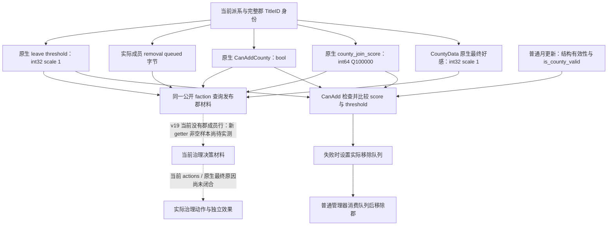

# CK3 1.20.0.3：罗贝尔郡派系判断材料

2026-10-06 的后续窄输入见 [玩家派系郡文化输入](faction-county-culture-input-12003.md)：同一 alert 郡行追加完整郡/目标文化身份与相等关系，当前 stock 的 `is_county_valid` 文化分支已冻结。该增量目前为 research / source-integrated，专用 fixture 与实机尚未执行；下面保留原 getter 与 v19 的历史证据边界。

罗贝尔普通战役在日期 `53220000` 的民粹派系 **188** 只有郡成员 **2111、2115**，没有角色 leader 或 character member。既有公开查询 `ck3_query_player_faction_alerts_v1` 当时实测得到力量 **99.125**、力量门槛 **80**、不满 **18**、每月增长 **6**，并按原版规则判为危险。角色送礼或 Sway 的材料不能代替这两个郡的判断材料。本次在同一查询的派系行追加 `county_member_observations`，发布原生郡好感、最终加入分数、资格和实际移除队列状态。最新 v19 暂停查询日期为 `53220456`；该帧完整 targeting vector 中已没有派系 188，仅有下面记录的自由派系观察项。

冻结版本为 **CK3 1.20.0.3 / Steam build 25652598**，EXE SHA-256 为 `94B55397ABB687A3DCD436805A5D885E6BE90FA6C693FEB44A9E3BBEEADE02A6`。只使用罗贝尔原普通战役作为当前测试入口；实际查询仍由 ROOT 串行执行，CK3 保持后台最小化。v19 的现有公开危险提醒查询已再次达到 **production-live primitive**。郡材料 DTO、原生 reader 与序列化/Python 契约为 **static-ready**；最新实际帧没有郡成员行，两个郡的新 getter 值仍未实机采样。不能从这次合法无郡场景或离线例值推断当前分数、当前好感或将其计为 G2 完成。

既有危险派系实机证据：`artifacts/g2-maintainer-2026-10-02/resume-12003/m4-sway/robert-faction-alerts-actual-01/001-ck3_query_player_faction_alerts_v1.json`，真实暂停日期 `53220000`，native revision `10`，actor `29829`。新 getter 的精确字节证据在同级 `robert-county-opinion-native-01/` 和 `robert-county-final-score-native-01/`，本次直接复用，不重复全 EXE 哈希、旧 ABI 矩阵或历史 fixture。

## 已闭合的原生决策树

郡好感的具名 `County.GetCountyOpinion` 注册最终进入 RVA `0x24D4CB0`。它以 `CountyData*` 为接收者，读取完整 TitleID，再解析郡的**当前持有者**，最后调用 aggregate `0x24D4790`；返回值为有符号 int32 整数，scale **1**。bridge 不应再除以 100000，也不应把罗贝尔硬替换为郡持有者。CountyData 由当前 Province `+0x848` 得到；这一入口避开 GUI wrapper。

派系最终郡加入分数使用 RVA `0x2602570(CFaction*, int64_t* out, CLandedTitle*)`。原生接收者创建 Title scope/tag **5**，保存实际 Faction scope/tag **0x19**，通过 `CFactionType+0xB80` 的 MTTH 求值器 `0x37616A0` 返回有符号 int64，scale **100000**。具名 parser token `county_join_score` 和独立 reflection/monthly consumers 已交叉闭合。读取最终结果即可保留原版 opaque 输入；本包不重建宗教、文化或其他内部公式。

原生 CanAddCounty 接收者为 `0x26028E0(CFaction*, CLandedTitle*)`，结果是 bool，与分数不同。现有成员的普通月更新还检查结构有效性和 `is_county_valid`，再调用 CanAddCounty，比较最终分数与 `0x5C694C0` 的有符号 int32 leave threshold ×100000。失败会将实际成员行 `+0x0C` 置为移除排队；普通管理器随后消费该字节并移除郡。这些都是观察来源，本查询不执行更新或移除。

**分数高于门槛不证明郡一定保留**，其他有效性与资格仍参与普通更新；分数低也不证明郡已经移除，必须观察实际成员和队列。CanAddCounty 只有原生布尔返回，没有本次闭合的原因字符串；不能将 `false` 解释成某个未经观测的特定原因。

## 同一公开查询的字段

`targeting_factions[].county_member_observations[]` 每行使用原有 `county_member_title_ids` 中的完整身份，按 TitleID 排序。C++ DTO 使用 optionals；JSON 形状如下：

| 字段 | JSON 值与单位 | 语义 |
|---|---|---|
| `county_title_id` | positive int32 | 当前已解析成员的完整 TitleID |
| `capital_province_id` | positive int32 或 `null` | 当前郡首府 Province |
| `holder_character_id` | positive int32 或 `null` | 郡当前持有者 |
| `county_opinion` | `{raw: signed int32, scale: 1}` 或 `null` | 原生最终郡好感 |
| `native_county_join_score` | `{raw: signed int64, scale: 100000}` 或 `null` | 实际 faction/title 原生最终分数 |
| `can_add_county` | bool 或 `null` | 原生最终 CanAddCounty 返回值 |
| `removal_queued` | bool 或 `null` | 实际成员已排队移除；不表示已经移除 |
| `native_leave_score_threshold` | `{raw: signed int32, scale: 1}` 或 `null` | 当前原生 leave threshold |
| `opinion_status` | `available` / `unavailable` / `unsupported_build` | 好感 getter 的读取状态 |
| `native_final_status` | 同上 | 分数、资格、队列和门槛四项均实际成功时可用 |

真实 **0** 与 **false** 都是已读取的值，不能转换成 unavailable。单个 getter 失败时对应字段为 `null`；同一行内已独立读取成功的其他字段继续保留，整体 `native_final_status` 可以仍为 `unavailable`。两个 status 描述新材料的读取，不改变既有 alert readiness 或旧危险提醒投影。

1.20.0.2 或其他旧 provider 的空 material vector 不输出新增字段。Python normalizer 接受旧派系行的原形；新增字段存在时按明确类型、单位和成员身份归一化，也不伪造当前空查询。本次不新增 MCP、动作 flag、政策 gate 或战争接口。

## 已完成验证与剩余工作

v19 首次公开查询为 **GREEN**，但其实际 payload 与 native wire 一致：暂停日期 `53220456`、actor `29829`、native revision **3**，完整 targeting faction count 为 **1**，唯一派系为 `liberty_faction` **50331692**。角色 leader **33435**，角色成员 **33435、34333**；力量 **32.455**，门槛 **80**，不满 **0**，每月变化 **-3**。原版危险判断为 `false`，planner 将其列为 watch，dangerous IDs 与 county exposures 均为空。该完整 targeting vector 中派系 **188** 不存在，且当前行的 `county_member_title_ids=[]`。因此 serializer 合法地不输出新增的郡材料行；这不是 getter 失败，也不是新 getter 的非空实机验收。

| 两个原郡的所需材料 | v19 实际观察边界 |
|---|---|
| 2111、2115 的身份、好感与好感 status | 本次没有对应成员行，未采样 |
| 最终 signed score、CanAdd、queue、threshold 与 final status | 本次没有对应成员行，未采样 |
| 原派系 188 的当前 targeting 风险 | 不在本次完整 targeting vector 中 |
| 当前自由派系 50331692 的风险 | 原版 non-dangerous，watch |

实机证据为 `artifacts/g2-maintainer-2026-10-02/resume-12003/m7-robert/actual-v19-sway-county-finance-01/005-ck3_query_player_faction_alerts_v1.json`（SHA-256 `397f10b69210af2df62de20f17cdb6fa9b2754d07bcbcabb95505c56546ebfc1`）和同目录 `native-wire.jsonl`（SHA-256 `020588227f765c4f31c6388cbcbc3c38d55cb3c58c207a6741c1ba46e4d3731c`）。本包只读这次已保存的两个来源，未重新调用游戏或重复 schema/ABI 测试。派系 188 的消失只能记为当前成员集变化，现有证据没有闭合具体原因，也不能归功于送礼、Sway、和平治理或新只读 getter。

生产 C++ serializer 经 **MSVC `/W4 /WX /O2`** 一次编译，实际输出三帧 JSON 字节，再由生产 Python normalizer 消费，结果为 **GREEN**。覆盖 signed int64 分数 `-4294967297`、signed int32 好感 `-37`、零值、`false`、部分 getter 失败的 `null`、保留成功的 queue `true`，以及旧字段缺失兼容。以上数字全部是离线测试例值。证据：`artifacts/g2-maintainer-2026-10-02/resume-12003/m4-sway/robert-county-material-dto-01/producer-wire/result.json`，原始输出 `producer.jsonl` SHA-256 `033946a13629ea9322d317e290d17d6d109b99403eb7206b164129992cbe0030`。

Python 新增测试和现有 faction 契约测试一次通过：**27 passed，38 subtests passed**。可复现入口为 [run_player_faction_county_material_wire_test.py](../../ck3_autonomous_player/native_bridge/research/run_player_faction_county_material_wire_test.py) 与 [test_player_faction_county_material_v1.py](../../ck3_autonomous_player/tests/unit/test_player_faction_county_material_v1.py)。它们不连接 SDK、pipe 或游戏，也不操作窗口。

新 getter 已接入 v19 的现有 application-main reader；当前没有适用的郡成员，无需为旧派系强行创造场景，也不阻断罗贝尔其他当前机会。后续在同一普通战役出现真实郡派系治理需要时，由 ROOT 用现有 `ck3_query_player_faction_alerts_v1` 采样非空材料，再据原生树选择实际可用的治理入口并独立验证效果。本页的更新没有增加游戏日数、G2 milestone 或和平解散派系的成果 credit；郡 getter 的非空 production-live primitive 与治理 OODA 仍待真实证据。
