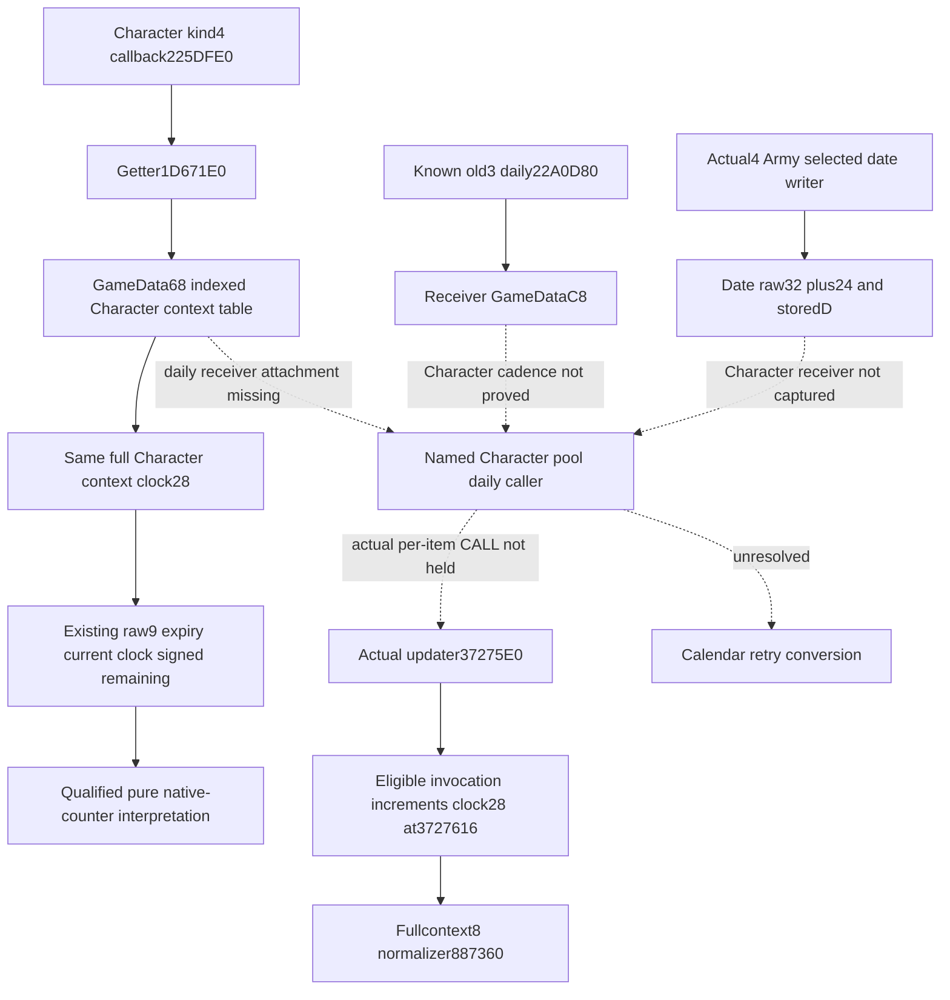

# Crown cooldown Character cadence and native-counter retry

2026-10-08 /2026-W41. Exact target: CK3 1.20.0.4 /Steam25734779 /
EXE SHA-256 `98702F88A547CDE2EAF29A85F93B85F68EE4CF8148336A4F7AFAEB75319DD518`.
This source-only increment reuses the closed
[duration literal and scalar clock chain](crown-authority-cooldown-duration-parser-12004.md),
the original nine-field observer, and frozen qualification packets.

## Actual native tree

Complete113B Character kind4 callback225DFE0 transfers Character+1B0's handle
at225E048 to complete331B getter1D671E0. For the actual nonnegative index,
1D67245 loads QWORD[GameData+68] and1D67249 returns QWORD[table+index*8].
This is the same full Character context used by the crown observer; clock
is signed32 at+28. Held96B updater37275E0 increments that clock at3727616
when its captured scalar-row conditions select the update, then passes
fullcontext+8 to normalizer887360 at372762E. The prefix gives no calendar caller.

Known old3 daily22A0D80 obtains GameData at22A101D and calls old3 updater
3727600 at22A102B with **GameData+C8**, selected at22A1024. It does not select
the GameData+68 Character table. Actual4 Army writer's qualified3B receiver
and152B date/D arithmetic prove raw32 date+24 and storedD, without qualifying
the complete5549B daily body or the Character pool updater receiver.

## Finite source join and one entrance

The source child checked only finite M7 ROOT/BACKGROUND03-05, Character
cadence/full-context-return indexes, retained Entry/context handoffs, and
actual4 Army selected-writer/route receipts. The parent's prior single
oldv57 daily-body query is reused without repeating it. No positive Character
pool daily caller is attached in that named scope; this is not a project-wide
absence claim. New source cost is **0 EXE/native bytes /0 reads**. Closed
bodies, generic parser/Lexer, PE metadata, hashes and code catalogs are not repeated.

[CLAIMED-CALLS-AND-RECEIVER.json](Z:/ck3_mod_rewrite_process_assets/g2-background-20261008/m7-clock-cadence-source03/source/CLAIMED-CALLS-AND-RECEIVER.json)
and [CACHE-LOOKUP-LEDGER.json](Z:/ck3_mod_rewrite_process_assets/g2-background-20261008/m7-clock-cadence-source03/source/CACHE-LOOKUP-LEDGER.json)
retain the existing source receipt references.

The sole next entrance is a **named Character NewDay or full-context pool-owner
caller receipt** selecting QWORD[QWORD[GameData+68]+index*8] and calling old3
3727600 on that same full context. No CALL site/window is currently attached,
so there is no justified actual4 capture range. After attachment, the minimal
capture must preserve receiver selection, actual CALL and invocation cadence.
[ONE-CONSTRUCTIBLE-SOURCE-ENTRANCE.json](Z:/ck3_mod_rewrite_process_assets/g2-background-20261008/m7-clock-cadence-source03/source/ONE-CONSTRUCTIBLE-SOURCE-ENTRANCE.json)
gives this exact source-index request. The already authored same-Character
ordinary-day law pair remains a later measurement alternative when game
contact is authorized; no SDK request is queued.

## Minimum consumer logic candidate

The qualified pure consumer exposes observed expiry as a **native counter
deadline**, retaining source signed remaining arithmetic. Stock years20 and
the source's four token-ID factors do not establish Character clock cadence.

A future consumer can reuse each existing actor/frame law observation and
its final native CanEnact/blocked-reason result. An absent cooldown already
has the strict observer's same-frame retry date. A timed observation can
report native deadline/current counter; observed exact-zero remaining can
motivate a fresh final-terms query. That hint or a raw row's presence does
not grant permission. Untimed/unavailable keep existing semantics. Negative
or wrapped remaining is not converted to a calendar due date or new expiry
predicate. Final native law terms continue to determine whether an action can run.

This is a source-only recipe, not a policy or Service change. No new DTO,
context/date/sequence gate, permission or scheduler is added. This finite
cadence lane stops pending the one concrete entrance above. Root can move
to the next evidenced G2 capability instead of guessing code ranges.

## Root's sole new pure qualification

Root qualified source2331e2a1b11d67a3bbe9b05f9108ed8245be9cd7. First01 was
launch-harness collection RED: omitted project-src PYTHONPATH, exit4, zero
cases executed,0.879639s. It remains frozen. First02 set
`PYTHONPATH=Z:/gbs1-m7-clock-v4/ck3_autonomous_player/src`; the sole new compound
passed in **2.461592s**. Product, Service and native source were unchanged
for this retry; old tests/wires/native/Service were not rerun.

Corrected [FIRST-RECIPE.json](Z:/ck3_mod_rewrite_process_assets/g2-background-20261008/m7-clock-units-factory-continuation02/FIRST-RECIPE.json)
states that environment and preserves its original missing-path copy.
[ROOT-FIRST-QUALIFICATION.json](Z:/ck3_mod_rewrite_process_assets/g2-background-20261008/m7-clock-units-factory-continuation02/ROOT-FIRST-QUALIFICATION.json)
records **static-ready pure native scalar clock interpretation**. Original
pending delivery snapshots remain unchanged. Keyword names, Character
daily cadence and calendar_deadline_ready remain unqualified/false. This
child made no game/SDK/process contact, build, project import or test. Root
owns shared report integration, adoption, push and the next evidenced G2 task.
