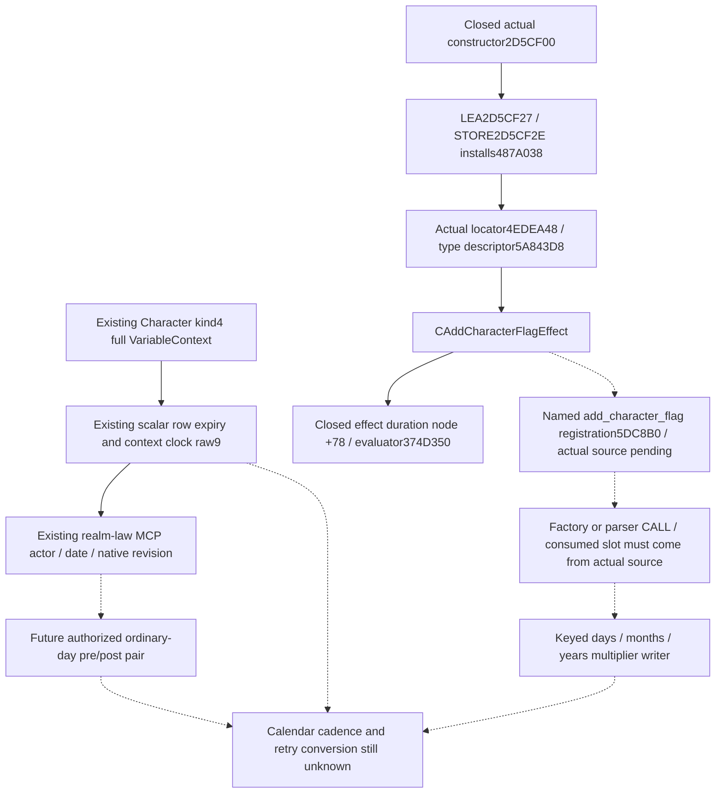
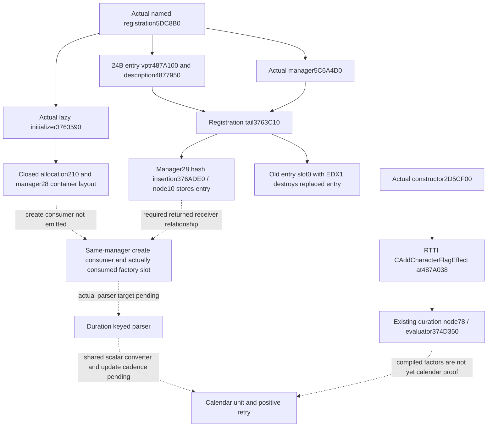

# Crown cooldown clock units: exact owner and next parser source

2026-10-07, 2026-W41. Target: CK3 1.20.0.4, Steam build25734779,
EXE SHA-256 `98702F88A547CDE2EAF29A85F93B85F68EE4CF8148336A4F7AFAEB75319DD518`.
Candidate baseline: immutable runtime26b source
`0d22c7efd1ae76a8ced52130f11cf201935520c9`.

The [existing crown observer](crown-authority-cooldown-observer-12004.md)
already publishes the same Character's scalar expiry, current counter and
native signed remaining arithmetic through the ordinary realm-law MCP.
Root reports the runtime25 six whole-query scenes and sole registered Service
consumer GREEN. Those checks are reused here. Calendar cadence and a positive
calendar retry date are still unqualified. The user reserved this machine for
playing CK3 again; this increment performed background file research only.

## Native source tree before a calendar policy

The exact native type narrows the parser search to the known
`CAddCharacterFlagEffect` duration owner. It does **not** identify a
`set_variable` parser, prove a virtual parser slot, or make a flag-specific
parser's factors applicable to a scalar variable. The generic evaluator's
integer multiplication and already closed scalar getter remain separate
facts. A concrete shared parser/conversion or a same-Character update source
is needed before publishing a calendar unit.

## Unique background RTTI source

Root authorized one finite chain from the constructor-installed vptr:
`487A038 - 8` (8 bytes), its returned complete-object locator (24 bytes), and
the returned TypeDescriptor name (at most128 bytes). No virtual-function
table slot was read.

The actual chain is:

| Exact source | Actual returned value |
| --- | --- |
| QWORD at487A030 | preferred-image VA144EDEA48, RVA4EDEA48 |
| Locator4EDEA48 | signature1, primary offset0, type descriptor5A843D8, self4EDEA48 |
| TypeDescriptor name at5A843E8 | `.?AVCAddCharacterFlagEffect@@` |

[Manifest](Z:/ck3_mod_rewrite_process_assets/g2-migration-20261007/m7-crown-cooldown-12004/native/script-duration-source09/next-units-entrance10/rtti-owner11/ROOT-FINITE-OWNER-RTTI-MANIFEST.json)
and [actual receipt](Z:/ck3_mod_rewrite_process_assets/g2-migration-20261007/m7-crown-cooldown-12004/native/script-duration-source09/next-units-entrance10/rtti-owner11/ACTUAL-OWNER-RTTI.json)
retain all three exact file offsets, returned fields and byte-cache paths.
New physical native cost is **160 bytes / 3 reads**. The parent's prior
3385 bytes / 22 reads are metadata reuse; cumulative source cost becomes
3545 bytes / 25 reads, preserving executor ownership. There were zero old
source rereads, PE reparses, EXE hashes, game/SDK/process actions, builds,
tests or production imports. Type naming is source evidence, not gameplay
or calendar qualification.

## Concrete named registration entrance

The retained `.2` source
`research/conversion_outcome12002_state_abi.json` names complete
`add_character_flag.registration` at `5DC8B0..5DC954`, 164 bytes. This is now
a concrete class-associated registration locator, rather than an arbitrary
nearby table. A metadata-only lookup in the retained `.3` and `.4` runtime
function tables finds ordinal20258: **both entries are
`5DC8B0..5DC954` /164 bytes**.

[Metadata attachment](Z:/ck3_mod_rewrite_process_assets/g2-migration-20261007/m7-crown-cooldown-12004/native/script-duration-source09/next-units-entrance10/rtti-owner11/NAMED-REGISTRATION-METADATA-ATTACHMENT.json)
does not claim byte equality or semantic migration. The next finite source
can select only that actual164-byte registration, cache first, and retain
the factory allocation/LEA/STORE/callback operands it actually emits.
It must then use a genuine consumer CALL or consumed slot to select the
specific parser. No virtual parser offset is inferred from another effect,
and no full vtable or `.rdata` scan is needed. Registration extraction has
not been executed by this increment.

## Existing consumer is sufficient

No new context sequence number, duplicate date, production TU or MCP route
is needed. The current raw9 producer selects Character kind4/full-ID, reads
the scalar row's signed expiry at `+0x0C`, and the same full context's
signed current clock at `+0x28`. The existing law DTO and strict/Service
path preserve those fields and bind the observation to actor, paused frame,
native revision and date.

Law `date_raw` is an int64 DTO populated from the existing ClockPrefix
int32 at GameState+08; it is not itself a full64 CDate storage read. The
already published Army observer supplies `current_date_storage_raw64` from
that native address when a full64 value is useful. Reuse its actor/date/frame
association instead of adding another read as a prerequisite.

[Consumer source plan and unique future recipe](Z:/ck3_mod_rewrite_process_assets/g2-migration-20261007/m7-crown-cooldown-12004/raw-clock-background/clock-consumer-child/ROOT-DELIVERY.json)
uses the next already-planned, authorized ordinary day for one pre/post law
pair. It can establish the actual counter change for that interval without
guessing a20-year remainder or multiplying unknown values by24. A measured
single interval does not prove normalization or all calendar cadence.
This recipe is held until game authorization resumes; no SDK request was
queued in this increment.

Readiness remains **research** for unit/positive retry conversion, with the
existing raw observer's Root-qualified fixture result reused. No law action
permission, policy or G2 completion credit changes here.

## Oct8 continuation: actual registration and manager storage

The prior Oct7 source/doc worktree remains read-only. Its completed owner
topic is retained here rather than discarded after the prior worker's
capacity failure. The new exclusive tree is `Z:/gbs1-m7-clock-v4`, clean base
`0d22c7efd1ae76a8ced52130f11cf201935520c9`. This increment reuses the closed
RTTI160B/three reads and registration164B/one read; no byte from those windows
is read from the EXE again.

The actual registration `5DC8B0..5DC954` is already captured and fully
decoded. Name LEA5DC8C1 selects `4877A10`, length18; the name handle feeds the
24-byte factory-entry allocation. `5DC935` selects factory vptr `487A100`,
`5DC93C` stores it at entry+0, entry+8 is description `4877950`, and entry+10
stores the handle. Tail5DC94F transfers manager `5C6A4D0`, handle and actual
entry to `3763C10`. This closes the named registration; the old section's
registration-pending sentences describe its earlier extraction stage.

The unique new224B helper body `3763C10` supplies a further actual ABI:
RCX manager, EDX raw name handle, R8 factory entry. It passes manager+28 to
`376ADE0` and stores the entry into returned hash-node+10. Manager+50 is the
lock; manager+58 is the name-registration container used by `B10CC0`.
The indirect CALL at3763CC2 consumes the old entry's virtual slot0 with
EDX1 during replacement: it is destruction, not create/parse dispatch.
Neither this actual slot0 nor another effect's historical slot8 is used to
invent a parser method.

The existing raw9 observation already contains expiry/current-clock/remaining
signed32, type/unit, and nullable retry date together with the original
actor/frame association. No extra context, date, sequence number or query
is added. Flag-duration parsing, actual scalar `set_variable` conversion,
and the same context clock's calendar cadence are separate proof edges.
The current source chain has reached manager storage, initialization layout
and replacement ABI. The actual create/parse consumer has not been located;
no further capture range is selected from a container-only call.
Root's already qualified raw observer is reused, while unit and positive
retry conversion remain `research`. Game/SDK/process, production import,
tests, builds and old qualification replays are zero.

The unique new source ledger is
`Z:/ck3_mod_rewrite_process_assets/g2-background-20261008/m7-clock-units-continuation/source/`.
The224-byte helper receipt is `actual_manager_named_register_helper224.json`.
Final owned read cost, the next exact source ABI and Oct8/W41 fields are
sealed in this continuation's delivery packet; historical pending receipts
remain unchanged.

## Oct8 final source and reused qualification

The named registration's `3763590` call selects an18-byte runtime-function
fragment, not a complete logical initializer. Its real fallthrough selects
`37635A2..376368A`,232 bytes. These actual bytes allocate a210-byte manager
and initialize its entry hash container at+28, bucket pointer at+30, count
at+38, empty sentinel at+48 and name container at+58. No create/parse virtual
CALL is emitted by these captured initializer fragments. The other emitted
initialization/container calls are not expanded because they do not identify
the missing parser.

| Unique new actual4 span | Bytes / physical reads | Closed result |
| --- | --- | --- |
| `3763C10..3763CF0` |224 /1 | Manager/name/entry ABI, node+10 storage, replacement slot0 |
| `3763590..37635A2` |18 /1 | Actual lazy initializer fragment and fallthrough |
| `37635A2..376368A` |232 /1 | Manager allocation and container layout |

New unique physical cost is **474 bytes /3 reads**, all code. Existing
runtime-function and PE metadata are reused; there are no new pdata/PE
reads, whole-image scans, hashes or old-source rereads. The prior160-byte
RTTI and164-byte registration receipts retain their original costs and
are not recharged to this continuation.

The single remaining source entrance is a **real consumer of manager
`5C6A4D0`'s+28 container that obtains its returned node+10 factory entry
and calls a concrete create/parse virtual slot**, or a positively linked
typed factory method that constructs `2D5CF00`. Its caller RVA and consumed
slot are still unlocated. Registration helper slot0 is replacement
destruction; factory entry+8 is a description field. Neither supplies this
missing call. [Exact remaining ABI](Z:/ck3_mod_rewrite_process_assets/g2-background-20261008/m7-clock-units-continuation/source/EXACT-REMAINING.json)
records this single entrance and an empty next-capture manifest, so another
effect's slot or a nearby table cannot become a supposed parser locator.

Root's original qualification is reused from
[crown RESULT](Z:/ck3_mod_rewrite_process_assets/g2-background-20261007/upstream-build-migration/functional-runtime25-first01/crown/RESULT.json)
and [CONSUMER-LAUNCH](Z:/ck3_mod_rewrite_process_assets/g2-background-20261007/upstream-build-migration/functional-runtime25-first01/crown/CONSUMER-LAUNCH.json),
exact source `e81c9ee137bd9188b9a6446f54528f52b9b148f0`, runtime25/g111-r25:
six whole native scenes,74 checks and one invocation GREEN; the sole
registered Service consumer completed its one compound/six outputs GREEN.
Runtime25 was never loaded into CK3. This source continuation does not repeat
either qualification and does not add live credit.

The [DTO/source join](Z:/ck3_mod_rewrite_process_assets/g2-background-20261008/m7-clock-units-continuation/dto-join/SOURCE-JOIN.md)
confirms that existing raw9 and actor/date/native-revision association are
sufficient. If applicable unit semantics close later, the existing
`Observation::remaining_unit` default and strict `COOLDOWN_REMAINING_UNIT`
constant are the minimal producer/consumer entry. A source-backed positive
retry would use the existing `Read.retry_date_raw` and present-row normalizer
branch, without new DTO, Service method, MCP route or context gate. This
identifies an implementation seam; it does not supply a conversion formula.

Unit, scalar shared-converter and Character calendar-cadence readiness remain
**research**. Positive present-row retry stays null. The authorized future
ordinary-day pre/post recipe remains held while this machine's CK3 use is
forbidden. This package makes zero production-code changes, adds/runs zero
tests and performs zero game/SDK/process, build or production-import actions.
