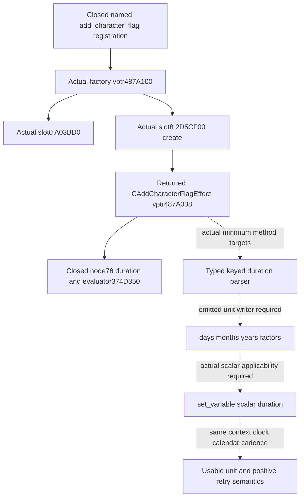
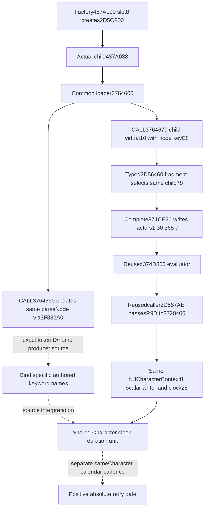

# Crown cooldown duration parser: actual named factory continuation

The subsequent [Character cadence source handoff](crown-authority-cooldown-character-cadence-source-12004.md)
records Root's sole pure FIRST qualification and the distinct unresolved
Character pool daily-caller edge; the source/candidate snapshot below is preserved.

2026-10-08 /2026-W41, exact CK3 1.20.0.4 /Steam25734779 /EXE
`98702F88A547CDE2EAF29A85F93B85F68EE4CF8148336A4F7AFAEB75319DD518`.
This is the next candidate after the sealed
[owner/manager source](crown-authority-cooldown-clock-units-source-12004.md)
at `a49533f2cf72168300b6919dd5f9efce3f3feba2`. Its old source receipts and
the qualified runtime25 raw9 observer remain unchanged. Root owns central
integration/build/test and all game/SDK use; this packet contains frozen
source and an unqualified pure candidate in `Z:/gbs1-m7-clock-v4`.

## Native tree before producer changes

The actual named flag registration installs factory entry vptr487A100;
description4877950 is object field+8, not a virtual method. The factory's
first two current vtable QWORDs are read directly from that positive
class-associated pointer. Actual slot0 isA03BD0. Actual slot+8 is2D5CF00,
which is the already closed126-byte allocator/initializer returning a
`CAddCharacterFlagEffect` with installed effect vptr487A038. This now proves
the flag factory's actual create method; no slot from a trait factory was
transferred, and the existing2D5CF00 body is not read again.

That complete create body performs allocation/base initialization and
initializes the duration-node state. It does not call a keyed duration
parser. The next source edge is the actual returned object's minimum
method targets, qualified by their bodies and actual operands. The intended
result is the parser's unit writer and its applicability to the actual
scalar cooldown, not merely another registration description.

Before-capture [source plan](Z:/ck3_mod_rewrite_process_assets/g2-background-20261008/m7-clock-units-factory-continuation02/SOURCE-PLAN.md)
and [actual factory entries](Z:/ck3_mod_rewrite_process_assets/g2-background-20261008/m7-clock-units-factory-continuation02/source/actual_flag_factory_first_two_slots16.json)
retain the source role and exact cache. This first step costs16 unique
actual4 data bytes /1 physical read. The effect owner, constructor,
registration, manager helper and evaluator are reused with zero repeated
EXE bytes. Later cost and actual parser closure will be appended here.

Existing raw9 and the sole realm-law Service remain the consumer. No new
context/sequence/date gate is needed. Until the actual scalar conversion
and cadence join, flag factors alone do not relabel the scalar remaining
unit or turn its null present-row retry into a calendar date.

## Actual typed parser and real common-loader consumption

The returned effect's first four method pointers select actual method+10
`2D56460`. Its76-byte runtime fragment recognizes decimal token IDs1300,
1301,1302 and1327 and tail-transfers **the same child+78** to `374CE20`.
The other token path transfers to `3766350`, a common unknown-property
diagnostic. These bytes establish the typed duration target without calling
this fragment the whole logical parser.

The actual `374CE20` duration helper is complete1211 bytes. It reads the
parse node's key DWORD+E8 and writes duration-node DWORD+0:

| Token ID, decimal /hex | Actual written multiplier | Write instruction |
| --- | --- | --- |
|1300 /514 |1 |374CFD0 |
|1301 /515 |30 |374CFC8 |
|1302 /516 |365 |374CFC0 |
|1327 /52F |7 |374CFB8 |

An unrecognized ID writes0 and returns false. Recognized branches parse
the integer/range into+4/+8 and expression/range-expression into+10/+18.
The existing actual evaluator374D350 consumes this same multiplier+0 and
value state. Its source is reused, not captured again. Naming these IDs
days/months/years/weeks from their factors alone would still be inference;
the actual token-name binding is the next necessary source edge.

The method's role is independently closed by the **actual** common loader
`3764600`,147 bytes:3764679 invokes `[child.vptr+10]`, with RCX the same
child, RDX its parse node and R8D the node's key+E8. Before that dispatch,
3764660 calls `3F832A0` on this node. That call supplies the positive source
entrance for its key/text update. A necessary prefix is selected from that
actual function, rather than a whole keyword table or code-xref search.

This shared physical clock relationship is positive source evidence even
while the separate scalar `set_variable` typed parser remains unlocated.
A closed flag keyword binding can explain duration's quantity in that same
clock. It does not prove daily update cadence or the absolute CDate retry
conversion. Current stock crown law authors `years=20`;7300 is not a literal
authored input and is not an actual observed countdown.

## Source-backed numeric implementation without calendar promotion

The owned
[pure primitive](../../ck3_autonomous_player/src/xar_autoplayer/bridge/crown_authority_cooldown_clock_12004.py)
exposes `scale_native_duration_literal_12004(token_id, literal_i32)` for
the source-closed four native IDs and signed32 literal multiplication.
It returns an explicit unknown-key rejection, factor0 and no value for
other IDs. It does not accept English unit names, evaluate an expression
or random range, select the current stock law's token, or simulate the
writer's later nonpositive-duration classification.

`interpret_crown_cooldown_native_clock_12004(raw_observation, date_raw=...)`
uses the **existing production strict raw9 normalizer** and preserves
unavailable, absent, untimed and timed states. A timed row exposes its
actual expiry as a native-clock deadline and its signed remaining counter,
including timed-1 and0. Absence preserves the original same-frame query
retry date; present rows retain null calendar retry. The source factor
table is metadata, not a sampled runtime token. Keyword names and calendar
deadline readiness remain false. No MCP wire, Observation field, unit
literal, registered Service, permission or policy is changed.

The single new
[compound case](../../ck3_autonomous_player/tests/unit/test_crown_authority_cooldown_clock_12004.py)
is **AUTHORED_NOTRUN**. It exercises actual ID/literal factors, signed32
overflow, a distinct wrong hex-ID rejection, production normalization and
the native-deadline distinction across timed-1/0/overflow/absence/untimed/
unavailable inputs. It makes no claim about current law token names,
calendar cadence, actual loaded CK3, range or expression execution.
The candidate is source-implemented; it is not newly fixture-qualified,
registered-service qualified or live. The previous runtime25 qualifications
are reused only for the unchanged raw9 observation/Service paths.

## Literal return closure, read cost and the concrete remaining input

The reused186-byte374D350 evaluator source ends outside its logical
common return. That entire span and its range/expression alternatives are
not extracted again. The new necessary return span is only
**374D4AB..374D4C2 /23 bytes**. Actual374D4AB..374D4C0 restores registers
and the stack;374D4C1 returns without modifying EAX. The retained literal
path loads+4, multiplies by+0 at374D3F3, moves the product into EAX at374D403
and jumps from374D405 to this common return when range+8 is negative and
range-expression+18 is null. This closes the selected signed32 literal
return used by the new primitive. It does not close a random range or
expression engine. The actual caller's returned-EAX-to-R9D-to3728400 flow
remains the existing positive same-clock writer source.

The registration's real description pointer4877950 also supplies an actual
128-byte help prefix: `add_character_flag = { flag = X days/weeks/years = Y }`.
The captured prefix has no terminating NUL and contains no ID/name rows.
It establishes authored flag usage words, but cannot associate each raw
ID with its English keyword. The names in the factor table are deliberately
not guessed from conventional1/30/365/7 factors.

New physical source cost is **3739 unique bytes /18 reads**, actual4 only,
with no overlap/old-byte rereads. These include3352 code/padding bytes and
387 data bytes. Existing PE/runtime-function metadata is reused. No hash,
whole-image/xref/table scan or PE/pdata reparse is performed. The
[source ledger](Z:/ck3_mod_rewrite_process_assets/g2-background-20261008/m7-clock-units-factory-continuation02/source/READ-LEDGER.json)
owns every actual extent and physical offset; earlier160/164/474-byte
packages retain their original costs and are reused without recounting.

The exact remaining name producer is the **input reader at
QWORD[parseNode+E0]**, consumed through its vptr+20 at actual3F500C3.
It must fill reader+40 ID, byte+44 kind and+48 text; the captured updater
copies these to parseNode+E8/+F0. The reader's actual input constructor/
vptr assignment is not held. This is an input instance dependency, not
permission to enumerate all Lexer classes. The positively followed static
provider54DDFD0/vptr49B8078 has consumed+30 target876E00 that simply returns
RDX. It adapts an already generated record and is explicitly rejected as
the token ID/name generator. The actual
[receiver/constructor requirement](Z:/ck3_mod_rewrite_process_assets/g2-background-20261008/m7-clock-units-factory-continuation02/source/LEXER20-RECEIVER-SOURCE-REQUIREMENT.json)
preserves that one source entrance. Deep Lexer expansion stopped once this
role was known; the implemented numeric primitive does not depend on names.

The next high-value calendar evidence remains the existing same-Character
ordinary-day law pre/post pair, held until user CK3 authorization. It can
measure the actual eligible clock change for that interval. A later
source-backed native date converter or daily ordering is still needed
before positive retry/calendar readiness is true. No reader instance,
future frame, script token or calendar value is synthesized here.

There are no new imports, builds, tests, Game/SDK/process/pipe/UI operations,
Root edits or pushes. The new case and its
[FIRST recipe](Z:/ck3_mod_rewrite_process_assets/g2-background-20261008/m7-clock-units-factory-continuation02/FIRST-RECIPE.json)
are authored only. Failed pointer-manifest arithmetic with0 native reads
and two mistaken text-read harness commands are retained externally; none
is a native capability/test RED or a reason to repeat old qualification.
