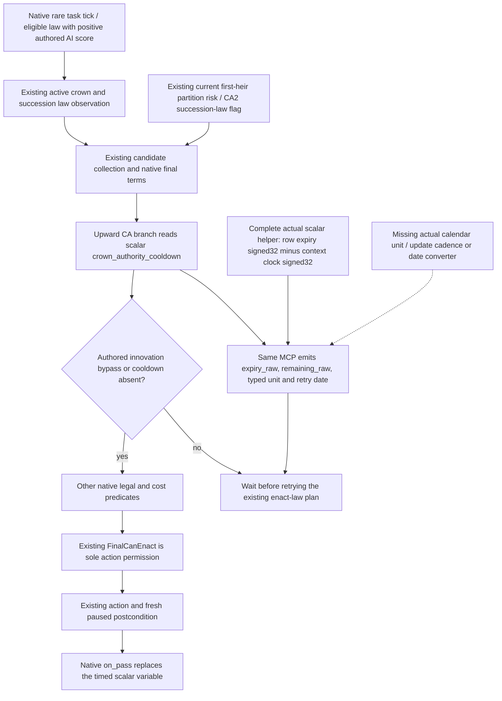

# Crown-authority retry timing in the ordinary 1.20.0.4 campaign

The missing decision input is the actual lifetime of Robert29829's scalar variable `crown_authority_cooldown`. The existing realm-law query already supplies active laws, candidate collections, native final permission, reasons, all ten costs and succession value profiles. Current held-title first-heir observations also exist. Reimplementing those inputs would not let the next-generation plan schedule a lawful retry after a cooldown rejection. This topic prepares the additional timing observation on the **same** `query-realm-law-final-terms-v1-private` route.

Initial source baseline: `14f07ade00e9ad359da3aa6af3642592ede3f48d`; this cached-result increment is based on Root's adopted `28f19693cc79afe9ab8de94ee17b64dcc6204306`. Target: CK3 `1.20.0.4`, Steam25734779, EXE SHA-256 `98702F88A547CDE2EAF29A85F93B85F68EE4CF8148336A4F7AFAEB75319DD518`. Root supplied current ordinary-campaign H9638, Robert29829, raw date53288448, runtime19 and saved6005; this worker did not query or reopen that frame. The original episode is `native-29829-2bc2d599f7f9`. Side R68 supplies no ordinary-campaign G2 qualification.

## Native decision tree before policy

Reuse [laws, contracts and succession](laws-contracts-and-succession.md), the [actual4 realm-law migration](realm-law-active-query-12004-migration.md), the [succession value profiles](realm-law-succession-value-profile-12003.md), [held-title partition](held-title-partition-v1.md) and the [crown source and receipt](ck3-1.20.0.2-realm-law-crown-source-and-receipt.md). Their already qualified callbacks, schemas and historical receipts are not rerun here.

The current vanilla `game/common/laws/00_realm_laws.txt` is the authored input. Its CA1 and CA2 `ai_will_do` blocks give score1 only for the preceding active level. CA3 has no corresponding authored block, so this topic does not invent a stock automatic CA3 preference. The CA1/CA2/CA3 upward legal branches inspect `crown_authority_cooldown`, with the authored `innovation_all_things` bypass. CA2 carries `can_change_succession_laws`. Each corresponding `on_pass` calls `calculate_authority_cooldown_break_effect` and writes a timed variable. The authored20-year duration is a setter argument; it is not the current row's remaining lifetime. This worker read the law source, not an EXE or save.

The new observer answers **when to inspect final terms again**. It neither grants action permission nor substitutes cooldown state for `FinalCanEnact`. Native final permission can be true through an override while a cooldown row remains present. Consequently `final_can_enact:true` cannot be converted into `remaining_raw:0`.

## Reused actual source and the finite missing source

The actual4 shared identifier and Character-context bindings already exist in `ck3_12004_family_break_penalty.cpp` and `ck3_12004_epidemic.cpp`: table3F8A7E0, lookup3F8A660, name3F8A6D0, scope-context370EAF0. The player context must come from the existing exact4 Character/full-ID selection, not an old binder or a new character.

The held marriage-family packet at `Z:/ck3_mod_rewrite_process_assets/g2-migration-20261007/marriage-family/actual4-break-penalty/context-map-no-pdata/FAMILY-MAP.json` closes four source instructions: old37274C0/C4/C8/D4 to actual37274A0/A4/A8/B4. They prove VariableContext rows+10, count+1C, stride20 and identifier DWORD+8. Actual15 bytes were already captured by that owner; this worker reuses its metadata with zero new native bytes. The original `context-map/FAMILY-MAP.json` pdata miss remains a separate historical failure. Epidemic list rows+30/stride48 are a distinct container.

Those four instructions alone do **not** prove scalar expiry, value type, current clock, normalization or calendar cadence. Root's later finite packet below independently closes actual scalar expiry and remaining arithmetic. The historical1.19 `scoped_character_variable_monitor_v1.cpp` names setter3346BE0, its duration argument, and a monitored row member+0C called `expiration_raw`. Its14-byte source prefix and function typedef are useful cache locators, not actual4 addresses or proof of a current offset/unit. Historical `.2` labels such as `FlagSet` are not scalar timing or calendar-unit evidence; current operand and receiver relationships must establish each consumed role.

The owned [source request and same-route contract](../../ck3_autonomous_player/native_bridge/research/crown_authority_cooldown_observer_12004_contract.json) is cache first. It asks the central native mapper for named `set_variable` scalar caller/setter, scalar expiry updater and its native-clock source. An executable byte manifest must be filled from concrete retained actual source locators before capture. Its declared follow-up ceiling is768 actual bytes/6 exact reads, restricted to the consumed scalar writer/update/clock/cadence operand windows; missing locators do not authorize a scan. The already closed identifier/context/collection roots are excluded. Root owns authorization, capture and the source packet; this lane performs no EXE reads.

## Same MCP publication and immediate consumer

Add one `crown_authority_cooldown` object beside `groups` in the existing law readback, sampled within the same native revision/date/actor capture. The object must publish the actual row expiry and clock, signed remaining amount, proved timing type/unit and a source-backed calendar retry date. It may also publish row presence and raw scalar type. Do not change the candidate DTO, create a second MCP query, add an action gate, or treat an ACK as observation.

The exact source packet must select the timing representation before its bound reader is authored. If it proves an absolute calendar expiry, preserve that raw date. If it proves a relative update counter, preserve expiry and current counter separately, including normalization behavior; map to a retry date only after the native update cadence and daily ordering are closed. No20-year subtraction from the current date, calendar conversion from FlagSet counters, or inferred timeout offset is permitted.

The published state distinguishes a successful absent row, an existing timed row with a legitimate remaining0, an existing permanent/untimed row, and a failed read. The now-closed native helper returns `remaining_raw:-1` for absence, so the observer must preserve that raw value with `present:false` and `expiry_raw:null`; its immediate **query** retry time is the captured frame date, independently of native remaining. A successful timed row preserves signed native remaining values, including0 and negatives; zero is not converted to `null` or used to delete the row. An existing row with signed expiry<=-1 is untimed under this native helper and has no invented finite deadline. Native remaining-1 can also arise from a timed row whose expiry is one clock step behind, so it cannot decide presence or timed status. Read failure uses nullable timing values and an explicit read status; it cannot masquerade as absence or zero. Storage and arithmetic are signed32, with the native DWORD subtraction's32-bit result; calendar unit and retry-date conversion remain source dependencies.

The Root hook recipe is narrow: extend `RealmLawReadback12002` with the owned typed cooldown result; call the exact4 reader from `CaptureRealmLawReadback12002` while it already holds the current played Character and frame; append the single object in `SerializeRealmLawReadback12002`; extend the strict exact-key validator in `realm_law_paused_private_transport.py`; preserve the object through the existing registered realm-law consumer. Existing action dispatch stays unchanged. These shared files are not edited by this worker.

The consumer's first useful result is the existing turn plan choosing either a fresh legal enact-law attempt, or a scheduled future requery at the observed deadline while it continues available development actions. It must still read fresh native final terms before dispatch. Current `govtSummary`, CA2's succession-law capability and held-title first-heir risk remain the inputs for prioritizing that existing plan. No new government system or hypothetical succession simulator is introduced.

## Concrete remaining-time source entrance: background only

The current Root game file `Z:/ck3_mod_rewrite/Crusader Kings III/game/localization/english/laws_l_english.yml:55` gives a direct native API name: the crown cooldown tooltip computes `GetCurrentDateWithDiff(GetVarTimeRemaining(CHARACTER.MakeScope,'crown_authority_cooldown'))`. This is stronger than interpreting a flag timeout: stock code explicitly asks for the remaining time of this Character scalar key and passes the result to a date-difference consumer. The getter's return width/unit and native callback RVA still require source closure; the localization alone does not justify multiplying an unknown result by24.

The constrained held Entry/Core/Command/Family/Epidemic caches do not supply an exact registered callback RVA for those two names. Preserve that **named locator MISS**. A second installed game copy at `Z:/SteamLibrary/steamapps/common/Crusader Kings III/.../laws_l_english.yml:59` contains the same composition, but its build was not checked; it is comparison source only. The Root copy at line55 is the production source locator. No game or SDK query was made.

There is now a finite executable **proposal for Root**, not an open-ended search. [ROOT-FINITE-SCALAR-TIMING-MANIFEST.json](Z:/ck3_mod_rewrite_process_assets/g2-migration-20261007/m7-crown-cooldown-12004/ROOT-FINITE-SCALAR-TIMING-MANIFEST.json) declares three exact old3/current4 paired windows with a physical ceiling of **762 bytes / 6 reads** before cache reuse. It selects the named old scalar value getter's local helper region at3727500/192 bytes, the timed writer's duration/expiry segment3728459/182 bytes, and its actual row-vtable RIP instruction3728440/7 bytes. All execution is Root central/background only; CK3 stays off.

The current-version candidates are attached to actual held native/member evidence and cached runtime-function metadata, rather than a generic RVA delta. The left scalar collection instructions37274C0/C4/C8/D4→37274A0/A4/A8/B4 are already proved. The cached `.3` writer interval3728420..37285AE corresponds by runtime-function ordinal to `.4`3728400..372858E, with equal398-byte extents. The cached updater entry3727600..372760F corresponds to37275E0..37275EF. These metadata candidates constrain the intervening local helper region; they are **not** semantic or runtime qualification. The192-byte helper region is leaf discovery starting at the named scalar value getter, not a fabricated `GetVarTimeRemaining` address. The declaration includes its exact old source prefix and separately marks the `.2` reference bytes as not yet `.3` byte proof.

The retained `.2` source has a further concrete typed attachment: writer3728440 (`488D05D94DD600`) produces row vtable448D220. Row serializer888870 reads row+8 at888882 (`8B5908`) and calls the actual variable identifier table3F8A800 at888885 (`E8761F7003`), matching the named PhaseVariableIdentifierTable contract. This creates a source-backed row-vtable/serializer/variable-identifier entrance for the central typed check. Prefix equality with historical setter3346BE0 or a historical `FlagSet` label alone is not used as scalar proof. Do not register `.2` reference bytes as a `.3` raw cache.

Root's single finite batch must first retain actual decoded scalar-helper/writer operands and source identity. If the native remaining helper and its scalar expiry/clock are found, only its actual typed return/date conversion remains to close. If the region lacks it, retain that exact finite MISS and proceed from the named registered `GetVarTimeRemaining` source request; the declared region does not authorize a wider scan. If row kind is still unresolved, the **actual returned** vtable/RIP target defines the next finite RTTI/serializer window; no new address is guessed. This packet deliberately authors no native binder until the frozen actual storage/type/unit/usable retry semantics are enough to implement it.

## Root's first timing packet: complete scalar helpers inside a partial region

Root executed that proposal once and sealed [scalar-timing-first01/FAMILY-MAP.json](Z:/ck3_mod_rewrite_process_assets/g2-migration-20261007/m7-crown-cooldown-12004/native/scalar-timing-first01/FAMILY-MAP.json): **762 physical bytes / 6 reads** across old3/current4. The182-byte writer window and7-byte row-vtable RIP window decode completely and normalize equally. The192-byte local region reports partial decode on both builds because its last instruction is truncated; that aggregate result does not invalidate its two earlier complete helpers. This lane and its two children parsed only the retained instruction JSON/raw cache and made **zero** new native reads.

| Region | Old3 | Actual4 | Result |
|---|---|---|---|
| Scalar value helper | 3727500..3727544 | 37274E0..3727524 | Complete68 bytes; row payload+10, absent fallback pointer4448648 |
| Padding | 3727544..3727550 | 3727524..3727530 | 12 bytes of CC |
| Scalar remaining helper | 3727550..3727592 | 3727530..3727572 | Complete66 bytes/23 instructions; byte-identical pair |
| Padding | 3727592..37275A0 | 3727572..3727580 | 14 bytes of CC |
| Unrelated next helper prefix | 37275A0..37275C0 | 3727580..37275A0 | 32 captured bytes,29 decoded; final `48 63 49` is truncated |

The remaining helper's actual ABI is `std::int32_t(const void* context, std::int32_t variable_token)`: RCX is the full scalar context, EDX the key and EAX the result. It scans the independently proved scalar rows+10/count+1C/stride20/keyDWORD+8. Actual3727560 reads signed expiry DWORD at row+0C. An absent row or expiry<=-1 returns-1; otherwise actual3727568 subtracts full-context DWORD+28. That directly closes **scalar** remaining arithmetic, without borrowing a historical container label. The named registered GUI callback `GetVarTimeRemaining` has not been resolved, but the complete primitive itself has genuine scalar source attachment. The exact instruction pairs and boundaries are retained in [getter-decode/ROOT-CACHED-GETTER-DECODE.json](Z:/ck3_mod_rewrite_process_assets/g2-migration-20261007/m7-crown-cooldown-12004/native/scalar-timing-first01/getter-decode/ROOT-CACHED-GETTER-DECODE.json).

The writer consumes inner receiver DWORD+20 plus positive R9D duration; nonpositive duration writes-1. Actual37284E6 writes expiry DWORD+0C, alongside key+8 and a16-byte payload+10. Actual3728420 produces row-vtable448D230. The writer's full/inner receiver relationship and the row's nominal RTTI/type name are not yet current source claims. Neither its vtable nor the value helper's fallback4448648 proves a time unit. A scheduling reader consumes the proved integer expiry/clock, not the absent fallback payload, so RTTI/default-value reads are not prerequisites for this next increment.

The decisive missing source is the clock's **calendar meaning**. Existing actual4 `date_raw` and the historical CDate24-ticks/day contract do not show that one scalar clock step is a day. The adjacent partial helper's3727597 branch to37275CE tests a row expiry and is not a cadence entrance. Do not extend that truncated helper or reread the762-byte packet.

The next narrow Root-only proposal is [ROOT-FINITE-SCALAR-CLOCK-PREFIX02-MANIFEST.json](Z:/ck3_mod_rewrite_process_assets/g2-migration-20261007/m7-crown-cooldown-12004/ROOT-FINITE-SCALAR-CLOCK-PREFIX02-MANIFEST.json): old3 **3727600/96 bytes**, actual4 **37275E0/96 bytes**, maximum **192 bytes / 2 reads** before cache reuse. Its actual candidate is the already-held runtime-entry ordinal187725, not an assumed RVA delta. The exact `.2`96-byte reference ends at instruction boundary3727660 and contains scalar rows+10, clock+28 increment, expiry comparison, full-context+8 selection and a concrete normalizer CALL. Root must recover those actual operands and actual CALL target before transferring the reference's roles. This prefix is a partial function window, not a whole-function qualification or a calendar-unit proof.

Root subsequently executed prefix02 once: [scalar-clock-prefix02/FAMILY-MAP.json](Z:/ck3_mod_rewrite_process_assets/g2-migration-20261007/m7-crown-cooldown-12004/native/scalar-clock-prefix02/FAMILY-MAP.json) closes the complete96-byte paired span, normalized/ordered-edge/local-flow equal, at **192 physical bytes / 2 reads**. Actual3727616 increments full context+28 only when scalar rows are nonempty and their last expiry is nonnegative;3727623 compares this clock to the last expiry;372762A selects full context+8;372762E calls actual887360. The full/inner receiver shift is current source, rather than borrowed layout. This is one increment per eligible invocation, still not a proved Character day.

The existing complete old3 daily-date body at `Z:/ck3_mod_rewrite_process_assets/g2-resume-20261004/battle-calendar-admission-v57/pause-source/evidence/daily-date-stage-22a0d80-primary.asm.txt` contains22A101D `mov rbx,[rsi+A0]`,22A1024 `lea rcx,[rbx+C8]`,22A102B `call3727600`. Root's [actual4 selected date/D writer receipt](Z:/ck3_mod_rewrite_process_assets/g2-parallel-20261007/army-supply-next-tick-12004/actual4-selected-writer-root-first01/ROOT-SELECTED-WRITER-RECEIPT.json) qualifies its selected calendar operands, not this caller. That direct updater receiver is **GameData+C8**. It cannot establish the Character scalar clock's day cadence. The19-byte caller window has an ordinal-attached actual candidate22A0FFD, but a new read there is unnecessary until a consumed Character relationship is found.

## Character scope registry: actual runtime initialization and next source entrance

The already-held complete87-byte scope-context helper actual370EAF0 obtains a registry by actual370EB00/370EB0A calls to3795A60, selects the ScopeTarget kind's row with stride50, then dispatches its callback at+30. This is the actual provider-selection route used by the existing Character-kind4/full-ID wrapper. The historical `.2` `event12002_recovery_variable_list_abi.json` and phase-definition constants explain that wrapper; they do not identify the current Character callback or daily updater.

Root adopted [ROOT-FINITE-CHARACTER-SCOPE-REGISTRY03-MANIFEST.json](Z:/ck3_mod_rewrite_process_assets/g2-migration-20261007/m7-crown-cooldown-12004/ROOT-FINITE-CHARACTER-SCOPE-REGISTRY03-MANIFEST.json) and mapped old3795A80/current3795A60, complete171 bytes, solely from the existing shared raw cache. [character-scope-registry03/FAMILY-MAP.json](Z:/ck3_mod_rewrite_process_assets/g2-migration-20261007/m7-crown-cooldown-12004/native/character-scope-registry03/FAMILY-MAP.json) records complete normalized/ordered/local equality with **zero new physical bytes / reads**. Total fresh Root cost stays **954 bytes / 8 reads** for first01+prefix02; reused342 paired registry bytes are separate.

Actual3795A82 returns the RIP-addressed registry object **54F2AF0**. The cold path uses the native thread-safe local-static guard, initializes its data/count region to zero at3795AD1/3795ADF, calls an allocator through virtual+20 at3795AE6 and registers the exit destructor43A1E10. This function does not write a Character-kind4 callback or any consumed row+30 slot. Its rows are a **runtime-initialized heap vector**, so neither adjacent3795BD0 data nor an EXE-time empty registry can be treated as a callback table.

The next cache-only source entrance is a concrete registry **registration** reference: match already-retained instruction/RIP metadata for exact static object54F2AF0, or actual callers of3795A60 that append/configure a stride50 type row. Retain only the actual kind4 selection and+30 callback LEA/STORE producer, its exact bytes and emitted provider target. Then pair that source against current4 using actual call/RIP or cached runtime ordinal attachments. A code window is proposed only when that genuine producer is found; neither an arbitrary neighboring RVA nor an unobserved callback pointer is a runnable row. Root's central source owner performs any later finite file extraction; this lane reads cached text/JSON only. The independent named renderer search remains a bounded MISS, with its checked scopes and interrupted old resume search recorded separately in [renderer-entry-lookup/ROOT-RENDERER-ENTRY-LOOKUP.json](Z:/ck3_mod_rewrite_process_assets/g2-migration-20261007/m7-crown-cooldown-12004/native/scalar-clock-prefix02/renderer-entry-lookup/ROOT-RENDERER-ENTRY-LOOKUP.json).

Reuse actual Character-provider/daily source or the emitted native date-difference conversion once located. Do not expand the normalizer merely to accumulate evidence: the remaining reader already consumes its direct same-frame integer arithmetic. The existing stock law tooltip remains the intended date consumer entrance. Until actual Character cadence or conversion closes, there is no usable positive retry date, no authored bound observer, and no completed timing capability. This is a continuing construction dependency, not a presence-only endpoint; Root's original partial-region result and complete helper source credit remain separately recorded.

## Root FIRST and qualification boundary

After the finite actual source packet closes timing, author the bound read-only leaf and integrate the hook recipe once. Root's new whole-producer fixture must exercise actual capture and serializer for absent, positive timed, timed-zero, timed-negative, native untimed sentinel and read failure. Its registered MCP consumer must consume those new serialized frames through the existing law query/strict normalizer, retaining frame identity and every timing field. This is a new timing FIRST, not a repetition of the old candidate/profile suite. Both stages are currently **NOTRUN** and no executable or fixture-live status is claimed.

Root then owns one genuine paused observation in the **current** Robert29829 ordinary campaign and records the actual runtime/source/frame pins. A valid absent/zero result can schedule an immediate fresh terms query; a valid positive result must supply a usable retry deadline. If timing remains unavailable and still prevents retry scheduling, the observation is unfinished and the same MCP construction continues. A presence-only read cannot close this work package. This topic does not reopen R54/R61, advance days, or award a new OODA loop.

## Oct7/W41 fields

- Completed source input: current stock/native tree and Mermaid; direct stock remaining/date consumer; Root first01 complete68-byte value and66-byte remaining helpers separated from truncated tail; actual signed32 scalar expiry/clock/remaining source closed; Root prefix02 actual clock increment/full+8 source closed; Root registry03 runtime singleton/heap initialization closed from shared cache with no new bytes; exact Character registration producer entrance and same-query recipe retained.
- Doing: exact Character-kind4 registration/provider cached references, then calendar cadence or date conversion, bound reader and new whole/registered FIRST under Root ownership.
- Why: current law permission and presence cannot schedule a future lawful retry; actual timing lets the existing next-generation plan continue useful development while waiting.
- Readiness: **research / construction prepared**. Cooldown timing observation, scheduled retry, new static-ready/fixture-live/production-live/loop credit are all unqualified. Presence-only is not completion.
- Execution: tests/imports/build/SDK/game/save/EXE/hash/newcapability0; old qualified suites0; no Root report/shared bridge/CMake edits.
- Source cost: Root first01 762B/6reads + prefix02 192B/2reads =954B/8reads; registry03 reused342 paired bytes/fresh0. Worker native reads0. No already qualified test or live observation repeated.
- Next: exact54F2AF0 registry registration/+30 callback producer from retained source, actual Character clock cadence or native date conversion, then the bound leaf and same-MCP integration. New FIRST and any later gameplay stay Root-owned; CK3 remains off during this background package. Report raw native-1, genuine zero, timed negatives and nullable read failure distinctly.
