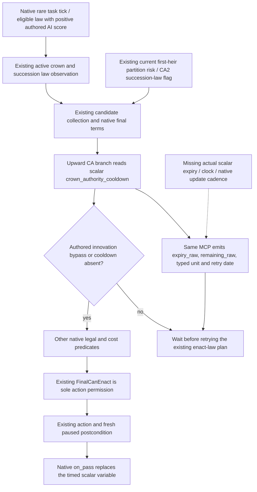

# Crown-authority retry timing in the ordinary 1.20.0.4 campaign

The missing decision input is the actual lifetime of Robert29829's scalar variable `crown_authority_cooldown`. The existing realm-law query already supplies active laws, candidate collections, native final permission, reasons, all ten costs and succession value profiles. Current held-title first-heir observations also exist. Reimplementing those inputs would not let the next-generation plan schedule a lawful retry after a cooldown rejection. This topic prepares the additional timing observation on the **same** `query-realm-law-final-terms-v1-private` route.

Source baseline: `14f07ade00e9ad359da3aa6af3642592ede3f48d`. Target: CK3 `1.20.0.4`, Steam25734779, EXE SHA-256 `98702F88A547CDE2EAF29A85F93B85F68EE4CF8148336A4F7AFAEB75319DD518`. Root supplied current ordinary-campaign H9638, Robert29829, raw date53288448, runtime19 and saved6005; this worker did not query or reopen that frame. The original episode is `native-29829-2bc2d599f7f9`. Side R68 supplies no ordinary-campaign G2 qualification.

## Native decision tree before policy

Reuse [laws, contracts and succession](laws-contracts-and-succession.md), the [actual4 realm-law migration](realm-law-active-query-12004-migration.md), the [succession value profiles](realm-law-succession-value-profile-12003.md), [held-title partition](held-title-partition-v1.md) and the [crown source and receipt](ck3-1.20.0.2-realm-law-crown-source-and-receipt.md). Their already qualified callbacks, schemas and historical receipts are not rerun here.

The current vanilla `game/common/laws/00_realm_laws.txt` is the authored input. Its CA1 and CA2 `ai_will_do` blocks give score1 only for the preceding active level. CA3 has no corresponding authored block, so this topic does not invent a stock automatic CA3 preference. The CA1/CA2/CA3 upward legal branches inspect `crown_authority_cooldown`, with the authored `innovation_all_things` bypass. CA2 carries `can_change_succession_laws`. Each corresponding `on_pass` calls `calculate_authority_cooldown_break_effect` and writes a timed variable. The authored20-year duration is a setter argument; it is not the current row's remaining lifetime. This worker read the law source, not an EXE or save.

The new observer answers **when to inspect final terms again**. It neither grants action permission nor substitutes cooldown state for `FinalCanEnact`. Native final permission can be true through an override while a cooldown row remains present. Consequently `final_can_enact:true` cannot be converted into `remaining_raw:0`.

## Reused actual source and the finite missing source

The actual4 shared identifier and Character-context bindings already exist in `ck3_12004_family_break_penalty.cpp` and `ck3_12004_epidemic.cpp`: table3F8A7E0, lookup3F8A660, name3F8A6D0, scope-context370EAF0. The player context must come from the existing exact4 Character/full-ID selection, not an old binder or a new character.

The held marriage-family packet at `Z:/ck3_mod_rewrite_process_assets/g2-migration-20261007/marriage-family/actual4-break-penalty/context-map-no-pdata/FAMILY-MAP.json` closes four source instructions: old37274C0/C4/C8/D4 to actual37274A0/A4/A8/B4. They prove VariableContext rows+10, count+1C, stride20 and identifier DWORD+8. Actual15 bytes were already captured by that owner; this worker reuses its metadata with zero new native bytes. The original `context-map/FAMILY-MAP.json` pdata miss remains a separate historical failure. Epidemic list rows+30/stride48 are a distinct container.

Those instructions do **not** prove scalar expiry, value type, current clock, normalization or calendar cadence. The historical1.19 `scoped_character_variable_monitor_v1.cpp` names setter3346BE0, its duration argument, and a monitored row member+0C called `expiration_raw`. Its14-byte source prefix and function typedef are useful cache locators, not actual4 addresses or proof of a current offset/unit. The `.2` FlagSet setter3728420/update3727630/normalizer88738E closes **flag** counter semantics only; those semantics cannot be transferred to a scalar variable because offsets look alike.

The owned [source request and same-route contract](../../ck3_autonomous_player/native_bridge/research/crown_authority_cooldown_observer_12004_contract.json) is cache first. It asks the central native mapper for named `set_variable` scalar caller/setter, scalar expiry updater and its native-clock source. An executable byte manifest must be filled from concrete retained actual source locators before capture. Its declared follow-up ceiling is768 actual bytes/6 exact reads, restricted to the consumed scalar writer/update/clock/cadence operand windows; missing locators do not authorize a scan. The already closed identifier/context/collection roots are excluded. Root owns authorization, capture and the source packet; this lane performs no EXE reads.

## Same MCP publication and immediate consumer

Add one `crown_authority_cooldown` object beside `groups` in the existing law readback, sampled within the same native revision/date/actor capture. The object must publish the actual row expiry and clock, signed remaining amount, proved timing type/unit and a source-backed calendar retry date. It may also publish row presence and raw scalar type. Do not change the candidate DTO, create a second MCP query, add an action gate, or treat an ACK as observation.

The exact source packet must select the timing representation before its bound reader is authored. If it proves an absolute calendar expiry, preserve that raw date. If it proves a relative update counter, preserve expiry and current counter separately, including normalization behavior; map to a retry date only after the native update cadence and daily ordering are closed. No20-year subtraction from the current date, calendar conversion from FlagSet counters, or inferred timeout offset is permitted.

The published state distinguishes a successful absent row, an existing timed row with a legitimate remaining0, an existing permanent/untimed row, and a failed read. Absent means `present:false`, `expiry_raw:null`, `remaining_raw:0` and `retry_date_raw` equal to this frame's raw date; that is a query retry time, not permission to enact. A successful timed row preserves signed native remaining values, including0 and negatives; zero is not converted to `null` or used to delete the row. A native permanent sentinel remains actual raw data with `timed:false` and no invented finite deadline. Read failure uses nullable timing values and an explicit read status; it cannot masquerade as absence or zero. The exact permanent sentinel and raw storage widths remain source dependencies, not guessed defaults.

The Root hook recipe is narrow: extend `RealmLawReadback12002` with the owned typed cooldown result; call the exact4 reader from `CaptureRealmLawReadback12002` while it already holds the current played Character and frame; append the single object in `SerializeRealmLawReadback12002`; extend the strict exact-key validator in `realm_law_paused_private_transport.py`; preserve the object through the existing registered realm-law consumer. Existing action dispatch stays unchanged. These shared files are not edited by this worker.

The consumer's first useful result is the existing turn plan choosing either a fresh legal enact-law attempt, or a scheduled future requery at the observed deadline while it continues available development actions. It must still read fresh native final terms before dispatch. Current `govtSummary`, CA2's succession-law capability and held-title first-heir risk remain the inputs for prioritizing that existing plan. No new government system or hypothetical succession simulator is introduced.

## Root FIRST and qualification boundary

After the finite actual source packet closes timing, author the bound read-only leaf and integrate the hook recipe once. Root's new whole-producer fixture must exercise actual capture and serializer for absent, positive timed, timed-zero, timed-negative, native untimed sentinel and read failure. Its registered MCP consumer must consume those new serialized frames through the existing law query/strict normalizer, retaining frame identity and every timing field. This is a new timing FIRST, not a repetition of the old candidate/profile suite. Both stages are currently **NOTRUN** and no executable or fixture-live status is claimed.

Root then owns one genuine paused observation in the **current** Robert29829 ordinary campaign and records the actual runtime/source/frame pins. A valid absent/zero result can schedule an immediate fresh terms query; a valid positive result must supply a usable retry deadline. If timing remains unavailable and still prevents retry scheduling, the observation is unfinished and the same MCP construction continues. A presence-only read cannot close this work package. This topic does not reopen R54/R61, advance days, or award a new OODA loop.

## Oct7/W41 fields

- Completed source input: one concrete missing decision input isolated; current stock/native law tree and Mermaid recorded; exact4 identifier/context and15-byte scalar collection witness reused; same-query producer/strict-consumer recipe and finite cache-first source request authored.
- Doing: central named scalar timeout/clock/cadence source closure, then the bound reader, whole-producer and registered-consumer FIRST under Root ownership.
- Why: current law permission and presence cannot schedule a future lawful retry; actual timing lets the existing next-generation plan continue useful development while waiting.
- Readiness: **research / construction prepared**. Cooldown timing observation, scheduled retry, new static-ready/fixture-live/production-live/loop credit are all unqualified. Presence-only is not completion.
- Execution: tests/imports/build/SDK/game/save/EXE/hash/newcapability0; old qualified suites0; no Root report/shared bridge/CMake edits.
- Next: central finite source receipt, exact bound leaf and same-MCP integration, then Root sole new FIRST and current paused acceptance. Report both genuine zero and unavailable results faithfully.
