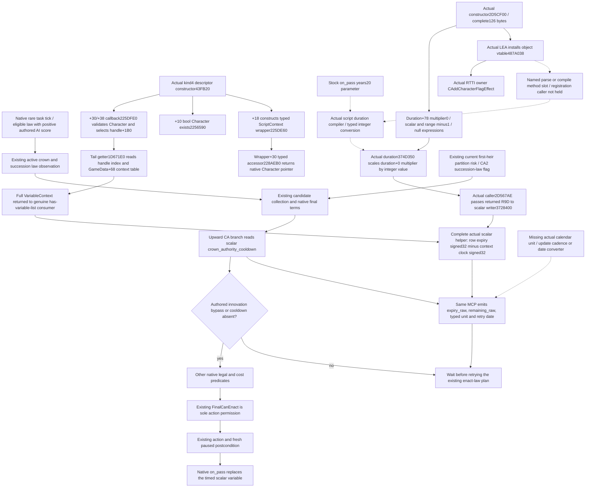

# Crown-authority retry timing in the ordinary 1.20.0.4 campaign

The missing decision input is the actual lifetime of Robert29829's scalar variable `crown_authority_cooldown`. The existing realm-law query already supplies active laws, candidate collections, native final permission, reasons, all ten costs and succession value profiles. Current held-title first-heir observations also exist. Reimplementing those inputs would not let the next-generation plan schedule a lawful retry after a cooldown rejection. This topic prepares the additional timing observation on the **same** `query-realm-law-final-terms-v1-private` route.

Initial source baseline: `14f07ade00e9ad359da3aa6af3642592ede3f48d`; first cached-result base was Root's adopted `28f19693cc79afe9ab8de94ee17b64dcc6204306`. The duration-producer increment is rebased onto Root's adopted raw-observer HEAD `b10e1c946a9c20ccb764e1a3f56be7ea6a341f46`. Target: CK3 `1.20.0.4`, Steam25734779, EXE SHA-256 `98702F88A547CDE2EAF29A85F93B85F68EE4CF8148336A4F7AFAEB75319DD518`. Root supplied current ordinary-campaign H9638, Robert29829, raw date53288448, runtime19 and saved6005; this worker did not query or reopen that frame. The original episode is `native-29829-2bc2d599f7f9`. Side R68 supplies no ordinary-campaign G2 qualification.

## Native decision tree before policy

Reuse [laws, contracts and succession](laws-contracts-and-succession.md), the [actual4 realm-law migration](realm-law-active-query-12004-migration.md), the [succession value profiles](realm-law-succession-value-profile-12003.md), [held-title partition](held-title-partition-v1.md) and the [crown source and receipt](ck3-1.20.0.2-realm-law-crown-source-and-receipt.md). Their already qualified callbacks, schemas and historical receipts are not rerun here.

The current vanilla `game/common/laws/00_realm_laws.txt` is the authored input. Its CA1 and CA2 `ai_will_do` blocks give score1 only for the preceding active level. CA3 has no corresponding authored block, so this topic does not invent a stock automatic CA3 preference. The CA1/CA2/CA3 upward legal branches inspect `crown_authority_cooldown`, with the authored `innovation_all_things` bypass. CA2 carries `can_change_succession_laws`. Each corresponding `on_pass` calls `calculate_authority_cooldown_break_effect` and writes a timed variable. The authored20-year duration is a setter argument; it is not the current row's remaining lifetime. This worker read the law source, not an EXE or save.

The new observer answers **when to inspect final terms again**. It neither grants action permission nor substitutes cooldown state for `FinalCanEnact`. Native final permission can be true through an override while a cooldown row remains present. Consequently `final_can_enact:true` cannot be converted into `remaining_raw:0`.

## Reused actual source and the finite missing source

The [background clock-unit source increment](crown-authority-cooldown-clock-units-source-12004.md) preserves the completed actual `CAddCharacterFlagEffect` RTTI and named `add_character_flag` registration. Its Oct8 continuation follows the actual manager/factory consumer before selecting a parser slot. Root reports the runtime25 six whole-query scenes and sole registered Service consumer GREEN; historical AUTHORED_NOTRUN passages below describe earlier stages. Calendar cadence, units and positive retry conversion remain separate source dependencies, with no new CK3 contact or repeated qualification here.

The actual4 shared identifier and Character-context bindings already exist in `ck3_12004_family_break_penalty.cpp` and `ck3_12004_epidemic.cpp`: table3F8A7E0, lookup3F8A660, name3F8A6D0, scope-context370EAF0. The player context must come from the existing exact4 Character/full-ID selection, not an old binder or a new character.

The held marriage-family packet at `Z:/ck3_mod_rewrite_process_assets/g2-migration-20261007/marriage-family/actual4-break-penalty/context-map-no-pdata/FAMILY-MAP.json` closes four source instructions: old37274C0/C4/C8/D4 to actual37274A0/A4/A8/B4. They prove VariableContext rows+10, count+1C, stride20 and identifier DWORD+8. Actual15 bytes were already captured by that owner; this worker reuses its metadata with zero new native bytes. The original `context-map/FAMILY-MAP.json` pdata miss remains a separate historical failure. Epidemic list rows+30/stride48 are a distinct container.

Those four instructions alone do **not** prove scalar expiry, value type, current clock, normalization or calendar cadence. Root's later finite packet below independently closes actual scalar expiry and remaining arithmetic. The historical1.19 `scoped_character_variable_monitor_v1.cpp` names setter3346BE0, its duration argument, and a monitored row member+0C called `expiration_raw`. Its14-byte source prefix and function typedef are useful cache locators, not actual4 addresses or proof of a current offset/unit. Historical `.2` labels such as `FlagSet` are not scalar timing or calendar-unit evidence; current operand and receiver relationships must establish each consumed role.

The owned [source request and same-route contract](../../ck3_autonomous_player/native_bridge/research/crown_authority_cooldown_observer_12004_contract.json) is cache first. It asks the central native mapper for named `set_variable` scalar caller/setter, scalar expiry updater and its native-clock source. An executable byte manifest must be filled from concrete retained actual source locators before capture. Its declared follow-up ceiling is768 actual bytes/6 exact reads, restricted to the consumed scalar writer/update/clock/cadence operand windows; missing locators do not authorize a scan. The already closed identifier/context/collection roots are excluded. Root owns authorization, capture and the source packet; this lane performs no EXE reads.

## Same MCP publication and immediate consumer

Add one `crown_authority_cooldown` object beside `groups` in the existing law readback, sampled within the same native revision/date/actor capture. The object must publish the actual row expiry and clock, signed remaining amount, proved timing type/unit and a source-backed calendar retry date. It may also publish row presence and raw scalar type. Do not change the candidate DTO, create a second MCP query, add an action gate, or treat an ACK as observation.

The exact source packet selects the representation: the complete helper proves a relative scalar update counter, so the owned raw reader preserves expiry and current counter separately. Map to a retry date only after the native update cadence and daily ordering are closed. No20-year subtraction from the current date, calendar conversion from FlagSet counters, or inferred timeout offset is permitted.

The published state distinguishes a successful absent row, an existing timed row with a legitimate remaining0, an existing permanent/untimed row, and a failed read. The now-closed native helper returns `remaining_raw:-1` for absence, so the observer must preserve that raw value with `present:false` and `expiry_raw:null`; its immediate **query** retry time is the captured frame date, independently of native remaining. A successful timed row preserves signed native remaining values, including0 and negatives; zero is not converted to `null` or used to delete the row. An existing row with signed expiry<=-1 is untimed under this native helper and has no invented finite deadline. Native remaining-1 can also arise from a timed row whose expiry is one clock step behind, so it cannot decide presence or timed status. Read failure uses nullable timing values and an explicit read status; it cannot masquerade as absence or zero. Storage and arithmetic are signed32, with the native DWORD subtraction's32-bit result; calendar unit and retry-date conversion remain source dependencies.

The Root hook recipe is narrow: extend `RealmLawReadback12002` with the owned typed cooldown result; call the exact4 reader from `CaptureRealmLawReadback12002` while it already holds the current played Character and frame; append the single object in `SerializeRealmLawReadback12002`; extend the strict exact-key validator in `realm_law_paused_private_transport.py`; preserve the object through the existing registered realm-law consumer. Existing action dispatch stays unchanged. These shared files are not edited by this worker.

The consumer's first useful result is the existing turn plan choosing either a fresh legal enact-law attempt, or a scheduled future requery at the observed deadline while it continues available development actions. It must still read fresh native final terms before dispatch. Current `govtSummary`, CA2's succession-law capability and held-title first-heir risk remain the inputs for prioritizing that existing plan. No new government system or hypothetical succession simulator is introduced.

## Concrete remaining-time source entrance: background only

The current Root game file `Z:/ck3_mod_rewrite/Crusader Kings III/game/localization/english/laws_l_english.yml:55` gives a direct native API name: the crown cooldown tooltip computes `GetCurrentDateWithDiff(GetVarTimeRemaining(CHARACTER.MakeScope,'crown_authority_cooldown'))`. This is stronger than interpreting a flag timeout: stock code explicitly asks for the remaining time of this Character scalar key and passes the result to a date-difference consumer. The getter's return width/unit and native callback RVA still require source closure; the localization alone does not justify multiplying an unknown result by24.

The constrained held Entry/Core/Command/Family/Epidemic caches do not supply an exact registered callback RVA for those two names. Preserve that **named locator MISS**. A second installed game copy at `Z:/SteamLibrary/steamapps/common/Crusader Kings III/.../laws_l_english.yml:59` contains the same composition, but its build was not checked; it is comparison source only. The Root copy at line55 is the production source locator. No game or SDK query was made.

There is now a finite executable **proposal for Root**, not an open-ended search. [ROOT-FINITE-SCALAR-TIMING-MANIFEST.json](Z:/ck3_mod_rewrite_process_assets/g2-migration-20261007/m7-crown-cooldown-12004/ROOT-FINITE-SCALAR-TIMING-MANIFEST.json) declares three exact old3/current4 paired windows with a physical ceiling of **762 bytes / 6 reads** before cache reuse. It selects the named old scalar value getter's local helper region at3727500/192 bytes, the timed writer's duration/expiry segment3728459/182 bytes, and its actual row-vtable RIP instruction3728440/7 bytes. All execution is Root central/background only; CK3 stays off.

The current-version candidates are attached to actual held native/member evidence and cached runtime-function metadata, rather than a generic RVA delta. The left scalar collection instructions37274C0/C4/C8/D4→37274A0/A4/A8/B4 are already proved. The cached `.3` writer interval3728420..37285AE corresponds by runtime-function ordinal to `.4`3728400..372858E, with equal398-byte extents. The cached updater entry3727600..372760F corresponds to37275E0..37275EF. These metadata candidates constrain the intervening local helper region; they are **not** semantic or runtime qualification. The192-byte helper region is leaf discovery starting at the named scalar value getter, not a fabricated `GetVarTimeRemaining` address. The declaration includes its exact old source prefix and separately marks the `.2` reference bytes as not yet `.3` byte proof.

The retained `.2` source has a further concrete typed attachment: writer3728440 (`488D05D94DD600`) produces row vtable448D220. Row serializer888870 reads row+8 at888882 (`8B5908`) and calls the actual variable identifier table3F8A800 at888885 (`E8761F7003`), matching the named PhaseVariableIdentifierTable contract. This creates a source-backed row-vtable/serializer/variable-identifier entrance for the central typed check. Prefix equality with historical setter3346BE0 or a historical `FlagSet` label alone is not used as scalar proof. Do not register `.2` reference bytes as a `.3` raw cache.

Root's single finite batch must first retain actual decoded scalar-helper/writer operands and source identity. If the native remaining helper and its scalar expiry/clock are found, only its actual typed return/date conversion remains to close. If the region lacks it, retain that exact finite MISS and proceed from the named registered `GetVarTimeRemaining` source request; the declared region does not authorize a wider scan. If row kind is still unresolved, the **actual returned** vtable/RIP target defines the next finite RTTI/serializer window; no new address is guessed. This packet deliberately authors no native binder until the frozen actual storage/type/unit/usable retry semantics are enough to implement it.

## Root's first timing packet: complete scalar helpers inside a partial region

Root executed that proposal once and sealed [scalar-timing-first01/FAMILY-MAP.json](Z:/ck3_mod_rewrite_process_assets/g2-migration-20261007/m7-crown-cooldown-12004/native/scalar-timing-first01/FAMILY-MAP.json): **762 physical bytes / 6 reads** across old3/current4. The182-byte writer window and7-byte row-vtable RIP window decode completely and normalize equally. The192-byte local region reports partial decode on both builds because its last instruction is truncated; that aggregate result does not invalidate its two earlier complete helpers. This lane and its two children parsed only the retained instruction JSON/raw cache and made **zero** new native reads.

| Region | Old3 | Actual4 | Result |
|---|---|---|---|
| Scalar value helper | 3727500..3727544 | 37274E0..3727524 | Complete68 bytes; row payload+10, absent fallback pointer4448648 |
| Padding | 3727544..3727550 | 3727524..3727530 | 12 bytes of CC |
| Scalar remaining helper | 3727550..3727592 | 3727530..3727572 | Complete66 bytes/23 instructions; byte-identical pair |
| Padding | 3727592..37275A0 | 3727572..3727580 | 14 bytes of CC |
| Unrelated next helper prefix | 37275A0..37275C0 | 3727580..37275A0 | 32 captured bytes,29 decoded; final `48 63 49` is truncated |

The remaining helper's actual ABI is `std::int32_t(const void* context, std::int32_t variable_token)`: RCX is the full scalar context, EDX the key and EAX the result. It scans the independently proved scalar rows+10/count+1C/stride20/keyDWORD+8. Actual3727560 reads signed expiry DWORD at row+0C. An absent row or expiry<=-1 returns-1; otherwise actual3727568 subtracts full-context DWORD+28. That directly closes **scalar** remaining arithmetic, without borrowing a historical container label. The named registered GUI callback `GetVarTimeRemaining` has not been resolved, but the complete primitive itself has genuine scalar source attachment. The exact instruction pairs and boundaries are retained in [getter-decode/ROOT-CACHED-GETTER-DECODE.json](Z:/ck3_mod_rewrite_process_assets/g2-migration-20261007/m7-crown-cooldown-12004/native/scalar-timing-first01/getter-decode/ROOT-CACHED-GETTER-DECODE.json).

The writer consumes inner receiver DWORD+20 plus positive R9D duration; nonpositive duration writes-1. Actual37284E6 writes expiry DWORD+0C, alongside key+8 and a16-byte payload+10. Actual3728420 produces row-vtable448D230. The writer's full/inner receiver relationship and the row's nominal RTTI/type name are not yet current source claims. Neither its vtable nor the value helper's fallback4448648 proves a time unit. A scheduling reader consumes the proved integer expiry/clock, not the absent fallback payload, so RTTI/default-value reads are not prerequisites for this next increment.

The decisive missing source is the clock's **calendar meaning**. Existing actual4 `date_raw` and the historical CDate24-ticks/day contract do not show that one scalar clock step is a day. The adjacent partial helper's3727597 branch to37275CE tests a row expiry and is not a cadence entrance. Do not extend that truncated helper or reread the762-byte packet.

The next narrow Root-only proposal is [ROOT-FINITE-SCALAR-CLOCK-PREFIX02-MANIFEST.json](Z:/ck3_mod_rewrite_process_assets/g2-migration-20261007/m7-crown-cooldown-12004/ROOT-FINITE-SCALAR-CLOCK-PREFIX02-MANIFEST.json): old3 **3727600/96 bytes**, actual4 **37275E0/96 bytes**, maximum **192 bytes / 2 reads** before cache reuse. Its actual candidate is the already-held runtime-entry ordinal187725, not an assumed RVA delta. The exact `.2`96-byte reference ends at instruction boundary3727660 and contains scalar rows+10, clock+28 increment, expiry comparison, full-context+8 selection and a concrete normalizer CALL. Root must recover those actual operands and actual CALL target before transferring the reference's roles. This prefix is a partial function window, not a whole-function qualification or a calendar-unit proof.

Root subsequently executed prefix02 once: [scalar-clock-prefix02/FAMILY-MAP.json](Z:/ck3_mod_rewrite_process_assets/g2-migration-20261007/m7-crown-cooldown-12004/native/scalar-clock-prefix02/FAMILY-MAP.json) closes the complete96-byte paired span, normalized/ordered-edge/local-flow equal, at **192 physical bytes / 2 reads**. Actual3727616 increments full context+28 only when scalar rows are nonempty and their last expiry is nonnegative;3727623 compares this clock to the last expiry;372762A selects full context+8;372762E calls actual887360. The full/inner receiver shift is current source, rather than borrowed layout. This is one increment per eligible invocation, still not a proved Character day.

The existing complete old3 daily-date body at `Z:/ck3_mod_rewrite_process_assets/g2-resume-20261004/battle-calendar-admission-v57/pause-source/evidence/daily-date-stage-22a0d80-primary.asm.txt` contains22A101D `mov rbx,[rsi+A0]`,22A1024 `lea rcx,[rbx+C8]`,22A102B `call3727600`. Root's [actual4 selected date/D writer receipt](Z:/ck3_mod_rewrite_process_assets/g2-parallel-20261007/army-supply-next-tick-12004/actual4-selected-writer-root-first01/ROOT-SELECTED-WRITER-RECEIPT.json) qualifies its selected calendar operands, not this caller. That direct updater receiver is **GameData+C8**. It cannot establish the Character scalar clock's day cadence. The19-byte caller window has an ordinal-attached actual candidate22A0FFD, but a new read there is unnecessary until a consumed Character relationship is found.

## Character scope registry: actual runtime initialization and next source entrance

The already-held complete87-byte scope-context helper actual370EAF0 obtains a registry by actual370EB00/370EB0A calls to3795A60, selects the ScopeTarget kind's row with stride50, then dispatches its callback at+30. This is the actual provider-selection route used by the existing Character-kind4/full-ID wrapper. The historical `.2` `event12002_recovery_variable_list_abi.json` and phase-definition constants explain that wrapper; they do not identify the current Character callback or daily updater.

Root adopted [ROOT-FINITE-CHARACTER-SCOPE-REGISTRY03-MANIFEST.json](Z:/ck3_mod_rewrite_process_assets/g2-migration-20261007/m7-crown-cooldown-12004/ROOT-FINITE-CHARACTER-SCOPE-REGISTRY03-MANIFEST.json) and mapped old3795A80/current3795A60, complete171 bytes, solely from the existing shared raw cache. [character-scope-registry03/FAMILY-MAP.json](Z:/ck3_mod_rewrite_process_assets/g2-migration-20261007/m7-crown-cooldown-12004/native/character-scope-registry03/FAMILY-MAP.json) records complete normalized/ordered/local equality with **zero new physical bytes / reads**. Total fresh Root cost stays **954 bytes / 8 reads** for first01+prefix02; reused342 paired registry bytes are separate.

Actual3795A82 returns the RIP-addressed registry object **54F2AF0**. The cold path uses the native thread-safe local-static guard, initializes its data/count region to zero at3795AD1/3795ADF, calls an allocator through virtual+20 at3795AE6 and registers the exit destructor43A1E10. This function does not write a Character-kind4 callback or any consumed row+30 slot. Its rows are a **runtime-initialized heap vector**, so neither adjacent3795BD0 data nor an EXE-time empty registry can be treated as a callback table.

That attempt's next cache-only source entrance was a concrete registry **registration** reference. Entry's subsequent positive constructor source below supersedes the scoped registration MISS; its historical searched ranges remain in their receipts. Root's central source owner performs later finite file extraction; this lane reads cached text/JSON only. The independent named renderer search remains a bounded MISS, with its checked scopes and interrupted old resume search recorded separately in [renderer-entry-lookup/ROOT-RENDERER-ENTRY-LOOKUP.json](Z:/ck3_mod_rewrite_process_assets/g2-migration-20261007/m7-crown-cooldown-12004/native/scalar-clock-prefix02/renderer-entry-lookup/ROOT-RENDERER-ENTRY-LOOKUP.json).

## Positive Character-kind4 construction and typed callback correction

Entry found the already-held complete old3 constructor **43FB20..43FBDD/189 bytes** at `Z:/ck3_mod_rewrite_process_assets/g2-background-round6-20261006/phase-descriptor-construction/body-0043FB20/disassembly.txt`, with exact `SOURCE.json` and `body-0043FB20-BD.bin`. It sets EDX=4, assembles a50-byte descriptor, copies its callbacks into the incoming row and calls3796120. This is positive named kind4 registration source, not a global xref search. Root's [character-kind4-constructor04/FAMILY-MAP.json](Z:/ck3_mod_rewrite_process_assets/g2-migration-20261007/m7-crown-cooldown-12004/native/character-kind4-constructor04/FAMILY-MAP.json) maps the complete actual4 constructor at the same43FB20 entry: normalized/ordered/local equality, **fresh189 bytes / 1 read**, old bytes reused. Fresh timing construction cost becomes **1143 bytes / 9 reads**; registry03 reuse remains separate.

| Descriptor member | Old3 target | Actual4 LEA target | Consumed role |
|---|---|---|---|
| +10 | 22565B0 | 2256590, LEA43FB4C | Existing `.3`91-byte metadata identifies a bool Character-kind4 exists predicate; not a scalar-context pointer |
| +18 | 225DE80 | 225DE60, LEA43FB77 | Actual371-byte body constructs a typed ScriptContext output |
| +30/+38 | 225E000 | 225DFE0, LEA43FB83/43FB93 | Actual113-byte body validates Character identity, loads handle+1B0 and tail-dispatches to the genuine full VariableContext getter |

The +30 assignment is exact: old43FB8F stores the LEA value into temporary descriptor+30;43FBB7 loads it and43FBC6 copies it into incoming+30. Current4 performs the same operations with the actual LEA target. A software symbol alone does not prove the returned role, and the initially held Character identity prefix did not cover the final return. The actual complete tail and genuine variable consumer below now prove the full VariableContext role. The earlier final-return description as a Character object resolver is superseded; a native Character pointer is instead returned by the separate typed ScriptContext accessor06.

The next finite Root proposal is [ROOT-FINITE-CHARACTER-SCRIPT-CALLBACK18-05-MANIFEST.json](Z:/ck3_mod_rewrite_process_assets/g2-migration-20261007/m7-crown-cooldown-12004/ROOT-FINITE-CHARACTER-SCRIPT-CALLBACK18-05-MANIFEST.json): old225DE80/current225DE60 **371 bytes each**, maximum **742 bytes / 2 reads**, cache first. Its current entry comes directly from actual43FB77 LEA bytes `48 8D 05 E2 E2 E1 01`; cached runtime ordinal118007 independently pairs equal371-byte entries. The proposed read identifies the callback's genuine ABI/return/ScriptContext flow and any actual variables accessor or receiver offset. It does not assume that +18 returns a VariableContext, grant automatic callee expansion or qualify the calendar unit. The old object113, bool-exists91, scope87, remaining66, updater96, singleton171 and constructor189 are excluded from rereading.

Root's [character-script-callback18-05/FAMILY-MAP.json](Z:/ck3_mod_rewrite_process_assets/g2-migration-20261007/m7-crown-cooldown-12004/native/character-script-callback18-05/FAMILY-MAP.json) now closes that complete371-byte pair with **742 fresh bytes / 2 reads**, bringing fresh cost to **1885 bytes / 11 reads**. Actual225DE60 takes an output pointer in RCX and a kind4/full-ID target in RDX. It resolves the Character using generation storage and fullID+18, stores the native pointer at stack+60, and constructs a typed ScriptContext output. Actual225DF18 calls879390 with that stored native pointer and the type object returned by9DAC60;225DF48 copies the temporary representation with87C910. It writes a type ID at output+28 and returns the output pointer at225DF87. Thus it is a context-wrapper constructor with an output ABI, not a direct scalar-row getter.

That genuine wrapper emits two actual callbacks:225DF51 LEA→**228AEB0**, stored at output+30 by225DF58;225DF5C LEA→**379A130**, stored at output+38 by225DF63. These wrapper members are distinct from the original kind4 descriptor callbacks. Root executed [character-script-typed-accessor06/FAMILY-MAP.json](Z:/ck3_mod_rewrite_process_assets/g2-migration-20261007/m7-crown-cooldown-12004/native/character-script-typed-accessor06/FAMILY-MAP.json) once: old228AED0/current228AEB0 **92 bytes each**, complete normalized equality, **184 fresh bytes / 2 reads**. It checks the indexed typed object against9DAC60, invokes its virtual+28 extractor, then actual228AEF1 dereferences the returned payload to produce a native Character pointer. That branch closes a distinct object-extraction role and supplies no scalar context or calendar unit. Its general output+38 callback379A130 is not expanded.

## Genuine scalar context return and shared table identity

The held actual380-byte `has-variable-list_readonly_executor` at378A610 supplies a concrete consumer role. Actual378A62B calls370EAF0, copies its returned pointer toRDX and, on the nonnull branch, reads list rows at full-context+30 and count+3C directly. There is no intervening Character-to-variables conversion. The exact held [consumer DETAIL](Z:/ck3_mod_rewrite_process_assets/g2-background-20261007/upstream-build-migration/epidemic-functions/primary-spans/has-variable-list_readonly_executor-DETAIL.json) is reused with zero capture. Together with the scalar helper's independent layout, this establishes the full VariableContext receiver consumed by the existing scope route.

Root's [registration-writer-identity07/FAMILY-MAP.json](Z:/ck3_mod_rewrite_process_assets/g2-migration-20261007/m7-crown-cooldown-12004/native/registration-writer-identity07/FAMILY-MAP.json) closes actual3796100's full270-byte paired writer: **270 fresh bytes / 1 read**, old270 bytes reused. The writer calls the already closed3795A60 getter and copies incoming descriptor+30 into the selected kind row of **54F2AF0**, the same registry used by370EAF0. Constructor RCX5C76EA8 is saved/returned registration-owner state, not evidence of a separate registry. The temporary separate-table hypothesis is withdrawn; both actual source paths use54F2AF0.

The old complete113-byte return cache in historical `.2` documentation could not be relabeled `.3`. Only the early4-byte kind predicate was held for the current old/new pair. Root therefore executed the exact constructor-attached [character-variable-context-return08/FAMILY-MAP.json](Z:/ck3_mod_rewrite_process_assets/g2-migration-20261007/m7-crown-cooldown-12004/native/character-variable-context-return08/FAMILY-MAP.json): old225E000/current225DFE0, full113 bytes each, complete normalized equality, **226 fresh bytes / 2 reads**. Actual225E03E loads QWORD[Character+1B0] intoRCX after full-ID/tag/state checks;225E045 tests it;225E048 conditionally tail-jumps to actual**1D671E0**. Null/invalid paths return0 at225E04E/225E050. The valid returned pointer is the downstream getter's result, not the Character pointer from the identity prefix.

That downstream getter is already source-closed in the existing religion migration packet: [religion_1D67200-DETAIL.json](C:/codex-ck3-background/packets/religion-addons-12004-migration-20261007/context-hostility-conversion/missing-batch02/religion_1D67200-DETAIL.json), old1D67200/current1D671E0, full331 bytes, complete normalized/ordered/local equality. Reusing it costs zero new native reads. Actual1D671F2 reads a signed index from the Character+1B0 handle. For a nonnegative index,1D67245 selects QWORD[GameData+68] and1D67249 returns QWORD[table+index*8]. The index-1 branch supplies an initialized shared0x50-byte default VariableContext with clock+28=0 and the scalar/list collection members. Existing `CharacterFlagCollection` labels are not used to infer a calendar unit. This closes the real full-context selection for the observer through the existing370EAF0 route.

The next source seam is now concrete: the daily updater of this **same GameData+68 context table**, or a native date-difference converter consuming the scalar remaining result. A pool-level daily updater can establish the Character clock cadence; a separate CharacterNewDay callback is not assumed. The held global GameData+C8 caller remains unrelated. Root's actual raw source cost through08 is **2565 bytes / 16 reads**, with171-byte singleton,380-byte consumer and331-byte getter reused separately. No helper, wrapper, singleton or constructor needs another capture.

The owned [raw observer header](../../ck3_autonomous_player/native_bridge/include/xar_bridge/crown_authority_cooldown_observer_12004.hpp) and [source](../../ck3_autonomous_player/native_bridge/src/crown_authority_cooldown_observer_12004.cpp) are now **AUTHORED_NOTRUN**. `BindImage` reuses `BindFamilyBreakIdentifiersImage`; `Read` resolves the exact scalar key through the existing identifier roundtrip and obtains the full context through the source-closed370EAF0 route. Its combined timing scan follows the native helper's first matching row, preserves expiry+0C/current clock+28 and computes native32 subtraction without signed overflow. It retains absent/untimed native-1, timed computed-1, legitimate0 and nullable read failure separately. No standalone presence getter, new query or action is added.

Its unit is explicitly `scalar_clock_step_calendar_unqualified`; a successful absent result has a same-frame query retry date independently of calendar conversion. A present positive result has no authored calendar deadline yet, so this leaf is source preparation and does not close the timing observation. Reuse the same-context daily source or native date-difference conversion once located, then finish that field in the same leaf. Do not expand the normalizer merely to accumulate evidence: the remaining reader already consumes direct same-frame integer arithmetic. Until cadence or conversion closes, there is no usable positive retry date or completed timing capability. Root's original partial-region result and complete helper credit remain separately recorded.

## Concrete script-duration producer: source09

The current Root law source at lines112–115 uses `set_variable = { name = crown_authority_cooldown years = @crown_authority_cooldown_years }`, with the constant20 at line1. It does not literally write `days = 7300`. A7300-day compiler result would need its actual native conversion; neither authored20 nor a historical evaluated number proves the current scalar clock unit. The nearby `calculate_authority_cooldown_break_effect` at `common/scripted_effects/01_dlc_fp1_scripted_effects.txt:1139` updates the break tally and does not supply a date conversion.

There is a positive named native source entrance before any new `.rdata` search. The exact historical `.2` [conversion-outcome ABI](../../research/conversion_outcome12002_state_abi.json) retains `CharacterFlagEffect.execute` at2D56680..2D56830/432 bytes. Its duration producer at2D567F6 calls **374D370**, with RCX selecting node+78, RDX the effect context and R8 its evaluation context+28. The returnedEAX is moved toR9D before2D5680A calls the same timed scalar writer3728420 on full context+8. This is actual CALL/argument evidence with its `.2` version retained; the `FlagSet` label does not supply a unit, nor does it invalidate the independently named generic duration evaluator as a source entrance. Current scalar/context identity and the evaluator's conversion must be established from current operands.

Held runtime JSON provides an exact finite current candidate: old3 runtime ordinal156680 is2D56680..2D56830/432 bytes, matching that historical entry/extent; actual4's same ordinal is2D56660..2D56810/432. Old3 ordinal188311 is precisely374D370..374D42A/186 bytes, and actual4 is374D350..374D40A/186. These are declared metadata candidates, not semantic transfer or a generic address delta. [HISTORICAL2-TO-CURRENT-METADATA-ATTACHMENTS.json](Z:/ck3_mod_rewrite_process_assets/g2-migration-20261007/m7-crown-cooldown-12004/native/script-duration-source09/HISTORICAL2-TO-CURRENT-METADATA-ATTACHMENTS.json) records both existing tables, ordinals and intervals with zero EXE/PE reads.

Root executed the [source09 manifest](Z:/ck3_mod_rewrite_process_assets/g2-migration-20261007/m7-crown-cooldown-12004/ROOT-FINITE-TIMED-SCALAR-DURATION-PRODUCER09-MANIFEST.json) once in dependency order. The complete caller suffix **old3 2D567CE/current4 2D567AE,98 bytes each** confirmed the actual duration CALL to **374D350**, the Character context getter and returnedR9D-to-writer**3728400** relationship. Its [actual receipt](Z:/ck3_mod_rewrite_process_assets/g2-migration-20261007/m7-crown-cooldown-12004/native/duration-caller09/FAMILY-MAP.json) is complete normalized equality, **196 fresh bytes / 2 reads**. Only after that actual CALL was known did Root extract the named evaluator **old3 374D370/current4 374D350,186 bytes each**. Its [receipt](Z:/ck3_mod_rewrite_process_assets/g2-migration-20261007/m7-crown-cooldown-12004/native/duration-evaluator09/FAMILY-MAP.json) is complete normalized/ordered/local instruction equality, **372 fresh bytes / 2 reads**. Historical `.2` reference bytes were not relabeled as old3 raw cache. Source09 adds568 bytes/4 reads; cumulative Root source cost is **3133 bytes / 20 reads**.

Actual374D3E3 optionally evaluates an expression through37540B0; otherwise374D3EA reads the integer at duration+4. Actual374D3ED reads a multiplier at duration+0 and374D3F3 multiplies the two integers. Duration+8/+18 control an optional range branch. This proves generic integer scaling, with no source label assigning days, months or years to that multiplier. The captured186 bytes branch to374D40A and jump to common return374D4AB outside the span. They are a **complete instruction fragment**, not a whole-function or complete-return qualification. No expression engine expansion or repeated98/186-byte extraction is requested.

The historical1.19 scalar `set_variable` execute3393530 is separately named by `scoped_character_variable_monitor_v1.cpp` with an18-byte entry prefix and a signed32 duration forwarded into3346BE0. That supplies an older scalar-effect locator, not a current successor address. It is retained beside source09 rather than guessed into1.20.0.4. No already closed writer182, getter331, callback113 or green execution is repeated.

Entry continues the independent same-pool/renderer locator route. Its cache-first fallback is exactly the three named NUL strings `GetVarTimeRemaining`20 bytes, `GetCurrentDateWithDiff`23 bytes and `set_variable`13 bytes. Existing global PE metadata locates `.rdata` at RVA43DA000/file43D8E00 and its existing file conversion; it does not contain a bound literal/RIP cache locator. That section address is not permission to read the whole17MB section. The positive executable source09 above supplies a smaller concrete producer now; a later named-literal match must lead to a real registration LEA/STORE before freezing a callback span. No open-ended scan or fabricated callback is introduced.

## Actual duration initializer: delegated entrance10

This source/docs increment is isolated at `C:/codex-ck3-background/g2-crown-units-entrance10-12004`, based on the raw whole-candidate commit `a624c5c400d581e60530b6813420540d1c4b7d56`. Root expressly delegated the frozen paired constructor manifest, with a maximum252 bytes/2 reads. The existing finite mapper checked held range caches first and captured only **old3 2D5CF20..2D5CF9E/current4 2D5CF00..2D5CF7E**,126 bytes each. Its [actual receipt](Z:/ck3_mod_rewrite_process_assets/g2-migration-20261007/m7-crown-cooldown-12004/native/duration-initializer10-clergy-first01/FAMILY-MAP.json) records a complete30-instruction span with normalized/ordered/local equality, **fresh252 bytes/2 reads**. No callee, vtable, PE scan, game/process or SDK access followed. Earlier historical `.2` bytes remain locator evidence and were not substituted for genuine old3 bytes.

| Actual4 source | Actual operand and role | Qualification |
|---|---|---|
| 2D5CF12 CALL | 4223B94 with requested object size98 | Allocation edge; not expanded |
| 2D5CF22 CALL | 3764150 receives the allocated whole object inRCX | Base-object initializer; no parser role assigned |
| 2D5CF27 LEA / 2D5CF2E STORE | RIP target487A038 installed at object+0 | True vtable anchor; old3 actual target487A028 |
| 2D5CF4D STORE | DWORD[object+78]=0 | Embedded duration+0 multiplier default |
| 2D5CF50 STORE | QWORD[object+7C]=all ones | Duration+4 integer and+8 range DWORD defaults-1 |
| 2D5CF58 / 2D5CF5F STORE | QWORD[object+88/+90]=0 | Duration+10 expression and+18 range-expression defaults |
| 2D5CF70 / 2D5CF7D | RBX copied toRAX, thenRET | Allocated object returned; complete constructor boundary |

The exact [decode receipt](Z:/ck3_mod_rewrite_process_assets/g2-migration-20261007/m7-crown-cooldown-12004/native/script-duration-source09/next-units-entrance10/decoder-after-capture/ROOT-ACTUAL-CONSTRUCTOR10-DECODE.json) and [observer join](Z:/ck3_mod_rewrite_process_assets/g2-migration-20261007/m7-crown-cooldown-12004/native/script-duration-source09/next-units-entrance10/observer-join/ROOT-OBSERVER-JOIN-DELIVERY.json) reuse only these held instructions. The source09 caller/evaluator already supplies the node+78 receiver and integer scaling; entrance10 now proves its initializer and emitted vtable. **No parser CALL or days/year multiplier store appears in this constructor.** The bounded named conversion-outcome ABI packet has no duration parse/compile virtual slot or provider multiplier writer. Its888CFB parser-named operand belongs to row-expiry deserialization and cannot fill this duration role. Following allocator4223B94 or pre-vtable base initializer3764150 would not select the missing days multiplier and is omitted.

There are two concrete next construction routes. For native source, the true anchor is the installed487A038 vtable: reuse a held named effect parse/compile virtual-call slot or registration caller before selecting any pointer/callee window. The [next finite node](Z:/ck3_mod_rewrite_process_assets/g2-migration-20261007/m7-crown-cooldown-12004/native/script-duration-source09/next-units-entrance10/observer-join/NEXT-FINITE-OBSERVER-NODE.json) leaves only the unproved slot/target/extent unfilled; constructor defaults do not authorize an arbitrary vtable read. For direct ordinary-campaign qualification, Root batch25 publishes the already authored raw9 object through the existing law MCP, then obtains genuine paused pre/post same-Character clock/expiry observations during its authorized normal24-hour progression. This compares native scalar counter movement with an actual calendar interval without guessing a20-year constant. The [same-MCP observation recipe](Z:/ck3_mod_rewrite_process_assets/g2-migration-20261007/m7-crown-cooldown-12004/native/duration-initializer10-clergy-first01/ROOT-SAME-MCP-CLOCK-UNIT-OBSERVATION-RECIPE.json) is preparation only; no observation or calendar unit is claimed here.

Source cost is now **3385 bytes/22 exact reads**: prior Root3133/20, plus this delegated lane252/2. Children reuse those captured instructions with zero new native bytes. Raw observer code, same-MCP hooks, whole producer and registered consumer remain uncompiled/unexecuted in this lane; Root25 owns their unified four-target batch. The constructor proof does not change raw9 type/unit, fill a positive retry date, add action permission or grant fixture/live readiness.

## Root FIRST and qualification boundary

The raw reader and same-MCP candidate are ready for Root integration before calendar qualification. The [external native hooks](Z:/ck3_mod_rewrite_process_assets/g2-migration-20261007/m7-crown-cooldown-12004/raw-observer-first/native-hooks/ROOT-NATIVE-HOOK-RECIPE.json) project only the existing law header, Capture/serializer, mailbox and router. Runtime bindings remain the existing exact4 image path; nullable fixture access pointers allow the new whole fixture to use the actual named executor with synthetic memory and callbacks. The production route and fixture both use `SerializeRealmLawReadbackCommandResult12002(request_id, native_readback, revision)`, which delegates to the existing full command-result helper. Root explicitly adds the owned observer source to `xar_ck3_12002_runtime` and the owned fixture CMake leaf to the selected complete source tree. This worker did not edit shared hooks or main CMake.

The [new whole fixture](../../ck3_autonomous_player/native_bridge/tests/crown_authority_cooldown_whole_fixture_12004.cpp) and [owned CMake leaf](../../ck3_autonomous_player/native_bridge/tests/crown_authority_cooldown_whole_fixture_12004/CMakeLists.txt) author target `xar_crown_authority_cooldown_whole_fixture_12004` and sole Ct `crown_authority_cooldown_whole_fixture_12004`. They exercise actual Enter/Capture/raw Read/Finish and the full production serializer for absent, positive timed, timed-zero, timed computed-minus-one, untimed sentinel and read failure. Every case retains the existing blocked FinalCanEnact, reason, costs and succession profile. The six complete output command_results are passed unchanged to the [sole registered consumer](Z:/ck3_mod_rewrite_process_assets/g2-migration-20261007/m7-crown-cooldown-12004/raw-observer-first/consumer/FIRST-REGISTERED-CONSUMER-RECIPE.json), whose only method is `CrownAuthorityCooldown12004RawWholeWireTests.test_six_native_raw_cooldown_whole_wires_through_registered_law_query`. It calls the actual registered `ck3_query_realm_law_final_terms_private_v1` through real server/Service lifecycle, Driver, strict transport and protocol ingest/wait. The existing registered law tool dispatches directly to Driver; no invented Service law method is introduced. These stages remain **AUTHORED_NOTRUN**, with no compiled output or fixture-live credit.

The raw wire has exactly nine fields: read_available, nullable present/timed, expiry_raw/current_clock_raw/remaining_raw, retry_date_raw, expiry_type and remaining_unit. Expiry/clock/remaining are signed32; frame and retry dates retain the existing signed64 DTO width. The strict projection admits the extra object only on actual1.20.0.4 and preserves the older seven-key law DTO. A successful absent row publishes its actual current clock, native remaining-1 and current-frame retry date; present rows have no calendar deadline yet. Fixed type `signed32_scalar_clock_counter` and unit `scalar_clock_step_calendar_unqualified` state the remaining source boundary without turning legitimate zero into null.

Fixture memory, callbacks, public frame and epoch are explicitly synthetic. The companion hello/state packet builders are private in the giant bridge; this candidate declares `state_packet_source:fixture-synthetic-snapshot` and null companion files instead of reproducing native state packets. Only the six whole wires are generated by the real compiled production serializer. The registered consumer leaves their incoming IDs, envelopes and rows unchanged; it aligns only its outbound UUID with the compiled ID. A future GREEN receipt would qualify this new fixture pipeline, not calendar units or a production campaign.

Root owns the genuine paused pre/post observations in the **current** Robert29829 ordinary campaign, retaining actual source/runtime/actor/date/context pins. Its authorized normal24-hour progression can compare this same Character context's clock and unchanged row expiry against actual date change. A positive clock delta for the eligible timed context can distinguish scalar steps from calendar days; zero delta without eligible timed rows cannot establish cadence. No ACK substitutes for those observations, and no24 multiplier is applied before the actual relationship closes. A valid absent result can schedule an immediate fresh terms query; a positive timed result still needs a usable retry deadline. If timing prevents scheduling, this same-MCP construction continues. The background lane performs no game/SDK/process operation and does not reopen R54/R61 or award OODA credit.

## Oct7/W41 fields

- Completed source input: prior scalar/Character/source09 proof is reused; delegated entrance10 actual126-byte constructor closes multiplier/default stores and true vtable487A038, with no calendar-unit credit. Raw leaf64bit frame width, external same-MCP hooks and new native whole/sole registered consumer remain AUTHORED_NOTRUN.
- Doing: Root25 unified four-target build/new FIRST, then genuine same-context paused pre/post clock evidence. The alternative native node is actual487A038 plus a source-proved parse slot or registration caller; no arbitrary slot selected.
- Why: current law permission and presence cannot schedule a future lawful retry; actual timing lets the existing next-generation plan continue useful development while waiting.
- Readiness: **research / construction prepared**. Cooldown timing observation, scheduled retry, new static-ready/fixture-live/production-live/loop credit are all unqualified. Presence-only is not completion.
- Execution: project/game imports, tests/build/SDK/game/process/save/hash/newcapability0; old qualified suites0; no Root report/shared bridge/CMake edits. The sole newly authorized offline EXE file operation is this constructor pair252B/2reads, through the frozen finite mapper. No further byte window ran.
- Source cost: prior Root **3133B/20reads** plus delegated constructor10 **252B/2reads** = **3385B/22reads**. Registry03/getter331/consumer380 and both children reuse proofs without new bytes. No qualified test/live observation repeated; exact capture timestamps remain in the new receipt and source contract.
- Next: Root compiles and executes the new target/consumer once, then observes genuine same Character context across normal24 hours. A source alternative is the actual duration multiplier's typed days/years producer or the named native date renderer, from held metadata and finite Root-only windows. Presence/raw fields alone are not closure; no extra gate, action permission or capability is added.
