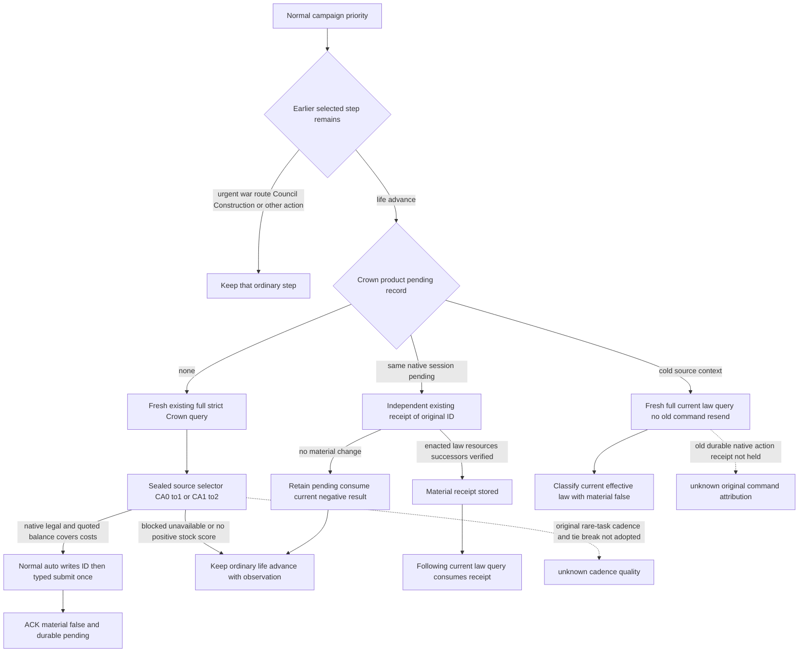

# Crown authority on the ordinary Service path

2026-10-08 / 2026-W41. Exact game1.20.0.4, Steam build25734779,
EXE SHA98702F88A547CDE2EAF29A85F93B85F68EE4CF8148336A4F7AFAEB75319DD518.
Source-only candidate on Root8f67ddd5 in `Z:/gbs-m7-crown-normal-8f67`.
No new native read, build, test, project import, SDK or Game execution by this
owner. Root executes the sole new compound and owns the original Robert29829
campaign, paused/minimized game and live qualification.

## Source inputs precede the ordinary policy

Reuse the already sealed [Crown selection tree](crown-authority-ordinary-campaign-policy-12004.md)
and [formal native query/enact/receipt](crown-formal-action-12004-migration.md).
The selector's native input is the authored positive `ai_will_do` score:
CA0→CA1 and CA1→CA2. Its final legality is the fresh native `can_enact`,
and its resource budget is the actual complete quote. No additional war,
faction-count, component-CanPass, guessed cooldown or prestige-reserve veto
is introduced. Native rare-task cadence and tie breaking remain unimplemented;
they do not alter the selected quote's current final legality.

Root's final qualified FOUR native fixtures are
`Z:/ck3_mod_rewrite_process_assets/g2-background-20261008/runtime30g-first04/m7_formal/wire`.
Root reports Native FIRST GREEN0.2274838s and sole registered consumer
GREEN3.6877793s, production4e with separately pinned fixture25f. This candidate
reuses those results; earlier runtime30/30e/30f RED directories are not a
qualification input and none of their tests is replayed.

## Ordinary priority and complete product path

Both existing normal institutions tails call the Crown consumer **after**
the existing Council consumer. Construction and family/lifestyle/release
arbitration already precede these tails. Only an unchanged `life-advance`
selection reaches Crown discovery or its pending receipt. A selected urgent
war read/action, march/route, Council appointment, Construction command or
other earlier action keeps its existing priority. The currently active-war
tail is wired as well as the ordinary tail; an idle governance opportunity
is not treated as a permanent nonwar scope.

`plan_turn` obtains the existing strict formal query with the current public
revision and retains its entire returned readback. This includes queried
public/native revisions, proof epoch, date, player, candidates, balances,
title successors and native/session provenance. The pure selector may choose
one positive-score target and exact quoted cost budget. Planning does not enact.
`auto_turn` plans again, writes its unique action ID and full readback to
`state_dir/crown-authority-formal-v1.json`, then calls the unchanged typed
NativeDriver submit method. No new MCP tool or CLI flag is added; the existing
`--private-realm-law-crown-action` controls all three formal operations.

An ACK remains `material_result=false`. The subsequent ordinary fallback
selects an independent receipt for the **same** action ID. Only native
`status=enacted`, `material_result=true`, the requested effective law and the
native verified law/resources/succession receipt resolve it as an enactment.
The next normal planning observation reads current law and consumes that
resolved receipt. The already active target is not submitted again; any later
CA1→CA2 choice needs its own current final quote and action ID.

If the independent native receipt reports no material change, the command
stays pending. Its already observed result is consumed on that same actual
native/date frame, leaving the ordinary clock route available. A changed
actual frame may read the same pending ID again. This is result consumption,
not a predicted-date admission gate, and it never converts a negative receipt
into success.

## Cold product entry and honest receipt boundary

The dedicated product file follows the existing institution consumers' atomic
JSON state pattern. It is not a new WAL or schema gate. It stores pending and
resolved records, the native source context and the exact quote/ACK/receipt.
The bound native pending record lives in the DLL process; no durable native
action-history restore is held. Its missing-ID reason is also not held and is
not invented here.

A product record loaded in a different source process uses a fresh strict
current-law query. It classifies the actual effective law, resources and
successors while explicitly publishing `material_result=false` and
`original_native_receipt_available=false`. It does not resend the restored
command or claim the old action caused the observed law. The next normal
planning query may consume this current-state classification. Only a same-ID
independent native verified receipt can credit the original action. Future
checkpoint transfer must retain this new dedicated file once the automatic
loop has written it, using the existing product-state copy mechanism.

## One new offline compound and remaining live work

`test_g2_normal_crown_service_compound_v1.py::test_registered_normal_crown_submit_independent_receipt_consume_and_precedence`
is the sole new compound, authored with FIRST0 for Root execution. It invokes
registered `ck3_plan_turn`/`ck3_auto_turn` with the real Service, pure selector
and existing NativeDriver transport. The original FOUR native command-result
bodies are unchanged except their existing top-level request correlation.
Baseline choice and paused outer frames are explicit fixture seams. Separately
source-shaped following/cold query DTOs test current-state consumption; they
are not native observation qualification or live evidence. Earlier Council
and Construction selections are explicit precedence seams; their old GREEN
compounds are not rerun.

The cases cover existing opt-in off, the warm normal loop with active-war and
faction inputs, exact CA1→CA2 budget/final-native permission, urgent war
priority, earlier Council/Construction selections, unchanged negative receipt,
following material consumption and cold current-law classification without
resend or old receipt credit. No new fixtures/native target/registry scan is
introduced. Source readiness remains `research / authored-notrun` until Root's
one new actual FIRST result. The existing native primitive qualification does
not grant this ordinary loop production-live status.

The Root live sequence after adoption is existing fresh snapshot → normal
plan → normal auto → later independent paused frame → normal auto receipt →
normal plan current-law consumption → normal save. Urgent army/route work
continues to win its current priority. M7 credit requires a real material
Crown result; M4 remains a separate two-year-window milestone. This candidate
adds zero game days, natural successions, live law changes or milestone credit.
