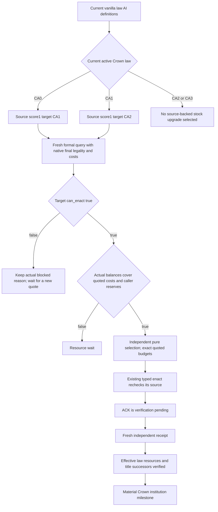

# Ordinary campaign Crown selection from the actual4 native source

2026-10-08 / 2026-W41. Source-only candidate based on Root
`b94679730f327dbed12e7f29bf014d79a0771029`; private tree
`Z:/gbs1-m7-crown-policy30`. Exact game is1.20.0.4 / Steam25734779 /
EXE SHA98702F88A547CDE2EAF29A85F93B85F68EE4CF8148336A4F7AFAEB75319DD518.
No new EXE read, hash, import, test, build, SDK or game action is performed.
Root owns the actual campaign and the shared Service integration.

## Native selection and visible value before policy code

Reuse [formal actual4 query/enact/receipt](crown-formal-action-12004-migration.md),
[laws and succession](laws-contracts-and-succession.md) and the
[raw Crown cooldown](crown-authority-cooldown-observer-12004.md). The formal
native source now has the Root-qualified4e snapshot reset correction; its
stack investigation, COFF and original four-wire mode are not rerun here.
Historical nonwar/religion exclusions in the old source topic describe its
former scope; they do not restrict this current Crown choice.

Current vanilla `game/common/laws/_laws.info:300-303` states that a positive
`ai_will_do` law is enacted when able and the highest score wins. Its rare-task
cadence and tie break are not implemented here. The current
`common/laws/00_realm_laws.txt:120-125` gives CA1 score1 only from CA0;
203-208 gives CA2 score1 only from CA1. CA3 has no corresponding authored
AI score. The minimum selector therefore chooses only those two source-backed
upgrades, with the actual native final `can_enact` result as its legality input.

CA2's definition128-143 contains vassal tax and levy contribution modifiers
of0.1, internal-vassal-war prohibition, refusal-as-treason, permission to change
succession laws and title retention on succession. These are concrete
institutional benefits. Its authored opinion modifiers remain political
tradeoffs; a faction count alone does not identify faction members, strength,
discontent or the player's eventual opinion changes. No projected tax income,
army increase or faction outcome is claimed from this definition alone.

The authored20-year cooldown is a setter argument, not an independently
proved current calendar retry. A candidate that is currently native-final
legal needs no reconstructed cooldown/date gate. Actual cost comes from the
same native quote, not a Python reimplementation of the dynamic cost script.
Active war and faction count are not added as vetoes; existing campaign
arbitration retains its war priorities.

## Why the ordinary campaign does not select Crown yet

The ordinary campaign goal is `dynasty_continuity` with family and succession
work. Source search finds formal Crown only in MCP registration, NativeDriver
wrappers and the private transport; no Crown chooser, dispatch or durable
pending receipt is wired in `bridge/service.py`. A registered tool alone does
not become an ordinary turn.

`GameplayBridgeService.plan_turn` calls the existing campaign/life selector.
Its active-war/lifestyle early returns skip the later faction, construction,
family and council tail. Adding Crown only to that tail would silently miss
the currently active-war campaign. The integration owner should call the new
pure selector during a governance opportunity after the selected war material
step, or from a common turn finalizer that keeps existing action precedence.
This candidate changes no Service, priority weights or war plan.

The selector module is `xar_autoplayer.crown_authority_policy_v1`;
`choose_crown_authority_upgrade_v1(readback, reserves_raw=...)` consumes the
full strict formal query readback and returns a value-only choice. Exact quoted
costs become the submit budgets. There is no existing campaign prestige reserve;
the caller may supply already chosen reserves. Existing faction/construction
gold reserves are not recast as a new prestige threshold.

Before automatic dispatch is integrated, the caller must retain the existing
formal readback, choose one unique action ID, submit once, record its ACK and
resolve that same ID by an independent receipt before another enact. The
transport/native pending semantics already prevent a second unresolved native
submit, but the ordinary campaign has no durable Crown pending record yet.
Reuse the existing faction pending record pattern when that hook is built;
this source-only selector does not invent a new generic transaction system.

## Root's existing CC1 SDK action recipe

The existing launch flag is `--private-realm-law-crown-action` with the normal
native-headless/stdio session. It enables all three formal tools. The final-
terms-only flag does not supply these action tools.

1. Use `ck3_take_snapshot()` for a fresh paused current-player frame. Pass its
   public `revision` to
   `ck3_query_realm_law_crown_action_private_v1(expected_revision=revision)`.
2. Keep the entire returned readback, schema
   `realm-law-crown-action-private-read-v1`. It includes available/paused,
   queried public revision, native revision/proof epoch, date/actor, candidates,
   balances, full title successors and exact session/native provenance.
3. Select the observed inactive `crown_authority_2` row with `can_enact=true`.
   Submit `ck3_enact_realm_law_crown_private_v1(readback=readback,
   law_key="crown_authority_2", budgets={"prestige": quoted_cost_raw},
   action_id=unique_id)`. The action ID is nonempty ASCII and at most63 chars.
   Use the fresh exact quote cost; never hardcode the held example as a future
   admission or replace the full readback with the final-terms result.
4. A successful ACK is `submitted_verification_pending`,
   `verification_pending=true`, `material_result=false`. Retain its action ID.
5. Obtain a later independent fresh paused snapshot and call
   `ck3_query_realm_law_crown_receipt_private_v1(expected_revision=new_revision,
   submitted_request_id=unique_id)`. Require `status="enacted"`,
   `material_result=true`, effective law2 and effective-law/resource/succession
   verification. A pending or unchanged receipt never means the institution
   changed. There is no need to unpause or wait a calendar duration merely to
   perform this independent mailbox verification.

Root's already consumed R76 quote is
`Z:/ck3_mod_rewrite_process_assets/g2-background-20261007/upstream-build-migration/managed-full-h9658-startup30restore01/operator/gameplay-responses/002-runtime30-m7-quote.json`:
public3/native2/date53288472, Robert29829, CA1 active, CA2 native-final legal.
Held prestige305791610 and cost119600000 leave186191610 raw prestige after
that quoted charge. Factions2 and war100663329 are context, not extra native
law conditions. The held quote is decision evidence only; after war actions
Root must obtain a fresh formal readback for enact.

## Readiness and first recipe

The existing actual4 formal tools are sufficient for Root's immediate visible
CA2 action and independent verification. The isolated selector is
AUTHORED_NOTRUN; no FIRST is performed by this package. Ordinary automatic
Crown selection/dispatch/pending integration remains unfinished. It is not
blocked on additional cooldown cadence, native fields or a full faction model.

For a later single necessary pure compound, use one current-CA1 legal quote
with Root's cost/balance shapes, native-illegal quote, insufficient quoted
balance, empty-cost lawful quote and activeCA2 no-stock-upgrade. The expected
CA2 choice keeps budgets exactly quoted and does not receive war/faction inputs.
Do not rerun M7 native/registered/stack cases for this isolated policy change.
