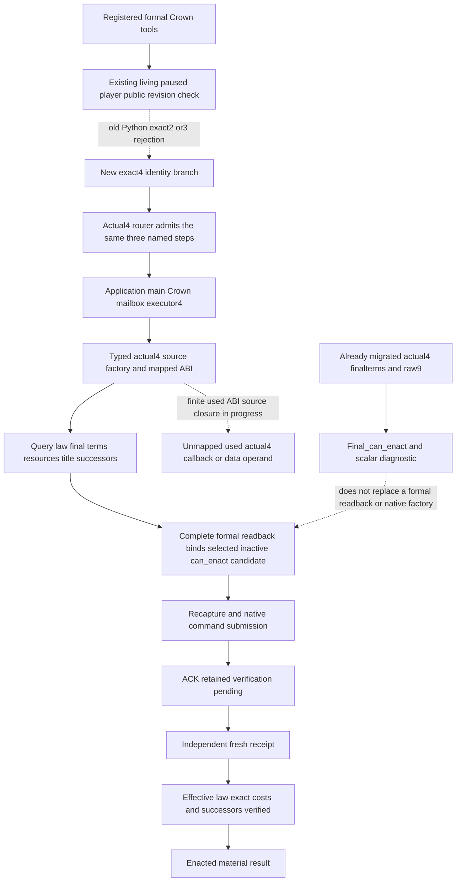
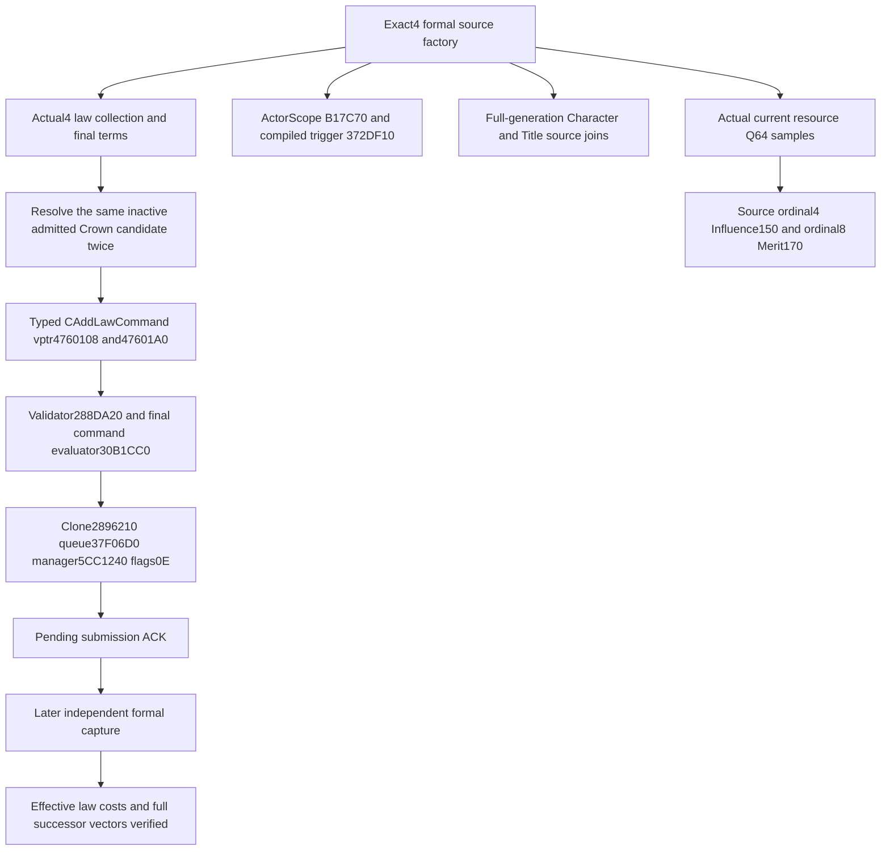

# CK3 1.20.0.4 formal Crown query, enact and receipt migration

2026-10-08 / 2026-W41. Candidate base is Root published
`a74a0d1fa4cc33f08fbfeb36de1d55efe2c38792`, exclusive tree
`Z:/gbs1-m7-formal4`. Exact game is 1.20.0.4 / Steam 25734779 /
EXE SHA-256 `98702F88A547CDE2EAF29A85F93B85F68EE4CF8148336A4F7AFAEB75319DD518`.
Root alone owns game, SDK, first build/test and integration.

## Concrete omitted production path

The registered formal tools exist behind the existing crown-action flag:
query-realm-law-crown-action-v1-private, enact-realm-law-crown-v1-private,
verify-realm-law-crown-v1-private. The Python transport's shared paused
check accepts only exact 1.20.0.2/1.20.0.3 and rejects actual4 before send.
This is separate from the already migrated actual4 final-terms/raw9 read.

The native source independently confirms the omitted branch. Legacy
action_mailbox Bind hardcodes the old2 executable SHA and old2 final/mutation
binders. Its handler checks old2 ABI/SHA. Its source adapter and components
binders also admit only old2. Actual4 router classification and executor
population include the final-terms read but exclude the three formal steps.
Registering Python tool names does not supply an actual4 action factory.

The existing formal native algorithms capture laws/resources/successors,
recapture before submit, submit at most one pending native command and
verify a later independent receipt. Queue ACK is not enactment. Reuse those
value algorithms and lifetime semantics; replace only actual native identity,
function/data bindings, typed source factory and dispatch for this omitted
three-entry path. Existing historical receipts and accepted migration211
remain their original scope; this package does not reopen their whole inventory.

The authoritative negative-source packet is
`Z:/ck3_mod_rewrite_process_assets/g2-background-20261008/m7-fresh-paused-retry-recipe04/native-factory/`.
FACTORY-STATUS.json and SOURCE-FINDINGS retain exact current source anchors.
Its inspection used source only: no game, EXE, process, import, build or test.

## Minimum implementation boundary before code

The source mapper owns only callbacks/data operands used by the formal
factory, mutation, components, command and source captures. Reuse already
closed exact4 same-function receipts; a missing used operand requires a
finite source-reached mapping, never an address delta or an old-hash alias.
The actual used-ABI ledger and mapped evidence will be appended here before
those native bindings are implemented.

Dedicated actual4 source adapter and action-mailbox TUs retain the three
existing step strings and reuse pointer-free DTO/value algorithms. The
actual4 router assigns ExecuteRealmLawPrivateAction12004 and dispatches
HandleRealmLawPrivate12004. The old2/3 branches are preserved. Python's only
new identity is CK3_12004; existing paused/player/revision and full-readback
semantics remain. No CanSend field, clock cadence API, calendar deadline,
raw absence gate or generic migration audit is added.

The single new native whole fixture must exercise production actual4 source
factory/query/submit/receipt, keeping native callback/memory/scheduler
substitutions explicit. The one new registered-Service compound exercises
the actual Python registration/transport path and existing checks. Both are
AUTHORED_NOTRUN until Root's unique FIRST. All historical six raw-clock
fixtures and accepted suites are reused without rerunning. Real paused
law execution and independent material receipt remain a later Root action.

## Actual4 direct-command source closure

The source-first seals reside under the active external packet
`Z:/ck3_mod_rewrite_process_assets/g2-background-20261008/m7-formal-crown-12004-migration/abi-map/`.
`FUNCTIONS01-SOURCE.json`, `CLOSED-SUBSET05.json` and
`GUARD06-SOURCE-SEAL.json` precede the corresponding native implementation.
The actual4 validator is `288DA20`, clone `2896210`, executor `288D990`,
and the mutation constructor/select/apply/finalize are
`28A94D0/28A96C0/28A9770/28A9570`. The command's constructor/clone source
and six actual pointer entries prove primary vptr `4760108` and secondary
vptr `47601A0`; the exact RTTI name is `CAddLawCommand`. The shared queue
`37F06D0`, embedded manager `5CC1240` and deleting destructor `9D1560`
are reused from their already closed actual4 receipts.

The new direct-command manifest is
`ck3_12004_realm_law_enact_mutation_abi.json`, SHA-256
`0B16BD06DA28B553E6243721F88FF24CC6BF10290A903F963E01A150564B6319`.
It contains fourteen instruction spans, six relative edges, six command
pointer entries and one RTTI string. The production formal source/mailbox
submits the typed command directly; it never constructs the GUI popup or
calls its confirm wrapper. Therefore the popup-only spans, two popup vtable
entries and popup RTTI from the legacy verifier are outside this factory's
dependencies. The full seventeen-span mapping is retained as source
provenance, and the historical old2 verifier remains unchanged.

The component factory independently binds actual actor scope `B17C70`,
compiled trigger `372DF10` and the already mapped scope destructors
`889700/889780`. It reuses pointer-free component evaluation algorithms.
Actual4 final-term collection and permission remain supplied by the
already migrated actual4 law binder, including its internal affordability
call; this source adapter adds no separate affordability callback.

The direct-command source checkpoint's fresh cost was 4,629 physical EXE bytes in
33 reads: old3 2,264 and actual4 2,365. Code contributes 4,100 bytes,
command pointer data 56, RTTI/COL/name 45 and the actor-scope pair 428.
The first failed metadata-key attempt's sixteen bytes are counted once and
reused; all reused shared packets contribute zero new EXE bytes. This
cost is the finite mapping ledger, not a whole-EXE scan or hash.

## Shared physical field joins

`FIELD12-LEDGER.json` and `HOLDER12-HELD-REUSE.json` join the actual4
primary-title getter `289DA10`, Character law/land `1C0`, held ID vector
`1E0/1EC`, Title full ID `10`, successor vector `150/158/15C` and holder
DWORD `128`. The holder proof reuses the existing complete172-byte
ProvinceHolder pair from
`upstream-build-migration/army-family-12004/commander-supply/domain-scoped06/provinceholder_247D030-DETAIL.json`:
actual instruction `247D0AE` reads DWORD from the already resolved Title
at `+128`. The FullCampaign subtype30/32 comment is not used as this proof.

The Activity resource getter pair proves Character extension `1B0`, Gold
Q64 `100` and Prestige Q64 `130`. The actual4 snapshot foundation names
`full-snapshot-core-fields/RESOURCE-FAMILY-STRESS-MAP.json`, which proves
Piety Q64 `110` at actual `310E853`, after extension read `310E847`.
The final `RESOURCE14-SOURCE-SEAL.json` and `FIELD14-CLOSED-LEDGER.json`
close Influence ordinal4 to Q64 `150` and Merit ordinal8 to Q64 `170`.
Actual switch `310E78A` references the ten-DWORD table `310ED8C`.
Ordinal4 selects `310EAF1`, whose paired22-byte prefix reaches balance
block `310EB07`; ordinal8 selects `310EBDB`, whose prefix reaches
`310EBF1`. The actual balance loads are `310EB13/310EBFD`. Both paired
47-byte balance windows match the retained named old3 ABI hashes; the
switch and all ten function-relative table targets agree. This qualifies
the raw resource source roles and does not execute or independently bind
the full affordability callback.

The final used source ledger accounts for 4,832 unique physical bytes in
39 reads: old3 2,467 and actual4 2,365. All required formal source fields
are closed. Shared fields, queue/destructor, PrimaryTitle and the holder
body are reused with zero new capture credit. The immutable direct-command
manifest's digest and fourteen/six/six/one dimensions are unchanged.

## Integration and unique FIRST

The new native whole target/CTest is
`xar_ck3_12004_realm_law_formal_whole_test`. It links the production
actual4 source, mailbox, command and verifier under the existing
`XAR_CK3_ENABLE_G2_REALM_LAW_ENACT_PRIVATE_V1=ON` flag. It produces four
complete protocol envelopes for query, submitted ACK, unchanged fresh
receipt and independently enacted receipt. Native function, fake memory
and scheduler substitutions remain explicit; they do not represent a
loaded game or real law enactment.

The sole registered-Service compound is
`test_realm_law_formal_registered_12004.py::test_actual4_registered_formal_guard_query_enact_independent_receipt`.
It consumes those newly compiled envelopes using
`CK3_M7_FORMAL_NATIVE_WIRE_DIR` through the real registered FastMCP,
Driver and transport path. It verifies the omitted old acceptance set's
rejection, the exact4 restored path, unchanged actor/paused/revision checks
and independent material receipt. The endpoint is synthetic; native ABI
source mapping remains separately recorded; the whole fixture explicitly
substitutes signature admission and native callbacks. Both FIRSTs remain
NOTRUN in this private candidate and are owned by Root.
