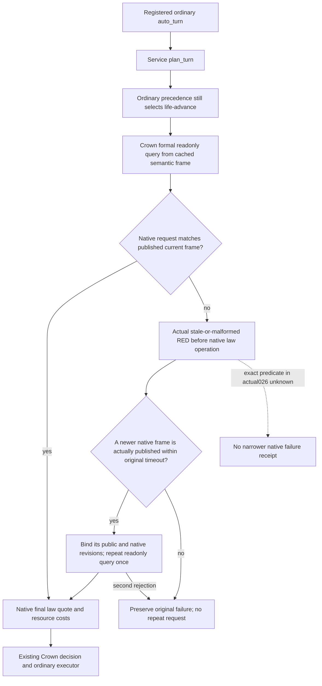

# Crown readonly query recovery on a published newer frame

## Actual trigger and native branch

The ordinary `normal026` call on SDK source
`f9820ecead8be1b9597f710bae34c7ab421136c6`, with qualified Native60
`30605664d00c845b4fa7a736d157903169a1e70b`, returned
`private crown-law native RED: nonwar private snapshot revision is stale or malformed`.
Root retained the actual 579-byte error and timing (196.421917 seconds) under
`D:/codex-ck3-background-spill/r0084-hot03-normal026-diagnosis`.
This source package does not reread the error or the opaque Driver state.

The exact-build branch in `native_bridge/src/bridge.cpp` rejects the request
before `HandleNonwarPrivate12002` when parsing fails, the expected native
revision is zero/differs, there is no previous snapshot, the current snapshot
cannot be read, or it differs from the published previous snapshot. The shared
error does not identify which predicate failed in normal026. There is no
evidence that the request used a public revision as a native revision:
`realm_law_formal_private_transport._send` already sends `before.native_revision`.

`auto_turn` evaluates `plan_turn` before entering `_execute_planned_turn`.
The Crown consumer's first formal query was not covered by its later optional
cooldown-query exception handler. Consequently this read failure stopped the
ordinary call before action execution. Existing Council source and its focused
regression already demonstrate an analogous native stale rejection followed by
a published newer observer frame; that precedent is reused without replaying it.

## Minimal source change

Only `realm_law_formal_private_transport.py` changes in production. It uses the
existing internal semantic snapshot for frame fields rather than exporting and
copying command history. Only the formal readonly QUERY's exact native stale
error is classified for recovery. The query waits through the existing native
state `wait_for_public_change` primitive and requires an actually newer native
revision before issuing one replacement readonly query. Both attempts and the
wait share the original timeout; the returned quote records its actual rebound
public/native revisions. Every successful quote still passes the existing full
native payload, paused actor/date, build, cost and candidate validation.

Other native errors, malformed responses, submission and receipt behavior are
unchanged. This is not replay of normal026, a blind live retry, a law enactment,
or a new policy/clock/schema/permission gate. A newly bound read can inform the
existing ordinary policy; final permission, costs and independent material
receipt still belong to their existing paths.

## Qualification boundary

The focused new registered Service/MCP regression uses explicitly synthetic
paused frames and source-shaped quote envelopes to reproduce the rejected old
native revision and subsequent observer publication. It reaches the actual
ordinary planning/Crown/Driver transport path; the external executor is a spy.
It also retains failures when no newer native frame appears, a different native
error occurs, or the second read is rejected. No existing native producer,
calendar policy, speed5 qualification or live query is replayed.

Author status: `SOURCE_READY / ROOT_FIRST_NOTRUN`. No author tests, project
imports, build, EXE/bin reads, hashes, SDK/Game calls or actions. No M7,
birth, natural succession or G2 completion credit. Root owns the sole focused
FIRST, integration and next same-game SDK deployment. Root's fresh post-error
snapshot separately reported public14/native59/raw53289504/pausedtrue; that
observation is not evidence of which native rejection predicate fired.
