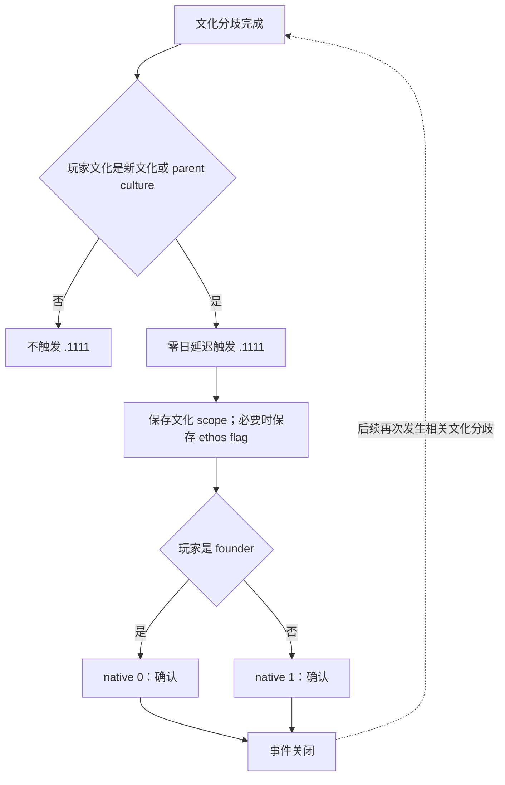

# CK3 1.19.0.6 `culture_notification.1111` 文化分歧通知决策树

## 状态与证据边界

- [static-confirmed] 本专题只绑定 CK3 `1.19.0.6` 与 `ck3.exe` SHA-256
  `2D00FF3101EF70B566F2FCBAE292F09263199C80E9DC8F139B82D7D96F83DB86`。
- [production-live primitive] R420 attempt 01 在 PID `197452`、connection generation `1` 首次遇到 instance
  `1111`，以 authored `2` / native `1` 完成选择；snapshot `native:1481 -> native:1482`、revision
  `1482 -> 1483`，`postcondition_verified=true`。
- [paused live RED retained] 同一进程和产品窗口随后在 date raw `54251808` 实见第二个合法 instance `1113`。
  旧合同的 `max_occurrences=1` 在动作前阻断；当前帧保持暂停，未提交坐标、OCR 或 console 动作。

日期、人物 ID、instance 与 PID 只属于 observation。通用合同只保留可复用的五 scope 形状、非 founder 投影、
authored `2` / native `1` 路线与产品观察窗内可重复语义。

## 原版入口与决策树

每次文化分歧完成时，原版 `culture_on_actions.txt` 都会遍历玩家。玩家文化若等于新文化或其任一 parent culture，
caller 会以零日延迟触发 `.1111`；源码没有 one-shot 或 cooldown 条件。因此同一玩家在长局内经历多个相关文化分歧时，
重复收到该通知是正常原版行为。

事件保存 `founder`、`parent_culture_1`、`new_culture` 与 `parent_1`；新旧 ethos 不同时，`immediate` 再保存
`ethos` flag。两项 authored option 互斥：玩家是 founder 时显示 native `0`，否则显示 native `1`。二者都只有同一个
`culture_notification_tooltip`，没有 scripted gameplay effect，也没有 `after`。

## 有界续跑策略

当前产品合同绑定 R420 实见的非 founder 投影：

1. root 必须是当前玩家；
2. `founder` 必须是另一名 Character；`parent_culture_1`、`new_culture`、`parent_1` 必须是 culture；
   `ethos` 必须是 flag；
3. snapshot 必须保留两个 authored option，但 rendered native option 必须精确为 `(1,)`；
4. 选择 authored `2` / native `1`，并以旧 instance 消失或前进作为 GREEN。

R420 两次实例相隔 `26280` raw hours，即 `1095` 天。源码允许不同文化分歧独立触发，因此旧
`max_occurrences=1` 改为 `repeatable-within-product-observation-window`。这项修改只解除已经实证的重复通知 blocker；
若未来出现 founder 投影，仍须先按其 exact scope/option 形状建立独立可复用分支。

## 证据

- 原版事件：`Crusader Kings III/game/events/culture_events/culture_notification_events.txt:161-262`，SHA-256
  `875A91E2E308DCFB15AD8DD99D267F721985798FB6B6AD0E605011FE1AB9AC8F`。
- 原版 caller：`Crusader Kings III/game/common/on_action/culture_on_actions.txt:237-255`，SHA-256
  `68E4ECC075A7D3D91FB2FD46A9A1C0C3FEE12D07E018E6E2A01E533013F6C91F`。
- R420 attempt 01 汇总 artifact：
  `_runtime/p1-b1-recovery-r420-20260911/live-artifacts/terminal-stages-red-attempt-01.json`，SHA-256
  `70B27E1064482C11FAE20CB730ED255755BDC5B70F1EAD1C048209EB31806866`。
- 可移植合同与 analysis：
  `ck3_autonomous_player/src/xar_autoplayer/vanilla_events/records_embedded_a.py` 与
  `records_analysis_embedded_a.py`。
