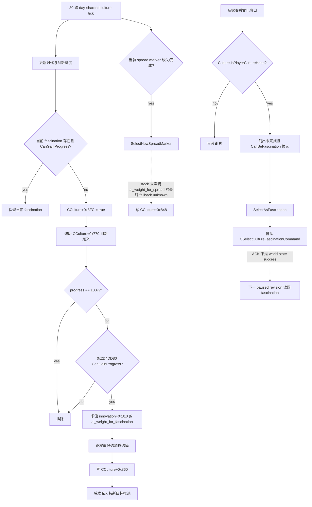

# 文化、时代与创新：原生 AI 决策树和 CULTURE1 施工边界

## 状态与范围

- **工作包**：`G2-M6-CULTURE1-NATIVE-TREE`。
- **证据状态**：`static-confirmed`。本文冻结原版脚本、GUI 反射注册和 exact-build EXE；没有启动 CK3，也没有 paused live artifact。
- **游戏构建**：CK3 `1.19.0.6`。
- **EXE**：`Crusader Kings III/binaries/ck3.exe`，95,206,008 bytes，SHA-256
  `2D00FF3101EF70B566F2FCBAE292F09263199C80E9DC8F139B82D7D96F83DB86`。
- **目标场景**：玩家是文化领袖时，自动玩家能够发现可选择的文化迷恋、判断研究进度和合法性、选择一个服务于整局目标的创新，并从下一 paused revision 验证选择结果；玩家不是文化领袖时只观察，不伪造动作能力。
- **明确非目标**：本工作包不修改 bridge、CMake、公共 schema 或 planner；不实现文化分化、文化融合、传统替换；不展开信仰、教义或宗教改革；不把 GUI 点击坐标当成通用能力。
- **当前结论**：原版定义和 EXE 已足够施工第一个只读 observer。动作提交路径已定位，但必须等只读字段取得 paused-live 证据以后再实现，命令 ACK 不能代替后置状态。

本文沿用本目录的证据分级：`static-confirmed` 表示 1.19.0.6 文件或 EXE 直接支持；`inference` 表示多项静态事实共同支持但仍缺运行互证；`unknown` 只保留尚未闭合的引擎内部语义。

## Exact-build 证据账本

完整文件哈希、108 项清单统计、原生字串和机器码锚点保存在
`ck3_autonomous_player/native_bridge/research/culture_innovation_v1_abi.json`，并由同目录的
`culture_innovation_v1_source_contract.py` 重算。核心来源如下：

| 资产 | SHA-256 | 直接支持的结论 |
|---|---|---|
| `common/culture/innovations/_culture_innovations.info` | `6D804E83024FCC2AECB9BD6B1CDD52D5000AA59A14E557FA4E92D2AAB96C623E` | innovation schema、文化领袖 skill、spread/fascination AI 权重、`potential` 与 `can_progress` 语义 |
| 九个 `common/culture/innovations/*.txt` 定义文件 | 逐文件见 JSON | 108 个创新、时代/组/skill 分布、所有原版 fascination 权重和地区/DLC 门 |
| `common/culture/eras/_culture_eras.info` | `0525CC5CAACEC73FE2612302785A88B2802F8167FB7573CE84D38FDC6D1556B9` | 时代开始年、政府禁用和时代解锁展示字段 |
| `common/culture/eras/00_culture_eras.txt` | `F1A99261B3F2F3A7428BA779BB8B3F04D5C7B190E270561D15E33006892C4FAE` | 四时代年份和非部落时代的政府门 |
| `common/defines/00_defines.txt` | `C1ECA141C71EC1E741CA5336E01BB538EEFAEC05B0684EDEC477CFC9053C3807` | 时代推进阈值、创新进度概率与进度量基础参数 |
| `gui/window_culture.gui` | `1584484A03402CC3CDD37F261391FA3F2F55EA3CBC3558C49D82493DECCC4569` | 列表、只读状态、合法性和 `SelectAsFascination` 动作入口 |

`_culture_innovations.info:6,23-49,75-79` 明确说明：文化通过时代与文化领袖的相应 skill 推进创新；`ai_weight_for_spread` 的 root 是文化领袖；`ai_weight_for_fascination` 的 root 是文化、`scope:character` 是文化领袖；`potential` 为 false 时不显示，`can_progress` 为 false 时不能推进。

四个时代在 `00_culture_eras.txt:2-88` 中依次从 0、900、1050、1200 年开始。early/high/late 都把 tribal、nomad、herder、wanua 政府列为 invalid。时代年份只是开始获得基础传播的必要输入，不等于某文化已经进入该时代。

## 原版创新清单与迷恋权重

focused verifier 对九个定义文件做顶层语法切片，结果为：

| 维度 | 1.19.0.6 结果 |
|---|---|
| 创新总数 | 108 |
| 时代 | tribal 38；early 23；high 23；late 24 |
| 组 | civic 56；military 52 |
| 文化领袖 skill | diplomacy 16；martial 33；stewardship 39；intrigue 1；learning 19 |
| 有 `ai_weight_for_fascination` | 108 |
| 有 `ai_weight_for_spread` | 0 |
| 有 `potential` | 32 |
| 有额外 `can_progress` | 3：`innovation_french_peerage`、`innovation_rocket_cart`、`innovation_composite_crossbow` |

108 个 fascination 权重只有四种模板：

| 模板 | 数量 | 行为 |
|---|---:|---|
| `value = 100` | 37 | 无额外时代乘零 |
| early `100`，未进入 early 时乘 `0` | 23 | 当前文化时代门 |
| high `100`，未进入 high 时乘 `0` | 24 | 当前文化时代门 |
| late `100`，未进入 late 时乘 `0` | 24 | 当前文化时代门 |

这里有一个需要显式保留的例外：`tgp_innovations.txt:627-646` 的 `innovation_tiefutu` 声明为 tribal innovation，但 fascination 权重在未进入 high medieval 时乘零。除这个跨时代门外，脚本没有按经济、军事、继承、人物性格或当前局势给可用创新不同权重。

因此，原版 AI 的 fascination 权重只能作为“可选/不可选”的静态参考，不能直接成为我们的治理策略。完整游玩至少要把候选解锁的真实价值、剩余完成时间和当前局面加入评分。可供首个治理 allowlist 审阅的明显入口包括：

- 防御与攻城：`innovation_motte`、`innovation_battlements`、`innovation_hoardings`、`innovation_machicolations`、`innovation_gunpowder`；定义起点分别见 tribal `:45`、early `:41`、high `:43`、late `:42,65`。
- 继承与法律：`innovation_hereditary_rule`、`innovation_royal_prerogative`、`innovation_primogeniture`；见 early `:252,357`、late `:220`。
- 经济与建造：`innovation_manorialism`、`innovation_windmills`、`innovation_guilds`、`innovation_cranes`；见 early `:276`、high `:248,367`、late `:247`。

这些名称只是策略候选入口。本文没有把 tooltip 描述自动换算为跨版本效用，也没有把 DLC/政府限定收益伪装成普遍收益。

## 时代与创新研究的原生推进

`00_defines.txt:1103-1142` 给出基础参数：

- 进入下一时代需要至少 8 个创新；时代基础月进度为 0.1，每点文化县平均发展度再加 0.05。
- 创新基础推进概率为 5；邻近文化传播加 40；当前 fascination 基础加 10，文化领袖 skill 相关加成的上限为 45。
- 创新单次基础进度为 0.3，每点文化县平均发展度再加 0.02；超前或落后时代还有单独乘除规则。

这些 define 描述组成部分，不能代替引擎最终值。人物 modifier、文化接受度、spread 与 fascination 同时存在时的倍率、超前创新惩罚都会改变结果。observer 必须读引擎最终 `CanGainProgress` 和实际 progress，planner 才能估计完成时间。

EXE `0x2714E60-0x2715153` 根据日期选择 30 个文化更新桶之一，再对该桶内文化调用 `0x22C07A0`。这是“每个文化约每月一次”的 day-sharded 调度证据；具体文化落在哪个日槽不应进入公共合同。

在文化 tick 内：

- 当前 fascination 缺失或已经不能推进时，`0x22C06CD-0x22C070C` 把 `CCulture+0x8FC` 置为需要重选。
- `0x22C0961-0x22C0975` 只在该标志为真时调用 `SelectFascinationInternal 0x22C4FC0`。因此原生流程不会在每个月无条件随机换目标。
- `0x22C4FC0-0x22C537D` 遍历 `CCulture+0x770` 的创新定义，排除进度为 100% 的项目，调用 `0x2D4DD80` 检查可推进性，在定义对象 `+0x310` 求值 `ai_weight_for_fascination`，加权选择后写入 `CCulture+0x860`。
- 载入/初始化路径 `0x204E1B0-0x204EBCA` 也会为文化建立传播与 fascination 状态；它不证明日常重选频率。

传播目标由 `SelectNewSpreadMarker 0x22C3E30` 使用独立候选/权重容器选择并写入 `CCulture+0x848`。所有 108 个 stock definition 都没有覆盖 `ai_weight_for_spread`。schema 没有声明默认值，所以“缺省 spread 权重究竟是多少”保持 `unknown`；不能擅自写成 1、100 或均匀随机。

## 原版决策树

实线是 exact-build 静态证据已经闭合的分支；虚线只保留仍需实机或更深调用链才能确定的部分。



## 机会发现、费用、动作与后置验证

`window_culture.gui:817,1285-1312` 从 `CultureWindow.GetCultureEras` 展开时代、组和创新。候选按钮的实际门如下：

- `:1352`：不是玩家文化领袖，或创新已经 active 时，显示不可点击版本。
- `:1612-1616`：玩家是该文化的文化领袖且创新未 active 时显示可点击版本；`CanBeFascination` 控制 enabled；`SelectAsFascination` 提交动作；`IsFascination` 给出按下状态。
- `:2140-2191`：`CanGainProgress` 和 `GetProgress` 驱动进度显示。
- `:2506-2562`：`HasSpreadMarker` 与 `IsFascination` 分开显示，并能表达二者同时命中。

| 阶段 | 必须读取或执行的内容 | 结论 |
|---|---|---|
| 机会发现 | 玩家文化、文化领袖身份、当前时代/时代进度、完整创新候选、`potential/can_progress` 最终结果、当前 fascination/spread、每项 progress | 不能用“窗口能打开”或 OCR 名称代替候选合法性 |
| 费用 | `CanPlayerSetAsFascination 0x2926310` 检查定义有效、索引、未完成和最终 `CanGainProgress`；GUI 与命令构造路径未见金币、威望、虔诚或 cooldown 输入 | 当前 exact-build 下选择本身没有已发现的显式资源费用；真正代价是改选后的研究机会成本 |
| 动作 | `SelectAsFascination 0xC02860` 取 culture/innovation identity，构造 `CSelectCultureFascinationCommand`，在 `0xC028DD` 进入统一 gameplay command queue | 禁止直接改 `CCulture+0x860`；禁止把调用返回当成成功 |
| 后置验证 | 在严格晚于提交的 paused revision 读回 culture、head、current fascination 和逐项 `IsFascination` | 目标 key 相等且恰好目标项为 true 才成功；若 head 已变化或 candidate 已失效则返回明确失败 |

选择没有显式货币费用不代表可以频繁换。fascination 为某一项目增加推进概率；在项目完成前换走会改变后续研究速度。首个策略应设置“保持当前目标”的基线，只在新目标解锁关键链、当前目标已失效，或剩余时间与收益差足以覆盖机会成本时才切换。

## exact-build 只读结构与反射入口

下列偏移只对本文冻结的 EXE 有效：

| 语义 | exact-build 结构事实 |
|---|---|
| 文化时代状态 | `CCulture+0x728`，count `+0x734`，stride `0x58` |
| 创新状态 | `CCulture+0x740`，count `+0x74C`，stride `0x790` |
| 创新定义列表 | `CCulture+0x770`，count `+0x77C`，元素为定义指针 |
| spread / fascination | `CCulture+0x848` / `CCulture+0x860` |
| 文化领袖 handle | `CCulture+0x8F8` |
| fascination 需要重选 | `CCulture+0x8FC` |
| 单项文化/定义/进度 | `CCultureInnovation+0x8/+0x10/+0x18`；100% fixed point 为 `0x989680` |

核心只读方法的 exact-build 链为：

| 方法 | string RVA → registration → callback/direct |
|---|---|
| `Culture.GetCultureHead` | `0x42FECF8 -> 0x4ACCC2 -> 0x22CAC70/0x22CAC80 -> 0x22C3B60` |
| `Culture.GetFascination` | `0x42FED18 -> 0x4AD212 -> 0x22CAD50/0x22CAD60 -> 0x22C31C0` |
| `CultureInnovation.CanGainProgress` | `0x40D2688 -> 0x59919B -> 0x2D4FA10 -> 0x2D4DD80` |
| `CultureInnovation.GetProgress` | `0x40D51F0 -> 0x599289 -> 0xE37E20` |
| `CultureInnovation.GetCultureEra` | `0x4152D18 -> 0x598DD2 -> 0x2D4F980/0x2D4F990 -> 0x2D4DC60` |
| `CultureInnovation.HasSpreadMarker` | `0x4413C68 -> 0x5994F9 -> 0x2D4FB80` |
| `CultureInnovation.IsFascination` | `0x4413C78 -> 0x599679 -> 0x2D4FBC0` |
| `CultureInnovation.CanPlayerSetAsFascination` | `0x40D2498 -> 0xC039DF -> 0xC027D0 -> 0x2926310` |
| `CultureInnovation.SelectAsFascination` | `0x40D2450 -> 0xC03A90 -> 0xC02860`，再进入命令队列 |

反射方法与直接结构互相印证，但首个 reader 仍应只输出拥有稳定 identity 的复制值，不向 MCP 泄漏借用指针。

## 下一最小只读 native/MCP 切片

唯一下一施工入口是：

`implement_private_exact_build_culture_innovation_snapshot_v1_reader`

先实现 private、exact-build-bound 的 `culture_innovation_snapshot_v1`，然后做 paused-live fixture；在这两步通过以前，不改公共 schema。最小字段为：

```text
revision, game_build, exe_sha256
player_character_id
culture_id
culture_head_character_id, is_player_culture_head
current_fascination_key
eras[]: key, progress
innovations[]:
  key, era_key, group_key, skill, progress
  is_active, can_gain_progress, can_be_fascination
  is_fascination, has_spread_marker
```

这个切片能一次解除三个真实决策缺口：是否有权操作、有哪些合法目标、当前研究是否值得保持。只发布 fascination key 而候选的 `can_be_fascination` 长期为 null，仍然不能作出动作，不算完成。

P0 验收必须满足：同一 paused revision 内文化 identity、文化领袖和所有创新行一致；每个候选有非空 key、era、progress 和最终 gate；恰好零或一项 `is_fascination=true`；若有 current key，它和该行一致；EXE 哈希不符时明确拒绝读取。通过后才把对应只读查询升入 MCP。

动作 `select_culture_fascination_v1` 是下一阶段，不和只读切片混交付。其 preflight 固定为：玩家仍是文化领袖、目标未 active、目标可作 fascination、目标不是当前 fascination、revision/build pin 仍匹配。执行必须构造并排队原生命令；下一 paused revision 读回目标 key 和逐项状态。失败不得通过重写内存或 UI 点击吞掉。

## 我方 counter-policy 的最小顺序

原生树已经证明所有合法目标在脚本权重层几乎等价，我方不能把随机同权当作完整游玩策略。observer live 后的首个确定性策略可按以下顺序收口：

1. **关键链解锁**：当前 succession/law、战争攻城、防御或核心经济建造确实被某个创新阻塞时优先。
2. **可完成性**：只在 `can_be_fascination=true` 的候选中评分；结合现有 progress、文化领袖对应 skill、平均发展度和 spread marker 估计完成时间。
3. **局面收益**：和平治理优先稳定继承和收入/建造；迫近战争优先能实际改变当前军务的解锁。未实现的 tooltip 语义先用审阅过的 allowlist，不做全量自动解释。
4. **保持性**：默认保持当前目标；新目标必须超过切换阈值，避免无费用造成的频繁改选。
5. **无权动作**：玩家不是文化领袖时只记录下一次可争取文化领袖地位的长期目标，不伪造选择成功。

这是一条尽快形成可见价值的最小策略。文化融合、传统、所有 DLC 特殊创新收益可以在 production outcome 出现实际缺口后分包，不阻塞第一条 fascination OODA。

## Unknown 与 readiness

- `unknown`：stock innovation 没有任何 `ai_weight_for_spread`，schema 也没有给默认值；最终 spread fallback 尚未闭合。
- `unknown`：`CSelectCultureFascinationCommand` 的最终拒绝原因如何回到命令结果，目前没有完整链路。
- `unknown`：P0 所列偏移和反射 getter 尚未取得 paused-live 一致性 artifact；当前只能标 `static-confirmed`。
- `unknown`：DLC 特殊创新的统一收益模型；它属于后续 planner 质量，不应假装由原版权重解决。
- 非 unknown：原生 fascination 候选遍历、完成/可推进 gate、脚本权重求值、加权选择、结果字段、玩家 GUI gate 和命令排队路径均已由 exact EXE 定位。
- 非 blocker：某个文化具体位于 30 个更新桶中的哪一天。公共策略只依赖 paused revision 的状态变化，不依赖内部日槽。

当前 readiness 是 `static-ready for private P0 reader`，不是 `production-live primitive`，更不是文化玩法 complete。

### CULTURE4 集成合同

私有异步 reader 使用 application-main mailbox 固定槽位 40，即
`permitted_executor_quadragintary`。槽位 34 属于 faction gift mitigation，
槽位 35 属于 domain construction；36–39 已预留，文化集成不得覆盖这些
身份。该槽位只允许 `ExecuteCultureInnovationMailboxQueryV1`，并在 install
空值判定、environment-to-mailbox copy 和提交 allowlist 中保持同一身份。
这是 private static-ready 接线，不改变公共 MCP schema；paused-live 验收仍由
独占 CK3 负责人另行完成。

## Focused 验证

本工作包只运行与该研究切片相称的验证：

```text
py ck3_autonomous_player/native_bridge/research/culture_innovation_v1_source_contract.py --ck3-root "Z:\ck3_mod_rewrite\Crusader Kings III"
```

该命令重算 14 个 stock 文件哈希，解析 108 个创新定义和四种 fascination 权重模板，验证 GUI/define 语义 token，并逐字节核对 EXE string/机器码锚点。它不启动 CK3，不声称完成 live 验收。
