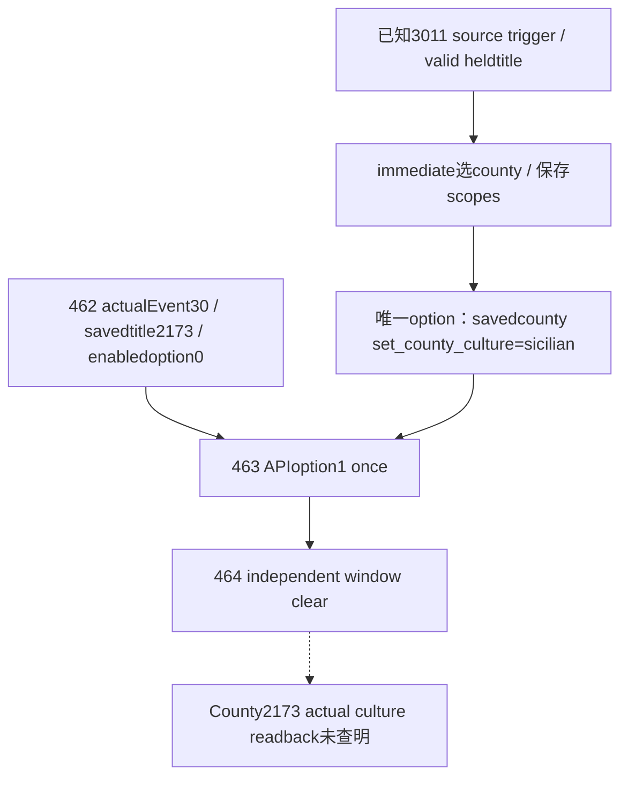

# CK3 1.20.0.3：Sicilian County转换通知global_culture.3011

## Provider192 qualified and War117 victory retained at h9390：已知源与实际Event30选择（2026-10-06T04:53:09+08:00）

Exact CK3 1.20.0.3／EXE SHA94B55397ABB687A3DCD436805A5D885E6BE90FA6C693FEB44A9E3BBEEADE02A6；只冻结Root已读取的 `game/events/global_culture_events.txt` **1040–1106行**，excerpt1453B／SHA9c423674061e719797ea47e6286045791ddc0d24d687fd18c098f9e89dd5a714，未重新hash EXE或展开其他source研究。

源是character event。Trigger检查非Sicilian、所列Latin/Berber/Byzantine/Frankish/Arabic heritage之一、至少一项valid heldtitle；valid helper内部未在本次展开。immediate按源权重选random heldtitle并保存county_to_change、old_culture、sicilian scope、设置had_sicilian_county_conversion variable；源中的debug_log此时已写“Converted”，而 **`set_county_culture=culture:sicilian` 位于随后唯一option的saved county作用域**。因此immediate/debug文本、来源效果和最终county readback应分别记录。它不会直接改root角色文化。

462 paused raw53271768／native822/public823实际为 `global_culture.3011`、instance30、saved county_to_change landed_title2173；old_culture/sicilian scope存在，generic文化identity未闭。唯一显示option原生index0、shown/enabled true，icon rows空／effect_preview unavailable，不能用UI indicator当完整effect。463只选APIoption1/native0，postcondition true、old30→newnull、sameepisode/generation1/PID69432，随后464独立snapshot active_event=null。

本分支已完成 **production-live primitive：既有stock源知情的一次选项与独立窗口消失**；尚无County2173文化的独立readback，**actual culture conversion未信用**。这不是完整generic event语义决策器，文化身份/query缺口与未来施工另按真正决策需要处理，不设新前置门禁。[stock3011 excerpt receipt](Z:/ck3_mod_rewrite_process_assets/g2-resume-20261006/event30-sicilian-source/SOURCE-EXCERPT-RECEIPT.json); [462 context](Z:/ck3_mod_rewrite_process_assets/g2-resume-20261006/gameplay-responses/462-arta-event30-current-context.json); [463 selection](Z:/ck3_mod_rewrite_process_assets/g2-resume-20261006/gameplay-responses/463-sicilian-culture-single-ack.json); [464 independent clear](Z:/ck3_mod_rewrite_process_assets/g2-resume-20261006/gameplay-responses/464-sicilian-event-independent-after-snapshot.json)。

证据全部来自已冻结source和原始462/463/464响应；本报告施工没有game／SDK／UI／Steam／binary-save读或新tests，源效果不能代替独立物质后验。
