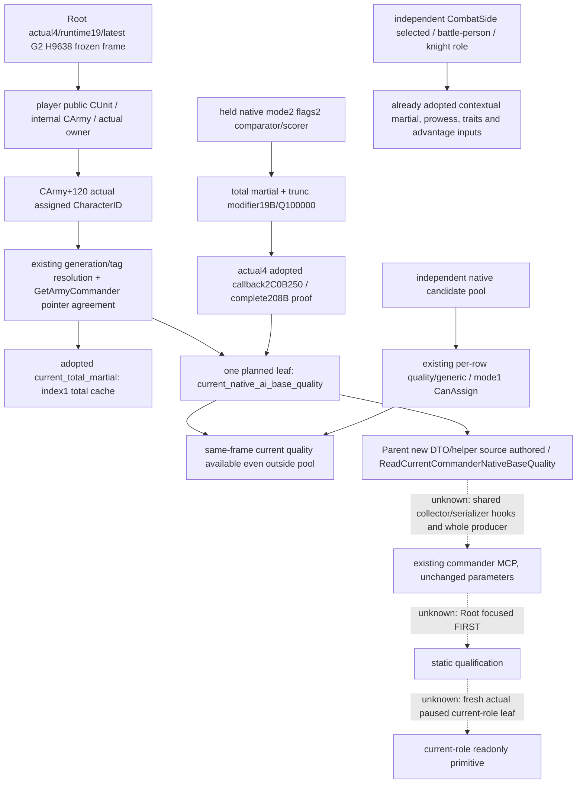
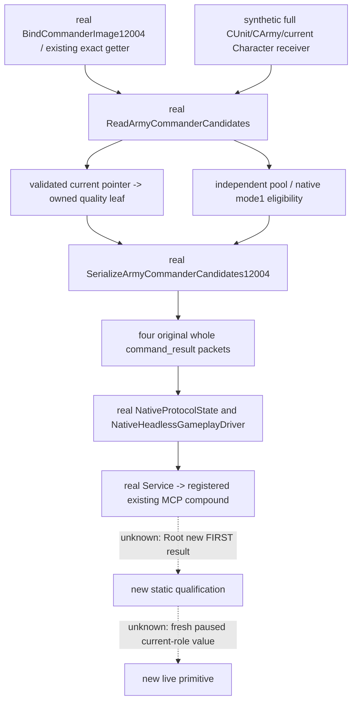

# Current assigned commander's native base quality — CK3 1.20.0.4

Actual source work: 2026-10-07, Asia/Shanghai, ISO2026-W41. Frozen source base is `14f07ade00e9ad359da3aa6af3642592ede3f48d`; source-first inventory is `Z:/ck3_mod_rewrite_process_assets/g2-parallel-20261007/commander-g2-inputs/skill-trait/SOURCE-FIRST-INVENTORY.md`. This topic is a source-closed readonly leaf plan, AUTHORED_NOTRUN. Parent owns native DTO/reader/serializer and shared integration; this child authors this topic and external ledger only. No new native/Python FIRST or live/G2 credit is claimed.

The actual runtime authority remains Root's runtime19/latest G2 H9638, public player Robert29829/date53288448. This worker reuses those supplied facts, does not query or reread live authority, and does not infer that the owner Character is the current commander. CArmy+120 is the actual assignment; candidate Character, CombatSide+74 selected Character and knight roster Character remain separate identities. Side R68 grants no G2 credit.

The native AI source precedes this input proposal. Held .3 assignment pass1A28CC0 obtains the native pool, sorts mode2 with flags2, and reaches scorer2C17B20 and comparator2C17C90. The owner martial threshold is a separate branch. Flags2 do not select the mask4 siege-score branch. The base scorer2C0B270 returns Character+DC total martial plus modifier19B Q100000 truncated toward zero. The proposed actual4 input calls the already adopted2C0B250 counterpart on the actual assigned receiver. It does not invoke AI mode2 eligibility, allocation, a command executor, skill recalculation or a writer.

This input has a concrete production gap. `ReadArmyCommanderCandidates` validates current assignment before independently iterating the candidate vector. Its current object publishes identity and adopted `current_total_martial`. Base quality and generic advantage are only on candidate rows. A valid current commander outside the candidate pool therefore has no current native rank score in this same query. Current martial alone cannot reconstruct the score without the effective modifier19B term. A synthetic example makes the consequence precise: current martial17 and native quality37 versus an eligible candidate's native quality25 yield different keep/replace comparisons if17 is incorrectly treated as the current quality. This example is a fixture plan, not an actual Robert value or implemented policy.

| Existing observation path | Already published input | Role/readiness boundary |
| --- | --- | --- |
| Same Army commander MCP current object | Actual assignment identity; adopted current total martial; associated current movement identity/rates | No current base quality/generic field when current is outside candidate pool |
| Same Army commander MCP candidate rows | Per-row native base quality, generic advantage, mode1 final CanAssign, siege modifier, optional target rolls | Candidate row membership does not define actual current assignment |
| Army strengths | Current/max soldiers, native AI power, commander supply-related input leaves | Selection quality is not a commander supply modifier |
| Target v2 commander | Actual assigned identity, generic advantage, contextual target roll/effective inputs and adopted trait-related sources | Existing explicit target/entry/ordered-participant query; not recreated |
| CombatSide/battle person/knight inputs | Selected contextual martial/advantage and effective prowess/trait/knight contributions within their adopted scopes | Reuse only with matching role and frame; no new prowess or trait mirror |

Exactly one new readonly current-role field is proposed: `current_commander.current_native_ai_base_quality`. Generic advantage, prowess and traits are not added by this package. Source-closed generic C6DED0 remains an independent final getter and cannot be relabeled as native base quality; its larger final/contextual path differs despite shared initial martial/modifier terms.

The proposed object has `status`, `source`, `source_character_id`, `value` and `unavailable_reason`. Source is `native_current_assigned_commander_ai_base_quality`. Available requires the same available current role ID and a raw signed32 getter result; legal0/negative remain values, with null reason. Absent/identity-unavailable current roles have null value, concrete existing-role reason and no extra getter call. This is field failure reporting, not a new gameplay gate. Existing candidate collection, eligibility, quality, martial, movement and target leaves retain their meanings and availability.

The minimal native seam reuses `CommanderBindings::get_native_ai_base_quality(void*)`; no new native function pointer, RVA, binding or byte-reading lane is necessary. Parent has authored three new owned native files: `include/xar_bridge/ck3_12004_current_commander_base_quality.hpp`, `src/ck3_12004_current_commander_base_quality.cpp`, and `cmake/current_commander_base_quality_12004.cmake`, under `ck3_autonomous_player/native_bridge/`. The exact API is `ReadCurrentCommanderNativeBaseQuality(int32 actual_character_id, void *validated_current_character, CurrentCommanderNativeBaseQualityReader)`, with reader typedef `int32(*)(void*)`. Its DTO has the five fields above. Native source is AUTHORED_NOTRUN; shared collector/serializer hooks and whole qualification are still Parent/Root work. The appended optional leaf retains older omission/null compatibility. The same existing `ck3_query_army_commander_candidates_v1(army_id, expected_revision, target_province_id)` and native mailbox route are reused; no new parameter, schema family, transport or capability is needed. Optional target parameter remains optional.

The owned source integration point is the current validated branch at `ck3_12003_commander.cpp:230..238`, before the independent candidate loop. The current source's binding presence checks remain as they are; this plan does not recast an existing whole-query unavailable result as a successful collection. The current identity/Army back-links remain checked by the existing collector tail. Serialization stays in the current object; actual4 whole serializer already wraps the common reader DTO. Python's current-role normalization should bind the new optional object to the existing current role, retaining older omission/explicit null without replacing candidate rows.

A focused future whole fixture should exercise the production ReadArmyCommanderCandidates and complete actual4 serializer with synthetic raw storage and explicit callback provenance. Suggested new scenes are current outside pool with quality37/martial17 and an eligible candidate quality25; current raw0 and raw−7 as separate packets; current absent with no additional quality read; and legacy observer omission. One sole registered Service/MCP method should consume the original whole packets with initialized production driver/state/history and a synthetic paused transport boundary. Assertions focus on this new leaf and unchanged old fields/getter counts. The candidate quality callback count remains its old N calls, plus one call on the validated current receiver when enabled/available; no selected or candidate substitute is permitted. These scenes are proposals awaiting Parent's final fixture freeze, not executed qualification or mandatory reruns of old closure.

The exact actual4 proof is the adopted support ledger `native_bridge/research/ck3_1_20_0_4_army_support.json:395..408`: old2C0B270→new2C0B250, full208 logical/code bytes, complete normalized span equal and whole local topology equal. Old logical end is2C0B340; new end is2C0B320. The old pin includes the fragmented .pdata span and is not truncated at its first fragment. Under the same finite mapper, external callees are not expanded; the existing source-adopted callback and aggregator28C3AC0/modifier reader23036E0 are reused within their established contracts.

Exact cached proof locators are:

- Old semantic/native AI pins: `docs/ck3-native-ai/commander-candidates-and-assignment-12003.md:59..61`, `native_bridge/research/commander12003_abi.json:52..63`, `native_bridge/research/commander12003_source_pins.json:378..400`.
- Held full old getter source: `Z:/ck3_mod_rewrite_process_assets/g2-resume-20261003/commander-native-candidates/pin-disasm-0x2c0b270.json`; AI scorer/comparator pins are in that directory's `SOURCE-PINS.json` at2C17B20/2C17C90.
- Actual4 proof detail: `Z:/ck3_mod_rewrite_process_assets/g2-background-20261007/upstream-build-migration/army-family-12004/commander-supply/support-first01/support_2C0B270-DETAIL.json`.
- Old cache locator: `Z:/ck3_mod_rewrite_process_assets/g2-background-20261007/upstream-build-migration/army-family-12004/commander-supply/cache-old-02C0B270-02C0B340.bin`.
- New cache locator: `Z:/ck3_mod_rewrite_process_assets/g2-background-20261007/upstream-build-migration/shared-span-cache/new-02C0B250-02C0B320.bin`.
- Adopted actual4 binder: `native_bridge/src/ck3_12004_army_support.cpp:208..229`; whole mailbox dispatch/serializer: `native_bridge/src/ck3_12003_commander_mailbox.cpp:139..148,193..204`.
- Strict/source chain: `bridge/army_commander_candidates.py:125..147`, Service normalization at `bridge/service.py:4372`, registered tool at `bridge/mcp_server.py:2575`.

Paths beginning native_bridge or bridge above are relative to `ck3_autonomous_player/` and `ck3_autonomous_player/src/xar_autoplayer/`, respectively. Cache files are locators only and were not opened, rehashed or reread as binary by this worker. No EXE/native byte extraction, project import, test/build/game/SDK/process action or Git operation is performed.

Initial packet readiness was source-closed research/AUTHORED_NOTRUN, including Parent's three authored native helper/DTO/CMake files. The subsequent whole-query source package is recorded below. The old874 martial/traits and current adopted phase/target inputs keep their existing evidence; no migration GREEN retest is requested. This input adds no game days, assignment, battle outcome, complete OODA or G2 credit.

## Whole query FIRST source package

The follow-up package pins Root `2a9eadce8f96c886aa62759c1a001658413f49f4`, after freeze20 `276533140b4b1dc8f46add1ab582fcf2fe061f58`. It linearly incorporates `1bb7035abb3285cf5539deddedcfa3546f5a0652` and applies the six integration hooks exactly once in the independent `commander-quality-first` tree. Root's tree is untouched. The initial14f source ledger and native tree above retain their historical pins; this update neither rereads the208B getter nor claims full actual4 AI parity.

The authored producer `src/ck3_12004_current_commander_base_quality_test.cpp` uses target `xar_ck3_12004_current_commander_base_quality_test`. Its four complete production packets cover current outside the pool, legal zero, unavailable current identity, and a comparison where the current character appears in the pool with mode1 `can_assign=false`. Synthetic native snapshot11/query7/date53288448/public revision4 are fixture data. CUnit83886367 and CArmy50331794 retain their storage generations; owner29829 is distinct from current30000. Receiver-count assertions keep current quality37 separate from current martial17, generic9 and candidate25. Callbacks are offline fixture boundaries rather than game-RVA execution.

The sole consumer is `CurrentCommanderNativeAiBaseQualityServiceTests.test_whole_native_query_registered_mcp_compound`, in `tests/test_current_commander_native_ai_base_quality_service_12004.py`. Production protocol state/driver ingestion supplies scope and history. The existing registered MCP invokes the real Service; transport only correlates request identity. The test consumes the original whole producer result rather than fabricated result JSON or a standalone-normalizer substitute.

The owned CMake fragment includes after `adopted_domains_12004.cmake`, adds the quality helper to the genuine runtime and links the one new fixture TU with the established `xar_ck3_12004_fixture_use_real_bridge` closure. Runtime/protocol/Bridge providers are reused, without stubs or new provider replacements. Actual source references to the modified header are recorded in `NATIVE-HEADER-REFERENCERS.json`; no wider ABI audit is performed.

This package remains `AUTHORED_NOTRUN`. Local CK3, SDK, input, process-query, injection and UI bans apply; this worker runs no producer, consumer, compiler or project import. The external launcher in `Z:/ck3_mod_rewrite_process_assets/g2-parallel-20261007/commander-quality-first/consumer/` takes `--source-root`, `--native-dir` and `--output-dir`. Native-dir is the directory of four original producer outputs. The launcher runs only the sole consumer after Root authorizes execution; missing inputs produce NOTRUN. Original1bb receipts remain frozen. Runtime/source20, G2 H9638 and side R68 confer no new live/G2 credit on this unexecuted package. Root owns report integration and push.
