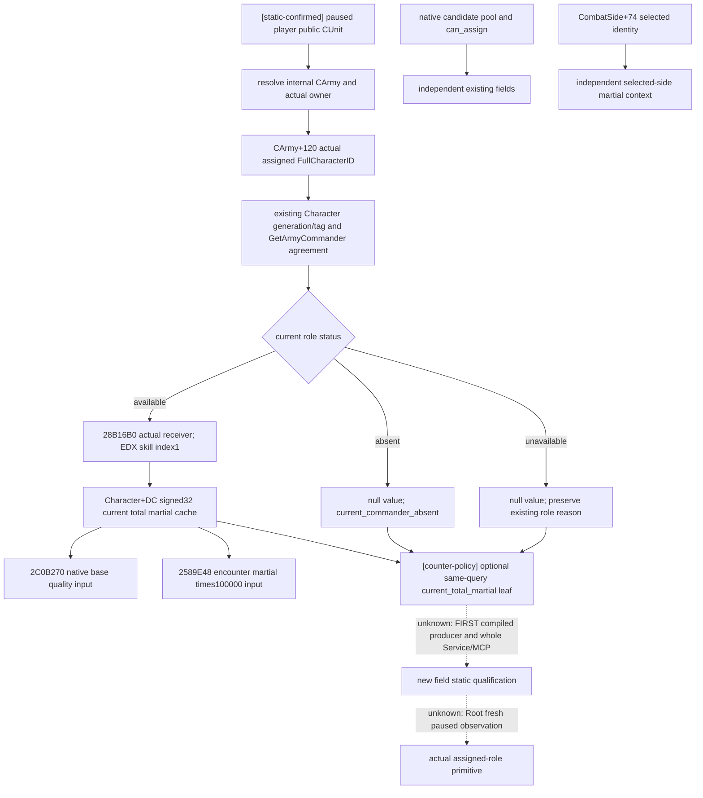

# 当前军队实际任命统帅的总军事值（1.20.0.3）

2026-10-07（Asia/Shanghai）。本增量是 **implementation candidate / research**：原生源已闭合，候选实现把当前角色技能接入既有军队查询。新 native target、CTest、完整 Service/MCP consumer、actual paused sample 均 **FIRST NOT RUN**。已有任命、selected-side martial 与 target-roll bounds 的资格沿各自专题保留，不授予本字段资格。

游戏固定为 CK3 **1.20.0.3 / Steam build 25652598**；EXE SHA-256 `94B55397ABB687A3DCD436805A5D885E6BE90FA6C693FEB44A9E3BBEEADE02A6`。只复用既有 exact-build 缓存与文件/函数 pins：没有新 EXE 读取、hash、RTTI 扫描、游戏进程访问或技能刷新。实施基线为 Root 提供的 immutable g104 source `71b729f0cc4894331f1dadb89155920fccd42a00`。

## 必要输入与已有口的范围

缺口是 **既有 `ck3_query_army_commander_candidates_v1` 当前军队角色对象内，没有直接发布实际任命者的总军事值**。查询原先发布 `current_commander.status/character_id/unavailable_reason`；候选 generic/base quality 是不同数据，不可把它直接称为军事值。

已有 contextual `effective_martial` 按实际或临时 CombatSide 的选定 Character 发布；已有 `CombatPhaseCharacterV3.martial`、phase trace/transition 字段按其战斗人物范围发布。它们都可在身份和 frame 匹配时复用。本增量没有声称全项目此前无 martial，也不将 selected-side 字段换名；它为接战前的实际 Army role 直接发布同一总技能缓存，避免为了一个 current role 值构造 target/contact context。

当前 source census 中，v2/v3 simulation MCP 要求 target、entry 和双方有序 Army lists，actual phase trace 要求 CombatID；Council main-skill projection 为 stewardship/diplomacy/intrigue/learning，无 martial position。此字段可支持当前实际任命者的技能基线与质量解释；它不是新增全局 gameplay 门禁，不产生 target-specific ranking 或任命资格。

## 原生树与缓存语义

Getter ABI 是 `std::int32_t (*)(void*, std::int32_t)`：Win64 `RCX` 为已验证的实际当前 Character pointer，`EDX=1` 为军事技能枚举。RVA **`0x28B16B0`** 的完整缓存体为 90 bytes，end-exclusive **`0x28B170A`**。常量 index1 经过 unsigned `<6` 分支，`0x28B16F8` 读取 `[rcx + index*4 + 0xD8]`，得到 **`Character+0xDC`**，至 `0x28B1709 ret` 返回。无效 index 的诊断分支不属于本常量调用。

这是**当前总技能缓存**，不是 base martial `Character+0xC4`。返回值保持 signed32，合法0、负值按原值发布，不猜 clamp/上限，不从 generic quality、特质图标或 selected-side total 倒推。原生 `2C0B270` 使用该 martial 加截零的 modifier19B；`2589E48` 使用 martial×100000 作为 contribution 起点，这证明它是原生决策输入。特质与 modifier 的完整来源归因仍独立。

只读查询不会调用 `force_character_skill_recalculation`、`28C3BC0` 或任何技能/任命 writer。后续引擎或 modifier 变化可改变缓存；本字段不承诺未来值，也不驱动刷新。实际 Army+120、候选身份、CombatSide+74 selected identity 是三个独立事实。

## 候选接口合同

同一 registered MCP `ck3_query_army_commander_candidates_v1`、原 GameplayBridgeService/NativeHeadlessGameplayDriver route 保留；无新增参数、transport branch 或 MCP 名称。候选实现增加 `current_commander.current_total_martial` optional leaf：

| 字段 | 语义 |
| --- | --- |
| `status` | `available` / `unavailable`，独立于 candidate pool availability |
| `source` | 固定 `native_current_assigned_commander_total_skill_cache` |
| `source_character_id` | 当前实际 Army role 的 Character ID；canonical absent 时 null |
| `skill_index` | integer1，不能把 Boolean 当整数 |
| `value` | success signed32；failure null |
| `unavailable_reason` | success null；failure 非空原因 |

Parent envelope already provides paused date/revision/public CUnit/native CArmy/owner。available leaf 必须绑定 available current role 的同一 ID；不接受 candidate 或 selected-side 替身。role absent 输出 `current_commander_absent` 且不调用 getter；role unavailable 沿既有角色原因；role identity available 但新 callback 缺失输出 `current_commander_skill_reader_unavailable`。该 leaf 的失败不抹去 collection、final eligibility、generic/base quality、movement 或 target-roll fields，也不收紧旧 top-level availability。

新的 DTO 和 bindings members 均追加在旧 aggregate 尾部。`current_total_martial_observer_enabled` 默认 false，维持旧 prefix-only fixtures / bindings 的 omission；exact `.3` `BindCommanderImage` 将它设为 true，并绑定 `get_current_total_skill`。enabled=true 但 callback 缺失是新 leaf unavailable，不是 omission 或合法0。Python strict projection 区分 missing / explicit null / present leaf，保留 legacy missing/null 兼容。

## FIRST producer 与 sole complete consumer（全部未运行）

新 native fixture 必须通过生产 `ReadArmyCommanderCandidates` 与完整 serializer 产出 whole query wires，使用显式 synthetic raw-memory/getter/paused-scope provenance。Python 不替换 native candidate/role rows 来宣称 native 覆盖。

| FIRST scene | 验收事实 |
| --- | --- |
| `01-current-outside-pool` | 现任者不在 pool，仍从实际 role receiver 读取23 |
| `02-current-and-selected-distinct` | 实际role29829/23与独立selected角色30000/41分开 |
| `03-current-zero-negative` | 分别产出zero和negative两份packet，available0、−7保留 raw signed值 |
| `04-current-absent` | canonical−1角色，无 getter，null而非0 |
| `05-current-identity-unavailable` | existing role validation失败，无 getter，pool按原合同保留 |
| `06-skill-reader-unavailable` | current role身份可用，callback缺失，newleaf unavailable且oldfields保留 |
| `07-legacy-omission` | observer-disabled旧wire omission；consumer另派生明确标记的null兼容响应 |

Target：`xar_ck3_12003_current_commander_total_martial_test`；CTest：`xar_ck3_12003_current_commander_total_martial`。Own CMake 仅编译 fixture TU 并链接既有 `xar_ck3_12002_runtime`，不复制历史依赖列表。

唯一完整消费方法为 `CurrentCommanderTotalMartialServiceTests.test_whole_native_query_registered_mcp_compound`。它读取真正 producer 的 whole-envelope bytes，通过生产 NativeHeadlessGameplayDriver → 完整 GameplayBridgeService → registered MCP → strict leaf；只有 transport/paused scope 使用 synthetic boundary。七个场景产出八份 native packet（03分zero/negative），再加一份明确标记的派生 legacy-null response，按同一复合方法一次消费。构建、CTest 和方法执行由 Parent/Root 的首次联合批次负责；本专题不提前写 GREEN、static-ready 或 live。

## 缓存证据、采用与边界

- Complete getter pin：`Z:/ck3_mod_rewrite_process_assets/g2-resume-20261003/commander-native-candidates/pin-disasm-0x28b16b0.json`。既有 **function-bytes SHA** `1c7bdcde8a0c5d90eeefd10edbd472cf2619ebbb92a2c25f3933fac391ff0c02`；它不是 JSON file SHA。历史256B窗口不增加本包可信span，邻近函数不使用。
- `side-selection/evidence/frozen-assignment-topic.md`（同阶段 `combat-commander-quality-v46`）既有 file SHA `61813737759b092f8c4c72a7931bac7413e75e8a2644d192d0d8cb04ea5fc59b`：actual CArmy role / indexed martial / quality。
- `side-selection/evidence/frozen-selector-contract.md` 既有 file SHA `4672cfd6b7d57e70e7e547d560077a947a5e24dad1e29fd17bd80c8b97086d64`：selected-side martial contribution与独立身份。
- Source-first tree、native plan和API封存：`Z:/ck3_mod_rewrite_process_assets/g2-parallel-20261006/battle-commander/next-current-skill-trait/`。init without `--exe` 已完成；check/render/fingerprint未运行，本 Mermaid 为人工 source图而非工具授予的资格。
- 实施source-usage/ABI账本与报告字段：`Z:/ck3_mod_rewrite_process_assets/g2-parallel-20261006/battle-commander/current-martial-implementation/docs/ABI-SOURCE-USAGE.json`、`ROOT-DOCS-DELIVERY.json`、`OCT6-W41-FIELDS.json`。Root 提交/采用 commit 在总包交付中单独记录。

当前 readiness 为 research/implementation candidate，所有新的 FIRST 和 actual paused evidence 未完成。后续一份 Root-owned fresh paused Robert29829 查询能直接验证实际 assigned role；若该帧角色缺席，只授 absence，不授技能值。游戏日、assignment、battle result、complete OODA 均未增加。本包没有重复已闭合 trait/tail/helper 或 target-roll branch，没有开展理论安全审计。

关联专题：[候选与任命](commander-candidates-and-assignment-12003.md)、[有效战斗输入](commander-effective-combat-inputs-12003.md)、[战斗侧选将](combat-side-commander-selection-12003.md)、[总技能 getter/刷新机制](character-skill-trigger-readback-1.20.0.3-2026-10-04.md)。

实际采用登记：`2026-10-07T00:06:50.072293+08:00`；源计划于2026-10-06封存，采用日期与源计划日期分列。
