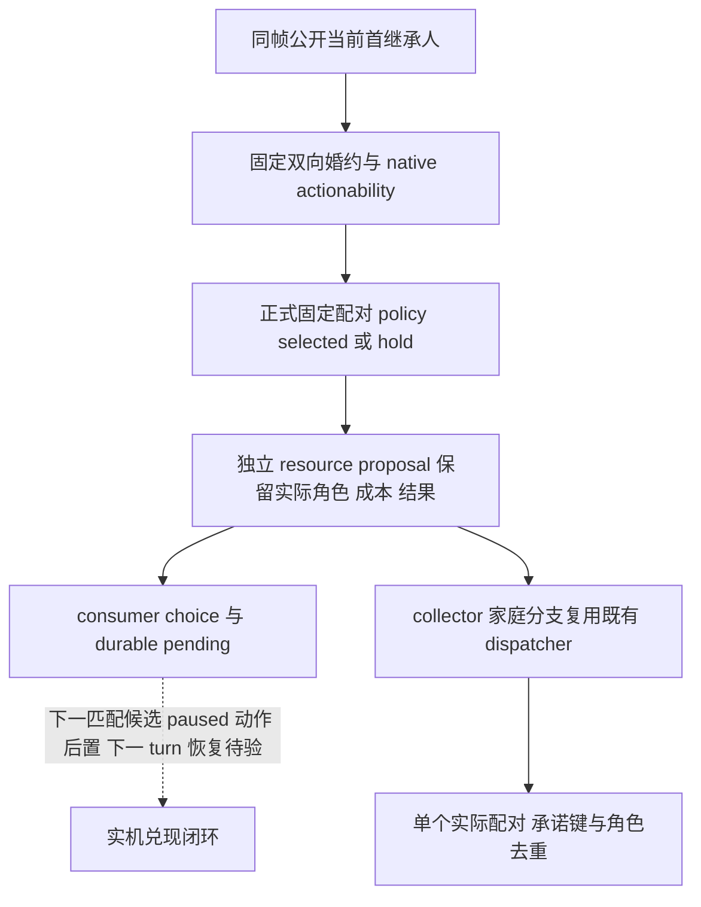

# 当前婚约兑现的家庭提案与资源输入

包：`NW-FAMILY-CURRENT-PAIR-RESOURCE-PROPOSAL-20260930`。

## 原生输入与已证缺口

施工先复用 [固定配对原生读回树](current-first-heir-betrothal-actionability-v1.md) 与
[家庭 companion 原生树](m5-h3928-family-companion-preflight-2026-09-29.md)。版本为 CK3
`1.19.0.6-steam23530548`，EXE SHA-256
`2D00FF3101EF70B566F2FCBAE292F09263199C80E9DC8F139B82D7D96F83DB86`。
原生 `ready_to_marry_betrothed_trigger` 要求实际婚约及双方 native 成年输入；当前配对的
最终五角色、Can Send、答复、十槽 authored on-send 成本、结果和 lineality 由 #768 的固定配对
读回提供。它们不等于本包已取得新 paused 实机字段或已经兑现婚约。

R0404 的当前首继承人 `38822` 与 `38718` 已独立确认双向婚约。普通
`first_heir_marriage_proposal` 要求 `heir_betrothed_character_id is None`，且成人价值标签为
`unpartnered_first_heir_adult_marriage_opportunity`；现有 collector 又只路由普通 first-heir submit。
因此现有普通新婚配模式不能直接消费固定婚约兑现计划。两种模式须保留区别，不删普通政策的
无伴侣要求，也不把实际婚约复制成五个候选。

## 最小接线边界

独立 builder 接收正式固定配对 policy 的 `selected/reasons` 和同帧 parsed relation；它只整理
实际角色、成本、原生结果与 lineality，不重新决定 native 合法性或把 hold 改成 ready。
consumer 将结果放入 `current_betrothal_choice.resource_proposal` 并随 pending 保存。
collector 仅在家庭分支识别 `fulfill_existing_betrothal`，其余 selector/dispatch/schema 不变。

价值只表示当前首继承人已成年婚约的兑现机会。尚无当前配对的 house/dynasty 或子代结果新字段，
不量化宗族收益、潜在联盟、联盟参战义务或解除婚约代价。原生 lineality/outcome 原样保留。
十槽费用保留 signed Q100000；缺字段仍为 null。当前正式 policy 的窄零成本条件不在此放宽，
非零费用观察可以保留，不能据此批准有战争现金缺项的联合花费。

双方实际婚约继续使用 `first-heir-marriage:<heir>` 这一既有承诺键。角色集合去重，
builder 不调用 reserve；只有现有 dispatcher 能作一次分析预留，pending-first 消费仍由正式
consumer 负责。兑现不是新增第二份婚约。M5 五个真实候选、同帧预算与公开能力 gate 均不变。

## 本包源码验收

独立 builder 的正式 API 为
`build_current_betrothal_fulfillment_proposal(relation, snapshot, *, selected, reasons)`。
正式 collector 的单配对、多 plan 适配与最终 typed 路由只在家庭分支消费新模式；
普通 first-heir 模式的原生最终价值要求不变。固定配对仅产出一份提案，实际五角色可能重复的
身份被去重，actor 不重复计入 M5 角色资源；既有承诺键只出现一次，未宣称新增婚约。

正常与 `-O` 各 **7 tests / 4 subtests PASS**，包括：#768 parsed 字段形状直接进入
生产 collector、实际单配对预留与新 typed step 路由、政策 hold 保留非零 signed 成本及未知
成本，以及四条既有普通家庭诊断/独立路径回归。新 native final/adult/cost 值为合同夹具，
不是 R0404 的新增 paused 读数。首次 sparse 工作区缺 `tools/build_release.py` 造成 import
失败，补齐独立工作区既有依赖后继续；初版测试用了错误的 reservation 输出层级和位置参数，
修正测试对既有生产 API 的调用后通过。失败日志与最后回执均独立保留于
`D:/nw-family-current-pair-resource-20260930/`，没有把 harness 失败叫作游戏回归。

本包没有 native/DLL 修改、公共能力/MCP 广告或兼容性破坏；不改变当前冻结候选、PRV008、
M5 五候选及战争现金合同。正式 consumer/service 并行集成后由新匹配候选验证动作、独立
婚姻后置、下一 turn 与冷恢复。本包新增动作与日期均为零。
