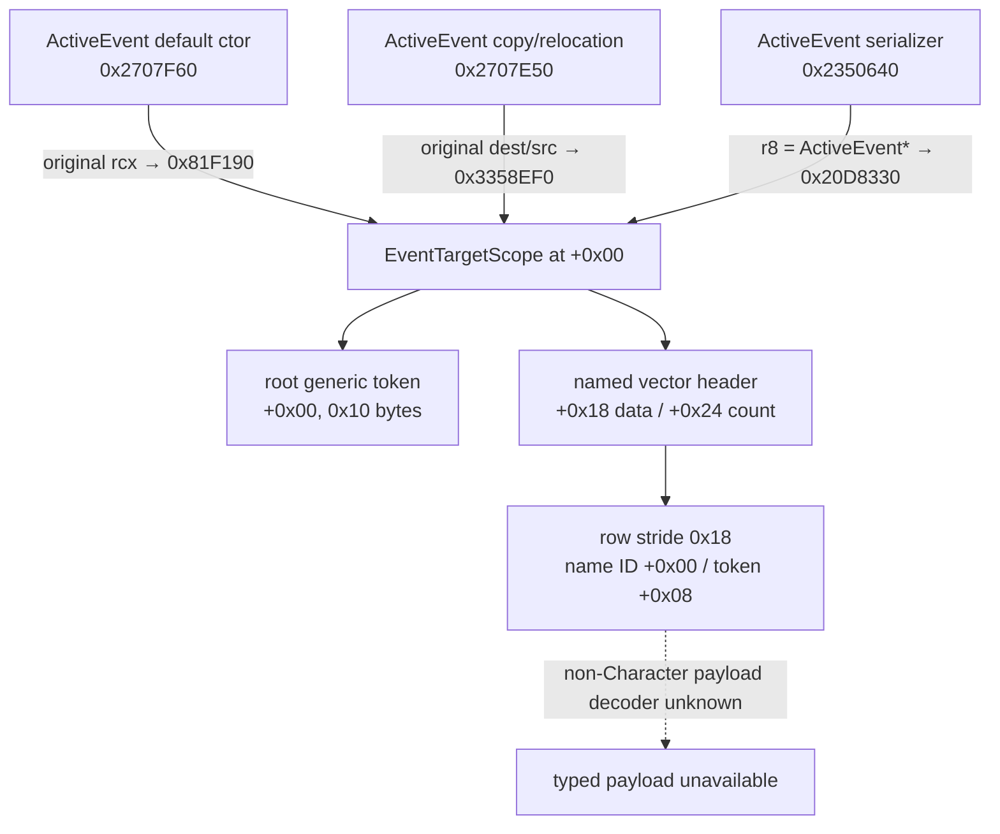

# CK3 1.19.0.6：current-event root / named scopes 静态 ABI

本文冻结当前 `ActiveEvent` 内嵌 `EventTargetScope` 的 root token 与 named-target vector 候选，供下一步扩展
`query-current-event-window-context-v1`。它只回答“值在哪里、类型名如何稳定解析、哪一种 payload 已有静态 decoder”，
不把尚未实机读取的 scope 写成现有能力。

## 版本、范围与 readiness

- 游戏版本：`1.19.0.6`
- `ck3.exe` SHA-256：`2D00FF3101EF70B566F2FCBAE292F09263199C80E9DC8F139B82D7D96F83DB86`
- 机器合同：[`event_window_context_1_19_0_6_abi.json`](../../ck3_autonomous_player/native_bridge/research/event_window_context_1_19_0_6_abi.json)
- 证据等级：**static-confirmed；current-event scope live=false**
- 已静态闭合：`ActiveEvent+0x00` zero-offset scope、root generic token、`+0x18/+0x24` named vector、
  `0x18` row、稳定 named key、generic type key，以及 type `4` CharacterID payload decoder。
- 尚未闭合：production wire、paused current-event root/named artifact、所有非 Character payload identity、其它
  `EventTargetScope` 容器到 `saved_scopes` wire 的完整映射。
- `current_event_scope_wire_ready=false`、`current_event_scope_live_ready=false`、
  `semantic_decision_ready=false`。

本专题是 generic、非宗教事件观测。没有研究或推导 faith、doctrine、tenet、fervor、改宗、宗教改革、holy order
或 holy-war 专用语义；稳定 type key 也不得被用来展开这些域。

## zero-offset scope 的三路证明

关键指令：

- `0x2707F66 mov rbx,rcx` 后，`0x2707F69 call 0x81F190`；调用前没有给 `rcx` 加偏移。
- scope ctor `0x81F190` 初始化到 `+0x166`；返回后 ActiveEvent ctor 从 `+0x168` 开始初始化自身字段。
- copy/relocation path 在 `0x2707E5A/0x2707E5D` 保存原始 source/destination，随后
  `0x2707E60 call 0x3358EF0`；后续 ActiveEvent 字段处理同样从 `+0x168` 开始。
- ActiveEvent serializer 在 `0x235068D` 执行 `mov r8,rdi`，随后 `0x2350698 call 0x20D8330`；
  `rdi` 就是 ActiveEvent，没有 base adjustment。

因此 `ActiveEvent+0x00` 是内嵌的 `0x168`-byte `EventTargetScope`，不是由相邻字段类推的候选指针。

## root 与 named-target 布局

### Root generic token

| 偏移 | 静态含义 |
|---|---|
| `ActiveEvent+0x00` | 16-byte generic event-target token 起点 |
| token `+0x00` | `uint16` generic type-registry index；`0` 表示 absent |
| token `+0x08` | 8-byte type-specific payload；不是通用 component ID，更不能直接发布为 pointer |

`EventTargetScope` serializer 的 `0x20D83AE..0x20D83C0` 把未偏移的 scope 指针交给 generic serializer
`0x81D880`；后者解引用后从 token `+0x00` 读取 `uint16` type index。

### Named-target vector

| scope 偏移 | 静态含义 |
|---|---|
| `+0x18` | row data pointer |
| `+0x20` | `int32` capacity |
| `+0x24` | signed `int32` count |
| `+0x28` | allocator pointer |

`0x20D8407` 比较 `[scope+0x24]`；非零时 `0x20D840D` 以 `scope+0x18` 调用 wrapper `0x2539DA0`。
row loop `0x253BD00` 从 header `+0x00/+0x0C` 读取 data/count，以 `data + count*3*8` 计算终点，
并在每轮执行 `add rsi,0x18`。复制路径 `0x335A370` 又独立按 `0x18` 拷贝每行。

| row 偏移 | 静态含义 |
|---|---|
| `+0x00` | `int32` script-identifier/name ID |
| `+0x04` | opaque；不发布 |
| `+0x08` | inline 16-byte generic event-target token |

serializer 在 `0x253BD60` 读取 `[row+0x00]`，经 `0x3B971A0 → 0x3B97090` 得到名称；在
`0x253BE1D` 把 `row+0x08` 交给 `0x81D880`。production reader 应复用已经闭合的
`0x3B971A0 → 0x3B97020 lookup-only → 0x3B97090 exact round-trip`，不得 intern 缺失名称或接受 fallback。

## Generic type key 与 payload 边界

`0x33C52B0` 返回 `module+0x4FFE290` 的 generic event-target type registry：data/count 位于
`+0x00/+0x0C`，entry stride 为 `0x50`。consumer `0x2011438..0x2011465`：

1. 从 token `+0x00` 读取 `uint16` type index；
2. 对 registry signed count 做 bounds check；
3. 以 `index*0x50` 定位 entry；
4. 读取 entry `+0x00 int32` identifier；
5. 调用 `0x3B58970` 得到 stable type key。

越界分支返回 `module+0x5000AB0` fallback；reader 必须拒绝。即使 type key 可稳定解析，也只能证明 payload
属于哪一种类型，不能证明该类型的 payload 编码。

当前唯一可在本合同复用的 typed payload 是 Character：

- type/index `4`；
- token `+0x08` 是 zero-extended full-generation `int32 CharacterID`；
- generic dispatcher `0x33299E0` 与 Character resolver `0x201AD30` 静态证明该分支；
- 发布前须经 Character storage generation lookup，并要求 `CCharacter+0x18` 回读完整同一 ID。

这只是 **character payload identity static-ready**。当前 event fixture 没有实读 root/named type-4 token，所以不是
current-event live；type `4` 以外的 payload 一律保持 `typed_identity=unavailable`。不得把 raw `+0x08` 猜成
CharacterID、TitleID 或任意指针。

## 完整 `.pdata` 证据

以下均按 `[start,end)` 对 EXE file-backed bytes 计算 SHA-256；完整清单由机器合同和 verifier 固定。

| 函数 | `.pdata` full extent | SHA-256 |
|---|---|---|
| ActiveEvent default ctor | `0x2707F60..0x2707FD8` | `387C833D...B51331` |
| ActiveEvent copy/relocation | `0x2707E50..0x2707F55` | `4A541021...E594A` |
| ActiveEvent serializer | `0x2350640..0x235082B` | `0B791044...AC4A` |
| EventTargetScope ctor | `0x81F190..0x81F24A` | `E119B49A...3FA7` |
| EventTargetScope serializer | `0x20D8330..0x20D84C0` | `3A36FF45...A428` |
| named-vector wrapper | `0x2539DA0..0x2539DF8` | `985F3965...777E` |
| named-row serializer | `0x253BD00..0x253BE92` | `8E407B28...A39` |
| generic token serializer | `0x81D880..0x81DA06` | `B267CA32...D1E6D` |
| generic type registry getter | `0x33C52B0..0x33C535B` | `8B7E4C67...97507` |
| generic type-name consumer | `0x2011400..0x2011623` | `55AC1793...B02B` |
| generic type-name resolver | `0x3B58970..0x3B58A94` | `54E7EAF6...FAB4` |
| Character target resolver | `0x201AD30..0x201ADB2` | `092646A8...19E7` |

## 下一项可施工入口

后续实现必须保持下面的顺序：

1. 在现有 application-main owning-thread callback 内，完整 instance ID 匹配后一次性复制 root token 和有界 named rows；
2. 前后双观察 `ActiveEvent*`、`EventData*`、完整 instance ID 与 definition identity，不把 engine pointer 交给 worker；
3. named key 与 generic type key 均做 bounds、fallback、bounded string 和 exact round-trip；
4. 仅为 type `4` 发布 generation-validated CharacterID；其它 payload 显式 unavailable；
5. 用 generic、非宗教、带 root 与 named Character scope 的 paused seed/checkpoint/fresh-cold fixture 实机验收；
6. live artifact 未 GREEN 前，`root_scope`、`saved_scopes`、scope wire readiness 与 semantic decision 一律保持 false。

该切片不会调用 trigger、effect、option selector 或 RNG，也不会执行事件选项。
