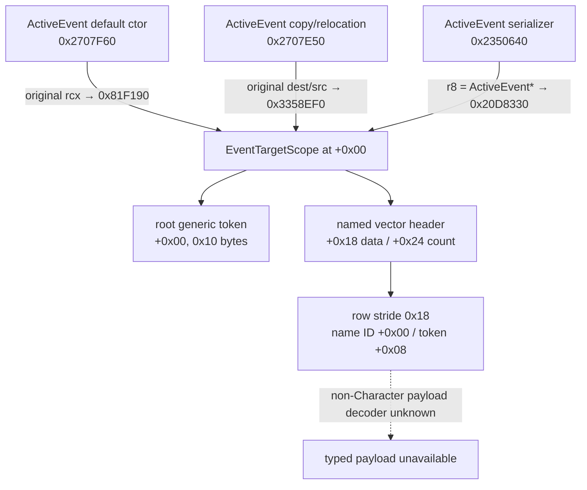

# CK3 1.19.0.6：current-event root / named scopes 静态 ABI 与 production wire

本文冻结当前 `ActiveEvent` 内嵌 `EventTargetScope` 的 root token、named-target vector 与已经实现的
`query-current-event-window-context-v1` production wire。它回答“值在哪里、如何在 owning thread 原子复制、类型名如何
稳定解析、哪一种 payload 已有 decoder，以及 wire 怎样诚实表达未闭合 payload”。production wire 已通过静态构建和测试；
尚未实机读取的 current-event scope 仍不得写成 live 能力。

## 版本、范围与 readiness

- 游戏版本：`1.19.0.6`
- `ck3.exe` SHA-256：`2D00FF3101EF70B566F2FCBAE292F09263199C80E9DC8F139B82D7D96F83DB86`
- 机器合同：[`event_window_context_1_19_0_6_abi.json`](../../ck3_autonomous_player/native_bridge/research/event_window_context_1_19_0_6_abi.json)
- 证据等级：**production wire/static-ready；current-event scope live=false**
- 已静态闭合：`ActiveEvent+0x00` zero-offset scope、root generic token、`+0x18/+0x24` named vector、
  `0x18` row、稳定 named key、generic type key、type `4` CharacterID payload decoder、完整 named-row inventory wire、
  C++ serializer/mailbox 以及 Python strict contract。
- 尚未闭合：paused current-event root/named artifact，以及所有非 Character payload identity。
- `current_event_scope_product_static_ready=true`、`current_event_scope_wire_ready=true`；
  `current_event_scope_live_ready=false`、`stable_scopes_ready=false`、
  `semantic_decision_ready=false`。

这里的 `wire_ready=true` 只表示 exact-build reader、DTO、serializer、mailbox、Python contract 与离线测试已经闭合；它不表示
CK3 paused artifact 已 GREEN。旧的 event-window/indicator live artifact 没有 scope 值，不能用于提升 scope readiness。

本专题是 generic、非宗教事件观测。没有研究或推导 faith、doctrine、tenet、fervor、改宗、宗教改革、holy order
或 holy-war 专用语义；稳定 type key 也不得被用来展开这些域。

## zero-offset scope 的三路证明



关键指令：

- `0x2707F66 mov rbx,rcx` 后，`0x2707F69 call 0x81F190`；调用前没有给 `rcx` 加偏移。
- scope ctor `0x81F190` 初始化到 `+0x166`；返回后 ActiveEvent ctor 从 `+0x168` 开始初始化自身字段。
- copy/relocation path 在 `0x2707E5A/0x2707E5D` 保存原始 source/destination，随后
  `0x2707E60 call 0x3358EF0`；后续 ActiveEvent 字段处理同样从 `+0x168` 开始。
- ActiveEvent serializer 在 `0x235068D` 执行 `mov r8,rdi`，随后 `0x2350698 call 0x20D8330`；
  `rdi` 就是 ActiveEvent，没有 base adjustment。

因此 `ActiveEvent+0x00` 是内嵌的 `0x168`-byte `EventTargetScope`，不是由相邻字段类推的候选指针。

## root 与 named-target 布局

### Root generic token

| 偏移 | 静态含义 |
|---|---|
| `ActiveEvent+0x00` | 16-byte generic event-target token 起点 |
| token `+0x00` | `uint16` generic type-registry index；`0` 表示 absent |
| token `+0x08` | 8-byte type-specific payload；不是通用 component ID，更不能直接发布为 pointer |

`EventTargetScope` serializer 的 `0x20D83AE..0x20D83C0` 把未偏移的 scope 指针交给 generic serializer
`0x81D880`；后者解引用后从 token `+0x00` 读取 `uint16` type index。

### Named-target vector

| scope 偏移 | 静态含义 |
|---|---|
| `+0x18` | row data pointer |
| `+0x20` | `int32` capacity |
| `+0x24` | signed `int32` count |
| `+0x28` | allocator pointer |

`0x20D8407` 比较 `[scope+0x24]`；非零时 `0x20D840D` 以 `scope+0x18` 调用 wrapper `0x2539DA0`。
row loop `0x253BD00` 从 header `+0x00/+0x0C` 读取 data/count，以 `data + count*3*8` 计算终点，
并在每轮执行 `add rsi,0x18`。复制路径 `0x335A370` 又独立按 `0x18` 拷贝每行。

| row 偏移 | 静态含义 |
|---|---|
| `+0x00` | `int32` script-identifier/name ID |
| `+0x04` | opaque；不发布 |
| `+0x08` | inline 16-byte generic event-target token |

serializer 在 `0x253BD60` 读取 `[row+0x00]`，经 `0x3B971A0 → 0x3B97090` 得到名称；在
`0x253BE1D` 把 `row+0x08` 交给 `0x81D880`。production reader 应复用已经闭合的
`0x3B971A0 → 0x3B97020 lookup-only → 0x3B97090 exact round-trip`，不得 intern 缺失名称或接受 fallback。

## Generic type key 与 payload 边界

`0x33C52B0` 返回 `module+0x4FFE290` 的 generic event-target type registry：data/count 位于
`+0x00/+0x0C`，entry stride 为 `0x50`。consumer `0x2011438..0x2011465`：

1. 从 token `+0x00` 读取 `uint16` type index；
2. 对 registry signed count 做 bounds check；
3. 以 `index*0x50` 定位 entry；
4. 读取 entry `+0x00 int32` identifier；
5. 调用 `0x3B58970` 得到 stable type key。

这里有两种不能混用的 fallback：

- consumer 在 `type_index` 越过 signed registry count 时选择 `module+0x5000AB0` 的 **0x50-byte registry fallback
  entry**；production reader 必须先要求 `type_index < count`，再计算 `index*0x50`，因此不会进入该 entry；
- `0x3B58970` 自身解析失败时返回 `module+0x585F058` 的 **MSVC string fallback**；production `Bindings` 必须用
  `kGenericValueTypeNameFallbackRva = 0x585F058` 固定这个 expected pointer，并在复制字符串前拒绝
  `native_name == bindings.generic_value_type_name_fallback`。

`module+0x5000AB0` 不是 resolver 返回的 string，`module+0x585F058` 也不是 registry entry。即使 type key 可稳定解析，
也只能证明 payload 属于哪一种类型，不能证明该类型的 payload 编码。

当前唯一可在本合同复用的 typed payload 是 Character：

- type/index `4`；
- token `+0x08` 是 zero-extended full-generation `int32 CharacterID`；
- generic dispatcher `0x33299E0` 与 Character resolver `0x201AD30` 静态证明该分支；
- 发布前须经 Character storage generation lookup，并要求 `CCharacter+0x18` 回读完整同一 ID。

这只是 **character payload identity 与 production wire static-ready**。当前 event fixture 没有实读 root/named type-4 token，
所以不是 current-event scope live；type `4` 以外的 payload 一律保持
`typed_identity={status: unavailable, reason: generic_scope_payload_identity_not_closed}`。reader 不读取这些 token 的
`+0x08`，不得把它猜成 CharacterID、TitleID 或任意指针。

## 已实现的 production wire

available frame 的 root 使用下面的精确结构：

```json
{
  "root_scope": {
    "status": "available",
    "raw_type_index": 4,
    "type_key": "character",
    "subtype": 0,
    "typed_identity": {
      "status": "available",
      "kind": "character",
      "character_id": 123
    }
  },
  "saved_scopes": [
    {
      "name": "xar_scope_root_control",
      "name_identifier": 456,
      "scope": "<同一 typed scope 结构>"
    }
  ]
}
```

`name` 是稳定 canonical script identifier；`name_identifier` 是当前进程的完整 signed `int32` generation ID，wire
范围为 `[-2147483648, 2147483647]`。负值也是合法的完整 ID，reader、serializer 与 Python contract 都必须原样保留并做
full-ID round-trip，不能只保留低 24 位，也不能跨 checkpoint/fresh PID 比较。named vector 的每一行都会进入
`saved_scopes`，非 Character 行不会被静默丢弃：它仍发布
`raw_type_index/subtype/type_key`，但 typed identity 精确为：

```json
{
  "status": "unavailable",
  "reason": "generic_scope_payload_identity_not_closed"
}
```

available frame 要求 `readiness.root_scope_ready=true` 与 `saved_scopes_ready=true`。二者表示 root、完整 named inventory、
canonical names/type keys 已复制，且所有 type `4` CharacterID 已做 generation round-trip；它们不表示非 Character payload
decoder 或 semantic decision 已完成。`effect_preview_ready=false` 与 `semantic_decision_ready=false` 保持不变。整个 query
unavailable 时，`root_scope=null`、`saved_scopes=null`，两项 scope readiness 都为 false。

production reader 在现有 application-main mailbox callback 内执行：

1. 完整 event instance 与 definition identity 命中后读取第一份 owned scope inventory；
2. generic type getter 必须返回精确 `module+0x4FFE290`；先以 `type_index < count` 拒绝会进入
   `module+0x5000AB0` registry fallback entry 的越界索引；generic type name 只走 `0x3B58970` 域，并在复制前拒绝
   Bindings 固定的 `module+0x585F058` native-name fallback；
3. named key 只走独立的 `0x3B971A0/0x3B97090/0x3B97020` script-name 域，拒绝
   `module+0x585F218` fallback，并要求完整 signed `int32` generation ID round-trip（包括负值）；
4. 复制窗口后再次读取 owned inventory，同时复核 ActiveEvent/EventData/instance 与 snapshot；任一变化都返回 unavailable；
5. DTO/mailbox 只携带整数、owned strings/vectors 和 typed status，不携带 token payload、native string、registry、Character
   或 ActiveEvent 指针。

因此 production static 能力不是“把 schema 的 null 改成对象”，而是 exact-build locator、两套名称域、Character generation
校验、双观察和 strict wire 一起闭合。当前仍缺的是这条路径的 paused live artifact。

## 完整 `.pdata` 证据

以下均按 `[start,end)` 对 EXE file-backed bytes 计算 SHA-256；完整清单由机器合同和 verifier 固定。

| 函数 | `.pdata` full extent | SHA-256 |
|---|---|---|
| ActiveEvent default ctor | `0x2707F60..0x2707FD8` | `387C833D...B51331` |
| ActiveEvent copy/relocation | `0x2707E50..0x2707F55` | `4A541021...E594A` |
| ActiveEvent serializer | `0x2350640..0x235082B` | `0B791044...AC4A` |
| EventTargetScope ctor | `0x81F190..0x81F24A` | `E119B49A...3FA7` |
| EventTargetScope serializer | `0x20D8330..0x20D84C0` | `3A36FF45...A428` |
| named-vector wrapper | `0x2539DA0..0x2539DF8` | `985F3965...777E` |
| named-row serializer | `0x253BD00..0x253BE92` | `8E407B28...A39` |
| generic token serializer | `0x81D880..0x81DA06` | `B267CA32...D1E6D` |
| generic type registry getter | `0x33C52B0..0x33C535B` | `8B7E4C67...97507` |
| generic type-name consumer | `0x2011400..0x2011623` | `55AC1793...B02B` |
| generic type-name resolver | `0x3B58970..0x3B58A94` | `54E7EAF6...FAB4` |
| Character target resolver | `0x201AD30..0x201ADB2` | `092646A8...19E7` |

## 已实现路径与下一项 live gate

production static 已按下面的顺序实现：

1. 在现有 application-main owning-thread callback 内，完整 instance ID 匹配后一次性复制 root token 和有界 named rows；
2. 前后双观察 owned scope inventory、`ActiveEvent*`、`EventData*`、完整 instance ID 与 definition identity，不把 engine
   pointer 交给 worker；
3. named key 与 generic type key 均做 bounds、fallback、bounded string 和 exact round-trip；
4. 仅为 type `4` 发布 generation-validated CharacterID；其它 payload 显式 unavailable；

下一项 gate 是用 generic、非宗教、带 root 与 named Character scope 的 paused seed/checkpoint/fresh-cold fixture 实机验收。
live artifact 未 GREEN 前，`current_event_scope_live_ready` 与 `stable_scopes_ready` 必须保持 false；production wire 中的
`root_scope_ready/saved_scopes_ready` 是单帧 typed-copy readiness，不能冒充 live readiness。

该切片不会调用 trigger、effect、option selector 或 RNG，也不会执行事件选项。

## 2026-08-27 live 尝试：环境/启动 RED，不是 scope capability RED

实现被精确冻结为 isolated commit `a860702cb76bb3b5c9972bc8d22bc2a61dffbd65`。candidate DLL 为
`ck3_autonomous_player/native_bridge/.build-event-scopes-a860702-msvc/xar_ck3_bridge.dll`，size `3938304`，SHA-256
`A2B78F371A16A87B2A911E1E832C07A5701E2E7B3C42FA046006A41C233702DF`；injector SHA-256
`1618840EC108F688B3EBECC6D7F8963038BA64C8D4A3E10DDE2E29E3F443B4DF`。

两次 default-off acceptance 都在 CK3 到达 map/event fixture 之前于同一 `ck3+0x1DABD89` 启动崩溃，runner 没有发出
scope query，也没有执行事件选项：

| artifact | size | SHA-256 | 判定 |
|---|---:|---|---|
| `artifacts/current-event-scopes-live-20260827-1048-a860702.json` | `41977` | `C36A8753F604024AF60D3B9DDE1B21544B2C678E5CAF2F190FBFBD65128BE563` | harness/startup RED；capability 未触达 |
| `artifacts/current-event-scopes-live-20260827-1055-a860702-attempt2.json` | `41985` | `B128AE7A21375369FB330BC79DF1D654B78057654C9DDCA1E9C90D753207250B` | 同一启动 RED；capability 未触达 |

source save 在两次尝试前后均为 `66594755` bytes、SHA-256
`5BA2136911EAD0CAF1F7D2F3DE02EAFBD8039861C46F01F35F698B3B5CFFFC5F`；DLL、injector、fixture/source 与清理 preflight
均通过。recorder-on 诊断 dump
`C:\Users\xenoa\AppData\Local\Temp\xar-war-entry-known-good-profile-control\profile\crashes\ck3_20260827_105659\minidump.dmp`
为 `45735562` bytes、SHA-256 `39CC57D52CE647F81C0204BB27224D627DA0765F346114BAC9E733E6BFA88597`；其 recorder
状态是 `source_lookup_null_count=16`、`variant_lookup_null_count=0`、`backend_creation_null_count=0`，16 个 particle2
root slot 全为空。default-off bridge 随后也在同一 RVA 崩溃，所以 recorder 不是必要触发条件。

当前 RED 进程由 `XENOAMESS-FULL-\\CodexSandboxOffline` 运行，dump 明确位于
`WinSta0\\CodexSandboxDesktop-*`；同日五个既有 CK3 live GREEN artifact 均由 `xenoa` 的普通交互环境产出。launch 参数、EXE、
save、DLC/VFS 指纹、显示设置与核心 runner 配置未发现其它确定差异。这只把“execution token/desktop”确定为当前最有价值的
A/B 边界，尚不能在没有复跑的情况下宣称因果已证明。

因此下一项 live gate 是在 `xenoa` 的正常交互 PowerShell / `WinSta0\\Default` 中，原样复跑上述 a860702 default-off
acceptance。当前 `current_event_scope_live_ready=false` 保持不变；不会通过启用 startup guard、伪造资源或把命令 ACK 写成
scope 观测来绕过该 gate。等待外部 A/B 期间，主线继续实现已经完成原生树前置的最小事件选择策略。
