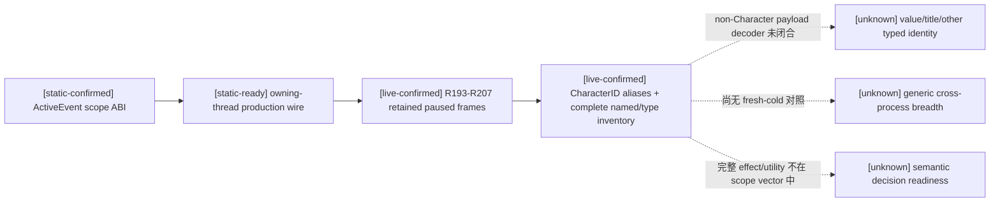
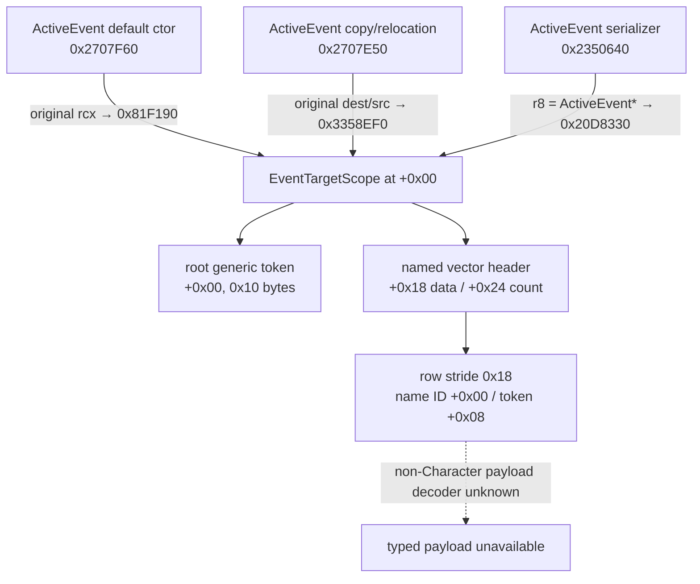
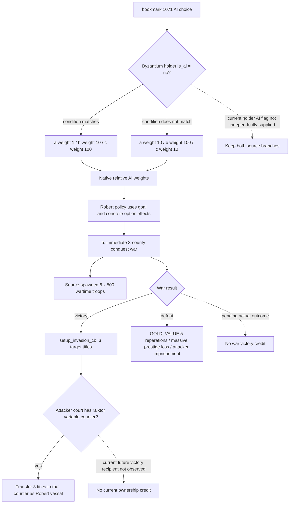

# CK3 1.19.0.6：current-event root / named scopes 静态 ABI 与 production wire

本文冻结当前 `ActiveEvent` 内嵌 `EventTargetScope` 的 root token、named-target vector 与已经实现的
`query-current-event-window-context-v1` production wire。它回答“值在哪里、如何在 owning thread 原子复制、类型名如何
稳定解析、哪一种 payload 已有 decoder，以及 wire 怎样诚实表达未闭合 payload”。production wire 已通过静态构建和测试，
并已在 R193–R207 的 exact-build retained product session 中读取多组真实 root/named scopes。该证据只升级已观察帧的
Character identity 与完整 named/type inventory，不升级非 Character payload、跨进程稳定性或事件语义。

## 版本、范围与 readiness

- 游戏版本：`1.19.0.6`
- `ck3.exe` SHA-256：`2D00FF3101EF70B566F2FCBAE292F09263199C80E9DC8F139B82D7D96F83DB86`
- 机器合同：[`event_window_context_1_19_0_6_abi.json`](../../ck3_autonomous_player/native_bridge/research/event_window_context_1_19_0_6_abi.json)
- 证据等级：**production wire/static-ready + observed product frames production-live；generic/fresh-cold breadth pending**
- 已静态闭合：`ActiveEvent+0x00` zero-offset scope、root generic token、`+0x18/+0x24` named vector、
  `0x18` row、稳定 named key、generic type key、type `4` CharacterID payload decoder、完整 named-row inventory wire、
  C++ serializer/mailbox 以及 Python strict contract。
- 已有 live：R193–R207 同一 exact-build product PID 的 paused current-event root、完整 named-row inventory、stable
  name/type key，以及所有 type `4` CharacterID 的 generation-validated identity。
- 尚未闭合：所有非 Character payload identity、跨 fresh process/checkpoint 的通用重验、未观察 event type 的覆盖范围与
  完整事件 effect/utility 语义。
- `current_event_scope_product_static_ready=true`、`current_event_scope_wire_ready=true`；观察到的 product frame 可记为
  `observed_frame_scope_live_ready=true`，但 `generic_fresh_cold_scope_live_ready=false`、
  `semantic_decision_ready=false`。

这里的 `wire_ready=true` 仍只表示 exact-build reader、DTO、serializer、mailbox、Python contract 与离线测试闭合；
R193–R207 artifact 才提供 paused scope live 证据。该证据来自一个 retained product session，不能外推成所有事件类型、
fresh-cold 稳定性、value payload decoder 或 semantic decision readiness。

本专题保留上述 1.19.0.6 历史观测事实；宗教领域自 **2026-10-02** 起已全面开放，允许 faith/religion、rite、doctrine、tenet、fervor、改宗、宗教改革、holy order、圣战与大圣战的原生研究、bridge/MCP、策略和实机验收。
原非宗教限定及禁止由稳定 type key 继续研究宗教领域的规范已撤销。授权不表示能力已完成；仍区分 exact-build 绑定、真实观测和 readiness，未闭合字段与具体施工入口按原证据边界记录。

## R193–R207 exact-build product live evidence

R193 以 1,031 文件正式天朝二期投影 fresh launch PID `44264`；R194–R207 均 reconnect 同一 PID，没有游戏重启。
这段会话把原先仅有静态接线的 scope reader 提升为 observed-frame production-live：

| 边界 | paused scope 证据 | 诚实结论 |
|---|---|---|
| R200 `health.1101`, instance `90` | root 为 played CharacterID `32904`；saved inventory 恰为 `sick_character` 与 `disease_type`，没有 `physician` | 证明 exact inventory 能区分缺失 alias；不解码 `disease_type` payload |
| R203 `zg361.1` | 46 个完整 named rows，混合 calibration/oversight/reopen、B2/P2C/compensation/CH-D 与数值状态 | shape drift 被准确拒绝，未因大 inventory 放宽为 wildcard |
| R204/R205 | `zg361.5` 有 43 rows（15 Character、28 value）；`zg361pp.149` 有 48 rows（17 Character、31 value） | Character alias 均做 full-generation identity；value 只发布 type key |
| R206 `zg361pp.150`, instance `129` | `date_raw=53186880`，同样 48 rows（17 Character、31 value），native option `0/1/2` | `root_scope_ready=true`、`saved_scopes_ready=true`；effect preview/semantic decision 仍 false |
| R207 `zg361pp.151`, instance `130` | `date_raw=53186904`，53 rows（19 Character、34 value），新增五个 `zg361_pp_subject_prompt_*` aliases | 当前 typed RED 帧；没有 exact contract/选择，不是 PP completion |

R207 还对 `.150` 提供了 scope-bound selection lifecycle：所有 identity/name/type 检查为 true，authored option `3` /
native index `2` 提交后，snapshot `native:933 -> native:934`、revision `2 -> 3`，旧 instance `129` 消失，
`event_selection.status=event_instance_advanced`。这证明该 observed frame 的查询和后置链，不靠 ACK 推断状态。

- R206 report SHA-256：`5DA38B3F05D92722BCCB685D538F4F02D9C5FC0468F162FA4B7F33CFD5BC651D`。
- R207 report：`Z:\p2r207promo_resume\report.json`，SHA-256
  `BC1EB388686709C0E9FC9CB2438D77423BCDDA9E6118E5073268EE0C3515C80C`。
- 两轮均绑定 CK3 `1.19.0.6`、EXE SHA-256
  `2D00FF3101EF70B566F2FCBAE292F09263199C80E9DC8F139B82D7D96F83DB86`；R207 为 connection generation `19`。


```mermaid
flowchart LR
    A["[static-confirmed] ActiveEvent scope ABI"] --> W["[static-ready] owning-thread production wire"]
    W --> R["[live-confirmed] R193-R207 retained paused frames"]
    R --> C["[live-confirmed] CharacterID aliases + complete named/type inventory"]
    C -. "non-Character payload decoder 未闭合" .-> V["[unknown] value/title/other typed identity"]
    C -. "尚无 fresh-cold 对照" .-> F["[unknown] generic cross-process breadth"]
    C -. "完整 effect/utility 不在 scope vector 中" .-> S["[unknown] semantic decision readiness"]
```

## zero-offset scope 的三路证明


```mermaid
flowchart TD
    A["ActiveEvent default ctor<br/>0x2707F60"] -->|"original rcx → 0x81F190"| S["EventTargetScope at +0x00"]
    C["ActiveEvent copy/relocation<br/>0x2707E50"] -->|"original dest/src → 0x3358EF0"| S
    Z["ActiveEvent serializer<br/>0x2350640"] -->|"r8 = ActiveEvent* → 0x20D8330"| S
    S --> R["root generic token<br/>+0x00, 0x10 bytes"]
    S --> N["named vector header<br/>+0x18 data / +0x24 count"]
    N --> Q["row stride 0x18<br/>name ID +0x00 / token +0x08"]
    Q -. "non-Character payload decoder unknown" .-> U["typed payload unavailable"]
```

关键指令：

- `0x2707F66 mov rbx,rcx` 后，`0x2707F69 call 0x81F190`；调用前没有给 `rcx` 加偏移。
- scope ctor `0x81F190` 初始化到 `+0x166`；返回后 ActiveEvent ctor 从 `+0x168` 开始初始化自身字段。
- copy/relocation path 在 `0x2707E5A/0x2707E5D` 保存原始 source/destination，随后
  `0x2707E60 call 0x3358EF0`；后续 ActiveEvent 字段处理同样从 `+0x168` 开始。
- ActiveEvent serializer 在 `0x235068D` 执行 `mov r8,rdi`，随后 `0x2350698 call 0x20D8330`；
  `rdi` 就是 ActiveEvent，没有 base adjustment。

因此 `ActiveEvent+0x00` 是内嵌的 `0x168`-byte `EventTargetScope`，不是由相邻字段类推的候选指针。

## root 与 named-target 布局

### Root generic token

| 偏移 | 静态含义 |
|---|---|
| `ActiveEvent+0x00` | 16-byte generic event-target token 起点 |
| token `+0x00` | `uint16` generic type-registry index；`0` 表示 absent |
| token `+0x08` | 8-byte type-specific payload；不是通用 component ID，更不能直接发布为 pointer |

`EventTargetScope` serializer 的 `0x20D83AE..0x20D83C0` 把未偏移的 scope 指针交给 generic serializer
`0x81D880`；后者解引用后从 token `+0x00` 读取 `uint16` type index。

### Named-target vector

| scope 偏移 | 静态含义 |
|---|---|
| `+0x18` | row data pointer |
| `+0x20` | `int32` capacity |
| `+0x24` | signed `int32` count |
| `+0x28` | allocator pointer |

`0x20D8407` 比较 `[scope+0x24]`；非零时 `0x20D840D` 以 `scope+0x18` 调用 wrapper `0x2539DA0`。
row loop `0x253BD00` 从 header `+0x00/+0x0C` 读取 data/count，以 `data + count*3*8` 计算终点，
并在每轮执行 `add rsi,0x18`。复制路径 `0x335A370` 又独立按 `0x18` 拷贝每行。

| row 偏移 | 静态含义 |
|---|---|
| `+0x00` | `int32` script-identifier/name ID |
| `+0x04` | opaque；不发布 |
| `+0x08` | inline 16-byte generic event-target token |

serializer 在 `0x253BD60` 读取 `[row+0x00]`，经 `0x3B971A0 → 0x3B97090` 得到名称；在
`0x253BE1D` 把 `row+0x08` 交给 `0x81D880`。production reader 应复用已经闭合的
`0x3B971A0 → 0x3B97020 lookup-only → 0x3B97090 exact round-trip`，不得 intern 缺失名称或接受 fallback。

## Generic type key 与 payload 边界

`0x33C52B0` 返回 `module+0x4FFE290` 的 generic event-target type registry：data/count 位于
`+0x00/+0x0C`，entry stride 为 `0x50`。consumer `0x2011438..0x2011465`：

1. 从 token `+0x00` 读取 `uint16` type index；
2. 对 registry signed count 做 bounds check；
3. 以 `index*0x50` 定位 entry；
4. 读取 entry `+0x00 int32` identifier；
5. 调用 `0x3B58970` 得到 stable type key。

这里有两种不能混用的 fallback：

- consumer 在 `type_index` 越过 signed registry count 时选择 `module+0x5000AB0` 的 **0x50-byte registry fallback
  entry**；production reader 必须先要求 `type_index < count`，再计算 `index*0x50`，因此不会进入该 entry；
- `0x3B58970` 自身解析失败时返回 `module+0x585F058` 的 **MSVC string fallback**；production `Bindings` 必须用
  `kGenericValueTypeNameFallbackRva = 0x585F058` 固定这个 expected pointer，并在复制字符串前拒绝
  `native_name == bindings.generic_value_type_name_fallback`。

`module+0x5000AB0` 不是 resolver 返回的 string，`module+0x585F058` 也不是 registry entry。即使 type key 可稳定解析，
也只能证明 payload 属于哪一种类型，不能证明该类型的 payload 编码。

当前唯一可在本合同复用的 typed payload 是 Character：

- type/index `4`；
- token `+0x08` 是 zero-extended full-generation `int32 CharacterID`；
- generic dispatcher `0x33299E0` 与 Character resolver `0x201AD30` 静态证明该分支；
- 发布前须经 Character storage generation lookup，并要求 `CCharacter+0x18` 回读完整同一 ID。

这条 decoder 已在 R193–R207 observed product frames 中实读 root/named type-4 token，因此
**Character payload identity 与 observed-frame production wire** 具备 scoped live 证据；type `4` 以外的 payload 仍一律保持
`typed_identity={status: unavailable, reason: generic_scope_payload_identity_not_closed}`。reader 不读取这些 token 的
`+0x08`，不得把它猜成 CharacterID、TitleID 或任意指针。该 retained-session 证据也不替代 generic fresh-cold 对照。

## 已实现的 production wire

available frame 的 root 使用下面的精确结构：

```json
{
  "root_scope": {
    "status": "available",
    "raw_type_index": 4,
    "type_key": "character",
    "subtype": 0,
    "typed_identity": {
      "status": "available",
      "kind": "character",
      "character_id": 123
    }
  },
  "saved_scopes": [
    {
      "name": "xar_scope_root_control",
      "name_identifier": 456,
      "scope": "<同一 typed scope 结构>"
    }
  ]
}
```

`name` 是稳定 canonical script identifier；`name_identifier` 是当前进程的完整 signed `int32` generation ID，wire
范围为 `[-2147483648, 2147483647]`。负值也是合法的完整 ID，reader、serializer 与 Python contract 都必须原样保留并做
full-ID round-trip，不能只保留低 24 位，也不能跨 checkpoint/fresh PID 比较。named vector 的每一行都会进入
`saved_scopes`，非 Character 行不会被静默丢弃：它仍发布
`raw_type_index/subtype/type_key`，但 typed identity 精确为：

```json
{
  "status": "unavailable",
  "reason": "generic_scope_payload_identity_not_closed"
}
```

available frame 要求 `readiness.root_scope_ready=true` 与 `saved_scopes_ready=true`。二者表示 root、完整 named inventory、
canonical names/type keys 已复制，且所有 type `4` CharacterID 已做 generation round-trip；它们不表示非 Character payload
decoder 或 semantic decision 已完成。`effect_preview_ready=false` 与 `semantic_decision_ready=false` 保持不变。整个 query
unavailable 时，`root_scope=null`、`saved_scopes=null`，两项 scope readiness 都为 false。

production reader 在现有 application-main mailbox callback 内执行：

1. 完整 event instance 与 definition identity 命中后读取第一份 owned scope inventory；
2. generic type getter 必须返回精确 `module+0x4FFE290`；先以 `type_index < count` 拒绝会进入
   `module+0x5000AB0` registry fallback entry 的越界索引；generic type name 只走 `0x3B58970` 域，并在复制前拒绝
   Bindings 固定的 `module+0x585F058` native-name fallback；
3. named key 只走独立的 `0x3B971A0/0x3B97090/0x3B97020` script-name 域，拒绝
   `module+0x585F218` fallback，并要求完整 signed `int32` generation ID round-trip（包括负值）；
4. 复制窗口后再次读取 owned inventory，同时复核 ActiveEvent/EventData/instance 与 snapshot；任一变化都返回 unavailable；
5. DTO/mailbox 只携带整数、owned strings/vectors 和 typed status，不携带 token payload、native string、registry、Character
   或 ActiveEvent 指针。

因此 production 能力不是“把 schema 的 null 改成对象”，而是 exact-build locator、两套名称域、Character generation
校验、双观察和 strict wire 一起闭合。R193–R207 已提供 paused observed-frame artifact；当前仍缺的是 generic/fresh-cold
覆盖、非 Character payload decoder 与完整 semantic preview，而不是重复证明同一 retained frame 能返回 rows。

## 完整 `.pdata` 证据

以下均按 `[start,end)` 对 EXE file-backed bytes 计算 SHA-256；完整清单由机器合同和 verifier 固定。

| 函数 | `.pdata` full extent | SHA-256 |
|---|---|---|
| ActiveEvent default ctor | `0x2707F60..0x2707FD8` | `387C833D...B51331` |
| ActiveEvent copy/relocation | `0x2707E50..0x2707F55` | `4A541021...E594A` |
| ActiveEvent serializer | `0x2350640..0x235082B` | `0B791044...AC4A` |
| EventTargetScope ctor | `0x81F190..0x81F24A` | `E119B49A...3FA7` |
| EventTargetScope serializer | `0x20D8330..0x20D84C0` | `3A36FF45...A428` |
| named-vector wrapper | `0x2539DA0..0x2539DF8` | `985F3965...777E` |
| named-row serializer | `0x253BD00..0x253BE92` | `8E407B28...A39` |
| generic token serializer | `0x81D880..0x81DA06` | `B267CA32...D1E6D` |
| generic type registry getter | `0x33C52B0..0x33C535B` | `8B7E4C67...97507` |
| generic type-name consumer | `0x2011400..0x2011623` | `55AC1793...B02B` |
| generic type-name resolver | `0x3B58970..0x3B58A94` | `54E7EAF6...FAB4` |
| Character target resolver | `0x201AD30..0x201ADB2` | `092646A8...19E7` |

## 已实现路径与剩余 live gate

production static 已按下面的顺序实现：

1. 在现有 application-main owning-thread callback 内，完整 instance ID 匹配后一次性复制 root token 和有界 named rows；
2. 前后双观察 owned scope inventory、`ActiveEvent*`、`EventData*`、完整 instance ID 与 definition identity，不把 engine
   pointer 交给 worker；
3. named key 与 generic type key 均做 bounds、fallback、bounded string 和 exact round-trip；
4. 仅为 type `4` 发布 generation-validated CharacterID；其它 payload 显式 unavailable；

observed product frame 的 live gate 已由 R193–R207 关闭。剩余 gate 是用 generic、非宗教、带 root 与 named Character scope 的
paused seed/checkpoint/fresh-cold fixture 做跨进程复验，并仅在真实决策需要时继续闭合相应非 Character payload decoder。
production wire 中的 `root_scope_ready/saved_scopes_ready` 仍只是单帧 typed-copy readiness；它们不能冒充跨进程 breadth、
完整 payload coverage 或 semantic decision readiness。

该切片不会调用 trigger、effect、option selector 或 RNG，也不会执行事件选项。

## 2026-08-27 live 尝试：环境/启动 RED，不是 scope capability RED

实现被精确冻结为 isolated commit `a860702cb76bb3b5c9972bc8d22bc2a61dffbd65`。candidate DLL 为
`ck3_autonomous_player/native_bridge/.build-event-scopes-a860702-msvc/xar_ck3_bridge.dll`，size `3938304`，SHA-256
`A2B78F371A16A87B2A911E1E832C07A5701E2E7B3C42FA046006A41C233702DF`；injector SHA-256
`1618840EC108F688B3EBECC6D7F8963038BA64C8D4A3E10DDE2E29E3F443B4DF`。

两次 default-off acceptance 都在 CK3 到达 map/event fixture 之前于同一 `ck3+0x1DABD89` 启动崩溃，runner 没有发出
scope query，也没有执行事件选项：

| artifact | size | SHA-256 | 判定 |
|---|---:|---|---|
| `artifacts/current-event-scopes-live-20260827-1048-a860702.json` | `41977` | `C36A8753F604024AF60D3B9DDE1B21544B2C678E5CAF2F190FBFBD65128BE563` | harness/startup RED；capability 未触达 |
| `artifacts/current-event-scopes-live-20260827-1055-a860702-attempt2.json` | `41985` | `B128AE7A21375369FB330BC79DF1D654B78057654C9DDCA1E9C90D753207250B` | 同一启动 RED；capability 未触达 |

source save 在两次尝试前后均为 `66594755` bytes、SHA-256
`5BA2136911EAD0CAF1F7D2F3DE02EAFBD8039861C46F01F35F698B3B5CFFFC5F`；DLL、injector、fixture/source 与清理 preflight
均通过。recorder-on 诊断 dump
`C:\Users\xenoa\AppData\Local\Temp\xar-war-entry-known-good-profile-control\profile\crashes\ck3_20260827_105659\minidump.dmp`
为 `45735562` bytes、SHA-256 `39CC57D52CE647F81C0204BB27224D627DA0765F346114BAC9E733E6BFA88597`；其 recorder
状态是 `source_lookup_null_count=16`、`variant_lookup_null_count=0`、`backend_creation_null_count=0`，16 个 particle2
root slot 全为空。default-off bridge 随后也在同一 RVA 崩溃，所以 recorder 不是必要触发条件。

当前 RED 进程由 `XENOAMESS-FULL-\\CodexSandboxOffline` 运行，dump 明确位于
`WinSta0\\CodexSandboxDesktop-*`；同日五个既有 CK3 live GREEN artifact 均由 `xenoa` 的普通交互环境产出。launch 参数、EXE、
save、DLC/VFS 指纹、显示设置与核心 runner 配置未发现其它确定差异。这只把“execution token/desktop”确定为当前最有价值的
A/B 边界，尚不能在没有复跑的情况下宣称因果已证明。

这两次 2026-08-27 startup RED 继续作为历史失败证据保留，但“scope capability 未触达”的当时结论已由 R193–R207
真实 product session supersede；不能再用它声称 current-event scope 全局 live=false。仍未完成的是同一 reader 的 generic
fresh-cold 对照和非 Character payload breadth。后续也不会通过 startup guard、伪造资源或动作 ACK 扩大 live 结论。

## R506：`value` 的 raw type index 不可由旧 fixture 固定

2026-09-12 的 exact-build R506 在真实 `zg361we.356` instance `620` 上发布
`zg361_we_al_cycle` 为 `raw_type_index=1 / type_key=value / subtype=0`，且
`typed_identity=generic_scope_payload_identity_not_closed`。事件定义 SHA-256 为
`29D1B867...43C38`，EXE 仍为 `2D00FF31...3DB86`；owner/player `32904`、日期
`53366568` 和三个可用选项均已同帧闭合。

来源 capture 的旧测试 fixture 把 `value` 误固定为 raw index `9`。这与本页既有
ABI 边界一致：只有 Character 的 index `4` 有已闭合 payload decoder；generic
scope 的稳定语义标签来自 registry 解析后的 `type_key`，不能让旧 fixture 的数字
覆盖真实 wire。现行来源合同因此要求正的非 Character raw index、
`type_key=value`、`subtype=0` 和原样 unavailable identity，并在 receipt 中保留
实际 raw index。它仍不读取或猜测 value payload；cycle/case 数值继续由
received-self Workforce provider 提供并与事件 full guard 互证。

## 2026-10-03T12:22 新 PID paused 实读

本专题对应的新只读叶与真实缺口见[统一实读记录](g2-v33-paused-religion-and-event-observations-12003.md)，回链actor/date/native/public revisions和原capture。仅记录primitive，不增加动作、日数或完整OODA；历史fixture与封存状态保留原时点。

## 2026-10-04 .3：event24 的健康事件上下文与选择清除

Root确认本轮production source-root **g54 / exact CK3 1.20.0.3**；sole consumer提供暂停帧date_raw **53245560**、event instance **24**、root/actor **29829**与唯一enabled选项（**optionCount=1**）。该count本身不推出option index。上下文索引为 `Z:/ck3_mod_rewrite_process_assets/g2-resume-20261003/runtime-preparation/v49/actual-event-24-context-01/result.json`；本追加只链接，不读取该raw。

Root提供的static stock语境为 `health.7300`。已缓存official `health_events.txt` **12313..12457** stdout显示单一option `health.7300.a`，其authored effect为 `add_trait = clouded_eyes`；trait ID124来自Root提供的语境。官方文件identity为 `Z:/SteamLibrary/steamapps/common/Crusader Kings III/game/events/health_events.txt`；本lane仅消费Root先前缓存的三个stock stdout receipt，没有重读官方文件。这个静态定义不能证明实际trait已添加。

Root sole SDK **74826** 正常closed/exit0、GREEN的实际选择body另确认 **option_number1 / native_index0**，event24→null、`postcondition_verified=true`；native **650→651**、public **2→3**，actor/date保持29829/raw53245560、新日0。Root提供的gold raw65169236、prestige raw280879140、stress raw0前后相同。这是该事件的 **production-live acknowledgment有限loop**：实际option已选择且instance已清除；不是根据optionCount或ACK猜测clear。

trait尚未独立读回，不记clouded_eyes已添加或material effect信用；本文件consumer新增0日/动作。1.19 historical ABI、R193–R207实际能力及未闭合generic/fresh-cold/non-Character边界继续保留，本次.3 frame不扩大为通用semantic utility或整局OODA完成。独立frame与normal SAVE现已由Root唯一control owner封存，见下列锚点；本lane不重读其raw。

Root已封独立frame/SAVE：normal **h6147／93428206B／SHA256 `3db05b5df4b982e4938af5bae0b079ce401afb9efaeae2c3420ea88b43a610cf`**；native **651**／public **3**／date_raw **53245560**，event=null、主军在2640围城。此选择与保存新增 **0日**，累计仍 **4218**；此前 **h6143／38日STOP** 保持原阶段归属，不被h6147替换。证据仅链接 `Z:/ck3_mod_rewrite_process_assets/g2-resume-20261003/battle-observation-schedule/r25-v49-event24-select-zero-days/ROOT-DELIVERY.json` 与 `Z:/ck3_mod_rewrite_process_assets/g2-resume-20261003/battle-observation-schedule/r25-v49-event24-select-zero-days/CACHED-FINAL-IDENTITY-CONTROL-SAVE-FIELDS.json`，未读取raw或这些receipt。资格仍为finite event acknowledgment loop；trait尚未后验，不记clouded_eyes已添加或material effect。


# bookmark.1071：原生 AI 树与 Robert 选择理由

原版静态来源为 `Z:/SteamLibrary/steamapps/common/Crusader Kings III/game/events/bookmark_events.txt` 的 `bookmark.1071`，本 lane 仅一次读取 1426–1810 内原生 `ai_chance` 与选项名。AI 摘录落在同目录 `STOCK-NATIVE-AI-EXCERPTS.json`，SHA-256 `c6279ee7542d369f364bb14835555577e8e7bf5b8ba2ae659612a81e7e329d39`；静态脚本证据不冒充执行结果。

## 原生权重

- a：lines 1636–1642，base 10；`title:e_byzantium.holder ?= { is_ai = no }` 时乘 0.1。
- b：lines 1784–1790，base 100；同条件成立时乘 0.1。
- c：lines 1798–1804，base 10；同条件成立时乘 10。


```mermaid
flowchart TD
  E[bookmark.1071 AI choice] --> H{Byzantium holder is_ai = no?}
  H -->|condition matches| P[a weight 1 / b weight 10 / c weight 100]
  H -->|condition does not match| A[a weight 10 / b weight 100 / c weight 10]
  H -. current holder AI flag not independently supplied .-> U[Keep both source branches]
  P --> W[Native relative AI weights]
  A --> W
  W --> R[Robert policy uses goal and concrete option effects]
  R --> B[b: immediate 3-county conquest war]
  B --> C[Source-spawned 6 x 500 wartime troops]
  B --> V{War result}
  V -->|victory| T[setup_invasion_cb: 3 target titles]
  T --> Q{Attacker court has raiktor variable courtier?}
  Q -->|yes| Z[Transfer 3 titles to that courtier as Robert vassal]
  Q -. current future victory recipient not observed .-> X[No current ownership credit]
  V -->|defeat| D[GOLD_VALUE 5 reparations / massive prestige loss / attacker imprisonment]
  V -. pending actual outcome .-> O[No war victory credit]
```

权重是原生 AI 的相对输入，不要求玩家策略照抄。Root 已给 Byzantium emperor `35991` 与 Raiktor `72315` 的 typed scope；本 lane 不据此猜 holder 的 AI 标志或其他 saved/global scope 含义。

## 当前推荐

推荐 **rendered/native index 1，b；SDK option_number 2**。Root sole-cache 的当前帧为 event instance `25 / bookmark.1071 / calc 1041071 / raw 53251272 / native:59 / public 2 / actor Robert 29829`，三个选项均 shown/enabled。UI 的 b 港口 claims 描述对应静态脚本中的立即 `raiktor_conquest_cb` 战争，目标为 `c_dyrrachion / c_avlonas / c_buthrotum`；不是先保存 claims、以后再决定宣战。

选择理由：这三县征服直接服务 Robert 的领土与港口目标；两种接受方案均立即 start_war，并在 root capital 生成脚本编制 `6×500 =3000` 战时兵。原生常态权重也给予 b 更高比重。a 启动 `raiktor_claim_cb / e_byzantium`，核心是扶 Raiktor 皇位，Robert 收益为条件性的 Epirus de-jure title 分支；c 把 Raiktor 移到 pool，当前 option 不直接开启战争。战争领域已全面授权，因此不能以旧 nonwar 限制默认选择 c。当前 `no active wars / ownarmy []` 是 Root 帧事实，生成兵的脚本效果另列，均不能当作已获胜证据。

成本与风险：effects lane 已核对两 CB 的 `cost = {}`，option 无直接 gold/piety/prestige 扣款；event trigger 的 gold≥100 是触发条件，不是扣费。b 胜利先处理三个 target titles，若 attacker court 有带 `raiktor` variable 的 courtier，再把三县转给他成为 Robert 的 vassal，不能提前声称 Robert 获得三县直辖。b 失败分支包括 `GOLD_VALUE 5` 的短期赔款、`-massive_prestige_value` 及由 defender 囚禁 attacker；a 失败为 `GOLD_VALUE 3` 与 claimant 失去 target claim，未发现同样显式的 imprisonment。b 的直接领土目标与该真实失败风险一起交给 Root 审阅；推荐不等于预判战果。旧 gold/piety/prestige 数值不作为当前可负担证明，不新采军力、不扩 observation gate。

效果与 CB 解释复用 sibling effects lane 对同一原版 event 及 `00_event_war.txt` lines 2652–2948 的 source 核对；本 lane 不重复读取 effects、CB、localization 或 helper。其 CB source pin 为 `48ab66002f287f0828cac3dcb3160248f49cc336ad335d838a4dd6c3563c0baa`（owner 提供）。Root context cache SHA 为 `c6c6097806ebfccb658c2b74e9608aadc94ace1c527e5ed98b6ac0634d44ff5e`，本 lane 未打开该 cache 或原始 raw。选择 ACK、event 清空、战争创建、实际领土结果分别记账；本文件只有 source/static-ready 树和政策推荐，0 SDK/actions/new days，未宣称 claims、军队、战争或领土已实际生效。

完整a/b/c效果、声明时条件关系变化与结算公式见 [source effects table](Z:/ck3_mod_rewrite_process_assets/g2-resume-20261003/actual-v55-event25-bookmark1071-review/effects/SOURCE-EFFECTS-FACT-TABLE.md)。事件触发的gold>=100与两CB空cost不等于所有声明条件成本为0；当前truce、宗教、联盟等具体分支未从旧余额或全局scope猜测。六个spawn_army块未指定maintenance_multiplier或maintenance_scaling_factor，官方defines未闭合默认倍率，因此未证明维护免费。此单项未查明不新增执行gate；上述stock推演本身不授实际选择、兵数、claims、直辖县或胜利信用；真实后态在下文另列。


### 同日实际选择与独立战争后态

Root SDK51989正常关闭GREEN，实际选择event25的option_number2/native index1；唯一消费者按明确委派只读取004选择和005战态两原叶各一次。004 postcondition_verified=true，event25→null，native61/public2→native62/public3，PID57052/gen9/paused，gold655.61127、prestige2832.3818、stress0前后均相同。两叶未发布date字段，raw53251272沿用Root独立日期绑定，不伪造provider日期。

初次005独立native62/public3确认新FullWar117440524：Robert为primary attacker，whole war score0，对手35991，targetTitleIDs[1333,1351,1358]、objective provinces[470,3711,472]。`raiktor_conquest_cb`是已选event.b的stock源码CB，当前war-state不发布DBCB key/numeric ID，不冒原生实读字段。实际玩家六支public fullID为[184549452, 301989972, 201326677, 301989975, 218103908, 285212781]，全owner29829/2619/regular1/controllable/noncombat/nonretreat/complete_empty route0/targetnull；soldiers全部null，实机总兵数未读，源码3000不作actual sum。敌268435597/owner35991在510/regular1，兵数同样null。P470当前已被第三方69281占领；其余两个目标未占，三者active_siege均null，不授夺地信用。

事件清除与独立新战争/六军状态形成有限production-live event-choice→war-initiation observation loop，未包含本owner的新专用strength或normal save。累计4456/恢复1303/10月4日431不变，动作新增游戏日0；claims、直辖县、战斗或战争胜利均未证明。最短可复用缓存：[COMPACT-ACTUAL-CHOICE-AND-WAR.json](Z:/ck3_mod_rewrite_process_assets/g2-resume-20261003/actual-v55-event25-bookmark1071-review/actual-choice-consumption/COMPACT-ACTUAL-CHOICE-AND-WAR.json)，含两原叶pins；Root及其他owner不必再读这两原始回执。

后续Root专用军力查询与五次合军的独立后态已核验六支事件军：3000/3000兵、24regiments，源码3k因此获得后续actual验证；上述初次005的soldiers=null保留为当时事实，不作为终态缺口。另新军301989997仍gathering，其兵数与集结ETA未知，不合计到已核验事件军。该增量只复用Root已确认字段，未再读取原始回执、运行SDK或测试；累计4456/恢复1303/10月4日431不变，新增日0，未授新战斗或胜利信用。
