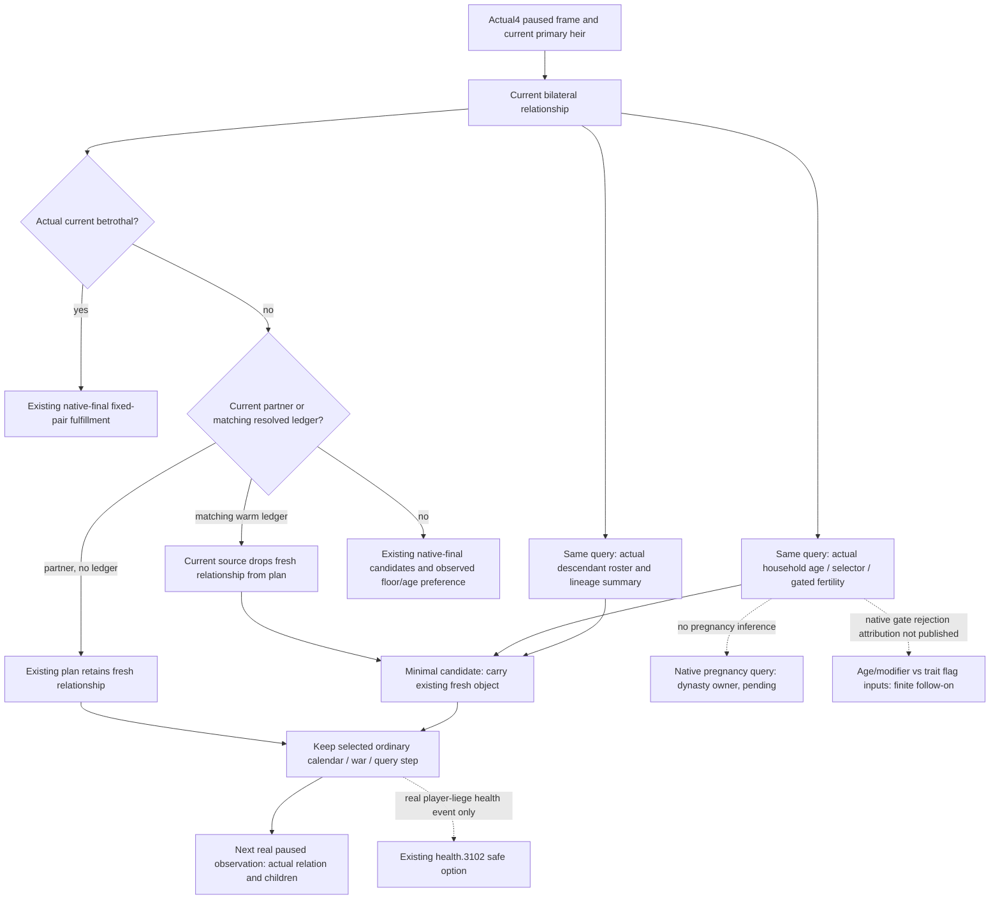

# Current first-heir family decision inputs, Runtime31

Source-first seal: 2026-10-08, Asia/Shanghai. This packet changes no game state.

## Identity and supplied qualification

Runtime31 source is `Z:/gbs-runtime31-source32-repair02`, pinned by the parent to
`96773ac0163c2ffcab5dfe89a0621cc86fdb228e`. Native identity is CK3 `1.20.0.4`,
Steam build `25734779`, EXE SHA
`98702f88a547cde2eaf29a85f93b85f68ee4cf8148336a4f7afaeb75319dd518`.
No EXE, process, Driver, save, import, SDK, build, test or FIRST is used here.

The current household observer originated at
`ccec7768874a4c547789f08048d89bc03857450d`. The parent supplied Runtime31 GREEN
for its seven native scenes and registered consumer, indexed by
`Z:/ck3_mod_rewrite_process_assets/g2-background-20261008/runtime31-first01/ROOT-FOUR-NEW-FIRST-RESULTS.json`.
That result is reused, not executed again. The historical source document's
AUTHORED_NOT_RUN label describes the earlier authoring phase.

## Native observer tree

`ck3_autonomous_player/native_bridge/include/xar_bridge/ck3_12004_first_heir_reproductive_inputs.hpp:14`
uses the actual current relationship's heir, primary spouse, spouse array and
betrothed IDs, in that order with deduplication. Each value is double-read through
the existing `family_value::ReadCharacterValue(..., true)` (lines 50–75).
The current relation and paused frame are checked again at lines 77–84.
The observer publishes actual signed age, native sex selector and gated current
fertility; a failed row stays unavailable and is not native zero.

The mapped existing fertility gate cache is
`Z:/ck3_mod_rewrite_process_assets/g2-migration-20261007/marriage-family/actual4-heir-lineage/function-map/adopted-existing-fertility-gate-DETAIL.json`.
Its complete cached 324-byte actual4 body at `0x28BB4C0` was inspected as saved
decoded metadata; no new native bytes were read. Its actual branches are:

- selector zero jumps to the trait loop, bypassing the female age calculation;
- the other selector uses an extended-data parameter lookup for native ID `0xBF`,
  native age override `Character+0x6C` when nonnegative, otherwise `+0x68`, and
  the actual loaded DWORD at `0x5C6A1A8`; an age above the calculated native limit
  returns false;
- the trait loop resolves each current trait from `Character+0xF8/+0x104`; a
  zero bit 5 of the resolved definition's DWORD at `+0x4A4` returns false;
- otherwise the gate returns true. The parameter's name and trait flag's name
  are not inferred here. This is source attribution, not a new diagnostic read.

The effective fertility getter proof at `0x28C6340` and the adopted reader
already distinguish missing extension/native rejection from a signed cached
raw value at extension `+0x2E0`, scale 100000. No future birth probability,
pregnancy or named trait diagnosis follows from that single-character raw.

## Actual production consumer tree

`ck3_autonomous_player/src/xar_autoplayer/bridge/service.py:1815` runs the
existing fixed-betrothal opportunity before the ordinary family opportunity.
`current_first_heir_betrothal_formal_consumer.py:209` returns the original plan
when no actual betrothal exists. A fulfilled existing betrothal retains its fresh
current relationship at lines 189–191. No pregnancy/children wait was found.

`family_marriage_formal_consumer.py:572` queries the fresh current relationship.
The no-ledger already-partnered branch at 622–625 retains it and leaves the
preselected ordinary step. The warm resolved-ledger branch at 620–621 instead
calls `_plan_existing_resolution` with the original plan and discards this
fresh relation from the resulting plan. The helper at 116–157 can only preserve
the old result/alliance evidence that it received. Thus fresh household values
and newly observed descendants are lost at this concrete consumer seam, even
though they were read and validated. The history may still hold the query;
the missing object is the current formal plan input.

The minimal source candidate carries the existing
`family_marriage_current_relationship` object through that call. It adds no new
wire field, getter, query, action, readiness gate, rank or probability. Existing
new-heir/ended-relation routing happens before the patched call. The unavailable
relation/cold fallback at line 582 is left intact.

For an actual new unpartnered heir, the existing native-final candidate route
and `first_heir_native_reproductive_preference.py` already consume observed
floor/age pass, partial and fail evidence without excluding fallback choices.
They are not rebuilt in this packet.

## Native action and outcome limits

A still-married pair can continue the existing calendar action. A current adult
betrothal may use the existing native-final fixed-pair fulfillment action. A
truly unpartnered heir may use the existing native-final candidate route. An
active player-liege `health.3102` event can use its existing qualified safe
treatment option for a court patient; `health-consumption-diagnosis.md:231`
documents that source tree. No present treatment event for the current heir or
spouse is supplied, so this is an existing conditional entrance, not a current
health action or asserted fertility improvement.

The current query's native descendant summary can distinguish known living
direct children and played-Dynasty matches. Neither a later query's positive
child count nor fertility implies a newly born child without before/after
material evidence. Natural succession credit remains separate.

Current native pregnancy is owned by `/root/dynasty_birth_inputs`; its named
registry research is not duplicated. Health alone is not a birth model, and
adding a health/null field without a reached controllable support opportunity
does not improve the current calendar route. The finite construction entrances
and exact limits are in `MINIMUM-INPUT-PLAN.json`.

