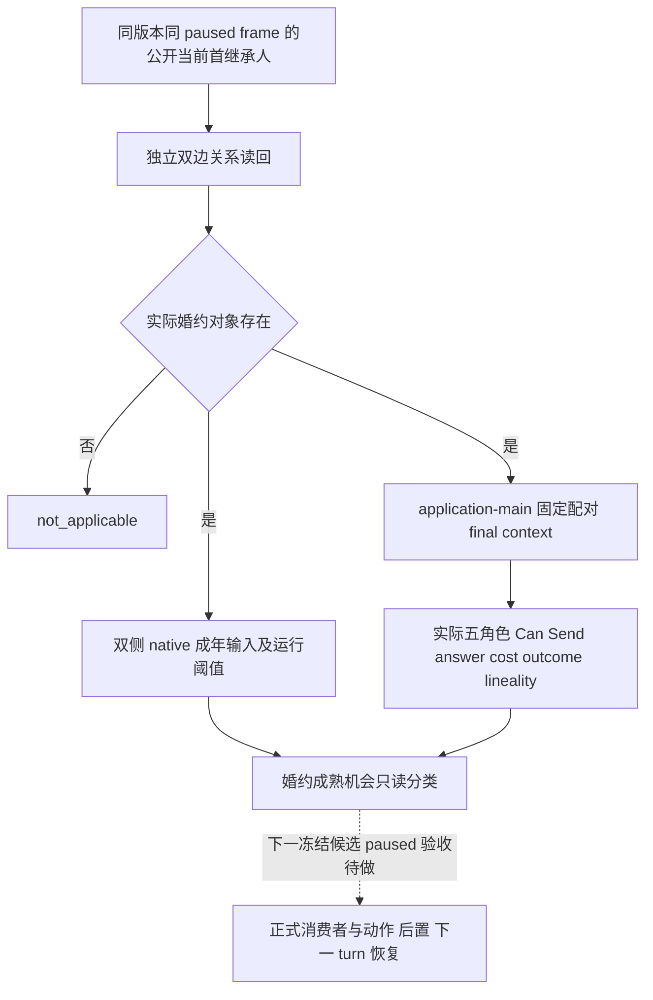
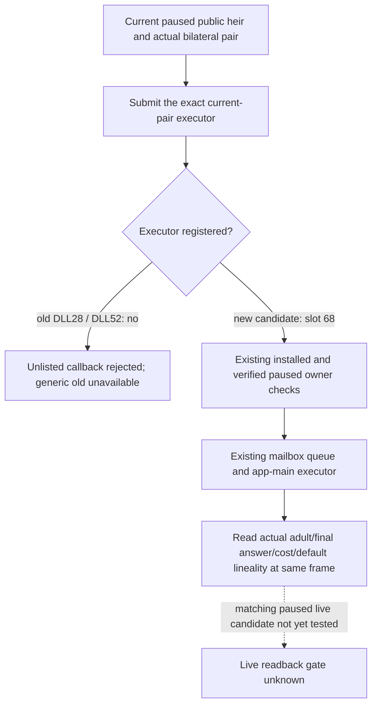

# 当前首继承人婚约的固定配对读回

包：`NW-FAMILY-CURRENT-BETROTHAL-READBACK-20260930`。
本包为私有只读接线，当前为 static-ready；没有新增求婚、婚约兑现、游戏日期或实机资格。

## 已存在的真实缺口与输入

R0402 的正式 companion 已从当前公开 campaign root 取得首继承人，并独立核实双方婚约。
既有 `query-current-first-heir-relationship-v1-private` 只发布关系，不发布双方成年与该实际配对的最终发送资格，因而不能判断是否到了兑现婚约的机会。
既有全候选查询只保留 Can Send 阳性行，不能用候选缺席推断实际婚约不成熟或非法。

施工前原生树已由 [家庭 companion 专题](m5-h3928-family-companion-preflight-2026-09-29.md) 的
不可变提交 `b2c66e534f2770fb97fb5babfca8bdfb1b0443c9` 先行记录：
`ready_to_marry_betrothed_trigger`（`00_marriage_triggers.txt:339–348`）要求存在婚约对象且双方 `is_adult`；
arrange marriage 的原版 redirect（109–134）、ready pair shown（334–365）与当前婚约配对 target（552–565）仍须经过原生最终判定。
普通 faith 判断仅由这一原生最终婚姻上下文消费，没有新增宗教策略。

## exact-build 复用

- CK3 `1.19.0.6-steam23530548`，EXE SHA-256
  `2D00FF3101EF70B566F2FCBAE292F09263199C80E9DC8F139B82D7D96F83DB86`。
- 成年输入复用 `marriage_container_outcome_abi_v1.json`：角色 `+0x68` 的 signed int16 measure、
  `+0x199` selector，以及运行时 `0x570E1D8` / `0x570F0E4` 的 signed int32 阈值。
  不用人物年龄推断，也不在此读口硬编码 16。
- 固定配对复用原生 redirect → all-role context → refresh → finalize；读取实际最终五角色、
  `Can Send`、recipient score/final answer，再复用现有 10 槽 signed Q100000 authored on-send cost evaluator。
- 兑现时的结果与父系/母系投影复用已有 `0x2282DE0` / `0x2282E86..0x2282EAB` 分支。
  `effective_matrilineal_if_accepted` 是当前原生最终上下文的投影，不冒充旧婚约自身未发布的 lineality 标志。

## 同一私有 query 的增量合同

现有 step / v1 schema / 关系字段保留，新增 `betrothal_actionability` 对象。
在已有 paused application-main mailbox 上只重建当前首继承人与其实际双边婚约对象的一份上下文，
不扫候选、不调用 option setter、不生成 proposal/action proof、不提交命令、不打开公共广告。

对象 `status` 为 `available`、`unavailable` 或 `not_applicable`；
真实 Can Send 为 false 时，只要必需字段均已读回仍可 `available`。
没有婚约的已读关系为 `not_applicable`；读取失败保留独立已读的成年/最终合法性等字段，
缺少的布尔值、成本和结果为 JSON null。
所有身份为正整数或 null，native intermediary `-1` 为 null。

- `adult_readback_available` 控制双方 `*_is_adult`、`*_adult_measure_raw`、`*_adult_threshold_raw`；
  `ready_to_marry_betrothed` 仅在实际双边婚约和双方成年输入已读时发布布尔值。
- `final_legality_sampled` 控制 `complete_can_send`；recipient score 与最终 answer 0/1/2 由
  `recipient_acceptance_ready` 控制，未读成功为 null。
- `generic_costs` 是 `raw_scale=100000`、`payer_role=actor`、`application_timing=on_send` 的十资源对象；
  不是未来联盟义务或兑现后的物质扣款。
- `predicted_outcome_if_accepted` / `effective_matrilineal_if_accepted` 分别发布 native marriage/betrothal 与原生 lineality 投影。

## 验收与兼容边界

聚焦检查覆盖：不同运行阈值、未成年、缺阈值、成年读不依赖 proposal context；
对象的未知/null、未成年 false、原生 Can Send false、成本零值/负值和 intermediary null。
Debug / Release bridge 编译与既有聚焦 CTest 各 `3/3 PASS`：
`current_first_heir_relationship_v1`、`marriage_native_outcome_classifier_v1`、`game_access_fixture`。
第三项直接调用生产固定配对读函数，实际 fixture 的双边关系与最终五角色绑定保持一致；
Can Send false 仍被真实采样，answer 2 保持已读拒绝，answer 3 保持未知，未调用 submit。
最终验证记录为 `D:\nw-family-current-pair-native-20260930\FINAL-VALIDATION.json`；
初次编译日志独立保留，最终仅增量重编实际修改影响的目标。
私有 additive Python transport 适配由独立家庭包负责；旧 DLL 缺对象仍为 unknown。
当前 frozen 8-flag DLL、PRV008 与已运行实例不热换。新 native 制品、配对/no-launch 和 paused snapshot 待下一候选。
公共 MCP/协议形状没有变化，`open_kaishek` 无需通用迁移。正式兑现动作、独立物质后置、下一 turn 与冷恢复尚未获得本包证据。

## R0406 actual application-main admission failure and minimal repair

Package `NW-FAMILY-CURRENT-PAIR-APPLICATION-MAIN-READBACK-20260930`, starting
source `7790ef859c1b1d7ba0b033760cca7c4a4d9204e2`; frozen EXE/version unchanged.
R0406 used the separate frozen query DLL28, not the untested action DLL52.
Its independently recorded current heir `38822` and actual partner `38718`
were bilateral and same-frame, but the optional actionability returned
`unavailable` / `current_betrothal_application_main_unavailable`: no adult,
threshold, final CanSend/answer, costs or lineality read completed. This is a
failed live readback, with zero actions and zero date advance. Retain its
immutable terminal artifact:
`D:\nw-robert-nonwar-postcondition-review-20260930\R0406-FAMILY-LIFE-ACTUAL-TERMINAL.json`,
SHA-256 `D1234F2495880B1EEE3BADC8531A362AAD834321D93D60DFF32D87E2B51082B8`.

The exact enum was not exposed by that old generic fallback. Source tracing
found a deterministic admission omission: the current-pair query executor
was submitted directly, but absent from the actual populated mailbox executor
registry. `TrySubmitMainThreadQueryV1` rejects an unlisted callback with
`invalid_request` before its installed/owner/paused/queue checks. The old
alliance projection executor is registered under slot 48; it does not authorize
the different current-pair executor. DLL52 added the typed fulfillment
executor but omitted its registration too, so it is not a matching fix.

The minimal repair extends the existing registry with private current-pair
query slot 68 and fulfillment slot 69, using the existing install certification,
environment-to-mailbox copy and exact callback admission pattern. Slot 68 is
registered only under the existing alliance-query build guard; slot 69 also
requires the existing first-heir-action guard. No owner, pause, same-frame,
native final evaluator, wait/reclaim, desktop or episode rules change. Submit
fallbacks now retain `unavailable` and identify their actual admission failure
stage in the reason; no missing input becomes a false/zero/adult observation.

Production mailbox regression reproduces zero executor calls and
`invalid_request` with the registry omission. Registered callbacks retain
`paused_main_thread_not_observed` before owner observation, then each execute
once and complete/reclaim through the actual paused queue. A source binding
check ties those slots to the actual private bridge executors and guards.
Focused Debug and Release bridge builds passed. In each mode the production
mailbox regression and current first-heir relationship fixture passed 2/2.
The original exact-build field readers and native action binder are unchanged;
the earlier #768/#775 independent focused results remain scoped evidence.
This submission repair still needs a matching paused live readback candidate.
No new CK3 instance, action, adulthood or query live success is claimed here.
