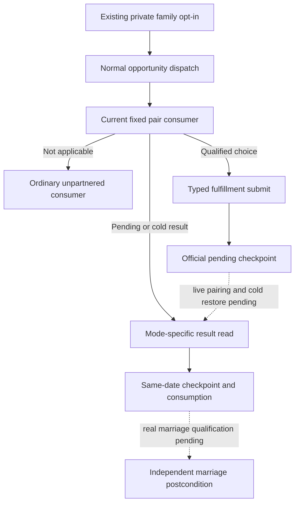

# Existing first-heir betrothal: formal entry

Package: `NW-FAMILY-CURRENT-PAIR-FORMAL-ENTRY-20260930`.
Initial source baseline: `48f8496d09678918d3b3d682d0c0853fa1370bad`.
This package concerns the Python formal turn entry. It does not qualify a new
native action or modify the frozen Robert candidate.

## Observed source gap

The existing default-OFF option is already passed through
`g2_preview_operator.py` -> CLI -> `native_auto_run` as
`allow_private_family_marriage_formal_trial`. It reaches the ordinary family
planner in `GameplayBridgeService.plan_turn`; there is no missing argument.

`plan_family_marriage_private` in `family_marriage_formal_consumer.py:599`
returns `current_first_heir_already_partnered` for the current heir's existing
betrothal. It does not evaluate the fixed pair's `betrothal_actionability` or
submit a fulfillment proposal. An existing marriage and a betrothal that can
now become a marriage therefore share the old hold path.

The required native inputs are recorded in
[current-first-heir-betrothal-actionability-v1.md](current-first-heir-betrothal-actionability-v1.md).
The exact CK3 build remains `1.19.0.6-steam23530548`, EXE SHA-256
`2D00FF3101EF70B566F2FCBAE292F09263199C80E9DC8F139B82D7D96F83DB86`.
The existing native final marriage context supplies adulthood, Can Send,
answer, costs and predicted outcome; age alone is not a readiness test.

## Entry work and evidence boundary

The fixed-pair consumer and typed binder are separate packages. This entry
will reuse the existing private family opt-in and the existing family ledger.
The ordinary unpartnered route remains the fallback. A fulfillment result
must be dispatched in its own mode: the old betrothal remaining present is
pending, and only an independently observed marriage is material completion.

The entry reuses `allow_private_family_marriage_formal_trial` to set the
internal fixed-pair gate. Its normal, pre-war, wartime and M5 fallback calls
try the fixed pair first and use the ordinary planner when it is not
applicable. A due LIFE action and other already selected real actions retain
their existing priority rules.

`submit-current-first-heir-betrothal-fulfillment-v1-private` is dispatched to
the typed consumer. The existing result step is dispatched by the explicit
`current_betrothal_fulfillment` marker. After an ACK, the normal save checkpoint
preserves the pending identity and `fulfill_existing_betrothal` mode. Every
fulfillment result read is paired with the unchanged paused game frame;
the consumer then records the actual checkpoint revision/date it consumed.
The full original family ledger remains the recovery input.

The official pair validator now recognizes this mode's step, submit checkpoint
phase and choice key. Its existing proof chain is retained. A marked
fulfillment cannot qualify the already existing betrothal as a material
resolved result. The compact formal report retains the mode and native
lineality option, so it remains a usable official recovery input.

## M5 fallback loss

At baseline, `service.py:999` unconditionally overwrites a selected independent
family step with `None` when the joint query returns
`m5_joint_query_only_red`. Replaying that actual production branch reproduces
the loss. The new fixed-pair submit/result can keep its independent selection
while the joint RED reason and `formal_action_ready=false` remain recorded.
The five-candidate M5 contract and the old ordinary family branch are unchanged.

Operator recovery fixtures pass in normal and optimized Python modes: new
submit/save, new PID without resubmission, refusal to count the old betrothal
as fulfilled, and the two existing ordinary pending-pair cases (`5/5` each).
The exact committed consumer tree `66fc7fbb2268b937fd3c92ee2ba520eb2727c519`
was loaded through an external production-module overlay, without copying
dependency files into this source package. Eight real service route fixtures,
one default-OFF formal-run fixture and one submit/pending/checkpoint/report
fixture pass in normal and optimized modes (`10` conclusions each).
The final run fixture feeds the actual compact `native_auto_run` report into
the official pending-pair validator and confirms the checkpoint consumption
revision can advance beyond the result-query revision without another submit.

The first run-fixture expectation wrongly required an ACK and pending query
to qualify the whole bounded run. The production result correctly remained
`not_qualified` with `run_bound_exhausted`; the test now expects that result.
The original failed attempt is retained in the package's external artifacts.
Service fixtures use actor `101`; the formal-run harness uses actor `707`.
Neither is evidence of a Robert proposal or a completed marriage.
`open_kaishek` preflight is not applicable to this Python dispatch/checkpoint
change; no CK3 script or finite script-runtime behavior was changed.

No CK3 was started, no proposal was sent in CK3, and no game date advanced in
this package. Frozen Robert source/DLL/save/driver combinations remain separate.
