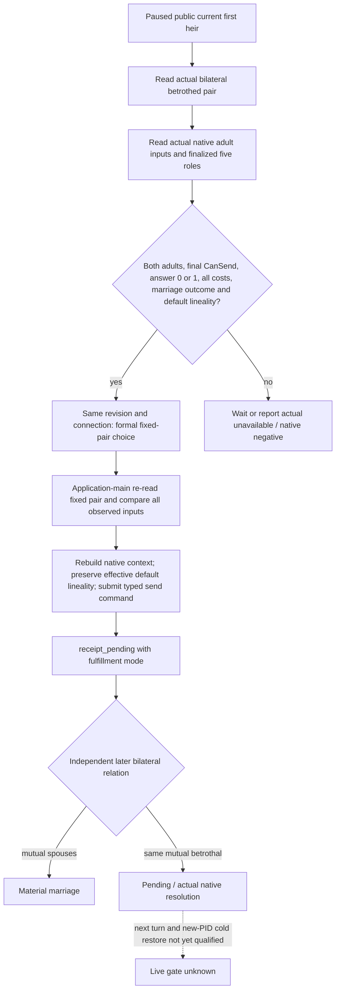

# Current first heir: fulfill the existing betrothal (private v1)

Package: `NW-FAMILY-EXISTING-BETROTHAL-ACTION-NATIVE-20260930`.
Source implementation only; no CK3 launch, proposal, acceptance, marriage,
next turn or cold restore is claimed by this package.

## Native tree and observed gap

Frozen engine: `1.19.0.6-steam23530548`, EXE SHA-256
`2D00FF3101EF70B566F2FCBAE292F09263199C80E9DC8F139B82D7D96F83DB86`.
The original marriage tree is already recorded by immutable source commit
`b2c66e534f2770fb97fb5babfca8bdfb1b0443c9` in
[family companion preflight](m5-h3928-family-companion-preflight-2026-09-29.md).
`00_marriage_triggers` 339–348 requires a betrothed and both actual adults;
`00_marriage_interactions` 109–134 redirects the fixed roles, 334–365 exposes
the ready pair, and 552–565 accepts the actual betrothed pair with native final
valid-target evaluation. Faith remains an opaque native final input.
The actual current-pair readback is documented in
[actionability v1](current-first-heir-betrothal-actionability-v1.md).

The old `PrepareObservedHeirMarriageSubmissionV1` rejects either existing
betrothed relation. Its full candidate-inventory route is therefore unsuitable
for fulfilling an independently observed existing pair. The old material
reader considers bilateral betrothal a successful new proposal; using that
rule for fulfillment would misclassify the unchanged pre-action relation.
Production helper fixtures cover both exact gaps and the replacement route.

## Private action contract

Step: `submit-current-first-heir-betrothal-fulfillment-v1-private`.
Payload: `expected_revision`, `heir_character_id`, `candidate_character_id`
(actual partner), `recipient_character_id`. Immediately preceding
`query-current-first-heir-relationship-v1-private` must have observed that
fixed pair in the same paused native revision and connection, after the
same-revision public campaign-root first-heir observation. No candidate
inventory, AI rank, query sequence, option setter, cancellation or alternative
proposal is used.

The app-main executor independently observes the current relation and native
actionability again. Cached and fresh adult raw measures/runtime thresholds,
five roles, final legality, answer, all ten signed native costs, exact predicted
outcome and effective lineality must agree. The pair must still be bilateral
betrothed with no mutual spouse, both actual adults, final CanSend true,
native final answer 0/1, all costs observed and predicted outcome `marriage`.
The existing binder rebuilds/redirects/finalizes the exact five roles, checks
actual prior betrothal again, reads final CanSend/answer and exact marriage
outcome, and preserves native effective default lineality in the original
and copied context without changing any option. It queues the existing typed
`CSendCharacterInteractionCommand` through the existing flags and lifecycle.

The reply uses the existing observed-heir action receipt schema and adds
`fulfill_existing_betrothal: true`. `matrilineal_option_selected` records the
observed effective native default. ACK remains `receipt_pending`, never a
material marriage result. The shared pending fence prevents another family
send while the action may have submitted.

Result step remains `query-observed-first-heir-marriage-result-v1-private`.
Warm native pending preserves the mode. Cold recovery supplies the existing
identity/source-date fields plus `fulfill_existing_betrothal: true` and the
submitted `matrilineal_option_selected` boolean. A retained bilateral
betrothal is pending, or the actual warm accepted_pending/refused/invalidated
resolution. Cold pending uses the existing exact outbound pending observer.
Only mutual spouses are material success for this mode. The old new-proposal
and specified-child modes retain their own betrothal success semantics.

## Delivery and qualification

The action is compiled only with the existing private first-heir action plus
alliance projection query gates. Public query/action advertisements remain OFF.
The existing eight-flag frozen read-only DLL `28C144...` is untouched; this
source requires an independent next candidate, official pair/no-launch,
paused fixed-pair readback, an actual formal send, independent spouse post,
next-turn consumption and contract cold restore before a live qualification.
Python transport/consumer and runner are separate owned packages; no public
interface break or unrelated downstream migration is introduced.

Focused native Debug and Release bridge builds passed with the existing
eight private flags. In each mode, the production observed-heir helper,
native proposal binder and current first-heir relationship fixtures passed
3/3. Fixtures cover the unchanged old-proposal rejection, fixed actual pair,
all ten cost drift, actual minor/negative CanSend/answer 2/non-marriage outcome,
default lineality source and command copy without setter, and warm/cold
unchanged prior betrothal versus material marriage. No live action gate was
run. Build/test logs and the new independent DLL are retained outside the
temporary source clone.
