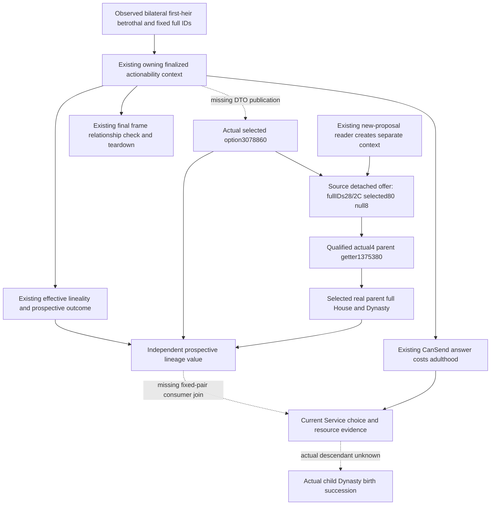

# Current first-heir betrothal: prospective lineage inputs, native 1.20.0.4

Recorded 2026-10-07, Asia/Shanghai, ISO 2026-W41. This source-first plan uses
the existing actual4 family tree, observer APIs and consumer source. Target
is CK3 1.20.0.4 / Steam25734779 / existing frozen EXE identity
`98702F88A547CDE2EAF29A85F93B85F68EE4CF8148336A4F7AFAEB75319DD518`.
The independent documentation worktree starts at Root source
`bf16ec708981ecf8fa3e623e1eddd7ab8c210e4a`; the source inventory was read at
the already adopted age candidate `0ff6fccbb0e1f7a31f4c603e104f16527fb94bca`.
Age/floor FIRST belongs to Root and is not reread, rerun or credited here.

The next independently useful input is the current fixed betrothed pair's
**actual selected proposal option and its native prospective child-House /
Dynasty preview**. The new-candidate route already has that preview. The
fixed-pair actionability route publishes effective lineality but omits actual
selection and the selected-parent lineage join. All needed actual4 native
primitives already exist; this plan requests zero new EXE acquisition.

## Actual omission and its decision scope

The resource builder `current_betrothal_fulfillment_proposal.py:75` retains
`child_dynasty_result` in its `unpriced` list. That is metadata, **not an
existing fulfillment blocker**. Current `evaluate_current_betrothal_fulfillment`
can choose the adult bilateral pair using observed CanSend, positive native
answer/acceptance, marriage outcome and its existing cost contract. Its failure
keys concern those already published inputs; none represents a missing preview.
No new action restriction follows from this inventory.

The missing observation instead answers which current parent's House/Dynasty
the native UI preview selects under the fixed pair's finalized fulfillment
option. This is useful input for the existing dynasty-continuity objective.
The fixed-betrothal Service route returns before the ordinary new-proposal
route, so that route's qualified preview cannot cover it. The old unpriced
actual-child result remains unpriced even after a prospective preview is
known. A preview is not an observed descendant, conception, pregnancy, birth
or guaranteed Dynasty continuation.

| Layer | Published now | Missing current fixed-pair input |
| --- | --- | --- |
| Native actionability | `ReadCurrentFirstHeirBetrothalActionabilityV1`, `ck3_12002_family.cpp:501`; current pair, finalized context, CanSend/answer/costs, adulthood and effective lineality | Actual selected matrilineal option retained independently of effective lineality |
| Current DTO / wire | `CurrentFirstHeirBetrothalActionabilityReadV1`, `ck3_11906.hpp:1288`; `current_first_heir_relationship_v1.cpp:77` | Selected option and native-selected parent/current House/Dynasty |
| Strict transport | `_current_pair_actionability`, `current_first_heir_relationship_private_transport.py:51` | Optional selected-option-bound preview with its own readiness |
| Current Service / value | `plan_current_first_heir_betrothal_fulfillment_private`, `current_first_heir_betrothal_formal_consumer.py:110`; resource builder `:30` | Retention of the observed prospective lineage, independently of the existing action decision |
| New-candidate route | Existing `family_obligations_lineage::Read`, native child-House preview and `first_heir_native_lineage_policy.py` | Already implemented; no repeat observer or candidate pool is needed |

Current player relation IDs and candidate relations already have their own
observations. No additional unpartnered-candidate rule, rank, fertility gate,
age rule, ROI requirement or current-player fertility query is proposed.

## Source-defined owning context and native tree

The current actionability reader prepares the verified fixed heir/betrothed
pair in `ContextStorage` at family.cpp518. Its live context pointer at521
is owned through the return by `DestroyContext` at522. It checks actual roles,
samples final CanSend and answer at530–536, then costs at537–540 and outcome
at543. The existing final frame, relationship and Character-pointer recheck
at555–559 happens before destruction. The new observation belongs inside
this same interval; another fresh pair context would not prove the same option.

The already bound actual4 option getter is
`b.read_boolean_option(context, *b.matrilineal_option)`: RVA `3078860`,
StringID slot `5D4BDBC`. Legal false is a known selection. `ReadOutcome`
uses selection when selectors differ, but for equal selectors derives
effective lineality from the subject selector. Therefore effective lineality
cannot stand in for selected option in the child-House preview.

| Subject selector | Candidate selector | Selected | Effective if accepted | Native preview parent |
| --- | --- | --- | --- | --- |
| 0 | 0 | false | false | subject |
| 0 | 0 | true | false | candidate |
| 1 | 1 | false | true | candidate |
| 1 | 1 | true | true | subject |
| different | different | selected bool | selected bool | subject iff selected equals bool(subject selector) |

The existing lineage reader's lower stage (`ck3_12002_family_obligations_lineage.cpp:64–93`)
constructs a zero-initialized aligned `0x88` detached offer. It writes the
already bound native vtable at0, subject/partner full IDs at28/2C and actual
selected bool at80. Offer8 remains null, selecting the native cached-option
path. Existing actual4 `BindFamilyLineageImage` supplies parent getter
`1375380` and vtable `454E470`. The returned native parent is checked against
the resolved subject/partner pointers, then the existing
`family_value::ReadCharacterLineage` resolves that parent's current full
House at Character158 and full Dynasty at House2C.

The public `family_obligations_lineage::Read` constructs its own new context.
It is not a supplied-context overload. The minimal implementation must extract
that lower detached-offer/parent/lineage stage and feed it the selection from
the current actionability context, rather than call the IDs-only reader and
label a second context's result as the first context's selection. Its existing
new-proposal caller can reuse the extracted stage while retaining its own
construction. No new getter ABI or source capture is required.

## Smallest implementation and FIRST plan

Keep the current-first-heir relationship MCP and its `betrothal_actionability`
object. Publish optional `matrilineal_option_selected` from the current owning
context. Add an independently available `native_child_house_preview` using
the existing preview contract: selected option, separate effective lineality,
actual selected-parent full ID and current House/Dynasty. Propagate the already
qualified actual4 lineage bindings to the owning callback; reuse existing pair
IDs, core and final frame check. Missing only the new binding/read leaves the
legacy actionability semantics intact.

Strict normalization retains observed false, lawful missing lineage and
absent/null older fields. The formal Service retains the preview in current
choice/resource evidence and pending value. Its readiness describes this
prospective current-pair input, not actual offspring. Existing action evaluation
and `unpriced.child_dynasty_result` remain their own contracts; observation
does not authorize a new decision gate or market price for descendants.

One dedicated new native target should exercise the production current-pair
reader, extracted stage and current relationship serializer. Required cases
are selected false/true with differing selectors, a same-selector case proving
selected/effective distinction, missing new preview binding with legacy inputs
available, and no current bilateral betrothal without demanding unused preview.
Use source-shaped memory and callbacks, never a gameplay sender. One new
complete Service compound then consumes only these new whole wires through
the actual current relationship transport and fulfillment planner, retaining
observed lineage while showing unchanged legacy fulfillment decisions.
All five native cases and the sole compound are a **recipe, NOTRUN**; no
fixture or implementation is claimed by this source package.

The loaded pre-floor minimum-age operand is retained as a separate finite92B
source alternative. It is not requested or acquired here and does not delay
this source-closed same-context lineage join. Native total score already has
its own actual ready-Strategy contract; an absent Strategy is not a score
field to invent. The Age candidate remains under Root25 FIRST independently.

Source readiness: **research / source-closed plan**. Implementation, new
native/Service qualification, paused values, material fulfillment, birth,
natural succession and additional G2 credit remain0. Root owns integration,
FIRST, shared reports and publication. External input ledger/API/FIRST recipe:
`Z:/ck3_mod_rewrite_process_assets/g2-parallel-20261007/first-heir-next-readiness25/`.
