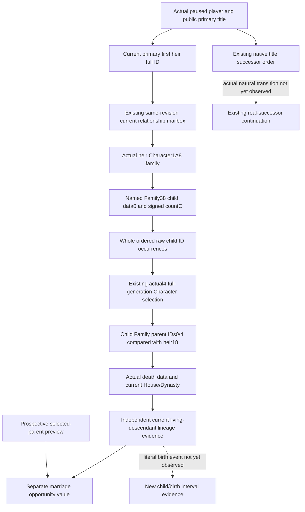

# Current first-heir observed descendants: native 1.20.0.4 input plan

Source inventory recorded 2026-10-07, Asia/Shanghai, ISO2026-W41. Target is
the existing frozen CK3 1.20.0.4 / Steam25734779 build. This is a new
source-only plan. The preceding same-context prospective-lineage candidate
`6fb7270375dfa0f014c1d82ced18acf3bc7a8def` remains frozen for Root27 FIRST;
its five whole wires and sole Service compound are not rerun or credited here.

The next independently useful observation is the current primary first heir's
**actual children and their current House/Dynasty**. Native effective fertility
and the selected parent's prospective child-House preview answer different
questions. Neither establishes that a descendant currently exists. The new
input would let the dynasty-continuity objective distinguish existing living
descendants from a prospective marriage value without predicting conception,
forcing a House, replacing native successor order or waiting for a birth.

## Existing inputs and concrete missing scope

| Current entry | Existing value | Why it does not cover this input |
| --- | --- | --- |
| Public campaign-root primary title | Current first-heir identity and native succession order | Successor IDs are a succession result, not the heir's complete direct-child roster. |
| Current first-heir relationship private query | Same-frame bilateral betrothed/spouse relation and additive actionability | It does not publish the heir's children. |
| Rich-five family fertility / Age / floor | Actual current subject/candidate native decision inputs | Current fertility and scored age do not observe children or predict births. Root25 qualification is reused without replay. |
| Native child-House preview | Selected parent's current House/Dynasty under the finalized option | This is prospective, not a realized child's House/Dynasty. Root27 candidate has no birth credit. |
| `ReadPlayerFamilyArrayProbeV1` | Named played-character spouse/children diagnostic headers and at most16 IDs | The receiver must be the played character. Its sampled prefix cannot stand in for the current heir's whole list. |
| `ReadPlayerChildMarriageSubjectV1` | Observed specified player-child identity, lineage, adulthood and relations | Its actual-child scope is the played actor; a first heir's child can be a grandchild of that actor. It is not a complete descendant roster. |

Current fulfillment actionability remains independently usable. The preceding
`unpriced.child_dynasty_result` metadata is not a new action blocker; this plan
introduces no additional marriage gate, ranking change or actual-child price.

## Already held actual4 native operands

The actual4 source cache already proves the operands needed for a read-only
child roster. No new EXE acquisition, global address shift or whole stock
collector recapture is requested.

| Operand | Existing actual4 authority | Used meaning |
| --- | --- | --- |
| Character family pointer | `marriage-family/actual4-heir-lineage/subject/diagnostic-map`: actual1C11B94 reads Character1A8 | Resolve the current heir, then read its own family object. |
| Child vector | actual1C11BA0 adds Family38 | The named child collection, not an arbitrary header identified by shape. |
| Raw data and signed count | actual1C11BAD reads data0; actual1C11BB0 MOVSXD count+C | Capture the whole current occurrence sequence rather than the diagnostic16-sample prefix. |
| Actual child-of relation | `ck3_12004_family_subject.cpp`: actual2B6EED4/EDC/EE8/EED | Child Family1A8 parent full IDs0/4 compared with the resolved parent Character18. Null child family is a known false relation. |
| Character selection / alive | Existing actual4 Core binding and current family reader | Per-occurrence full-generation identity and actual death pointer, rather than name/House inference. |
| Current House/Dynasty | Existing actual4 `BindFamilyValuesImage` and `ReadCharacterLineage` | Read each actual child's Character158 full House and House2C full Dynasty with the qualified stores. |

The child-vector witness is the retained32-byte mapped window:
old `[1C11BB4,1C11BD4)` -> actual `[1C11B94,1C11BB4)`. Its existing
`FAMILY-MAP.json` marks the complete instruction span/edges/local topology
normalized equal. The old and actual acquisition totaled64B/two reads in
that original migration; this plan performs zero new acquisitions and does
not repeat its DETAIL/body. The separate inline parent-ID witness is already
implemented by the actual4 family-subject binder.

The selected cached metadata row is ordinal94140, old
`[1C11B50,1C11BE1,510F2E0]` and actual `[1C11B30,1C11BC1,510F3D0]`.
This is a collector locator, not admission to invoke its complete body. The
observer can consume the already proved fields inline; no whole native
collector callable or borrowed old-version ABI is required.

Capacity is not read by that named child-collection consumer and is not needed
to publish the demanded data/count sequence. No new capacity field or borrowed
old capacity claim is proposed. This input does not require reproducing the
entire stock collector's filtering/sorting or a generic birth forecast.

## Minimal same-query producer and consumer

Keep `ck3_query_current_first_heir_relationship_private_v1` as the owning MCP.
It already binds the primary first heir from the fresh public campaign root
under the same native revision. The native current relationship mailbox can
append one optional `current_first_heir_descendants_v1` family. Use the
same selected heir, core and final frame/identity observation as the current
query. No caller-selected arbitrary parent, extra query or unrelated census
is required.

Proposed observation fields:

- Current heir full ID and receiver identity; family pointer presence.
- Raw signed child count and raw data presence; independent header/whole
  occurrence availability. A known zero is distinct from missing input.
- Whole ordered occurrences with native index and raw full u32 child ID.
  Preserve repeated IDs and invalid/unresolved entries as observations.
- Per occurrence actual selected identity, full-generation result, death data /
  alive, both raw parent IDs and actual child-of-this-heir result.
- For an actual resolved child, current full House/Dynasty from the existing
  lineage reader. The raw observed contract retains legal no-House/no-Dynasty
  `-1` and lawful0; unavailable reads use null. The earlier proposed nullable
  no-House wording is superseded by this explicit raw lineage contract.

Call `ReadCharacterLineage` directly for the observed resolved child. The
general `ReadCharacterValue` rejects dead characters, so it cannot supply the
whole historical child roster. Keep deceased raw/resolved occurrences and
their parent/lineage observations while summarizing living descendants
separately; death does not erase their actual relationship from this read.

Do not drop unresolved occurrences and then label the remainder a complete
living-child list. Record complete raw collection availability separately
from each demanded relation/lineage result. A future pure consumer can retain
the ordered evidence and summarize observed living direct children and
their current Dynasty; partial items stay explicit rather than becoming an
invented empty family. These summaries add decision information independently
of the existing marriage action's readiness.

## Material birth and natural succession remain distinct

This current input can establish an actual direct-child relationship and a
current child's actual House/Dynasty. It does not alone establish a new birth
date, biological cause, future child, or a natural-death transition. Comparing
fresh same-subject rosters with an existing earlier baseline can report newly
observed descendant IDs, while preserving the baseline's actual episode/frame
and keeping the event's cause separate. No stale roster is relabeled current.

Natural succession already has its own existing current-title successor,
death modal, matched successor continuation and new actor/episode contracts.
Use the actual post-transition played actor and fresh public first heir;
current child position is not a substitute for native succession-law outcome.
This package proposes no replacement of those contracts and grants no birth,
succession, game day, live loop or G2 counter credit.

The source-plan commit `217428600d629e3e3d68b883298faf0e62483146` was
**research / source-closed input plan**. Its implementation was subsequently
authorized by Root. The historical plan executed no imports, tests, builds,
runtime queries, SDK/game/process/UI operations or EXE reads/hashes.

## Authored same-query observer and FIRST recipe

The actual4 current relationship query now samples
`ReadCurrentFirstHeirDescendantsV1` inside its existing application-thread
callback, using the selected public primary-first-heir identity and the same
qualified Family/Core/House/Dynasty bindings. A tail mailbox flag is enabled
only for that actual4 owning query. The fulfillment action does not opt in to
this extra observation. The enclosing full snapshot still binds the callback
to the public actor/heir revision; the leaf preserves frame/header stability
and records its current date.

The new header-only collector emits optional
`current_first_heir_descendants_v1` in the production whole relationship
serializer. It retains every raw u32 occurrence, native index, generation
selection, liveness, actual parent IDs and lineage. A null child Family is a
known false child-of relationship. A missing heir Family, negative signed
count or positive count with null data is an independent partial. A known
zero count is a complete empty roster. Unresolved occurrences remain in the
complete raw roster and carry unknown relation/lineage values.

Python preserves the native leaf and adds a separately named derived
`current_first_heir_descendants_summary_v1`. It counts known direct/living
occurrences, provides explicitly distinct-ID summary lists, and compares
current child's Dynasty separately with the actual heir and played actor.
Legal reference Dynasty `-1` means that comparison is not applicable. Missing
lineage and unresolved rows retain partial summary completeness while known
living-child existence remains useful. The current fulfillment choice and
resource proposal carry both observations as evidence; action terms, ranking,
force-House behavior and the original unpriced result stay unchanged.

The new native target is
`xar_ck3_12004_first_heir_descendants_test`, linked to the existing
`xar_ck3_12002_runtime` and `xar_bridge_protocol`. It requires the existing
`XAR_CK3_ENABLE_G2_M5_ALLIANCE_PROJECTION_PRIVATE_QUERY_V1` definition and
active assertions (`/UNDEBUG` or `-UNDEBUG`). No new production translation
unit is needed. Root owns registration, formal compilation and FIRST.

Six new whole frames are authored: `complete-roster`, `known-empty`,
`data-missing`, `family-missing`, `lineage-missing`, and `no-betrothal`.
The complete roster has18 occurrences including dead, invalid, mismatched
generation, foreign-parent and repeated IDs; its last actual living child is
at index17. The observed heir Dynasty is200 and played Dynasty400. Known direct
occurrences are15, living direct occurrences14; living matches are13 for the
heir Dynasty and1 for the played Dynasty. Distinct direct IDs are3 and living
IDs2. These are sealed expectations, not executed results.

The single registered-MCP/Service compound is
`CurrentFirstHeirDescendantsRegisteredServiceTests.`
`test_complete_descendants_reach_registered_query_and_service_as_readonly_evidence`
in `test_current_first_heir_descendants_registered_service.py`. It consumes
the six emitted whole frames and one explicit legacy-absent copy. It uses the
real registered relationship query and `ck3_plan_turn` consumer, keeping actual
empty/partial/non-betrothal routing intact. It has not run in this candidate.

Candidate status: **AUTHORED_NOTRUN / source-closed implementation**, with
native6 and sole Service7 FIRST reserved for Root's immutable source tree.
There is no new birth, natural succession, paused live query, game day or G2
counter credit. Actual descendants will be observations of current records;
the selected-parent preview remains prospective. Shared reports and final
qualification remain Root-owned.
