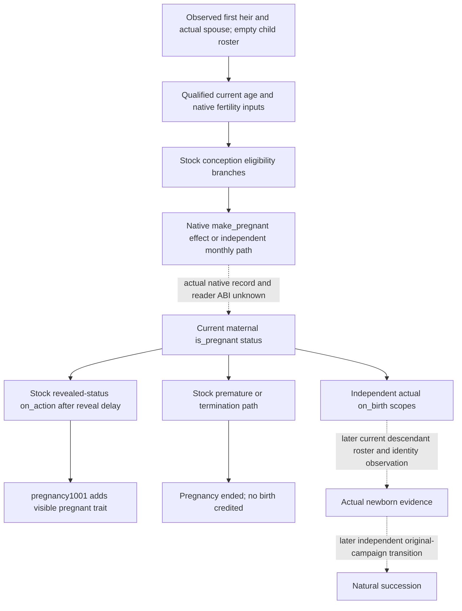
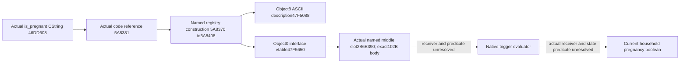
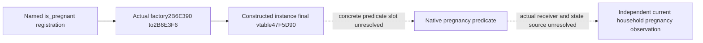
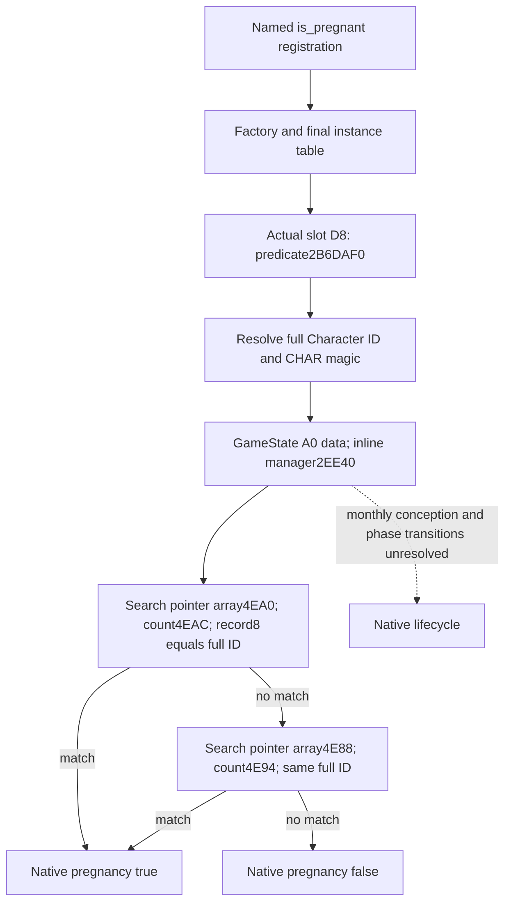
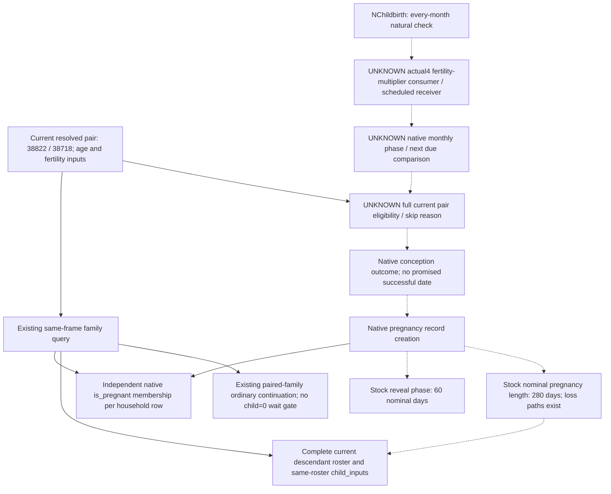
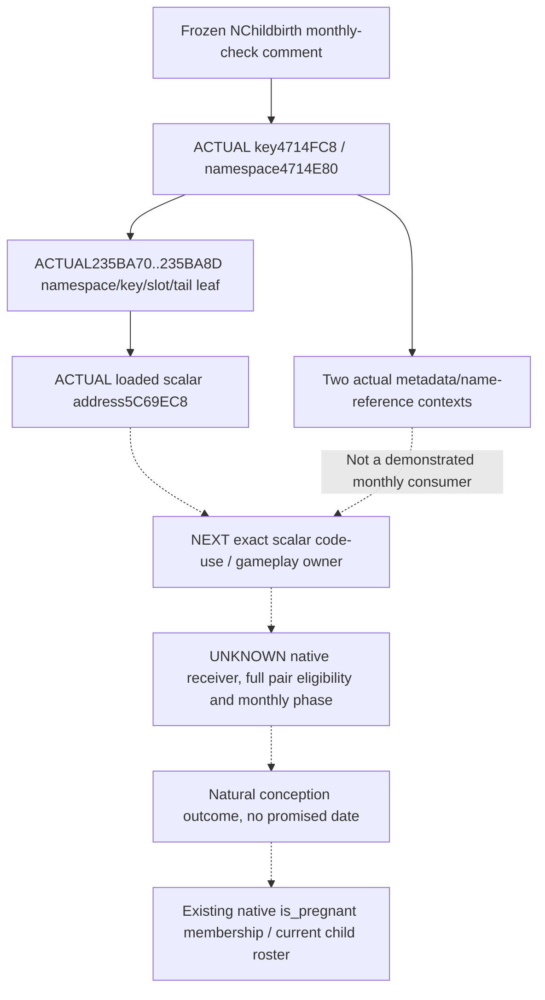
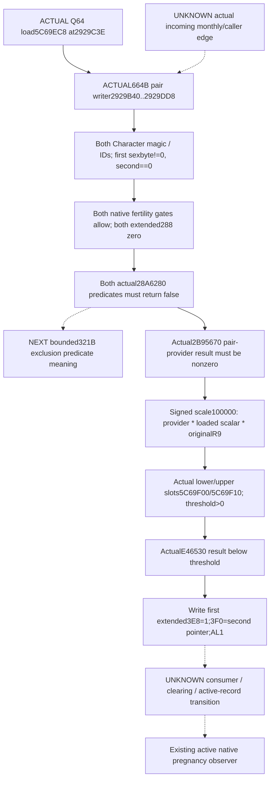
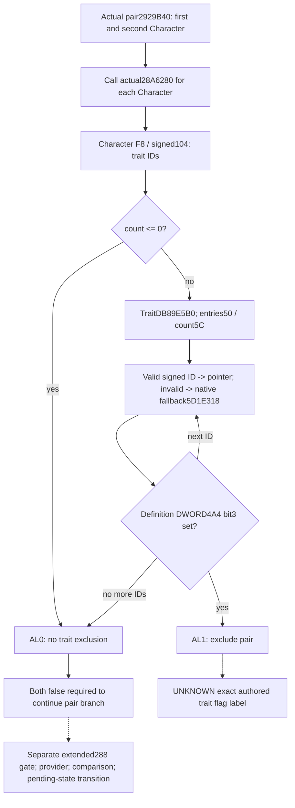
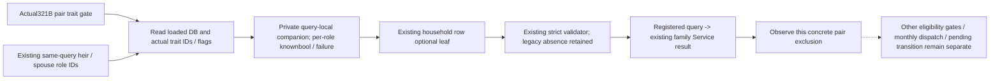

# Current first-heir pregnancy: exact native status entry

Research packet recorded 2026-10-08 / ISO 2026-W41. The exact game remains
CK3 1.20.0.4 / Steam 25734779, held SHA-256
`98702F88A547CDE2EAF29A85F93B85F68EE4CF8148336A4F7AFAEB75319DD518`.
This topic supplements the
[qualified current household inputs](current-first-heir-reproductive-inputs-12004.md)
and the source-first workflow in [the native AI index](README.md).

## Current independent observation gap

Root's retained R76 original-campaign evidence identifies Robert 29829,
current first heir 38822, spouse 38718, a complete empty current child roster,
and zero observed natural successions. This is a retained baseline rather
than a fresh observation by this source worker. Root subsequently qualified
the household observer's seven native scenarios and its eight registered
consumer passes; the qualified Runtime31 source has not been deployed at the
time of this packet. The original authored FIRST recipe remains NOT RUN;
Root's later execution records own the actual test result.

Current age, native sex selector and effective fertility are independent
household inputs. Their qualification does not supply a current pregnancy
record. Marriage acknowledgement, prospective marriage legality, fertility,
absence of a visible pregnancy icon, and an empty child roster cannot answer
the missing current pregnancy question. The existing normal paired-household
calendar policy continues; this research adds no waiting gate or conception
probability model.

## Stock native names and lifecycle evidence

The current stock root is
`Z:/SteamLibrary/steamapps/common/Crusader Kings III/game`.
The stock source work is independently retained by
`/root/person_later_suffix/trait_growth_side_source` at
`Z:/ck3_mod_rewrite_process_assets/g2-parallel-20261008/current-pregnancy-birth32/stock/`.
Its `SOURCE-TREE.md`, `SOURCE-READS.json`, `QUERY-PLAN.md` and `DELIVERY.json`
retain the exact line spans, Mermaid tree, independent query proposal and
zero EXE/Game/build/test cost.

- `common/scripted_triggers/00_romance_and_seduction_triggers.txt:863`
  defines `possible_pregnancy_after_sex_with_character_trigger`. Its opposite
  selector branches require both people to be visibly fertile, fertility at
  least 0.1, and the maternal receiver's `is_pregnant = no` at lines 876/887.
  This supplies the exact authored engine status-trigger name
  `is_pregnant`; it does not supply its registered callback or ABI.
- `common/scripted_effects/00_romance_effects.txt:498,579` uses the native
  `make_pregnant = { father = ... }` effect inside a scripted pregnancy-chance
  branch. The scripted intercourse path is distinct from the stock monthly
  impregnation defines. Neither chance branch proves an actual pregnancy.
- `common/on_action/child_birth_on_actions.txt:1500-1541` distinguishes pregnancy
  revelation from actual birth. `on_pregnancy_mother` and
  `on_pregnancy_father` are called when a pregnancy reaches revealed status;
  the father's event list is empty. Absence of a father's popup therefore
  cannot exclude pregnancy. `on_birth_mother` is a separate actual birth
  hook with newborn, mother, biological-father and family-father scopes.
- `common/defines/00_defines.txt:384-385` uses 60 days to reveal and 280
  pregnancy days. `events/pregnancy_events.txt:162` event `pregnancy.1001`
  adds the `pregnant` trait in its immediate block. The trait is stock revelation-layer
  evidence; it cannot substitute for the unresolved native status reader.
- `pregnancy_real_father` is used as an actual linked native scope.
  `events/pregnancy_events.txt:593,599` separately references
  `pregnancy_assumed_father` and `set_pregnancy_assumed_father`. These exact
  authored names do not establish an invented `pregnancy_father` getter.
- `pregnancy.2101` checks `is_pregnant = yes` and calls `end_pregnancy = yes`
  in a premature termination path. Ending pregnancy is not birth evidence.
  The stock real-father birth hook is only called when biological and family
  fathers differ; the identities must remain distinct in later verification.
- `events/birth_events.txt:2733-2789` stillbirth event `birth.3001` retains
  memory and pregnancy-ending effects, without an actual newborn ID. Its
  event delivery must not be counted as a successful birth observation.

A bounded current stock GUI search did not establish a Character
`GetPregnancy` or `IsPregnant` datafunction. The
`KnightsView.GetKnightPermissions.GetAllowPregnant` setting controls knight
permissions; it does not observe a character's pregnancy. `msg_known_pregnancy`
is a toast type rather than a proved native pregnancy getter.



The dotted record-to-status edge is the immediate construction dependency.
No old pregnancy layout, fertility-based inference or trait proxy closes it.

## One shared actual4 named-literal acquisition

Root owns every new EXE acquisition. This worker has read zero new EXE bytes
for this package and has run no SDK, native build, tests, production imports,
or CK3 operations. The finite Root-only locator recipe is:

`Z:/ck3_mod_rewrite_process_assets/g2-parallel-20261008/actual4-pregnancy-native-entry33/shared-named-literal-locator/ROOT-FIRST-RECIPE.json`

Its unique authored FIRST ID is
`actual4_shared_pregnancy_warscore_named_literal_locator33_FIRST0`, with
authored status `NOT_RUN_SOURCE_READY`. The script reads the frozen installed
EXE's `.rdata` once using existing
`upstream-build-migration/global-pe-diff/NEW-PE-METADATA.json`: raw offset
71142912, raw size 17124352, RVA 71147520. It neither hashes the game image
nor reparses the PE and reads no other game section.

The only pregnancy strings are `is_pregnant` and Root's explicit native-type
candidate `CPregnancy`. The same acquisition carries the war lane's existing
stock names `GetTickingWarScoreTooltip`, `GetTickingWarScore`, and
`attacker_wargoal_percentage`, saving a second read of the same section.
The first two are authored in `gui/window_war_overview.gui:1988,2001`; the
third is in `common/casus_belli_types/00_claim.txt:807` and its `.info:10`.

The locator retains exact CString versus substring classification, file
offsets, RVAs, and finite same-buffer 64-bit preferred-VA pointer references
to each actually observed literal. Local neighboring qwords are classified
only as possible held-section addresses. They are not callback registrations.
The single shared result is
`shared-named-literal-locator/root-first0/NAMED-LITERAL-OFFSETS.json`.
Root completed this FIRST once at approximately 2026-10-08 04:16:49 UTC:
GREEN, 0.314 seconds, one 17124352-byte game-image read and zero image hashes.
This later actual execution is distinct from the original NOT RUN authored
recipe; the source worker still acquired zero new EXE bytes.

`is_pregnant` has one exact CString at RVA `0x46DD608`, file offset 74302472.
Its only same-section VA pointer reference is RVA `0x47001F8`, file offset
74444792. Adjacent qwords form name/ID pairs, with `0x41B3` immediately
following this pointer and neighboring IDs `0x41B1`, `0x41B2`, `0x41B4`.
No neighboring qword is a `.text` address. This proves a concrete literal
and name-ID-table seam, not a callback. `CPregnancy` has zero matches in this
bounded `.rdata` pass.

The shared war names have exact literal RVAs `0x44B8360`, `0x44B8380` and
`0x46C4338`, respectively. The threshold's actual same-section reference
`0x46EC9E8` is followed by `0x2CFF`; the two GUI getter literals have no
same-section VA pointer references. These shared source locators add no war
field or callback credit to this pregnancy topic.

## Next native construction seam and readiness

Reuse the shared result for both lanes. The actual references did not contain
a callback pointer. The next finite Root-only acquisition recipe is
`shared-named-literal-locator/ROOT-TEXT-XREF-FIRST-RECIPE.json`, with unique
ID `actual4_shared_pregnancy_warscore_named_text_xref33_FIRST0` and authored
status NOT RUN. It looks up code references to only the four actual exact
CString RVAs and the two actually observed adjacent name-ID values. If Root
has no retained suitable code cache, one metadata-bounded `.text` read uses
raw offset 1024, size 71141888 and RVA 4096. There is no repeated `.rdata`
read, image hash, new PE parse or other game-section read.

Named-hit code windows are retained for decoding without another section
read. Their RIP-relative instruction candidates and untyped ID byte matches
remain source locators until actual instruction boundaries and registration
are proved. Root can then acquire only the actual candidate's precise
function range and close the receiver, predicate and final native field/call.
No callback RVA is guessed in advance. A bounded `CPregnancy` miss in
`.rdata` does not prove type-descriptor absence from `.data`.

Only after the actual4 status reader is closed can the existing current-heir
household query gain a read-only pregnancy observation with native true,
native false and failed read distinguished. The receiver must be the actual
maternal member of the observed current household, resolved by the existing
current relation evidence. No arbitrary-population query, new AI script,
birth promise or natural-succession credit is added here.

Current status: **research**, with a finite **source-ready locator recipe**.
There is no pregnancy runtime or pregnancy fixture credit from this packet.

## Actual named registry construction from retained code

Root subsequently completed the shared text FIRST once: GREEN, 1.1856
seconds, one 71141888-byte `.text` read and zero image hashes. The source
worker decoded only its retained named-hit JSON hex windows. The resulting
`CACHED-NAMED-WINDOWS-DISASSEMBLY.json` and
`CACHED-NAMED-CLASSIFICATION.json` are in the same shared locator packet.
No new game-image bytes were read by the source worker.

The one actual literal RIP-relative candidate is instruction RVA `0x5A8381`,
which loads the exact `is_pregnant` CString at `0x46DD608`. Its retained
window contains a coherent complete registry construction at
`0x5A8370` through `0x5A8408` exclusive, 152 bytes. The observed prologue,
terminal tailcall and subsequent INT3 padding establish this code range;
no new PE exception-table record is claimed.

The function constructs the 11-byte name, interns it through actual call
`0x3F4F280`, allocates an 0x18-byte registry object, stores an actual
LEA-derived description, primary vtable and returned name ID, then tailcalls
`0x372BD10`. Instruction `0x5A83D4` obtains `0x47F5088`, stored at object
offset +8. Instruction `0x5A83E9` obtains `0x47F5650`, stored at offset +0.
The later finite capture resolves their distinct roles: `0x47F5088` is the
ASCII description `is the character pregnant?`, and `0x47F5650` is the
primary registry-object vtable. The initial two-window recipe called both
LEA-derived targets vtable candidates; the actual read corrects that
interpretation. Neither an address or description alone proves a pregnancy
evaluator, Character field or live status reading.

The 24 untyped `0x41B3` byte matches provide no pregnancy-ID callback:
one is a relative call displacement, and 23 are integer-multiplication
constants. The four war-policy `0x2CFF` candidates are also unrelated byte
runs: two relative call displacements and two runs crossing a negative MOV
displacement and its following immediate. The finite War getter LEA/MOV
lookup has no candidate; this does not prove global code-reference absence.

The next exact Root-only acquisition is
`shared-named-literal-locator/ROOT-PREGNANCY-VTABLE-FIRST-RECIPE.json`.
Its unique FIRST ID is
`actual4_is_pregnant_registered_object_vtables33_FIRST0`, authored NOT RUN.
It requested only two actual registered-object windows: RVA `0x47F5080`
size 88 and RVA `0x47F5648` size 88. Each includes its observed vtable's
preceding cell and ten possible slots; total cost is two reads and 176 bytes,
without reading a whole section, hashing the image or reparsing the PE.
Root completed this FIRST: GREEN, 0.191 seconds, two reads totaling 176
bytes. Its primary table contains three code slots at offsets 0, 8 and 16.
The first and third slots point to `0xA03BD0` and `0x855AB0`, shared by
adjacent registered objects, and are not expanded. The middle slot is the
named independent callback candidate `0x2B6E390`.

The retained actual4 runtime-function table at
`upstream-build-migration/function-match-core/NEW-RUNTIME-FUNCTIONS.json`
closes its precise body as `0x2B6E390` through `0x2B6E3F6` exclusive,
102 bytes, unwind RVA `0x5109DB0`. Resolving that cache acquires no new EXE
bytes. The next Root-only recipe is
`shared-named-literal-locator/ROOT-PREGNANCY-CALLBACK-FIRST-RECIPE.json`,
unique FIRST ID `actual4_is_pregnant_registered_callback33_FIRST0`, authored
NOT RUN. It requests exactly that 102-byte body at file offset 45537168,
one read, zero hashes or PE parses. The constructor, whole `.text` and whole
`.rdata` need no repeated read. The receiver, predicate and final native
state source remain unresolved until this callback is decoded.



This advances the actual4 source seam while pregnancy capability remains
**research**. It adds no current-state, birth or natural-succession credit.

## Registered slot is an instance factory, not a state reading

Root's exact 102-byte acquisition is retained in
`shared-named-literal-locator/root-callback-first0/IS-PREGNANT-CALLBACK.json`.
Decoding this cache resolves the middle registered-object slot as a factory.
It allocates **0x128 bytes (296 decimal)**, calls the shared base constructor
`0x372CA70`, installs intermediate vtable `0x48049E8`, initializes a
boolean-related member through `0xA03AD0` at object offset +0x40, and finally
installs the actual derived instance vtable `0x47F5D90`. It copies the
registered name ID from the registry object +0x10 to the instance +8 and
writes instance byte +0xC to zero before returning the instance.

Instruction `0x2B6E3D4` supplies the final table by actual RIP-relative LEA;
this address follows the independently observed named registration and
factory chain. The factory reads no character pregnancy state. Allocating
or invoking it is not proposed as a read-only bridge implementation.

The next Root-only recipe is
`shared-named-literal-locator/ROOT-PREGNANCY-INSTANCE-FIRST-RECIPE.json`,
unique FIRST ID `actual4_is_pregnant_instance_vtable33_FIRST0`, authored
NOT RUN. It requests only RVA `0x47F5D88`, 136 bytes: the final instance
vtable's preceding cell and first 16 possible slots. Real instance slot
addresses and the retained runtime-function table must identify the actual
predicate before decoding its receiver and final native status source.
Intermediate constructors, shared registry slots and neighboring pregnancy
names are not expanded by this work package.



The constructed instance is source evidence. Pregnancy state, pregnancy
fixture qualification, actual birth and natural succession remain open.

## Actual instance predicate and two-array lookup

Root's subsequent finite acquisitions retain the actual instance vtable
and its callback windows in the same shared packet. The final table has 28
slots, ending before the next complete-object locator at `0x47F5E70`.
The selected slot +0x18 initializes a boolean-related member; slot +0x40
visits a child expression; slot +0x60 copies a four-DWORD constant. These
functions do not read a Character pregnancy status. Their decoded source
is retained without expanding the neighboring shared callbacks.

The actual last slot +0xD8 points to `0x2B6DAF0`. The retained runtime
function row closes its body through `0x2B6DB7D` exclusive, 141 bytes.
Root captured that body once, GREEN, 0.0807032 seconds. It accepts the
native Character scope type 4, extracts its full Character ID, and resolves
that ID through the actual4 Character store. The slot validates both the
full ID at Character +0x18 and the `0x43686172` Character magic at +0x1C.
It then reads GameState through the existing actual4 global `0x5C68C50`,
loads GameState +0xA0, and adds +0x2EE40 to obtain the inline manager.
At instruction `0x2B6DB65`, it calls `0x28FD1B0` with that manager in RCX
and the validated Character pointer in RDX. Its boolean result is exactly
whether the returned pointer is non-null. No sex, trait, fertility,
marriage, notice or revealed-status condition appears in this predicate.

Root's next 128-byte capture at `0x28FD1B0` was GREEN, 0.0840573 seconds.
This leaf has no row in the retained runtime-function table, so its range
is established by actual control flow rather than an invented metadata
boundary. It first searches the 8-byte record-pointer array at manager
+0x4EA0, using the signed DWORD count at +0x4EAC. Each record's DWORD +8
is compared with the complete Character ID at Character +0x18. A match
returns that record pointer immediately.

The first RET is not the end of the lookup. On no first-array match, the
actual branch at `0x28FD1EF` goes to `0x28FD1F5` and searches a second
record-pointer array at +0x4E88, count +0x4E94, with the same full-ID
comparison. The 128-byte prefix ends mid-instruction at `0x28FD22E`;
Root completed the exact 16-byte tail capture once, GREEN, 0.0723412
seconds. At `0x28FD22E` the actual instruction loads the matched record
pointer and returns at `0x28FD231`. The no-match branch returns at
`0x28FD232`, retaining the null selected by the preceding CMOVE. Subsequent
INT3 padding establishes the observed function end at `0x28FD233`
exclusive, 131 bytes. This is an actual control-flow boundary, not a new
exception-table row. Array labels such as concealed or revealed
remain unknown; the observation preserves their native search order and
does not attach a guessed pregnancy phase to either array.



## Existing-query independent observation

The source candidate adds `native_pregnancy` to each current-household row
of the existing `current_first_heir_reproductive_inputs_v1` leaf. The
receiver IDs still come exclusively from the current heir and their
observed spouse/betrothal relationships. The new result identifies
`source: native_is_pregnant`, has an independent available/unavailable
status, and returns either a native boolean or null with a failed-reading
reason. Both native arrays are searched in their observed order; the
existing actual4 Core binder and Character resolver are reused. No native
factory, trigger, conception or event function is invoked.

Pregnancy sampling precedes the existing fertility failure `continue`.
The serializer publishes it outside the age/fertility availability branch,
and the strict Python consumer accepts an absent field from older wires
without converting absence to false. The existing row and leaf status
retain their age/fertility meaning. Thus pregnancy unavailable can coexist
with available fertility, and native pregnancy true can coexist with
unavailable fertility. The paused-frame and current-relation consistency
checks are the existing collector checks.

The next qualification uses one new mode of the existing native target,
`--pregnancy-observer-wire-dir`, producing five whole envelopes: first-array
match, second-array match, no match, unavailable pregnancy array, and
unavailable fertility with a native pregnancy match. Exact and wrong
generation IDs in the real fixture arrays exercise the production lookup.
One new method in the existing registered service test consumes those five
compiled envelopes plus a legacy wire with the new per-row field absent.
It verifies the existing query and ordinary already-partnered life-advance
plan; it does not submit a command or add a children-zero wait gate.

All source-worker Game, SDK, new-image reads, builds, imports and test
execution remain zero. The native status source is closed, and the
observation candidate is **static-ready**, with Root's new build/native/
registered-consumer FIRST still not run. Neither native source closure nor
these authored fixtures prove
that spouse 38718 is currently pregnant, that a child has been born, or
that Robert 29829 has undergone a natural succession.

## 2026-10-10: natural conception checks and useful family readiness

This source-only increment reuses the existing 1.20.0.4 / Steam build
`25734779` identity and held EXE SHA-256
`98702F88A547CDE2EAF29A85F93B85F68EE4CF8148336A4F7AFAEB75319DD518`.
It does not rehash or read the executable, call the Game or SDK, change a policy,
or repeat qualified observers. The private documentation base is frozen SDK
`f255bd8c253a2fcfbb77033878b55ec8afff2091`; this is a portable documentation
increment, not a claim that f255 is Root's current integrated SDK.

The supplied household is heir FullID `38822` and spouse FullID `38718`, both
age 22, with fertility raw values `40000` / `25000` and no observed children.
Those individual fertility values are inputs, not a couple's conception
probability. The available native fertility gate is an individual gate; it
does not prove that all monthly pair eligibility, child-limit and postpartum
conditions pass. Heir descendants zero also does not establish that the spouse
has no earlier children or that a maternal child-limit input is zero.

### The three different times

| Question | Existing evidence | Consequence for this household |
|---|---|---|
| When is natural conception checked? | Frozen `NChildbirth.FERTILITY_CHANCE_MULTIPLIER` comment, `common/defines/00_defines.txt:374`, says every month. | The monthly native pass is the next relevant conception opportunity. Its exact next date and current pair eligibility are not closed by the comment. No guaranteed conception follows from a pass. |
| When is an existing pregnancy revealed? | `DAYS_TO_PREGNANCY_REVEAL=60`; the pregnancy mother/father on-actions explicitly run at revealed status. | Lack of a popup or `pregnant` trait does not exclude a concealed pregnancy. Sixty days is not the next conception-check interval. |
| When does an existing pregnancy normally deliver? | `PREGNANCY_DAYS=280`; stock also has pregnancy termination and stillbirth paths. | Neither 280 elapsed days nor pregnancy ending establishes a living newborn FullID. A current descendant roster must show the actual child and parent links. |

The old frozen stock prose placed the every-month comment at line 375; its
locator identifies line 374. No old childbirth span was reread for this
correction. `CHILD_BIRTH_TO_PREGNANCY_WAIT=3` remains an authored value with an
unclosed native application/unit; it is not converted into days or months here.

A necessary new bounded stock seam distinguishes scheduling domains.
`common/on_action/_on_actions.info:7` documents the playable yearly pulse as
birthday-based, and line 13 describes the quarterly playable pulse relative to
that yearly pulse rather than calendar quarters. There is no demonstrated edge
from those pulses to natural conception. Likewise
`DAYS_BETWEEN_MONTHLY_CHECK=30` at defines line 753 belongs explicitly to schemes.
None supplies the natural conception phase or a justified 30-day deadline.
The finite on-action locators found subsystem-specific monthly hooks, but no
text reference tying the childbirth fertility/wait defines to a conception
dispatcher. This is a limited source result, not proof that no native scheduler
exists.



### Existing useful query and the frame boundary

`ck3_query_current_first_heir_relationship_private_v1` already returns the
resolved current pair, independent `native_pregnancy` values, complete
descendants and child inputs in one observation. Its existing request shape is:

```json
{
  "tool": "ck3_query_current_first_heir_relationship_private_v1",
  "arguments": {"expected_native_revision": 47}
}
```

The `47` above identifies the **historical hot03 request**, not a request to
replay. For the next Root-owned paused observation, use the fresh snapshot's
native revision in that same integer argument; a public revision is not its
replacement. Reuse the existing operator request route. No new endpoint,
separate pregnancy query, child query, wrapper or SDK is needed.

Historical hot03 returned both household pregnancy values available/false and
a complete zero-child roster at native revision `47`, date_raw `53289360`.
The thin evidence is
[ROOT-HOT03-FAMILY-ACTUAL-THIN.json](D:/codex-ck3-background-spill/g2-source-20261010/family-native60-r0084-preparation/ROOT-HOT03-FAMILY-ACTUAL-THIN.json).
Root is restoring the later durable 6051 frame. The older negative result is
not promoted to that restored date. The later hot05 timeout supplies no newer
pregnancy or child value. Empty child inputs remain a legitimate empty roster,
not an observed child education/focus/guardian result.

For ordinary already-paired family continuation, the required observation
provider is implemented and qualified. Once Root obtains the fresh same-frame
family result, no additional monthly schedule field is needed merely to keep
advancing natural days and detect pregnancy/children through that existing
query. This research adds no wait gate or new policy. Detecting a new pregnancy
is an observation milestone; a living child, natural succession and the full
M7/G2 loop require their own actual outcomes.

### The remaining native source entry and smallest useful extension

For an **exact native-aligned next-check deadline** or a diagnosis of a native
monthly skip, the single necessary source entry is the actual4 consumer of the
authored `NChildbirth.FERTILITY_CHANCE_MULTIPLIER`, followed to its invoking
monthly scheduler and eligibility branch. First identify the actual receiver
(mother, father, Character or pair), then its native due-date comparison or
phase, and only the conditions needed to explain that scheduled check. The
other childbirth defines are inputs to classify within this same branch, not
permission to scan unrelated schedulers or calculate a probability from raws.

The held pregnancy source closes `GameState+0xA0 -> GameData+0x2EE40` and the two
ordered pregnancy-record arrays (`+0x4EA0/+0x4EAC`, `+0x4E88/+0x4E94`). The
lookup compares record `+0x08` against the complete Character ID. It closes
active pregnancy membership only. The record's conception/due timestamps,
father fields and array phase labels have not been read. Predicate
`0x2B6DAF0` and lookup `0x28FD1B0` are status-reader pins; they are not writer or
monthly scheduling pins. No held exact monthly consumer RVA/extent exists in
the bounded inventory, so this packet does not fabricate an executable capture
range or repeat their already qualified bodies.

After the actual scheduled receiver and timing branch close, extend the same
private family/household observation only if that timing has independent
decision value. The minimal semantic contract is the existing full-ID and
same-frame envelope plus: native scheduled/eligible state, the actual next
check deadline or native phase only where the source supplies one, and the
observed native skip condition needed for this current pair. Legal unscheduled
or ineligible values must remain distinct from failed reads. Exact widths,
native enums and calendar conversion are determined by that future source;
this document creates no fields that would permanently return null. A deadline
would schedule a useful **recheck**, not promise conception or birth. Crown-law
kind4 variable-clock projection is unrelated and must not be reused.

This is a concrete next source dependency, not a new sampling authorization.
The next source owner should return a named registration/callsite or bounded
consumer extent first; Root can then execute its one finite capture. No broad
repeat of `.text`, `.rdata`, `.data`, old observer decoding or old GREEN is
requested by this increment.

### Evidence and delivery state

- Reused frozen source tree/read ledger:
  [current-pregnancy-birth32/stock](Z:/ck3_mod_rewrite_process_assets/g2-parallel-20261008/current-pregnancy-birth32/stock/SOURCE-TREE.md).
- New finite stock seam and exact source reads:
  [stock-schedule/SOURCE-TREE.md](D:/codex-ck3-background-spill/m7-natural-pregnancy-schedule-20261010/stock-schedule/SOURCE-TREE.md),
  [SOURCE-READS.json](D:/codex-ck3-background-spill/m7-natural-pregnancy-schedule-20261010/stock-schedule/SOURCE-READS.json).
- Held actual4 reader/provider inventory:
  [cached-native/HELD-NATIVE-FIELDS.json](D:/codex-ck3-background-spill/m7-natural-pregnancy-schedule-20261010/cached-native/HELD-NATIVE-FIELDS.json).
- State: documentation/source research; existing family status provider reused.
  The exact monthly scheduling extension is not implemented or qualified.
  Tests/FIRST/build are `NOTRUN` and unnecessary for this documentation-only
  increment. Game/SDK calls, new EXE/bin reads, hashes, old body decodes and
  repeat GREEN are zero. No new pregnancy, birth, education, natural succession,
  M7 completion or G2 credit is granted.

## 2026-10-10: actual4 natural-conception define binding

This increment continues the unique `NChildbirth.FERTILITY_CHANCE_MULTIPLIER`
source dependency above. It uses held CK3 1.20.0.4 / Steam25734779 identity and
the existing SHA, without rehashing or changing the active SDK, integrated
source or Game. The private source base is
`91bf64589d78df866fdf6908841fc9b64e875ec7`.

Root's new R0086 observation, independently extracted once from its existing
response, supplies native revision3 and date_raw53289552: heir38822 and
primary spouse38718 are bilaterally verified, both age22, with native fertility
raw40000/25000. Both `native_pregnancy.status` values are `available`, both
`is_pregnant` values are `false`, and both unavailable reasons are null. The
native child roster is complete and empty. Current family/result envelopes do
not supply public revision or episode; historical plan receipts are not used to
fill those fields. This refreshes an existing readonly primitive, not a new
pregnancy, child, marriage action or completed M7 loop. The actual thin is
[ACTUAL-FAMILY-THIN.json](D:/codex-ck3-background-spill/g2-source-20261010/r0086-family-native60-preparation/ACTUAL-FAMILY-THIN.json).

### Actual namespace and key

Root executed the finite named source locator once at
2026-10-10T02:56:32.169010Z through02:56:32.346146Z, elapsed0.177136s.
It read frozen `.rdata`17,124,352B once, with zero hash/newPE/Game/process reads.
The exact null-terminated key is atRVA`0x4714FC8`; the exact namespace
`NChildbirth` is at`0x4714E80`. A second namespace substring in an inbreeding
description is not a namespace binding. Both exact names have zero64-bit
same-buffer literal-pointer references. The retained result is
[NAMED-LITERAL-OFFSETS.json](D:/codex-ck3-background-spill/m7-natural-pregnancy-consumer-20261010/root-named-first01/NAMED-LITERAL-OFFSETS.json).

The subsequent Root-only single-key code locator read frozen `.text`
71,141,888B once in a successful1.432s execution. It retained only finite
windows for three actual key-reference candidates, not a reusable whole code
buffer. The result is
[DEFINE-KEY-TEXT-XREFS.json](D:/codex-ck3-background-spill/m7-natural-pregnancy-consumer-20261010/root-key-text-first01/DEFINE-KEY-TEXT-XREFS.json).

### Actual loaded-slot leaf and excluded metadata references

The actual cached instructions close this leaf directly:

| Actual4 instruction RVA | Decoded operation | Proven operand |
|---|---|---|
| `0x235BA70` | `mov rcx,rdx` | RCX passes through incoming RDX; concrete owner/type is not established. |
| `0x235BA73` | RIP-relative `lea r9` | Loaded scalar address `0x5C69EC8`. |
| `0x235BA7A` | RIP-relative `lea rdx` | Exact namespace `0x4714E80`. |
| `0x235BA81` | RIP-relative `lea r8` | Exact key `0x4714FC8`. |
| `0x235BA88` | Direct tail jump | Actual target `0xB70700`. |

The decoded instructions end at`0x235BA8D`, followed by three`CC` bytes.
The held runtime-function table has no owner for this leaf; it lies between
`[0x235BA40,0x235BA6F)` and`[0x235BA90,0x235BB15)`. This is a closed actual
instruction sequence, not an invented PDATA extent or a typed Character ABI.
The historical.3 namespace/key/slot pattern was only a localization aid; none
of its addresses or getter ABI was transferred.

The other two actual key references are not evidence of monthly gameplay:

- `0x235BA97` lies within the complete133B owner
  `[0x235BA90,0x235BB15)`. Its cached code builds stack-local descriptor context,
  uses namespace/key pointers, calls`0x87C8C0`, then passes`&0x5C69EC8` and signed
  64-bit limit values to`0x3F99A80`. It does not consume an incoming Character
  receiver or demonstrate a direct gameplay read of the target scalar.
- `0x46C57C` belongs to `[0x46C540,0x46C6F4)`. The retained prefix constructs
  name/metadata context using exact lengths11/27 and calls`0x3F7E220` twice,
  then`0x87C8C0`. The available complete-instruction prefix ends at`0x46C622`;
  the remaining210B is not captured because it does not currently establish a
  necessary conception dependency.

The next source step uses **only actual scalar`0x5C69EC8` code operands** to
reach its gameplay consumer. It does not descend into generic`0xB70700`,
capture the unrelated metadata tail, scan namespace references, repeat names,
or assign unknown pregnancy-object vtable methods to monthly lifecycle.
The actual load determines value width before a provider is implemented.



This is functional source localization progress. It does not add a permanently
null schedule field, treat raw fertility as probability, borrow Crown clocks,
or qualify a new runtime provider. Root remains the only live executor.
Tests/build/FIRST are NOTRUN for this source research; no old GREEN or status
reader body is replayed. The three independent bounded inventory packets are
under
[m7-natural-pregnancy-consumer-20261010](D:/codex-ck3-background-spill/m7-natural-pregnancy-consumer-20261010/SOURCE-TREE.md).

### Actual scalar consumer, pair branch and candidate-state writes

Root's next scalar-only locator completed successfully in2.377s. It retained
six actual references to`0x5C69EC8`: five address-only define infrastructure
references and one gameplay **8-byte integer load**, at`0x2929C3E`.
The load is not a floating-point instruction. The frozen scalar's live loaded
value was not read; the stock default is not substituted for a live value.

The cached middle covers`[0x2929B9E,0x2929D25)`,391B. Its actual fallthrough
and branches traverse three held runtime fragments:
`[0x2929B40,0x2929C4B)`, `[0x2929C4B,0x2929D7A)` and
`[0x2929D7A,0x2929DD8)`. The first267B row was not treated as a whole function.
Root acquired only the missing94B prefix and179B continuation, a total273B,
reusing the middle. The actual returns at`0x2929DC8` and`0x2929DD7` now close
the complete664B body. The following function at`0x2929DE0` is excluded.

The actual entry arguments are:

| Entry register | Preserved role | Closed fact |
|---|---|---|
| RCX | RDI | First Character; nonzero sex byte`+0x1A1`. |
| RDX | RSI | Second Character; zero sex byte`+0x1A1`. |
| R8 | RBP | Original third argument, later used as`0xE46530` receiver. Its native type is not established. |
| R9 | RBX | Original numeric modifier used in fixed-point multiplication. |

Both Character magic and non-sentinel IDs are checked. The caller then requires
both already-qualified fertility gates`0x28BB4C0` to allow, both Characters'
extended-data`+0x288` values to be zero, and neither call to`0x28A6280` to
return true. The latter calls use the actual first and second Character as
RCX; `TEST AL,AL; JNE0x2929DC9` excludes the pair. The meaning of that
independent predicate and of extended`+0x288` is not guessed from raw fertility.

The next provider call`0x2B95670` receives RCX=`&stack+0x50`, RDX=first
Character, R8=second Character and R9D=3. Only its first stack result is consumed
here; a zero value excludes the pair. This caller does not itself reject a
negative provider value at that step, and its provider's full semantics remain
unclosed. The actual caller multiplies that result by loaded scalar
`0x5C69EC8` at signed scale100000, then multiplies by the original R9 modifier
at the same scale. The fast/slow arithmetic paths are not extra eligibility
gates. Real8-byte operands`0x5C69F00` and`0x5C69F10` form the lower/upper
clamp; their exact define-key bindings remain unproved. Only after clamping is
a nonpositive result rejected. No couple probability is calculated from the
observed40000/25000 values.

For a positive threshold, the actual call to`0xE46530` uses the original third
argument as RCX, RDX=0 and R8D=`0x989680`. RAX at least the threshold rejects
the pair. The bounded-sample/random interpretation is an inference from these
arguments and comparison; this packet does not claim the helper's native RNG
type or ABI. When the comparison passes, the body performs these exact writes:

- At`0x2929DA5`, byte1 to first Character's extended data
  `[Character+0x1B0]+0x3E8`.
- At`0x2929DB3`, the second Character pointer to the same extended data
  `+0x3F0`.
- It returns AL=1 at`0x2929DC8`. All rejected branches return AL=0 at
  `0x2929DD7` without these writes.

These are actual pair candidate-state writes. Their subsequent consumer,
clearing/lifetime and transition to active pregnancy records are not yet closed.
The function contains no date or monthly scheduler access and does not insert
into the pregnancy manager at`GameData+0x2EE40`. Consequently an active
`native_is_pregnant=false` observation does not sample these different slots,
and the candidate writes cannot be reported as an active pregnancy or a birth.
No new pending-status schema is shipped solely on this partial transition.



The limited incoming-cache inventory found no held direct caller for actual
entry`0x2929B40`; matches in the current packet are only this function's
own range/detail records. A proposed additional section/E8 locator was canceled
under Root's instruction to stop section scans, before authoring or execution.
This is a bounded inventory result, not a claim that the function has no caller.

The smallest current qualification dependency is the actually reached
`[0x28A6280,0x28A63C1)`321B predicate. It can resolve one independent pair
exclusion without following the generic define getter, unknown sample helper
or large modifier provider. Its Root-only cached-first recipe is
[ROOT-PAIR-EXCLUSION321-ARGV.json](D:/codex-ck3-background-spill/m7-natural-pregnancy-consumer-20261010/ROOT-PAIR-EXCLUSION321-ARGV.json).
The actual whole-body proof and branch ledger are
[CONCEPTION-CONSUMER-CLOSED-RECEIPT.json](D:/codex-ck3-background-spill/m7-natural-pregnancy-consumer-20261010/manager-owner/CONCEPTION-CONSUMER-CLOSED-RECEIPT.json).

Readiness boundaries remain separate: the current family observation provider
can already support ordinary paired-family continuation; an exact monthly
check deadline and a complete candidate-to-active-pregnancy transition are not
yet provided. This source increment does not alter that continuation policy,
spawn a new test/build, perform a live call or grant M7/G2 completion.

## Actual pair trait exclusion closed (2026-10-10)

The next bounded source acquisition has completed. The earlier proposed
`[0x28A6280,0x28A63C1)`321B predicate is no longer an unknown Boolean:
Root captured exactly these321B once, and the existing decoded result was
interpreted once without rereading the664B caller. The actual source is
[PAIR-EXCLUSION-PREDICATE321.json](D:/codex-ck3-background-spill/m7-natural-pregnancy-consumer-20261010/root-pair-exclusion321-first01/PAIR-EXCLUSION-PREDICATE321.json);
the branch/input ledger is
[PAIR-EXCLUSION321-FIELDS.json](D:/codex-ck3-background-spill/m7-natural-pregnancy-consumer-20261010/manager-owner/PAIR-EXCLUSION321-FIELDS.json).

The receiver is the actual Character pointer in RCX, preserved as RBX at
`0x28A6286`. It first calls the database provider at`0x28A6289`, then reads
the signed32 count at Character`+0x104` and the8-byte ID-array pointer at
`+0xF8`, and walks signed32 definition IDs with stride4.
The independently qualified Character trait collectors already use these
same fields, and the actual4 religion and phase-character bindings identify
`0x89E5B0` as TraitDB. Thus this source branch is a trait-definition test,
rather than a pregnancy-record or calendar query.

At`0x28A6289` the code obtains that database through`0x89E5B0`. A nonnegative
ID below the database's signed32 count at`+0x5C` resolves through its pointer
array at`+0x50`, stride8. Invalid IDs use the actual fallback pointer loaded
from`0x5D1E318` at`0x28A636C`; the native fallback is not silently treated as
an absent trait. At`0x28A6396` the code reads the definition DWORD at`+0x4A4`,
then tests bit3 (`SHR ECX,3; TEST CL,1`).

Any resolved definition with bit3 set produces AL=1 at`0x28A63B9`, followed
by RET at`0x28A63C0`. A signed count of zero or less, or a completed list
without a matching bit, produces AL=0 at`0x28A63B1`, RET`0x28A63B8`.
The already closed caller's two sites (`0x2929BDA`/`0x2929C04`) reject the
pair if either Character returns true, before the provider, multiplier,
comparison and candidate-state writes. The exact stock/authored flag name
for bit3 is not established. The concrete behavior is nonetheless closed:
it is the trait exclusion used by this actual native pair-conception branch.
It is distinct from the existing fertility gate's separately held bit5.



The original predicate also contains existing database synchronization around
the lookup (database`+0xEE0` state and`+0xEA0` lock operations). The actual
bit read follows release of that synchronization. The321B body has no
null-to-false branch for the array, database, selected definition or fallback
pointer; an observer must not invent such a native result. The provider's
own body has not been expanded, so its initialization behavior is not claimed.
This is not
an active pregnancy-manager mutation, and it is not a basis for invoking the
original predicate as a read-only bridge getter. A future observer can reuse
the existing qualified trait-ID/database field reader and preserve its read
failure semantics. An independently useful result would be a per-role
`native_conception_trait_exclusion` Boolean for the real heir and current
spouse, without claiming complete conception eligibility, current pregnancy,
or a scheduled check time. A lawful empty trait list is known false; an
unreadable database/definition is a separate unavailable result, not false.

The finite follow-up inventory of12 previously held source/header/pin files
found no semantic owner or consumer for extended`+0x288`, `+0x3E8` or
`+0x3F0`. Its only`+0x288` match was the already known raw zero gate; the two
pending-state slots had no additional matches. No further section scan,
generic-callee recursion or new field hook followed that miss. The exact
remaining lifecycle dependency is an actual consuming/clearing callsite for
the pending slots, or a retained incoming caller of`0x2929B40` which supplies
the monthly dispatch context. No such bounded entry is claimed by this
inventory.

Root's unique321B acquisition ran from03:23:52.172087Z to03:23:52.174965Z;
the elapsed0.002878s is derived from those timestamps. Its wrapper ran
03:23:51.383090Z to03:23:52.276610Z (derived0.893520s). This adds one frozen
EXE read and321B to the previously recorded159,408,401B, giving159,408,722B
for this round's necessary native source acquisitions. There were no new
hashes, PE parses, Game/SDK/process reads or worker EXE reads.

This increment is research/source closure. Tests, build and runtime FIRST
are NOTRUN; the current active-pregnancy false observations and empty child
roster remain unchanged. No new pregnancy, birth, natural succession, M7 or
G2 completion is credited.

## Same-family trait-exclusion observer candidate (Native70, SOURCE_NOTRUN)

The actual exclusion test above supplies a missing decision input: positive
observed fertility and false active-pregnancy predicates do not establish
whether a trait prevents this native pair attempt. Root authorized a minimal
same-family observer for that concrete gate. Its input tree was committed
first (`cdd49e936dfede80767c37a85af3686891ee9008`), before this source candidate.
The qualified type/provider reuse is recorded in
[PAIR-EXCLUSION-TYPE-BINDING.json](D:/codex-ck3-background-spill/m7-natural-pregnancy-consumer-20261010/define-provider/PAIR-EXCLUSION-TYPE-BINDING.json).

The candidate reads the actual4 **loaded TraitDB pointer slot**`0x5C67528`
and the already captured native invalid-ID fallback slot`0x5D1E318`.
It invokes neither`0x89E5B0` nor the synchronized original predicate
`0x28A6280`. It applies the proved signed-ID lookup and`+0x4A4` mask8 test
to the same household role IDs already collected by the query. A signed
trait count of zero or less is the actual predicate's known-false case,
including when no database definition is needed. Nonempty rows whose
database, ID array or selected/fallback definition cannot be read have an
independent unavailable result. Invalid IDs resolve through the real fallback;
they are not skipped, and a null fallback is not reported as native false.

The existing registered MCP remains
`ck3_query_current_first_heir_relationship_private_v1`, using only its existing
fresh `expected_native_revision` parameter. The new optional row leaf is:

```json
{
  "native_conception_trait_exclusion": {
    "source": "native_conception_trait_exclusion",
    "status": "available",
    "unavailable_reason": null,
    "blocks_pair_conception": false
  }
}
```

For `status="unavailable"`, `blocks_pair_conception` is null and the reason
is a nonempty string. The leaf sits on each row of
`current_first_heir_reproductive_inputs_v1.rows`, outside its age/fertility
availability condition. Native pregnancy remains a separate result. The
existing strict Python validator accepts this optional leaf without inventing
a value for older packets, and the existing registered query and Service
retain it in the complete current relationship. No action or policy changes
are included; a currently partnered, childless family still follows the
existing ordinary continuation policy.



The two private headers are
`current_first_heir_conception_trait_inputs_v1.hpp` (local result and serializer
overload) and `ck3_12004_first_heir_conception_trait_inputs.hpp` (actual4 binder
and raw field collector). Production owners are only `bridge.cpp` and
`current_first_heir_relationship_v1.cpp`. A query-local companion plus a new
private seven-argument serializer overload preserves the existing public
Snapshot, Observation, relationship, descendants and reproductive-row
layouts; original serializer overloads remain available. The actual4 manual
public query setup and existing family mailbox binder both bind the new raw
slot environment, and the owning callback collects it after the existing
household result.

The existing `ck3_12004_first_heir_descendants_test.cpp` gains only a new
`--conception-trait-exclusion-wire-dir <directory>` mode. Its six genuine
whole-result scenes exercise:

1. The heir's bit3 excludes the pair while the spouse is known false.
2. The spouse's bit3 excludes the pair while the heir is known false.
3. Both legal zero-trait lists are known false.
4. Multiple IDs with nonmatching valid definitions and a final invalid ID
   resolve the actual fallback whose bit3 blocks the heir.
5. A missing loaded database makes a nonempty heir unavailable while the
   spouse's empty list remains known false; fertility remains available.
6. Both age/fertility reads fail while heir/spouse trait exclusion remains
   independently known true/false.

They retain real married-pair roles, zero children and independently false
native pregnancy. They use real database/definition/ID-array memory layouts,
the production collector and serializer, and the canonical actual4 wire
identity. There is no replacement Boolean callback or native initializer call.
One new registered query -> real Service compound consumer consumes these
six compiled whole wires plus one derived legacy field-absent case. The
existing fixture target is reused; old qualified modes are not replayed.

The candidate's readiness is SOURCE_NOTRUN until Root builds the owning
objects and executes that sole new compound. An available false leaf means
only that this observed trait gate did not exclude that role in this frame.
It is not full eligibility, a conception probability, a deadline, a promise
of pregnancy, guardian readiness, or completion of M7 or G2. The actual
incoming monthly scheduler, extended`+0x288`, pair-value provider details,
clamp-name bindings and pending`+0x3E8/+0x3F0` transition remain explicit
source dependencies. Native69 is frozen independently; this candidate is
for Native70 integration and carries no new Game/SDK or birth credit.
