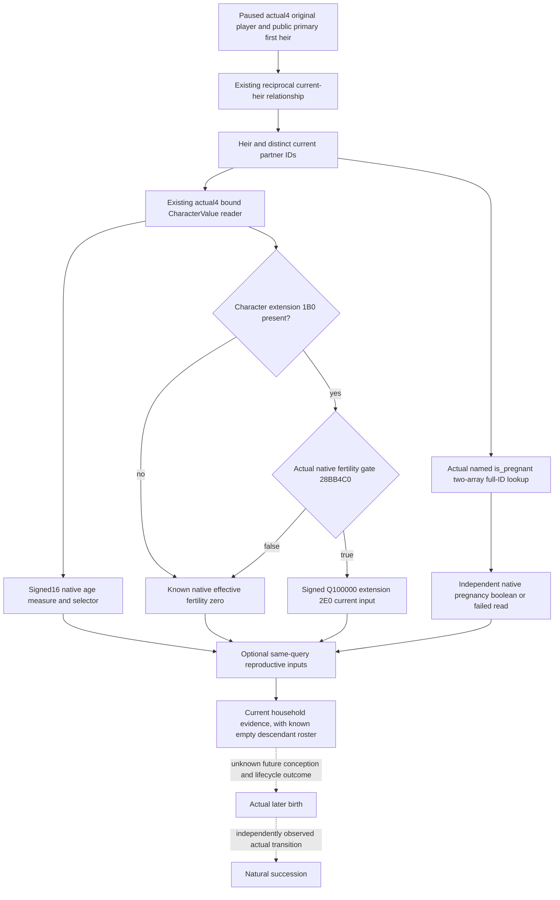

# Current first-heir household: observed age and native fertility

Source-first scope recorded 2026-10-08 / ISO 2026-W41. The source baseline is
`b3169b00c26e3ae08ef327d0ab32dba9b610a1c4`. The exact image remains CK3
1.20.0.4 / Steam 25734779, SHA-256
`98702F88A547CDE2EAF29A85F93B85F68EE4CF8148336A4F7AFAEB75319DD518`.
This package does not acquire EXE bytes, import production code, run tests,
build native code, connect to the SDK, or operate CK3.

## Current decision gap

Root's R76 paused original campaign observes Robert 29829, current first heir
38822 and actual spouse 38718, at raw date 53288472. The complete current-heir
child roster is known empty. There is no observed birth or natural succession.
The existing relationship query supplies that useful current relationship
and descendant evidence, but no age or effective fertility for the married
pair. Its betrothal actionability reader returns immediately when no current
betrothal exists. The rich-five marriage opportunity reader supplies fertility
for legal prospective matches, rather than for an already married household.

Appending existing qualified individual inputs to the same current-heir query
lets the continuity loop distinguish an observed native zero or failed
eligibility gate from missing current reproductive evidence. It supplies no
marriage action, birth forecast, pregnancy inference, or new waiting gate.

## Existing actual4 authority, reused without new reads

The [family binding topic](family-bindings-12004.md) and cached migration
`Z:/ck3_mod_rewrite_process_assets/g2-migration-20261007/marriage-family/actual4-heir-lineage/function-map/`
close the independently mapped actual fertility getter 0x28C6340 and gate
0x28BB4C0. Getter 0x28C634A checks Character +0x1B0; the successful branch
reads its extension's signed qword +0x2E0. Extension absent or native gate
false produces legitimate effective zero. Q100000 is the existing qualified
individual current input scale. The actual4 `BindFamilyValuesImage` already
binds these inputs, with current Character age measure +0x68 and sex selector
+0x1A1, and is used by `family_value::ReadCharacterValue`.

The named current relation reader independently resolves all full-generation
IDs and verifies reciprocal relations. Its complete observed heir relation
owns the demanded household: heir first, then primary spouse, native spouse
array order, then a current betrothed if present; duplicate partner IDs are
read once. No arbitrary receiver or population census is introduced.

The raw age value remains the native signed16 measure. This observer does not
assign a calendar birth date or borrow an old version's pregnancy layout.
The qualified reader's current full identity, liveness, lineage and employer
requirements remain explicit in each row's availability; failed rows do not
turn into zero fertility. The original relationship's availability and action
terms remain independent of this optional observation.

## Independent native pregnancy entry

The [current pregnancy entry research](current-first-heir-pregnancy-entry-12004.md)
closes the authored `is_pregnant` status trigger through its actual4 named
registration, instance predicate and pure two-array full-ID lookup. Root
acquired each finite source window once; the final lookup tail ends at
`0x28FD233`. It retains the distinction between native status, revelation
events, fertility, birth and natural succession. Effective fertility,
marriage legality and a known empty child roster do not infer pregnancy.

The next source candidate adds independent per-row `native_pregnancy`
status, reason and boolean before the existing age/fertility failure branch.
Both results remain separately available: pregnancy can be true when
fertility cannot be read, and pregnancy failure does not erase fertility.
Older wires may omit the optional new field; absence never becomes false.
The existing query, registered service and already-partnered calendar
progression are reused. No new policy or waiting gate is added.

Pregnancy source is **static-ready**; Root's new five-native/six-consumer
FIRST and actual paused-household observation remain pending. Native status
source closure gives no live pregnancy, birth or succession credit.

## Original household owning path and FIRST seam

Append `current_first_heir_reproductive_inputs_v1` to the existing native
current-heir relationship envelope, using the current actual4 mailbox and its
paused frame. Each demanded character row carries source roles, the observed
ID, status/reason, raw age/selector and the existing native-fertility shape.
Capture the existing reader twice and retain explicit frame/identity failure.
The strict transport consumes this optional leaf, accepts an absent legacy
leaf unchanged, and publishes it under the registered existing query. No new
MCP tool, schema version, action, policy, safety gate or script is needed.

A new finite native whole-wire mode belongs to the existing
`xar_ck3_12004_first_heir_descendants_test` target. Invoke only
`--reproductive-inputs-wire-dir <fresh-directory>`; the previous descendant
mode is never replayed. Its seven new scenes are `married-pair`, `gate-zero`,
`extension-zero`, `signed-negative`, `missing-gate`,
`partner-value-unavailable`, and `unpartnered`. A sole new registered-MCP
compound consumes those compiled envelopes plus an absent-leaf copy. It proves
married-pair, zero, negative raw, missing gate, unavailable partner and unpartnered observation,
while preserving known-empty child evidence and existing family dispatch.
All FIRST stages remain `AUTHORED_NOTRUN` until Root executes them against the
coherent frozen source. Existing fertility, descendant and relationship GREEN
receipts are reused, and no game day, birth, natural succession or G2 credit
is added by this source candidate.

Root's sole consumer node is
`test_current_first_heir_reproductive_inputs_registered_service.CurrentFirstHeirReproductiveInputsRegisteredServiceTests.test_current_married_household_inputs_reach_registered_query_and_service`.
Set `XAR_CURRENT_HEIR_REPRODUCTIVE_NATIVE_WIRE_DIR` to the seven newly emitted
whole envelopes and `XAR_CURRENT_HEIR_REPRODUCTIVE_SERVICE_OUTPUT` to the new
compound receipt. The original native relationship, descendant and fertility
tests are not invoked. The registered Service sees the full observation in its
existing partnered relationship evidence and continues selecting normal
calendar advance; partial individual input adds no waiting or proposal gate.

The helper and DTO are header-only. Existing production owners are
`bridge.cpp` and `current_first_heir_relationship_v1.cpp`; the modified shared
`ck3_11906.hpp` requires Root to select every actual retained owner affected by
the complete header dependency graph. No new production TU, CMake target,
registry entry or game script is introduced. The readonly source candidate
therefore composes with the next functional owner union without a separate
game restart or repeated earlier FIRST.
