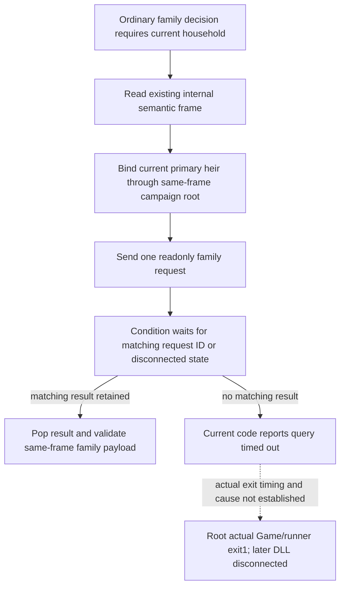

# Current-heir missing result during the Native60 hot05 exit

## Actual incident

Root's bounded ordinary `normal006` call on SDK
`f255bd8c253a2fcfbb77033878b55ec8afff2091` failed from
2026-10-09T23:45:00.863930Z to 23:52:04.685980Z with
`current heir relationship query timed out` and no structured result.
The original response is retained at
`D:/codex-ck3-background-spill/g2-live-20261010-r85-retry02/r0084-timing-native60-hot05/operator/gameplay-responses/120-r0084-sdkf255-bounded-normal-save02-chunk01-000006-normal.json`.
Root already read that response; this source investigation did not reread it.
The associated tiny request is the existing registered `ck3_auto_turn` with
empty arguments. The bounded loop stopped on RED and was not replayed.

Root subsequently observed owned Game162360 and its session runner165008 with
actual exit code1; Python operator13540 remained running with exit code259
(STILL_ACTIVE). A fresh Root snapshot at 23:54:29Z reported DLL not connected.
These later observations establish the unavailable native session at that
time. They do not identify the exact Game/runner exit time or cause, or the
particular internal family callback that was active. Ally owns the exit/crash
metadata investigation and its eventual frozen locator. This was not a normal
game exit. The prior ordinary step advanced from raw53289552 to53289576;
neither the failed family observation nor the later disconnected snapshot
adds a day, SAVE, child, or inheritance result.

## Closed Python source semantics

`current_first_heir_relationship_private_transport.py` already chooses
`take_internal_semantic_snapshot` for its pre/post reads. Its public campaign
root source also uses the existing semantic frame. The family request is sent
once and then `NativeState.wait_for_command_result` waits on
`request_id in _command_results or not _connected`; it returns the dictionary
pop or `None`. That wait does not clone history. The family transport labels
every `None` as the quoted timeout error. Consequently the error alone cannot
distinguish deadline expiration from disconnection, and does not prove that
the full default360-second wait elapsed. It also does not prove a public/native
revision mix-up or a local-history-copy fault.

The optional timing file was read once (3597 bytes, no hash), retaining the
bounded incident window in
`D:/codex-ck3-background-spill/r0084-hot05-heir-timeout-source/ACTUAL-TIMING-TAIL-THIN.json`.
It contains `service.normal_plan_turn` elapsed423.6164938 seconds and a full
Driver persistence stage elapsed72.1053005 seconds ending23:49:11.741991Z.
There is no associated family request ID/stage receipt in these scalar rows.
The stages cannot be assigned to the missing response or added together to
claim that persistence consumed its native deadline.

## Disposition and independent performance work

No new family production code, retry, timeout increase, native query, fixture,
or test was authored. Crown recovery applies to an explicit native stale RED
followed by an actually published newer frame; no such rejection was received
here, so that recovery is not applicable. Root explicitly stopped new family
fix work after confirming the exited game/session. Do not resend the failed
ordinary call or infer a pregnancy, birth, focus, or child trait state from its
missing result.

Sway's separate hot06 performance candidate
`4541d0344848bd6d2dbca934fd4c944bc473491a`, based on this same SDK,
changes only the existing LIFE planning post-read to omit exported history.
Its sole focused qualification is independent of this incident and is owned
by Root; this document grants it no test or live recovery status.

This package is a source diagnosis and honest incident boundary, not a
functional recovery. Worker Game/SDK/process calls, tests, project imports,
builds, EXE/bin reads, hashes and failed-response body reads are all zero.
Root continues the crash/exit diagnosis, freezes the failed run, and restores
only the last durable baseline6051. No M7, birth, natural succession or G2
completion credit is assigned.
