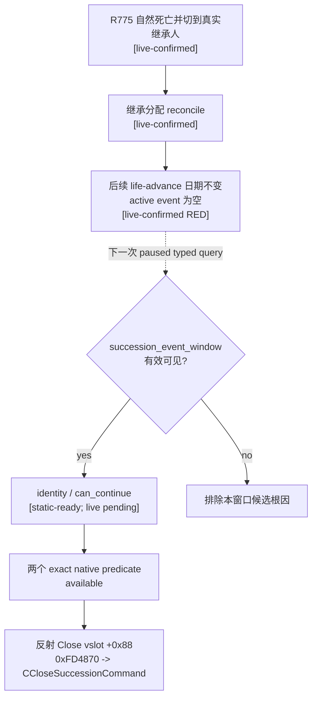

# 2026-09-16 reflected Close correction

R780 disproved the earlier mapping of `SuccessionEventWindow.Close` to
controller vslot `+0x20`: that call hid the root, but eight later observations
(`7216..7272`) retained `IsPausedBySuccession=true` and
`HasOpenSuccession=true`. The exact reflected action is controller vslot
`+0x88`, whose `CSuccessionEventWindow` override is RVA `0xFD4870`. It submits
the RTTI-identified `CCloseSuccessionCommand`; executor RVA `0x25EA9C0` clears
the matched active succession row at `row+0x260`. Both predicates read that
active-row state. Therefore `HasOpenSuccession` is not a HUD-history marker,
and formal resume/life-advance is a post-Close liveness check rather than the
cleanup mechanism. The corrected contract and remaining live gate are in
[death-succession-modal-continue-v1.md](death-succession-modal-continue-v1.md).
Any older `+0x20 is Close` text retained below is historical and superseded.

# 2026-09-16 exact-predicate update

This update supersedes the older `blocks_simulation=unavailable` reverse-engineering boundary retained below as historical context. The exact-build controller-acquisition artifact closes both public predicate cores: `IsPausedBySuccession()` at RVA `0xA05A90` and `HasOpenSuccession(Character*)` at RVA `0xA05B20`. The private owning-thread query now publishes both as fail-closed typed booleans (`blocks_simulation` and `has_open_succession`). It resolves and round-trip validates the currently played `Character` from the frozen component storage before calling the second predicate. A read failure makes the whole query unavailable and is never mapped to `false`.

The query wire is static-ready and frozen-build paused live acceptance remains pending. The paired private action is documented in [death-succession-modal-continue-v1.md](death-succession-modal-continue-v1.md). It invokes typed Close once, treats ACK as unverified, and requires a later application-main observation revision to prove the root disappeared and both predicates became false before formal `life-advance` can prove date movement. Query, action, adapter capability, and public MCP advertisement all remain OFF.

---

# CK3 1.19.0.6：死亡、继承与 game-over 时间线阻塞观测

本文冻结 `current-timeline-blocker-context-v1` 的静态候选。它只回答当前是否出现原版死亡/继承、无继承人 game-over 或选择命运界面，以及原版 GUI 是否给出了当前可用的继续控件。它不点击界面，不提交动作，也不把输入模态等同于“阻止游戏时间”。

当前状态是 **private production wire static-ready / paused live 未完成 / capability、adapter registry 与 public MCP tool 均未注册且未广告**。

## 版本与直接证据

- CK3：`1.19.0.6`
- `ck3.exe` SHA-256：`2D00FF3101EF70B566F2FCBAE292F09263199C80E9DC8F139B82D7D96F83DB86`
- 原版 GUI：`game/gui/window_succession_event.gui`
- 原版 GUI SHA-256：`5925DE3F28CD00FF8D50F345FC4DE389AFF06FA3A7D89955DDDAA613E2DA12E4`
- 机器合同：[current_timeline_blocker_context_v1_abi.json](../../ck3_autonomous_player/native_bridge/research/current_timeline_blocker_context_v1_abi.json)
- typed schema：[current-timeline-blocker-context-v1.schema.json](../../ck3_autonomous_player/schemas/current-timeline-blocker-context-v1.schema.json)

现有 exact-build GUI ABI 已经冻结以下只读链：

```text
module + 0x576CC68
  -> GUI singleton chain
  -> top-level owner
  -> FindTopLevelWidget(module + 0x36D0B20, fixed_name)
  -> fixed descendant traversal
  -> widget +0xD0 cached effective-visible/effective-disabled bits
```

查询只接受编译期固定的两个 root 和六个 descendant 名称，不接受 MCP 调用者提供的名称、路径或原生指针。实现复用 [`zhongguo_scoreboard_state_v1`](../../ck3_autonomous_player/native_bridge/include/xar_bridge/zhongguo_scoreboard_state_v1.hpp) 已冻结并测试的 GUI owner、树遍历和可见性原语。

## private production wire

静态 reader 已通过固定的 application-main owning-thread mailbox 接入 bridge。内部 step 是
`query-current-timeline-blocker-context-v1`，请求只接受一个 canonical positive integer
`expected_revision`。bridge 把该 revision 与当前 paused、map-ready snapshot 逐项绑定，并把同一
`snapshot_revision`、`date_raw` 与 `paused=true` 复制给 mailbox；executor 完成后再次核对 completion
stamp，任一处变化都返回 unavailable，不会把旧帧结果重新标成当前结果。

该 wire 有意保持私有：

- native heartbeat 只把它列入 private query scope；没有加入 CK3 1.19.0.6 adapter capability registry；
- result envelope 固定携带 `private_build=true`、`read_only=true`、`advertised=false`；
- Python `NativeBridgeDriver` 只有显式启用 `allow_private_current_timeline_blocker_query=True` 才能调用；
- service 只接受与调用前、调用后同一 paused snapshot revision/date 绑定的结果；
- MCP 层只有下划线前缀的内部 helper，没有 `@server.tool()` 注册项；
- 没有 Close 动作、选择命运动作、通用点击或婚姻处理。

typed boolean 的 unavailable 状态必须携带 `value=null`。特别是
`blocks_simulation.status=unavailable` 不能在 native、Python service 或内部 MCP helper 中转换成
`false`。

## 原版窗口与继续路径

原版文件给出以下直接关系：

| 语义 | 原版证据 | typed 结果 |
|---|---|---|
| 死亡/继承主窗 | root `succession_event_window`，`layer = confirmation`；`bottom.visible = SuccessionEventWindow.IsSuccession` | root 与 `bottom` 有效可见，且存在有效可见、enabled 的 `close_button` 时，identity 为 `death_succession_modal` |
| 继承继续 | bottom `close_button` 触发 `ruler_transition_reset`；该 state 的 `on_finish` 调用 `SuccessionEventWindow.Close`；lineage `close_button` 直接调用同一 Close | `can_continue = true`，证据控件为 `close_button` |
| 无继承人 game over | `menu_button.visible = Not(SuccessionEventWindow.GetPlayerHeir.IsValid)` | menu 有效可见、enabled 时，identity 为 `game_over_modal`，同一 campaign 的 `can_continue = false` |
| 选择命运 | 独立 root `succession_select_destiny_window`；两个 continue 控件都调用 `ConfirmSelectDestinyCharacter` | identity 为 `succession_select_destiny_modal`；当前任一 continue 控件有效可见、enabled 时 `can_continue = true` |

`can_continue` 只表示原版 source 暴露的**直接继续控件当前可用**。本候选没有动作端，不会调用 `Close`、`ConfirmSelectDestinyCharacter` 或通用点击。

### `CSuccessionEventWindow.Close` exact-build ABI

同一 `ck3.exe` 已冻结 `CSuccessionEventWindow` RTTI TypeDescriptor RVA `0x521FC90`、COL RVA `0x468A190` 与主 vtable RVA `0x4111E80`。GUI 反射动作槽是 vtable `+0x88`（slot 17），该 controller 的专用 override 为 RVA `0xFD4870`：

```text
CSuccessionEventWindow::vtable +0x88
  -> 0xFD4870 reflected Close
  -> vtable +0x20 -> 0x1006FB0 hide view
  -> construct and queue CCloseSuccessionCommand
  -> executor 0x25EA9C0 matches character/token and clears row+0x260 active
```

vtable `+0x20` 只是通用 view hide；R780 已实证它不会清除 succession row。vtable `+0x18` 的 `0xFD4860 -> 0x1006F40` 是 **open path**，同样不是 Close。本文的只读查询不会调用上述任何函数；动作端必须按独立合同调用 `+0x88`，不得直接构造 command。

## `blocks_simulation` 与 `has_open_succession`

exact-build predicate 已冻结：`IsPausedBySuccession()` RVA `0xA05A90` 扫描 active succession row 并读取 `row+0x260`；`HasOpenSuccession(Character*)` RVA `0xA05B20` 先按 `row+0xB0` 匹配 CharacterID，再读取同一 active 字段。读取失败时整个查询 fail closed，不得映射成 `false`。

`HasOpenSuccession` 因此不是可回看的 HUD 历史记录。反射 Close command 的 executor 清除 `row+0x260` 后，两个 predicate 都应在后续独立 application-main 观测中变为 `false`。

## R775 的结论边界

R775 在同一 campaign 内完成自然死亡、继承分配核对、真实继承人接续和继承人后续正式动作。随后一次 `life-advance` 在 `date_raw=53411568` 既没有推进日期，也没有观察到 active event。现有 current-event 查询只覆盖 `ActiveEvent`，而 `succession_event_window` 是独立的 game-view/controller，因此“没有 active event”不能排除继承窗口仍然阻塞时间。

R775 没有采集本文新增的窗口 frame，所以当前只能把“继承窗口未关闭”列为与症状一致、可由下一次只读查询证伪的候选根因，不能写成 live-confirmed 根因。



## 实机解锁门

静态 ABI 已闭合，不再需要扩大到通用 GUI 逆向。下一项只是在同版本 paused checkpoint 上调用一次反射 Close vslot `+0x88`，等待独立 application-main command-pump 观测，并核验 root 消失和两个 predicate 同时为 `false`。

private production wire 已完成。它进入 public capability/registry/advertisement 前仍必须完成：

1. 在 R775 的安全 checkpoint 或语义等价自然死亡 checkpoint 上，通过 private wire 采集真实 paused frame，证明 root identity、`can_continue` 与屏幕/日期症状一致。
2. 调用 `+0x88` 后的独立新 frame 证明 root 消失且两个 predicate 为 `false`；随后正式 `life-advance` 使日期推进。
3. 同版本 live gate 关闭后，另行同步 adapter capability、public MCP registration 与下游 consumer；private wire 本身不构成能力广告证据。

## MCP 与 open_kaishek 影响

本提交把 schema 与 C++ reader 经 owning-thread mailbox、private bridge parser、Python driver/service 和内部 MCP helper 串通，但没有加入 adapter registry 或 public MCP tool list。现有公开 MCP 协议和 open_kaishek 可见组合不变，因此当前不要求 open_kaishek 发布新适配版本。

同版本 live gate 关闭并准备公开注册时，open_kaishek 必须同步消费 `identity` 与两个 typed boolean，并保留 `blocks_simulation.status=unavailable`、`value=null` 的 fail-closed 语义。公开注册、consumer 适配和能力广告需要作为同一兼容版本组合交付；不得把本 private wire 的 static-ready 结果冒充为 live capability。

## 正式单查询 operator（默认关闭）

`tools/g2_preview_operator.py query-current-timeline-blocker-context-v1` 是该 private wire 的唯一正式实机入口。它复用 production preflight、`native_session` 单实例所有权、冷 checkpoint 加载和进程回收；内部 agent 子命令为 `native-query-current-timeline-blocker-context-v1`。只有显式提供 `--private-timeline-query-round-id R<number>` 才会构造带 `allow_private_current_timeline_blocker_query=True` 的 driver。普通 `native-auto-run`、公开 MCP registry、adapter capability 与能力广告均不受影响。

一次运行只允许一条 `query-current-timeline-blocker-context-v1`。operator receipt 必须保留 source commit 与 agent/operator hash、实际 CK3 轮次、查询 envelope、查询前后 save/driver SHA-256、查询前后 `date_raw` 和 cleanup；只有这些值保持不变且进程树已回收时才返回 `GREEN_READ_ONLY`。该入口没有 Close、婚姻、`death-terminal`、Python successor continuation、日期推进、checkpoint 写入、UI 输入或 gameplay action 路径。R776A 是证据切片名；其实际单实例轮次仍按持久台账传 `R776`，不得把带字母的候选名冒充 CK3 轮次。
