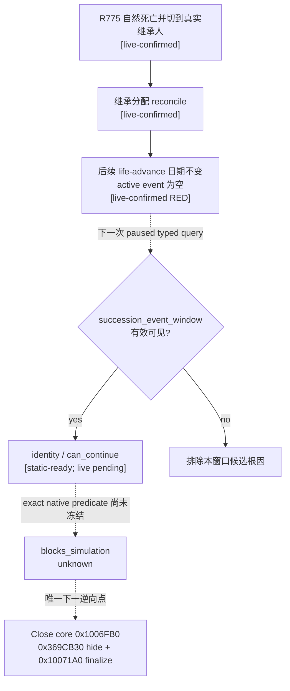

# CK3 1.19.0.6：死亡、继承与 game-over 时间线阻塞观测

本文冻结 `current-timeline-blocker-context-v1` 的静态候选。它只回答当前是否出现原版死亡/继承、无继承人 game-over 或选择命运界面，以及原版 GUI 是否给出了当前可用的继续控件。它不点击界面，不提交动作，也不把输入模态等同于“阻止游戏时间”。

当前状态是 **static-ready candidate / production wire 与 paused live 均未完成 / capability 未注册且未广告**。

## 版本与直接证据

- CK3：`1.19.0.6`
- `ck3.exe` SHA-256：`2D00FF3101EF70B566F2FCBAE292F09263199C80E9DC8F139B82D7D96F83DB86`
- 原版 GUI：`game/gui/window_succession_event.gui`
- 原版 GUI SHA-256：`5925DE3F28CD00FF8D50F345FC4DE389AFF06FA3A7D89955DDDAA613E2DA12E4`
- 机器合同：[current_timeline_blocker_context_v1_abi.json](../../ck3_autonomous_player/native_bridge/research/current_timeline_blocker_context_v1_abi.json)
- typed schema：[current-timeline-blocker-context-v1.schema.json](../../ck3_autonomous_player/schemas/current-timeline-blocker-context-v1.schema.json)

现有 exact-build GUI ABI 已经冻结以下只读链：

```text
module + 0x576CC68
  -> GUI singleton chain
  -> top-level owner
  -> FindTopLevelWidget(module + 0x36D0B20, fixed_name)
  -> fixed descendant traversal
  -> widget +0xD0 cached effective-visible/effective-disabled bits
```

查询只接受编译期固定的两个 root 和六个 descendant 名称，不接受 MCP 调用者提供的名称、路径或原生指针。实现复用 [`zhongguo_scoreboard_state_v1`](../../ck3_autonomous_player/native_bridge/include/xar_bridge/zhongguo_scoreboard_state_v1.hpp) 已冻结并测试的 GUI owner、树遍历和可见性原语。

## 原版窗口与继续路径

原版文件给出以下直接关系：

| 语义 | 原版证据 | typed 结果 |
|---|---|---|
| 死亡/继承主窗 | root `succession_event_window`，`layer = confirmation`；`bottom.visible = SuccessionEventWindow.IsSuccession` | root 与 `bottom` 有效可见，且存在有效可见、enabled 的 `close_button` 时，identity 为 `death_succession_modal` |
| 继承继续 | bottom `close_button` 触发 `ruler_transition_reset`；该 state 的 `on_finish` 调用 `SuccessionEventWindow.Close`；lineage `close_button` 直接调用同一 Close | `can_continue = true`，证据控件为 `close_button` |
| 无继承人 game over | `menu_button.visible = Not(SuccessionEventWindow.GetPlayerHeir.IsValid)` | menu 有效可见、enabled 时，identity 为 `game_over_modal`，同一 campaign 的 `can_continue = false` |
| 选择命运 | 独立 root `succession_select_destiny_window`；两个 continue 控件都调用 `ConfirmSelectDestinyCharacter` | identity 为 `succession_select_destiny_modal`；当前任一 continue 控件有效可见、enabled 时 `can_continue = true` |

`can_continue` 只表示原版 source 暴露的**直接继续控件当前可用**。本候选没有动作端，不会调用 `Close`、`ConfirmSelectDestinyCharacter` 或通用点击。

### `CSuccessionEventWindow.Close` exact-build ABI

同一 `ck3.exe` 已冻结 `CSuccessionEventWindow` RTTI TypeDescriptor RVA `0x521FC90`、COL RVA `0x468A190` 与主 vtable RVA `0x4111E80`。vtable `+0x20`（slot 4）指向高置信 Close core RVA `0x1006FB0`。当前静态调用链为：

```text
CSuccessionEventWindow::vtable +0x20
  -> 0x1006FB0 Close core
  -> vtable +0x38 IsOpen
  -> when open: view/widget +0x78 -> 0x369CB30(..., edx=0, r8=0) hide
  -> when flags slot +0x50 == 0x800: observed global ingame/UI byte +0x11A1 = 1
  -> 0x10071A0 manager/history finalization
```

vtable `+0x18` 的 `0xFD4860 -> 0x1006F40` 是 **open path**，不是 Close。`+0x11A1` 写入的具体所有者和语义尚未冻结，也没有证据把它等同于 simulation-hold predicate。本文的只读查询不会调用上述任何函数；动作端属于后续独立工作包。

## `blocks_simulation` 为什么仍是 unknown

`layer = confirmation` 证明窗口处于确认输入层，但它没有证明 CK3 的模拟时钟由哪个原生 predicate 持有。当前 mailbox 只能在 paused application-main frame 上安全复制 GUI 状态；该 paused 标记也是查询的执行前提，不能反过来当作窗口阻止时间的证据。

因此所有已识别 identity 都发布：

```json
{
  "blocks_simulation": {
    "status": "unavailable",
    "value": null,
    "unavailable_reason": "succession_simulation_block_predicate_not_frozen"
  }
}
```

禁止把 unknown/null 当成 `false`，也禁止依据 `confirmation` 层猜成 `true`。

## R775 的结论边界

R775 在同一 campaign 内完成自然死亡、继承分配核对、真实继承人接续和继承人后续正式动作。随后一次 `life-advance` 在 `date_raw=53411568` 既没有推进日期，也没有观察到 active event。现有 current-event 查询只覆盖 `ActiveEvent`，而 `succession_event_window` 是独立的 game-view/controller，因此“没有 active event”不能排除继承窗口仍然阻塞时间。

R775 没有采集本文新增的窗口 frame，所以当前只能把“继承窗口未关闭”列为与症状一致、可由下一次只读查询证伪的候选根因，不能写成 live-confirmed 根因。



## 唯一下一逆向点与实机解锁门

下一项逆向只从已冻结的 Close core `0x1006FB0` 继续，沿 `0x369CB30` hide 路径与 `0x10071A0` manager/history 收尾定位清除模拟 hold 的 exact-build predicate，并冻结能在 application-main frame 只读判断的值。现有 `+0x11A1` 写入只是一条观测，不足以承担该结论。不要扩展到通用 GUI 点击或任意窗口扫描。

候选进入 production wire 前必须完成：

1. 将固定 executor 接入 application-main mailbox；工具不接受参数，query/action 仍不广告。
2. 在 R775 的安全 checkpoint 或语义等价自然死亡 checkpoint 上采集真实 paused frame，证明 root identity、`can_continue` 与屏幕/日期症状一致。
3. 关闭继承窗口后的独立新 frame 证明 root 消失；随后正式 `life-advance` 使日期推进。
4. 只有 exact predicate 与上述前后帧互证后，才把 `blocks_simulation` 从 unavailable 升级为 boolean。

## MCP 与 open_kaishek 影响

本提交新增 schema、C++ typed reader/native adapter 和 ABI 文档，但没有把命令加入 adapter registry、bridge command parser、Python service 或 MCP tool list；现有 MCP 和 open_kaishek 组合不变。将来接线是新增只读 capability，open_kaishek 需要同步理解 `identity` 与两个 typed boolean，并保留 `blocks_simulation.status=unavailable` 的 fail-closed 语义，直到同版本实机门关闭。
