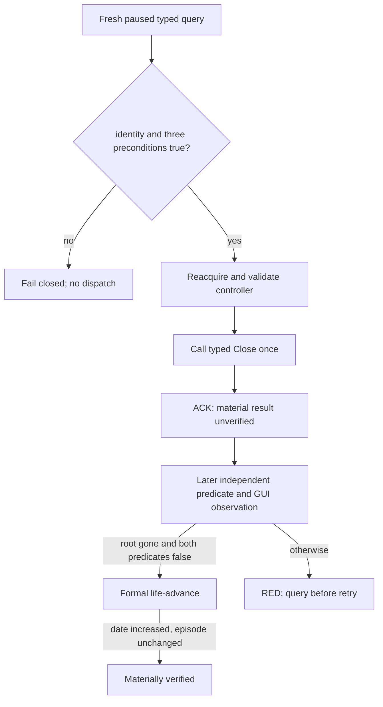

# CK3 1.19.0.6: private typed death-succession modal Close

`continue-death-succession-modal-v1` is the minimum private action used to
unblock the natural-death successor episode. Its current status is
**static-ready; frozen-build paused live acceptance pending**. It is absent
from the public capability registry and MCP tool list.

## Frozen build and evidence

- CK3: `1.19.0.6`
- `ck3.exe` SHA-256:
  `2D00FF3101EF70B566F2FCBAE292F09263199C80E9DC8F139B82D7D96F83DB86`
- Close ABI artifact SHA-256:
  `BB5F3A315D3790DD3046CBA64DF98C0E06E22C044B249E697FD8514C5E89F8D9`
- controller acquisition/predicate artifact SHA-256:
  `0F1D607C6CBD5D1FFF43A7C38DB9709E56524A23007C6B5AD24EB4086955BD00`
- checked-in action ABI:
  [`death_succession_modal_continue_v1_abi.json`](../../ck3_autonomous_player/native_bridge/research/death_succession_modal_continue_v1_abi.json)

The action runs only in an application-main owning-thread mailbox callback.
Every callback acquires a fresh controller:

```text
*(module + 0x570F7B8)                         idler root
  -> *(root + 0x10)                           CIdlerGfxBase
  -> __RTDynamicCast at module + 0x3E631F4
       source TD module + 0x501EF28
       target TD module + 0x501EF50
  -> *(CIngameInterfaceIdlerGfx + 0x88)       handler
       vtable == module + 0x40AF630
  -> *(handler + 0x260)                       succession controller
       vtable == module + 0x4111E80
```

`handler+0x268` is the lineage window and is never accepted. No controller,
handler, idler, character, game-data, or succession-row pointer is cached.

## Admission and one-shot dispatch

Python binds the request to the current episode, played Character `35465` in
R776, the public snapshot revision, and `episode_run_id`. Native code then
binds the request to the current native revision and date and rechecks all of
the following on the owning thread:

1. exact build admitted, paused map-ready snapshot, living played character,
   and unchanged expected native revision/date/character;
2. a fresh `current-timeline-blocker-context-v1` result whose identity is
   `death_succession_modal` and `can_continue=true`;
3. `IsPausedBySuccession()` at RVA `0xA05A90` is true;
4. `HasOpenSuccession(Character*)` at RVA `0xA05B20` is true;
5. the freshly acquired controller has the exact primary vtable;
6. controller vslot `+0x38` resolves to RVA `0xFD4B00` and returns true;
7. controller vslot `+0x20` resolves to RVA `0x1006FB0`.

Only then is vslot `+0x20` called once. Any missing or changed observation
returns unavailable without dispatch. Coordinates, generic clicks, reflection
wrappers, cached pointers, and vslot `+0x18` are outside this contract.

## Material result

The command result is only an ACK and always carries
`material_result_verified=false`. The private Python route accepts success only
after a separate later application-main observation revision proves all three
conditions:

- GUI identity is `none`;
- `HasOpenSuccession=false`;
- `IsPausedBySuccession=false`.

It then calls the formal `life-advance` step and requires the date to increase
without changing the successor episode. A timeout or malformed ACK leaves the
action state unknown; callers must query before any retry.



## Compatibility and advertisement

The wire is private and opt-in at both Python driver seams. The native adapter
capability registry, public MCP tool list, and open_kaishek-visible surface are
unchanged. A same-version live acceptance must pass before any registration or
advertisement change is considered.
