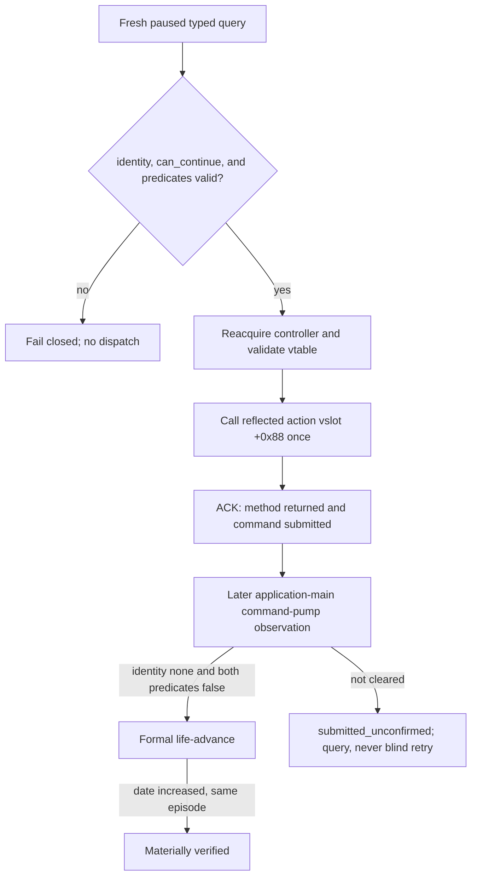

# CK3 1.19.0.6: reflected death-succession Close ABI

`continue-death-succession-modal-v1` is the private typed action for retiring the
active succession row after a natural death. Its corrected exact-build ABI is
**static-ready; paused live acceptance is pending**. It remains absent from the
public capability registry and MCP tool list.

R780 disproved the previous action mapping. Calling controller vslot `+0x20`
returned a strict ACK and made the visible root disappear, but eight later
queries at observation revisions `7216..7272` still reported both
`IsPausedBySuccession=true` and `HasOpenSuccession=true`. The slot is the generic
game-view hide operation. The GUI reflection method
`SuccessionEventWindow.Close` uses the common action slot `+0x88`, which this
controller overrides with succession-specific command submission.

## Frozen build and source path

- CK3: `1.19.0.6`
- `ck3.exe` SHA-256:
  `2D00FF3101EF70B566F2FCBAE292F09263199C80E9DC8F139B82D7D96F83DB86`
- stock GUI: `game/gui/window_succession_event.gui`
- stock GUI SHA-256:
  `5925DE3F28CD00FF8D50F345FC4DE389AFF06FA3A7D89955DDDAA613E2DA12E4`
- machine contract:
  [`death_succession_modal_continue_v1_abi.json`](../../ck3_autonomous_player/native_bridge/research/death_succession_modal_continue_v1_abi.json)

The stock root is `succession_event_window`. Its main bottom button starts the
`ruler_transition_reset` animation, whose `on_finish` evaluates
`[SuccessionEventWindow.Close]`; the lineage button evaluates the same method
directly. The destiny-selection modal uses a separate
`ConfirmSelectDestinyCharacter` path and is outside this ABI.

## Controller acquisition

The owning-thread callback must reacquire and validate the controller on every
invocation:

```text
*(module + 0x570F7B8)                         idler root
  -> *(root + 0x10)                           CIdlerGfxBase
  -> __RTDynamicCast at module + 0x3E631F4
       source TD module + 0x501EF28
       target TD module + 0x501EF50
  -> *(CIngameInterfaceIdlerGfx + 0x88)       handler
       vtable == module + 0x40AF630
  -> *(handler + 0x260)                       succession controller
       vtable == module + 0x4111E80
```

`handler+0x268` is the lineage window and is excluded. No controller, handler,
idler, character, game-data, or succession-row pointer may be cached.

## Why `+0x20` was wrong

Controller vslot `+0x20` resolves to RVA `0x1006FB0`. It hides the game view.
That explains the complete R780 observation without any asynchronous-frame
hypothesis: the root identity became `none`, while the active native succession
row and both public predicates remained unchanged.

The common reflected-action slot is vslot `+0x88`. Its generic default at RVA
`0x1007190` is only:

```text
mov rax, [rcx]
jmp qword ptr [rax + 0x20]
```

`CSuccessionEventWindow` overrides that slot in primary vtable RVA
`0x4111E80`; the entry at `0x4111F08` resolves to RVA **`0xFD4870`**. This is
the implementation of reflected `SuccessionEventWindow.Close` for the
succession window.

## Correct action ABI

The minimum typed action is:

```text
void __fastcall CSuccessionEventWindow::reflected_Close(
    CSuccessionEventWindow* self);            // vslot +0x88 -> RVA 0xFD4870
```

It has no explicit parameter and must run on the application-main/GUI owning
thread. The function first invokes `self` vslot `+0x20` to hide the view. Under
its native succession-state guards, it then constructs and submits a
`CCloseSuccessionCommand` through the locked command queue with channel flags
`7`, and performs linked succession UI cleanup. Direct call xrefs include
`0xD728A6`, `0xFD41A4`, `0xFD5A47`, `0xFD5A4F`, and `0xFD5B3B`.

The command is frozen by RTTI and both vtables:

| Item | Exact-build value |
|---|---:|
| RTTI name | `.?AVCCloseSuccessionCommand@@` |
| TypeDescriptor | `0x54C0128` |
| primary / secondary vtable | `0x4322358` / `0x4322328` |
| primary / secondary COL | `0x4962FB0` / `0x4962FD8` |
| object size | `0x28` |
| CharacterID | `+0x20`, `int32` |
| opaque succession-instance token | `+0x24`, `int32` |

The bridge must call the reflected action slot and let CK3 construct the
command. It must not synthesize the opaque token or submit a command payload
directly.

## Material executor and predicates

The secondary command vtable dispatches at `+0x08` to RVA `0x25EA9C0`. The
executor reads game data through module slot `0x570E068`, row array
`game_data+0x1D548`, and count `game_data+0x1D554`. It matches command
CharacterID `+0x20` to row `+0xB0` and the opaque command token `+0x24` to row
`+0xD8`. For an active row it writes row `+0x260=0`; when row `+0x2C8` is set,
it invokes cleanup on row `+0x268` through RVA `0xA84DA0` and clears that
related state.

Both public predicates read this active-row state:

- `IsPausedBySuccession()` at RVA `0xA05A90` scans active rows and tests
  row `+0x260`.
- `HasOpenSuccession(Character*)` at RVA `0xA05B20` matches the character at
  row `+0xB0` and tests row `+0x260`.

`HasOpenSuccession` is therefore not a historical HUD-record predicate on this
build. Formal resume or `life-advance` does not retire the row; it is a later
liveness proof after the close command has materially executed.

## Admission and material result

Before dispatch, the owning-thread callback must recheck the exact build,
paused map-ready snapshot, expected native revision/date, successor episode
binding, public identity `death_succession_modal`, `can_continue=true`, both
succession predicates, controller vtable, and absence of an unresolved pending
action. It then calls vslot `+0x88` at most once.

ACK proves only that the reflected method returned and submitted the command.
It does not prove command execution. A later application-main command-pump
observation must show all three material conditions together:

- GUI identity is `none`;
- `IsPausedBySuccession=false`;
- `HasOpenSuccession=false` for the played successor.

An increased `observation_revision` is required to establish a later
observation, but `pump_epoch` alone does not prove a complete GUI frame because
one frame can invoke the hooked pump more than once. After a strict ACK the
driver must query state and never blindly resend Close. Only a cleared query
permits formal `life-advance`, which must increase the date without changing
the successor episode.



## Remaining boundary

The semantic name of the succession-instance token and the exact names of two
internal `0xFD4870` state guards remain unknown. Neither is required by the
minimum ABI because CK3's reflected Close owns both. The corrected vslot
`+0x88` still needs one frozen-build paused live acceptance before the private
wire can be considered live, and registration or capability advertisement
remains prohibited until that gate passes.

The earlier close-ABI artifact remains useful only for controller acquisition
and generic-hide evidence. Its own note that the GUI reflection Close was not
uniquely located is now resolved by this revision; it must not be cited as
evidence that vslot `+0x20` is the reflected action.
