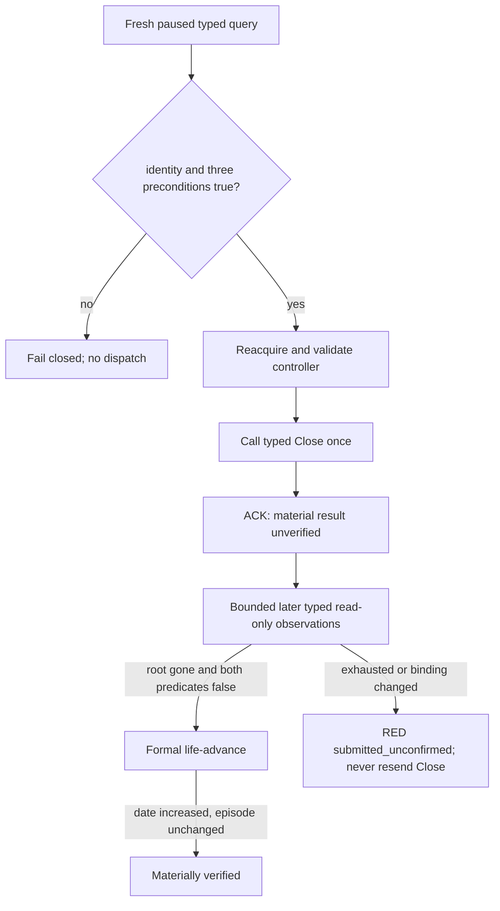

# CK3 1.19.0.6: private typed death-succession modal Close

`continue-death-succession-modal-v1` is the minimum private action used to
unblock the natural-death successor episode. Its current status is
**typed action submitted once; material result still RED**. R777 proved the
fresh paused read-only precondition. R778 then returned a strict ACK with
`close_invocations=1`, but its immediate independent query still observed the
modal and both succession predicates. The source checkpoint was unchanged and
CK3 was reclaimed. The action remains absent from the public capability
registry and MCP tool list.

## Frozen build and evidence

- CK3: `1.19.0.6`
- `ck3.exe` SHA-256:
  `2D00FF3101EF70B566F2FCBAE292F09263199C80E9DC8F139B82D7D96F83DB86`
- Close ABI artifact SHA-256:
  `BB5F3A315D3790DD3046CBA64DF98C0E06E22C044B249E697FD8514C5E89F8D9`
- controller acquisition/predicate artifact SHA-256:
  `0F1D607C6CBD5D1FFF43A7C38DB9709E56524A23007C6B5AD24EB4086955BD00`
- checked-in action ABI:
  [`death_succession_modal_continue_v1_abi.json`](../../ck3_autonomous_player/native_bridge/research/death_succession_modal_continue_v1_abi.json)

The action runs only in an application-main owning-thread mailbox callback.
Every callback acquires a fresh controller:

```text
*(module + 0x570F7B8)                         idler root
  -> *(root + 0x10)                           CIdlerGfxBase
  -> __RTDynamicCast at module + 0x3E631F4
       source TD module + 0x501EF28
       target TD module + 0x501EF50
  -> *(CIngameInterfaceIdlerGfx + 0x88)       handler
       vtable == module + 0x40AF630
  -> *(handler + 0x260)                       succession controller
       vtable == module + 0x4111E80
```

`handler+0x268` is the lineage window and is never accepted. No controller,
handler, idler, character, game-data, or succession-row pointer is cached.

## Admission and one-shot dispatch

Python binds the request to the current episode, played Character `35465` in
R776, the public snapshot revision, and `episode_run_id`. Native code then
binds the request to the current native revision and date and rechecks all of
the following on the owning thread:

1. exact build admitted, paused map-ready snapshot, living played character,
   and unchanged expected native revision/date/character;
2. a fresh `current-timeline-blocker-context-v1` result whose identity is
   `death_succession_modal` and `can_continue=true`;
3. `IsPausedBySuccession()` at RVA `0xA05A90` is true;
4. `HasOpenSuccession(Character*)` at RVA `0xA05B20` is true;
5. the freshly acquired controller has the exact primary vtable;
6. controller vslot `+0x38` resolves to RVA `0xFD4B00` and returns true;
7. controller vslot `+0x20` resolves to RVA `0x1006FB0`.

Only then is vslot `+0x20` called once. Any missing or changed observation
returns unavailable without dispatch. Coordinates, generic clicks, reflection
wrappers, cached pointers, and vslot `+0x18` are outside this contract.

## Material result

The command result is only an ACK and always carries
`material_result_verified=false`. The private Python route accepts success only
after a bounded sequence of separate, read-only application-main observations
proves all three conditions in the same query:

- GUI identity is `none`;
- `HasOpenSuccession=false`;
- `IsPausedBySuccession=false`.

`action_observation_revision` and query `observation_revision` are the exact
build's `pump_epoch` from the SDL `PeekMessageW` return hook at RVA
`0x3CE4222`. A larger value proves a later hook invocation, but not a complete
GUI frame: one frame can call `PeekMessageW` more than once. Heartbeat sequence
and heartbeat pump counters are liveness evidence only, not material Close
evidence.

After the strict ACK, the route never sends Close again. It keeps the paused
date, native revision, and successor episode binding fixed and issues at most
eight typed read-only queries. Every recorded observation revision must be
strictly greater than the ACK and its predecessor. If the predicates do not
clear, the result is `submitted_unconfirmed`; the immutable report retains the
initial query, strict ACK, every post-query and binding, and reports one Close,
zero life-advances, and zero checkpoints. Only a cleared query permits the
formal `life-advance`, which must increase the date without changing the
successor episode. A malformed pre-ACK response leaves action state unknown;
once a strict ACK exists, callers must never retry Close without first
resolving the submitted action through observation.

## R777 source and formal bounded entry

R777 observed the exact source at date `53411568`, played/episode Character
`35465`, episode `native-35465-cbdf997e3d80`: identity
`death_succession_modal`, `can_continue=true`,
`blocks_simulation=true`, and `has_open_succession=true`. Its read-only query
left the save unchanged and reclaimed CK3. This is a live query primitive,
not evidence that Close works.

The private formal action entry is:

```text
g2_preview_operator.py continue-death-succession-modal-v1
  -> agent.py native-continue-death-succession-modal-v1
  -> GameplayBridgeService.continue_death_succession_modal_private_v1
```

It admits only the sealed history-3 source pair:

- checkpoint SHA-256 `2C0F4333AE186EE91F560AD7D14ABB2F2E29AAA1B4D2EACFEFE0C9A8E1E505E3`;
- driver-state SHA-256 `C3FA1268FFA72B49936D36E4C49C7CEA182D3C18E2795DDC5586EFFF136200C9`;
- ordinary history `continue-as-reconciled-successor`,
  `query-campaign-root-context-v1`, `save-checkpoint` at indices 1..3.

The operator requires an explicit monotonic `R<number>` round and
`--expected-date-raw 53411568`. After a true cold restore it permits only:
restore at history index 4, the private query and one Close (kept in the
immutable report, not ordinary history), one formal `life-advance` at index 5,
and one GREEN-only `save-checkpoint` at index 6. Marriage queries/actions,
death-terminal replay, Python successor continuation, generic UI input, and
all other gameplay are zero. The output checkpoint must have a later date,
the same successor episode, and bytes different from the source checkpoint.

The R778 operator manifest and output directory are candidate artifacts, so a
launch command is recorded only after those paths and hashes are sealed. The
subcommand itself exposes all required parameters through `--help`; it has no
fallback to `native-auto-run` or a private UI harness.



## Compatibility and advertisement

The wire is private and opt-in at both Python driver seams. The native adapter
capability registry, public MCP tool list, and open_kaishek-visible surface are
unchanged. Native admission additionally requires building the controlled
candidate with
`-DXAR_CK3_ENABLE_G2_DEATH_SUCCESSION_MODAL_PRIVATE_V1=ON`; the option defaults
to `OFF` and gates the early step admission exception, both dispatch branches,
and both owning-thread executor slots together. The early gate must use the
fixed private-step classifier because neither step is allowed to enter
`GameAdapter::supports_step` or public capability advertisement. A same-version
live acceptance must pass before any registration or advertisement change is
considered.
