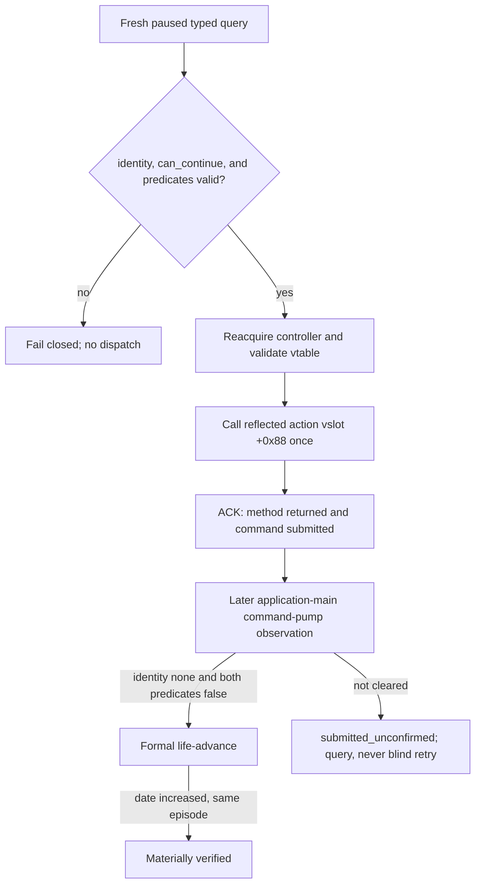
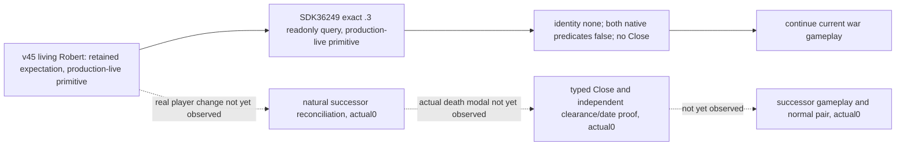

# Reflected death-succession Close ABI: 1.19.0.6 and 1.20.0.3

`continue-death-succession-modal-v1` is the private typed action for retiring the
active succession row after a natural death. The corrected Close remains **static-ready; actual Close acceptance is pending**. The exact 1.20.0.3 living-player no-open-modal readonly query is now a **production-live primitive**. The existing opt-in MCP tools are registered under `--private-death-succession-modal-continue`; the private wire remains absent from the public native capability registry. Neither registration nor a living query is a Close acceptance result.

R780 disproved the previous action mapping. Calling controller vslot `+0x20`
returned a strict ACK and made the visible root disappear, but eight later
queries at observation revisions `7216..7272` still reported both
`IsPausedBySuccession=true` and `HasOpenSuccession=true`. The slot is the generic
game-view hide operation. The GUI reflection method
`SuccessionEventWindow.Close` uses the common action slot `+0x88`, which this
controller overrides with succession-specific command submission.

## Historical 1.19.0.6 frozen build and source path

- CK3: `1.19.0.6`
- `ck3.exe` SHA-256:
  `2D00FF3101EF70B566F2FCBAE292F09263199C80E9DC8F139B82D7D96F83DB86`
- stock GUI: `game/gui/window_succession_event.gui`
- stock GUI SHA-256:
  `5925DE3F28CD00FF8D50F345FC4DE389AFF06FA3A7D89955DDDAA613E2DA12E4`
- machine contract:
  [`death_succession_modal_continue_v1_abi.json`](../../ck3_autonomous_player/native_bridge/research/death_succession_modal_continue_v1_abi.json)

The stock root is `succession_event_window`. Its main bottom button starts the
`ruler_transition_reset` animation, whose `on_finish` evaluates
`[SuccessionEventWindow.Close]`; the lineage button evaluates the same method
directly. The destiny-selection modal uses a separate
`ConfirmSelectDestinyCharacter` path and is outside this ABI.

## Controller acquisition

The owning-thread callback must reacquire and validate the controller on every
invocation:

```text
*(module + 0x570F7B8)                         idler root
  -> *(root + 0x10)                           CIdlerGfxBase
  -> __RTDynamicCast at module + 0x3E631F4
       source TD module + 0x501EF28
       target TD module + 0x501EF50
  -> *(CIngameInterfaceIdlerGfx + 0x88)       handler
       vtable == module + 0x40AF630
  -> *(handler + 0x260)                       succession controller
       vtable == module + 0x4111E80
```

`handler+0x268` is the lineage window and is excluded. No controller, handler,
idler, character, game-data, or succession-row pointer may be cached.

## Why `+0x20` was wrong

Controller vslot `+0x20` resolves to RVA `0x1006FB0`. It hides the game view.
That explains the complete R780 observation without any asynchronous-frame
hypothesis: the root identity became `none`, while the active native succession
row and both public predicates remained unchanged.

The common reflected-action slot is vslot `+0x88`. Its generic default at RVA
`0x1007190` is only:

```text
mov rax, [rcx]
jmp qword ptr [rax + 0x20]
```

`CSuccessionEventWindow` overrides that slot in primary vtable RVA
`0x4111E80`; the entry at `0x4111F08` resolves to RVA **`0xFD4870`**. This is
the implementation of reflected `SuccessionEventWindow.Close` for the
succession window.

## Correct action ABI

The minimum typed action is:

```text
void __fastcall CSuccessionEventWindow::reflected_Close(
    CSuccessionEventWindow* self);            // vslot +0x88 -> RVA 0xFD4870
```

It has no explicit parameter and must run on the application-main/GUI owning
thread. The function first invokes `self` vslot `+0x20` to hide the view. Under
its native succession-state guards, it then constructs and submits a
`CCloseSuccessionCommand` through the locked command queue with channel flags
`7`, and performs linked succession UI cleanup. Direct call xrefs include
`0xD728A6`, `0xFD41A4`, `0xFD5A47`, `0xFD5A4F`, and `0xFD5B3B`.

The command is frozen by RTTI and both vtables:

| Item | Exact-build value |
|---|---:|
| RTTI name | `.?AVCCloseSuccessionCommand@@` |
| TypeDescriptor | `0x54C0128` |
| primary / secondary vtable | `0x4322358` / `0x4322328` |
| primary / secondary COL | `0x4962FB0` / `0x4962FD8` |
| object size | `0x28` |
| CharacterID | `+0x20`, `int32` |
| opaque succession-instance token | `+0x24`, `int32` |

The bridge must call the reflected action slot and let CK3 construct the
command. It must not synthesize the opaque token or submit a command payload
directly.

## Material executor and predicates

The secondary command vtable dispatches at `+0x08` to RVA `0x25EA9C0`. The
executor reads game data through module slot `0x570E068`, row array
`game_data+0x1D548`, and count `game_data+0x1D554`. It matches command
CharacterID `+0x20` to row `+0xB0` and the opaque command token `+0x24` to row
`+0xD8`. For an active row it writes row `+0x260=0`; when row `+0x2C8` is set,
it invokes cleanup on row `+0x268` through RVA `0xA84DA0` and clears that
related state.

Both public predicates read this active-row state:

- `IsPausedBySuccession()` at RVA `0xA05A90` scans active rows and tests
  row `+0x260`.
- `HasOpenSuccession(Character*)` at RVA `0xA05B20` matches the character at
  row `+0xB0` and tests row `+0x260`.

`HasOpenSuccession` is therefore not a historical HUD-record predicate on this
build. Formal resume or `life-advance` does not retire the row; it is a later
liveness proof after the close command has materially executed.

## Admission and material result

Before dispatch, the owning-thread callback must recheck the exact build,
paused map-ready snapshot, expected native revision/date, successor episode
binding, public identity `death_succession_modal`, `can_continue=true`, both
succession predicates, controller vtable, and absence of an unresolved pending
action. It then calls vslot `+0x88` at most once.

ACK proves only that the reflected method returned and submitted the command.
It does not prove command execution. A later application-main command-pump
observation must show all three material conditions together:

- GUI identity is `none`;
- `IsPausedBySuccession=false`;
- `HasOpenSuccession=false` for the played successor.

An increased `observation_revision` is required to establish a later
observation, but `pump_epoch` alone does not prove a complete GUI frame because
one frame can invoke the hooked pump more than once. After a strict ACK the
driver must query state and never blindly resend Close. Only a cleared query
permits formal `life-advance`, which must increase the date without changing
the successor episode.


```mermaid
flowchart TD
    Q[Fresh paused typed query] --> P{identity, can_continue, and predicates valid?}
    P -->|no| F[Fail closed; no dispatch]
    P -->|yes| A[Reacquire controller and validate vtable]
    A --> C[Call reflected action vslot +0x88 once]
    C --> K[ACK: method returned and command submitted]
    K --> O[Later application-main command-pump observation]
    O -->|identity none and both predicates false| L[Formal life-advance]
    O -->|not cleared| R[submitted_unconfirmed; query, never blind retry]
    L -->|date increased, same episode| V[Materially verified]
```

## Remaining boundary

The semantic name of the succession-instance token and the exact names of two
internal `0xFD4870` state guards remain unknown. Neither is required by the
minimum ABI because CK3's reflected Close owns both. The corrected Close vslot `+0x88` still lacks an actual material Close result in the current ordinary campaign. The current opt-in .3 registration and readonly primitive below do not promote that action to live. The 1.19.0.6 RVAs above remain historical exact-build evidence and must not be used as .3 addresses.

The earlier close-ABI artifact remains useful only for controller acquisition
and generic-hide evidence. Its own note that the GUI reflection Close was not
uniquely located is now resolved by this revision; it must not be cited as
evidence that vslot `+0x20` is the reflected action.

## Current 1.20.0.3 provider and opted-in entry

The .3 provider reuses the same DTO, serializers and transports with the selected `ck3_12003_succession_modal` adapter. Exact build: CK3 1.20.0.3 / Steam25652598 / EXE SHA `94B55397ABB687A3DCD436805A5D885E6BE90FA6C693FEB44A9E3BBEEADE02A6`. The full recovered .3 controller/predicate/normal-command tree, literal-name association boundary and native byte pins are in [succession transition migration](succession-transition-v1.md#2026-10-03-war-time-natural-succession-exact-12003-modal-abi-migration). The older addresses in this document apply only to the frozen 1.19.0.6 branch.

The existing native option is `XAR_CK3_ENABLE_G2_DEATH_SUCCESSION_MODAL_PRIVATE_V1=ON`; the existing MCP option is `--private-death-succession-modal-continue`. Current registered contracts are:

- `ck3_query_current_timeline_blocker_context_v1(expected_revision)` — readonly, expected_revision is the fresh public snapshot revision; response binding separately carries native revision.
- `ck3_continue_death_succession_modal_v1(expected_revision, expected_played_character_id, expected_episode_run_id)` — existing typed action, conditional on an actually observed supported current death/succession modal.

An available `identity=none` plus both available native predicates false is a valid living-frame result. Its unavailable/null `can_continue` with `no_supported_timeline_surface_visible` is legal, and no Close is submitted. Top-level unavailable with null predicate values is a different state and is not evidence of no modal. For a real `death_succession_modal`, use the current naturally played actor and episode, the actual available can_continue/predicate values and the existing typed transport; later independent root/predicate clearance and actual date movement remain required for material action credit.


## Actual v45 living retention and no-open-modal readonly primitive

Root's actual v45/R22 game PID28944 retained the living Robert expectation in SDK16649 `011-ck3_plan_turn.json`. Its bound frame is `native:3`, public revision2/native3/date53240904, Robert29829 alive, episode `native-29829-2bc2d599f7f9`, ordinary `xar_off`/no pact. The available expectation predicts primary successor38822; titles2102,2111,2115,2141(primary),2142→38822 and2173→38988, risk `split_successors`. The goal still has reconciled_successions0. Plan phase `native_war_termination_query` returned `query-war-termination-options-16777231` as a proposal; plan_turn did not execute it. Normal SAVE17 is h5494/date53240904, SHA `29ec388a745bf6827e9f79624b37dd3c9cd5d66b9914d2fd92ec7015b87ef7b2`.

That same SDK16649 normalclosed with exit1 because `015-ck3_query_current_timeline_blocker_context_v1.json` returned `private timeline-blocker query is disabled`; original Sway4, retention11, reserve13 and SAVE17 were GREEN. The native request was never sent: the existing transport checks `allow_private_current_timeline_blocker_query` first. The MCP loader had passed `allow_private_death_succession_modal_continue` to registration/Close but omitted the independent timeline-query constructor bool. The focused static CLI-loader fixture replaced the real constructor and did not cover this actual default-disabled query gate. The [original failed packet](Z:/ck3_mod_rewrite_process_assets/g2-resume-20261003/runtime-preparation/v45/actual-sway-retention-reserve-modal-01/015-ck3_query_current_timeline_blocker_context_v1.json) remains capability RED with its successful preceding primitive results preserved.

Root published the necessary one-path Python fix `451dde9915b6bac042f1cfc28364b2a4548f12e6`: the native-headless loader now passes the existing modal bool into the existing `allow_private_current_timeline_blocker_query` constructor parameter. The actual MCP entry is the separate Python freeze `Z:/g48/ck3_autonomous_player/mcp_server.py`; the running native DLL remains v45/g47 source `7a0bef46588292d26c74716a39fe02b348d3ee65` with the existing native manifest. No game restart, native rebuild, new CLI or Sway/retention/reserve replay was needed.

SDK36249 then normalclosed GREEN after only the modal readonly query and normal SAVE. Query004 uses public expected_revision2 and binds `native:10`, native revision10/date53240904, query_sequence1/observation_revision90761. The available `current_timeline_blocker_context` reports `identity=none`, native `blocks_simulation=false` and `has_open_succession=false`. `can_continue` is legally unavailable/null with `no_supported_timeline_surface_visible`, because no supported modal is visible; this is a successful current no-open-modal observation, not a failed read or Close entrance. Evidence source is the exact stock GUI plus native widget state. Normal SAVE006 is h5499/date53240904, size91526523 bytes, SHA `fd7cad467288a372cae5da01de137d5da874d27e22fb0af79d96385cf0089eab`, with the same Robert episode/lifecycle.

These two current results qualify **production-live primitives** for living expectation retention and the exact .3 living-player no-open-modal readonly query. They do not qualify a naturally switched successor, real modal admission, typed Close, clearance/date proof, successor gameplay loop or successor cold restore. Those current-campaign actual counts remain0, and the retention/query package adds0 calendar days. Root resumes the current war work; unfinished SDK52833 is not included in this receipt. Evidence: [actual query004](Z:/ck3_mod_rewrite_process_assets/g2-resume-20261003/runtime-preparation/v45/actual-modal-readonly-after-python-fix-01/004-ck3_query_current_timeline_blocker_context_v1.json), [normal SAVE006](Z:/ck3_mod_rewrite_process_assets/g2-resume-20261003/runtime-preparation/v45/actual-modal-readonly-after-python-fix-01/006-ck3_save_checkpoint.json), [combined file-consumption receipt](Z:/ck3_mod_rewrite_process_assets/g2-resume-20261003/war-time-natural-succession/actual-v45-consumption/ACTUAL-V45-LIVING-QUERY-RECEIPT.json).


```mermaid
flowchart LR
    L["v45 living Robert: retained expectation, production-live primitive"] --> Q["SDK36249 exact .3 readonly query, production-live primitive"]
    Q --> N["identity none; both native predicates false; no Close"]
    N --> W["continue current war gameplay"]
    L -. "real player change not yet observed" .-> S["natural successor reconciliation, actual0"]
    S -. "actual death modal not yet observed" .-> C["typed Close and independent clearance/date proof, actual0"]
    C -. "not yet observed" .-> P["successor gameplay and normal pair, actual0"]
```

## Minimum balance inputs qualified and post-ransom h9444 retained：R0047自然继承准备增量（2026-10-06T05:27:55+08:00）

仅消费frozen g78 HEADd22e9a1c source/reference和既有R0047/v73配置，不改代码、不重测/构建/游戏。当前heldstdio argv已选ordinary_campaign_succession/no-pact/private-death-succession-modal，loader已有readonly query＋Close注册，nativev73 private modal构建ON。观察到 `continue_as_heir_after_death:false` 是capabilities/_with_one_life_episode的固定metadata，并非actuallaunchdisable；不能修改字段制造readiness，也无需因该字段重启或换MCP。

真正自然paused换人时，先保留旧estateexpectation与同帧actualsuccessor，按已有matched reconciliation绑定；已有continue-as-reconciled-successor只把episode重绑到已played alive successor，零CK3command／零restart、PID/gen/frame/campaignorigin保持。随后fresh publicrevision query exacttimeline，alreadyclear走普通successor日期推进；真正deathmodal且published predicates满足时才用当前successor/新episode一次normalClose。该已注册Close本身包含独立predicate-clear核对和真实life-advance/date proof，**不是只读关窗，也不承诺exact1日**；ACK/submitted_unconfirmed/unknown不能授material credit或盲重放。

Runbook包仅 **research/runbook-ready**；living expectation/query已有历史primitive，ordinarynatural successor matchedrebind/actualdeathmodal/Close及normal successor save/driver pair在当前战役 **actual0**，coldrestore另项。此report固定h9444/raw53276520/5508/原Robertalive；health3.05962旧帧不作死亡日期预测，G2 5/8/NW2 2/4/natural0，610以后未来自然事件不预填。具体既有入口、顺序、casebounds与引用见 [natural succession RUNBOOK](Z:/ck3_mod_rewrite_process_assets/g2-resume-20261006/natural-succession-preparation/RUNBOOK.md); [natural report fields](Z:/ck3_mod_rewrite_process_assets/g2-resume-20261006/natural-succession-preparation/REPORT-FIELDS.json); [frozen source/reference manifest](Z:/ck3_mod_rewrite_process_assets/g2-resume-20261006/natural-succession-preparation/SOURCE-REFERENCE-MANIFEST.json)。
