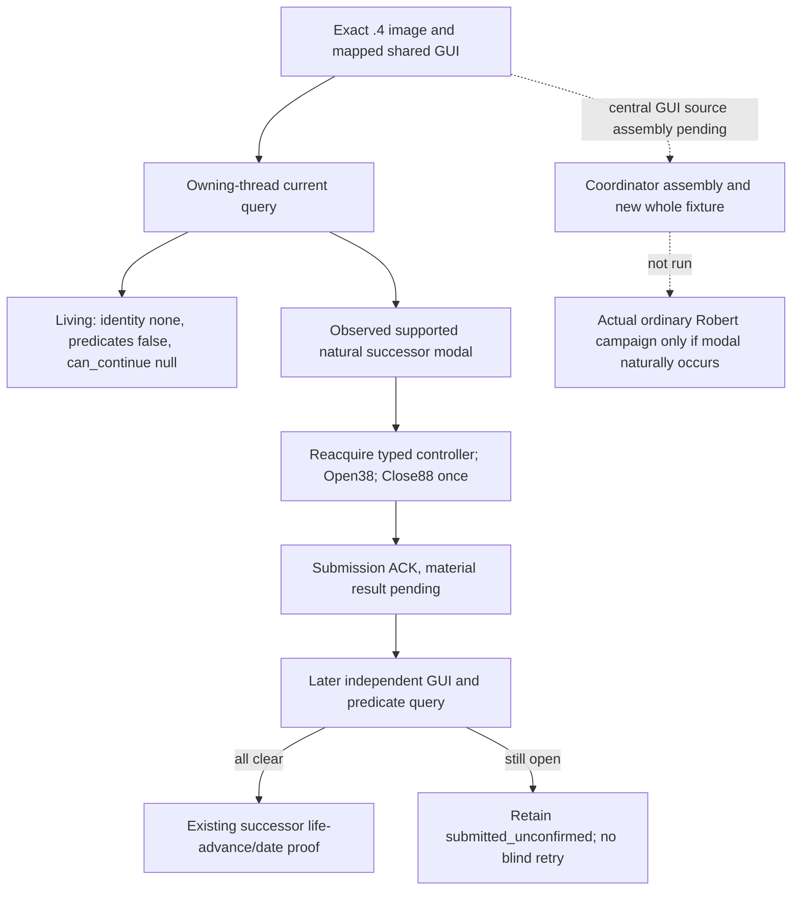

# Death/succession modal migration to exact 1.20.0.4

2026-10-07 / W41. This package migrates the adopted `XAR_CK3_ENABLE_G2_DEATH_SUCCESSION_MODAL_PRIVATE_V1=ON` provider. Its native callback/controller/handler pins are closed. Implementation and the native/MCP whole fixtures are **AUTHORED_NOT_RUN**. The central GUI helper assembly and coordinator verification remain in progress; this is not a new production-live result. Historical `.3` living-player no-modal primitive and the corrected Close boundary remain in [the original topic](death-succession-modal-continue-v1.md) and [the exact `.3` transition tree](succession-transition-v1.md#2026-10-03-war-time-natural-succession-exact-12003-modal-abi-migration).

This is an engine-transition tree. No NPC policy is changed. Actor and episode remain the actual currently played, naturally reconciled successor; no fixed successor ID, forced death or manufactured runtime modal is introduced.

The input ledger was read before implementation from baseline `caa4adc3d1278e324cf4ec19774028e9b9138e28`. The reached old provider is `native_bridge/src/ck3_12003_succession_modal.cpp`, selected through the existing query and Close mailbox contexts. The similarly named generic `death_succession_modal_v1.cpp` is not its source file. The old reflected Close research file is a **historical 1.19.0.6 contract** and supplies no `.4` image addresses.

## Exact build and finite evidence

New build: CK3 **1.20.0.4**, Steam **25734779**, executable SHA-256 `98702F88A547CDE2EAF29A85F93B85F68EE4CF8148336A4F7AFAEB75319DD518`. This source lane consumes the existing frozen identity and mapper JSON; it does not open or hash an executable. Old build: `.3`, Steam25652598, SHA `94B55397ABB687A3DCD436805A5D885E6BE90FA6C693FEB44A9E3BBEEADE02A6`.

The [finite request](Z:/ck3_mod_rewrite_process_assets/g2-background-20261007/death-succession-actual4/FINITE-MAPPER-REQUEST.json) selects seven old held modal bodies plus the already shared runtime-cast body. The lineage constructor/controller and unrelated GUI/command neighbors are excluded. The old body and typed RTTI metadata are held at `OLD-MODAL-PINS-CACHE.json` and `OLD-RTTI-LOCATORS-CACHE.json` in the same external packet. All new bindings come from actual instruction/target/table pairs, never from a global RVA shift.

| Reached input | Actual `.4` value | Evidence |
|---|---:|---|
| Jomini/idler root slot | `5C6A520` | Closed shared core and handler-accessor source operands |
| Runtime cast | `4260E74` | Shared complete 358-byte body reuse in family map |
| Cast source / target TypeDescriptor | `5514438` / `5514460` | Actual getter RIP target pairs |
| Ingame handler getter | `10EC150..10EC1E9` | Complete 153-byte body, root `+10` / handler `+88` source-use operands |
| Handler primary vtable / TypeDescriptor | `44BA8A0` / `5694B20` | Faith shared typed COL, name and offset0 |
| Global pause predicate | `A7C440..A7C4C1` | Complete 129-byte body comparison |
| Per-character succession predicate | `A7C4D0..A7C531` | Complete 97-byte leaf through final return |
| Controller Close | `10D8900..10D8B11` | Complete 529-byte body comparison |
| Controller Open | `10D8BC0..10D8C5B` | Complete 155-byte body comparison |
| Controller constructor caller | `B07CD0..B07D85` | Complete 181-byte body; handler controller field `+260` |
| Controller primary vtable | `4522DA0` | Actual constructor LEA/store at `10D78BE/10D78C5`, typed COL `4AFB430`, offset0 |
| Controller Open / Close vslots | `+38` / `+88` | Actual table entries point to the independently compared Open / Close bodies |
| Native close-command primary / secondary tables | `4760520` / `47605B8` | Actual Close construction RIP targets plus typed COL offsets0 /18 |
| Native close-command executor | `2894C20..2894D06` | Complete 230-byte split body and secondary vslot `+08` |

The mapper's [family map](Z:/ck3_mod_rewrite_process_assets/g2-background-20261007/death-succession-actual4/deathmapper-onlypacket/FAMILY-MAP.json), [window table](Z:/ck3_mod_rewrite_process_assets/g2-background-20261007/death-succession-actual4/deathmapper-onlypacket/SUCCESSION-WINDOW-TABLE.json) and [command tables](Z:/ck3_mod_rewrite_process_assets/g2-background-20261007/death-succession-actual4/deathmapper-onlypacket/CLOSE-COMMAND-TABLES.json) close the unique native rows. Actual body operands retain GameData row data/count `+22340/+2234C`, row CharacterID `+B0`, opaque token `+D8` and active byte `+260`. The provider invokes native Close and reads native predicates; it does not directly write or construct this command.

The predicate semantic names retain the original topic's evidence boundary: their complete row behavior is recovered and compared, while the literal reflection-registration name association has not been independently recovered. The extra condition inside the global pause predicate stays native-owned and semantically unnamed. This migration does not promote those old name associations into a new independent reflection proof.

Faith's already captured shared accessor `B20140` proves Jomini slot → root `+10` → idler handler `+88`, and its typed table packet proves actual handler primary vtable `44BA8A0` / TD `5694B20`, idler vtable `44BC418` / TD `5514460`. Its [shared route tables](Z:/ck3_mod_rewrite_process_assets/g2-migration-20261007/faith-tenet/implementation-caa4/basic-map/route-tables/ROUTE-TABLES-CLOSED.json) and [shared accessor map](Z:/ck3_mod_rewrite_process_assets/g2-migration-20261007/faith-tenet/implementation-caa4/basic-map/window3/FAMILY-MAP.json) are reused, without another capture. The subsequently closed [actual handler getter](Z:/ck3_mod_rewrite_process_assets/g2-background-20261007/death-succession-actual4/deathmapper-onlypacket/handler/IngameHandlerGetter-DETAIL.json) independently compares its full153B and actual cast RIP inputs `5514438/5514460`; it follows Jomini `5C6A520`, not the separate GUI singleton `5CB87F8`. The dedicated native pins are now ready; no old descriptor identity is rewritten.

The frontend's [Setup receipt](Z:/ck3_mod_rewrite_process_assets/g2-background-20261007/frontend-bookmark-12004/owner-map/setup_named_constructor-DETAIL.json) proves the actual GUI root slot remains `5CB87F8`. The central GUI owner supplies the `.4` FindTop and reached singleton/widget layout witnesses for `ResolveNamedGuiWidgetV1`, `ResolveFirstVisibleEnabledNamedGuiWidgetV1` and `ReadGuiWidgetRuntimeV1`. Those helper inputs are an implementation dependency, not a claim that slot equality alone completes GUI migration.

## Implementation and original semantics

`ck3_12004_succession_modal.hpp/.cpp` is an independent exact `.4` binder/provider. It uses the `.4` core binder/character generation resolver and dedicated literal pins; it never substitutes the old executable SHA or calls the `.3` image binder. The GUI factory explicitly selects the central `GuiAbiRevisionV1::crozier12004`. Each mailbox context owns its `.4` GUI observation context for the whole queued/executing interval and passes the typed fixed-widget source to the native binder.

Both existing mailbox implementations dispatch `.4` and `.3` by their exact descriptor triples. Their original owning-thread, paused-frame, actor/episode and single-invocation contracts are retained. Registration, tool names, flags and public capability advertisement remain the adopted behavior. The shared bridge, adapter, central GUI and main CMake hooks are handed to their owner in [SHARED-HOOKS.md](Z:/ck3_mod_rewrite_process_assets/g2-background-20261007/death-succession-actual4/SHARED-HOOKS.md).

An available living `identity=none` frame has two available false native predicates and an unavailable/null `can_continue` with reason `no_supported_timeline_surface_visible`. That is distinct from an unavailable query with null predicates. For an actual supported modal, Close still uses reflected vslot `+88` once. Its ACK only proves method return/submission; an independent later observation must clear GUI identity and both native predicates before the existing transport can proceed to actual successor date movement. An ACK or authored fixture cannot earn natural-succession or live-loop credit.

## Authored verification and report fields

The new native whole fixture calls the actual `.4` binder, core generation resolver, query, controller acquisition/Open/Close and production timeline serializer with caller-owned fake memory and typed GUI input. It checks legal living null, supported modal, one controller submission, still-open state after ACK and a separate later clearance. Native functions are replaced only by local fixture callbacks. The new registered MCP consumer uses the actual `NativeHeadlessGameplayDriver` and `create_server`; it consumes the native fixture packet with the `.4` hello identity, verifies legal null through the registered query, blocks Close on the living frame, and retains one submitted/unconfirmed Close without date movement when the later fixture query remains open.

Sources: `src/current_timeline_blocker_12004_whole_fixture.cpp`, `cmake/death_succession_modal_whole_fixture_12004.cmake`, `tests/unit/test_death_succession_modal_registered_mcp_12004.py`. Both are **AUTHORED_NOT_RUN**. The coordinator owns the single build/fixture/MCP invocation after shared source assembly; this lane ran zero tests, builds, SDK turns or game queries. No live artifact was created, and existing natural successor/Close counts remain unchanged.

Oct7/W41 completed: adopted route/input ledger located; finite old-body request and held typed RTTI metadata delivered; independent `.4` provider, exact mailbox dispatch, whole native/MCP fixtures and concrete shared hooks authored; all modal callback/handler/controller actual-map literals consumed and native pins ready. In progress: central GUI helper witness/source assembly, shared bridge/main CMake assembly and the new coordinator verification. Reason: these are actual reached shared native inputs supplied once by their owner. They are finite construction work, not a permanent unavailable/null endpoint.

Cost separation: this source lane performs **0 EXE reads/hashes, 0 builds/tests, 0 SDK/game activity, 0 Git commits/pushes**. The delegated unique mapper records **23 new partial reads / 1909 bytes**: six unique bodies1321B, getter153B, one constructor operand10B, window typed table77B and close-command typed tables348B; the runtime-cast358B and old bodies/RTTI are reused. Shared Faith/frontend/GUI costs belong to their original owner receipts and are not double counted. Parent coordinates the combined source commit/push and merges these fields into the shared Oct7/W41 reports.
