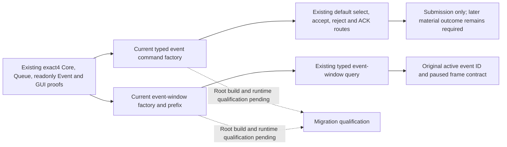

# Existing default Events MCP migration to 1.20.0.4

October 7, 2026 / W41. Source baseline `c8f19a6a067ef8dd56926b8bc11d14b164045974`.
Exact target: CK3 1.20.0.4 / Steam 25734779 / held SHA
`98702F88A547CDE2EAF29A85F93B85F68EE4CF8148336A4F7AFAEB75319DD518`.
This restores existing default event actions and the current-event-window
reader. It adds no event policy, event generation, gameplay or G2 progress.
The source tree was recorded before implementation at
`Z:/ck3_mod_rewrite_process_assets/g2-background-20261007/upstream-build-migration/default-events-12004/SOURCE-TREE.md`.

The actual4 adapter's SnapshotFoundation already reads active events and
pending interactions. Its default `bindings.events` was nevertheless empty,
and the inherited action methods used old command-table constants. Separate
readonly Snapshot support does not provide action construction. The current
event-window typed executor likewise selected the old SHA-rejecting binder;
its default token and actual4 early typed route were absent.

The independent `ck3_12004_events.hpp/.cpp` factory reuses the existing
software EventsBindings DTO while binding actual4 Core, GetCurrentEvent,
pending storage/routing and Reply validation. Its actual4 submitters construct
the current typed Select and Reply commands. The concrete adapter retains
ownership of its command bundle and repairs the submit callback/context after
moving the bundle; the factory stores no pointer to a temporary. Root's
shared hooks assign the binder, select the actual4 submitters by exact
descriptor and restore the four existing action tokens. Old methods remain
their historical providers.

| Current command/input | Actual4 source closure |
| --- | --- |
| Select primary/secondary vptr | `47733E0` / `4773540`, constructor RIP and typed COL offsets 0 / 24 with exact Select class name |
| Select validation / execution / Clone | `29BDFC0` / `29BDDE0` / `29BE2B0`, complete 56 / 477 / 123-byte bodies and corresponding table slots |
| Select native UI construction | `18578F0`, complete 454-byte body; played owner at Event `+1B8`, full event ID at command `+20`, option `+24`, flags zero and channel 7 |
| Reply primary/secondary vptr | `448BC28` / `448BBF8`, reused exact typed readonly Reply packet and current Clone stores |
| Reply execution / primary Clone | `29683B0` / `86D880`, complete 191 / 123-byte bodies; full ID and reply copied at `+20` / `+24` |
| Notification ACK construction | `136E0C0`, complete 98-byte body; existing discriminator 4 and channel 14 |

These seven complete named bodies, typed command tables and current owning
queue proof close the action lane's native source. `EventCommand` remains 40
bytes with secondary vptr `+18`, flags `+8` and complete signed payload fields.
Option bounds, played owner, current pending identity, ACK-only notification,
paused ACK and native reply validator semantics are retained. Command return
or queue acceptance does not prove event or interaction resolution.

The source commit is `8189c78d`. Its final proof and shared hook recipe are
`event-actions-12004/EVENT-ACTIONS-NATIVE-CLOSURE.json` and
`ROOT-SHARED-HOOK-RECIPE.md` within the parent migration packet. Exact action
cost is 30 finite reads / 3,456 bytes through the existing shared
FamilyMapper/O_EXCL cache API, with zero whole-image reads, hashes or helper
expansion. The first secondary-table projection included 16 trailing data
bytes; it is retained, and only the correct 48-byte COL/table prefix is
qualified. No repeat capture was used to conceal that projection.

The event-window factory and consumed-field closure are sealed in the
separate `event-window-12004/` packet. Source commits are `662c0abe` followed
by `a79337c16ab2dd5e7c92d65ac1cf842adc7ec405`. Its 20 exact pins, seven
existing readonly callbacks, six compared primary vptr identities and all
116 declared consumed operands are closed. It borrows current Core, Event,
GUI, Faction and Title source. A nullable observation-prefix callback is
necessary in the existing EventWindowBindings DTO: the old prefix reader
internally constructs old Reply commands while observing pending state.
Actual4 uses the qualified actual4 Core/SnapshotEvents prefix, including its
current Reply tables; old factories retain the null callback and original
reader.

Trait identity receives one further current-build callback. The direct
Trait GetName wrapper closes database/native-ID/returned-definition arguments
and key `+18`. The complete 239-byte `C85E80` native lookup has no calls and
only local branch/return paths. The current reader requires a unique payload
in the database array and a matching canonical native lookup result; it no
longer borrows the old unproved definition ID `+10`. Historical factories
leave the callback null and preserve their original member-based reader.
Stable-key uniqueness remains required. The source proof is
`event-window-12004/COMPLETE-NATIVE-TRAIT-LOOKUP-MAP.json` and its sealed
source-closure ledger.

Native token subtype/payload are witnessed by the current named 16-byte
copy, whole kind/subtype-zero store and Character resolver's scalar `+8`.
The original EventOption materializer directly proves the consumed 32-byte
Name/Reason string representation: lower and upper 16-byte copies, size `+10`,
capacity `+18`, inline threshold 16 and heap data at `+0`. No unrelated CString
class is used as a layout substitute. The complete source packet records
246 finite partial reads / 6,429 bytes and 51 held-cache reuses. An initially
unaligned three-byte copy projection, a vector allocator mistaken for a
string constructor and a singleton getter containing no trait ID are all
retained as unused attempts. No failed attempt is promoted into field proof.

The minimum shared window hooks also admit only the existing `event_window`
kind to actual4 early typed dispatch, select the actual4 factory, restore
`game.command.query-current-event-window-context-v1`, and permit actual4's
existing nullable saved Character scope in the typed renderer. The parser,
expected native revision, active event full ID, paused snapshot and completion
snapshot checks remain the existing contract. A campaign without an active
event fails the current active-event request gate; it is not a reason to
invent an event or weaken that gate.

Readiness is **research / native source closed for both existing providers;
implementation authored, Root build and runtime qualification pending**.
No static-ready, action-live or loop credit is claimed by this source lane.
The normal Robert 29829/H9613 campaign currently has no active event. No new
event is required before maintenance handoff. This work performs no build,
test, SDK query, game action, Driver read or save-body read. Parent/Root owns
shared integration, the sole formal build/runtime entrance, report merge and
push.

Root adds only two production translation units:
`ck3_12004_events.cpp` and `ck3_12004_event_window_context.cpp`. The existing
event-window header changes require its reader/serializer and their dependent
translation units to recompile normally; the window delivery enumerates all
26 dependencies, while the action delivery enumerates its eight dependencies.
There is no new test target in this source lane. Root's separate offline
qualification owner receives these pins and the original meaningful positive
fixtures; it must preserve their assertions while supplying actual4 inputs.
A positive old fixture, a current empty event scene or a command ACK is not
an actual4 event-resolution result.

Combined unique new mapping cost is 276 finite calls / 9,885 bytes. Current
proofs, source commits, shared recipes and Oct7/W41 handoff fields are indexed
at `default-events-12004/ROOT-DELIVERY.json` within the parent migration packet.

## First production consumer failure and necessary repair

Root's actual `.4` Window native fixture passed, including canonical trait
lookup. The next02 registered MCP compound then failed after nine checks:
`events-phase-existing-next02/window/registered/RESULT.json` is RED,
`qualification=synthetic-native-fixture`, two cases, zero live queries and
zero game actions. Its stderr is
`events-phase-existing-next02/01-registered-window.stderr.log`. Preserve these
failures and the original next01 native frames; they are separate from a
nonempty production game event.

Two production source gaps explain the rejected frame. The strict Python
normalizer omitted the `.4` backend from both its exact provenance and build
maps. The shared `.2` serializer emitted idler `0x44BC408`, while the actual
`.4` factory and closed typed source pin use `0x44BC418`. Identity rendering
changed backend and indicator coverage but did not change that locator.

The source repair adds an explicit `.4` provenance row with unchanged root
`module+0x5C6A520->+0x10` and manager `+0x28`, and exact idler `0x44BC418`.
It also accepts only the already bound `.4` reader's numeric scopes, nullable
saved character/title identities and six indicator kinds; field, identity,
coverage, readiness and completeness assertions remain intact. Historical
build behavior remains intact.

Root's shared adapter recipe scopes the idler replacement to the existing
exact `.4` descriptor guard and `current-event-window-context-v1` schema.
Only `ck3_12004_adapter.cpp` needs to recompile; no header, new target or
fixture JSON changes are needed. The source patch and affected-only retry
recipe are indexed by
`event-window-production-provenance-fix-12004/ROOT-DELIVERY.json` in the
migration packet. This repair is **SOURCE_READY / Root validation NOT_RUN**;
there are no new native reads, builds, tests, SDK calls or game actions in
this repair lane. Events, Phase and Pending qualification is reused.
