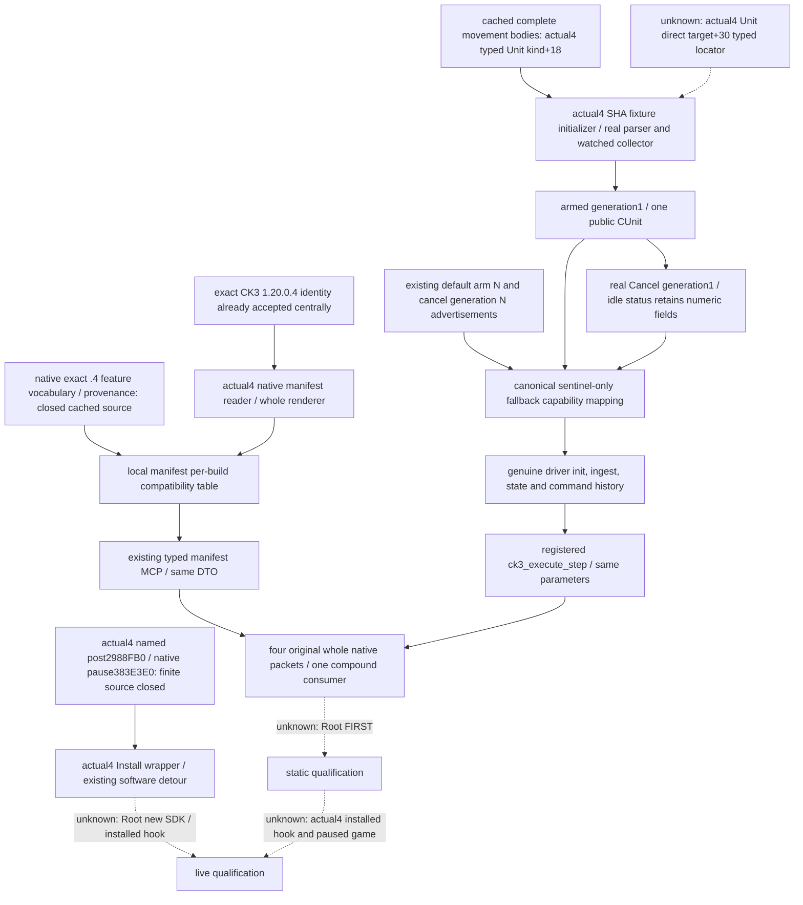

# Default feature manifest and tactical sentinel migration — CK3 1.20.0.4

Actual work: 2026-10-07, Asia/Shanghai, ISO2026-W41. Source-first plan is `Z:/ck3_mod_rewrite_process_assets/g2-parallel-20261007/default-manifest-sentinel-12004/consumer-docs/SOURCE-FIRST-PLAN.md`. Adopted tree is `C:/codex-ck3-background/parallel-integrations-20261007/default-sentinel-12004`, base `e0ea249ae557749299735bc4cf53dfaa757aad50`. This package is AUTHORED_NOTRUN; no child qualification is claimed.

The installed build is Root's frozen CK3 `1.20.0.4 / Steam25734779`, SHA-256 `98702F88A547CDE2EAF29A85F93B85F68EE4CF8148336A4F7AFAEB75319DD518`. `bridge/version_identity.py` already recognizes that exact pair. The historical installed-build named-metadata null is retained as history; later ASCII .4 proof comes from Root's `global-pe-diff/NEW-PE-METADATA.json`. These identity facts do not automatically qualify old native slots or bodies.

The original sources are [loaded-feature-manifest.md](loaded-feature-manifest.md), [battle-speed-control.md](battle-speed-control.md), [battle-decision-epoch-cruise.md](battle-decision-epoch-cruise.md), and the native `loaded_feature_manifest_v1_abi.json` / `tactical_daily_sentinel_v1_abi.json`. They establish the existing semantics and historical1.19.0.6 qualification. The manifest resolves effective gameplay features and current runtime `has_dlc` keys. It does not infer account entitlement; the existing entitlement component remains `unavailable` with `store_verdict_provenance_unclosed`. This is a state resolution tree, not an AI scoring policy. Sentinel Arm/Cancel operates the existing bounded native state; this fixture performs no day advancement or original hook call.

Two concrete compatibility gaps have source implementations in this package. Before the edit, the manifest's local per-build feature definitions and provenance maps have entries only through .3, although its central exact-build resolver accepts .4. A genuine .4 manifest therefore cannot traverse the old local table. The local edit adds the CK3_12004 import, the source-proved44-item vocabulary alias to CK3_12002, and the exact .4 provenance entry. The new actual176-byte enum data is equal to the old44 IDs; this supports vocabulary reuse while retaining actual .4 version, SHA and enum address. The central identity and build-agnostic sentinel status normalizer remain unchanged.

The exact .4 manifest provenance is root `0x5CB87F8`, bitset `root+0x2B0`, enum table `0x47334D0..0x4733580`, runtime script DLC set `0x5CC15E0`, and backend `ck3-1.20.0.4-native-loaded-feature-manifest-v1`. The independent name-getter proof closes RVA `0x3F4F8E0`. Native source receipts are `feature-native/ROOT-DELIVERY.json` and `feature-native/SOURCE-LEDGER.json` under the external package root. They reference the dedicated feature-root leaf map, feature-DLC map, feature-registry-data map, and doctrine ParameterTokenKey family map. This Python leaf consumes those cached proofs and does not read native bytes or substitute an older build SHA.

The second gap is a real caller mismatch. The production composite at `native_driver.py:21646..21685` formats canonical arm arguments and submits via the existing arm N capability. Its cancel path at `21853..21875` submits with the existing generation N capability. The generic `ck3_execute_step` route falls through at `9645..9648` to `_execute_primitive_step`, whose ordinary admission at `10809..10819` requires the literal concrete step in `action_steps`. The default advertisements contain generic N templates, so this same native-supported canonical arm/cancel is unreachable through the raw registered MCP.

For example, `research-arm-tactical-daily-sentinel-v1-53236608-to-53236632-speed-1-mode-terminal-a-1-83886367` previously fails literal action-step admission even when the default arm N capability is advertised. The implemented `_canonical_tactical_daily_sentinel_step_capability` classifies that existing canonical arm form and passes the existing arm N capability to the unchanged primitive, just as the production composite does. `research-cancel-tactical-daily-sentinel-v1-generation-1` similarly uses the existing cancel template. Classification follows native canonical arm/cancel grammar at `tactical_daily_sentinel_v1.cpp:496..579`, using the existing canonical public-CUnit decimal/token parsers including slot0. It checks the existing date/speed/mode/count/token grammar and positive uint64 cancel generation. All other fallback steps retain their admission, and action-step advertisements are not expanded. These source pins refer to the immutable e0ea base, before insertion changes line numbers.

Wire schemas, DTO fields and native source meanings remain unchanged. The MCP routes remain `ck3_query_loaded_feature_manifest_v1(expected_revision)` and `ck3_execute_step(step, expected_revision, expected_h2743_frame)`. There is no new capability, policy, telemetry or gate. Whole native actual4 serializers are declared in `xar_bridge/ck3_12004_default_routes_mailbox.hpp` for manifest, arm, cancel and status. The actual4 fixture initializer takes the inherited bindings, exact .4 SHA and fixture callbacks, then reaches the real existing native parser/Arm/Cancel/status code.

The new consumer is authored as `DefaultManifestSentinelServiceTests.test_whole_native_default_routes_registered_mcp_compound` in [test_default_manifest_sentinel_service_12004.py](../../ck3_autonomous_player/tests/test_default_manifest_sentinel_service_12004.py). It requires four original native files: `01-loaded-feature-manifest.json`, `02-sentinel-arm.json`, `03-sentinel-cancel.json`, `04-sentinel-status-idle.json`; an absent producer directory is explicitly NOT RUN. The initialized NativeHeadlessGameplayDriver, frame ingestion/state, execution and command history remain production code. Endpoint/default capability advertisement and paused frame are synthetic. The test asserts that generic arm N/cancel N capabilities are advertised and their concrete steps are absent from action_steps, then submits both concrete forms through registered `ck3_execute_step`. Correlating request_id does not change any native result body.

The final sentinel scene starts at date `53236608`, targets `53236632`, speed `1`, terminal mode and one watched public CUnit `83886367`, resolving internal CArmy `50331794`. It is stationary, has null direct target, retreat counter0 and Combat ID−1. Arm yields state `armed`, generation `1`, last-observed date `53236608`, trigger date `0`, army count1, combat/tick/intermediate/flags `0`, signed delta `0`, overshoot `−1`, and all pause/terminal/abnormal booleans false. Cancel expected generation `1` yields accepted `canceled`; it changes state to `idle` without resetting dates, counts, mode, speed or generation. The fourth original packet reports that retained idle state. These are native fixture values, not running-game observations.

The manifest scene contains44 native rows, enabled indices0/5/43 and UTF8-sorted script keys `A Flavor Pack`, `The Royal Court`, `É Pack`, with typed entitlement unavailable. The synthetic consumer frame is paused, public revision `4`, native manifest revision `11`, date `53236608`, public player Character `29829`. Native Player ID `7`, public owner Character `29829`, current commander Character `30000`, public CUnit `83886367` and internal CArmy `50331794` have distinct roles. CUnit+178 resolves internalArmy while +174 is owner; Army+124 is publicUnit while +120 is commander and +128 is Combat. The watched fixture uses these roles rather than substituting character IDs for army IDs.

The sole method asserts the complete original native result in the endpoint delivery and registered response, typed manifest mirrors/binding/readiness, stable revision/date, generic advertisements, four real transport requests and monotonically appended production command history. Native arm/status serializers produce outer status `available` with leaf state `armed`/`idle`; cancel produces outer status `canceled` without a status leaf. The unchanged primitive adds its ordinary `backend_id` annotation to those sentinel responses. The test distinguishes this production annotation from the original native result and never rewrites native rows, driver state or command history.

Actual .4 sentinel binder, fixture initializer and installer source are recorded in `sentinel-native/NATIVE-DELIVERY.json`, `CACHED-DEPENDENCY-EXTRACT.json`, `COLLECTOR-SOURCE-UPDATE.md`, `INSTALL-MAPPED-SOURCE-PROOF.json` and `SOURCE-FIRST.md`. Their reused cached Army/Combat members close generation storage and the collector roles used here. CUnit kind+18 is now closed by typed current movement bodies: actual land instruction `24AA929` and naval `24AABE6` compare DWORD `[rcx+18]` with0 on the typed incoming CUnit. The remaining separate collector dependency is the exact .4 directtarget+30 typed locator, including the target row ProvinceID+10. A null direct-target fixture cannot qualify an installed field locator and semantic remaining-route+38/+44 is not a substitute.

The actual .4 installer now exists in `ck3_12004_tactical_daily_sentinel.cpp`. Its exact4 SHA selection uses actual Core/storage bindings and explicit defaults for the existing software install environment: post-stage `0x2988FB0` and true native pause callback `0x383E3E0`. Original software installation, exact15B prologue anchor, original function once then evaluation, Arm/Cancel and watched collector remain in the real existing sentinel TU. The actual named post-stage is distinct from pre-date roster function `2A99DA0`.

`SENTINEL-INSTALL-SOURCE-READY.json` under the external packet closes four finite roots. The declared legacy .2 post-day298B cache is explicitly compared to fresh actual .3 `2988FD0..29890FA` and is exactly raw-equal; it is never relabeled as a .3 cache. Complete actual .3/.4 post bodies prove `2988FD0 -> 2988FB0`,298B, normalized instruction/ordered edge/local topology equality. Both have exact first15 bytes `48895c24084889742410574883ec20`. The body preserves the original `void(void*)` call shape, does not access incoming receiver members and overwrites RCX before typed GameData+2D50 AIExecute; preserved timing callees and downstream AI are outside this finite closure.

The typed actual CPause secondary vtable `476C878` slot+8 supplies the actual leaf candidate `2987950`; no .pdata exists for this leaf. Its20B body plus12INT3 in the bounded32B named window maps actual .3 `2987970 -> 2987950`. It loads native PlayerID from secondary+8 into R8D, bool from+C into EDX, actual Jomini slot `5C6A520` into RCX and tail-jumps to true wrapper `383E3E0`. This is separate evidence from queued PauseCommand and from the historical `346B910` callback.

The true wrapper `383E400 -> 383E3E0` has complete137B normalized equality. It compares Jomini+20 against DL; its true branch sets DL1 and calls immediate leaf `383E320`. That only necessary immediate paused-write leaf maps `383E340 -> 383E320`, complete182B. Actual .4 instructions save native PlayerID R8D into ESI, bool DL into BL and Jomini RCX into RDI, then write `byte[RDI+20]=BL` at+155 and `DWORD[RDI+24]=ESI` at+158. The wrapper is the genuine three-argument native callback; the existing signed software PlayerID argument passes the same32 bits under Windows x64. No raw paused byte write is introduced by the port.

Actual finite capture cost for this necessary installer scope is1298B total,8 partial reads across actual old/new images,649B each. The298B legacy cache and all Core/Army/feature/movement proofs are reused; hash, whole EXE read, PE reparse, cached .pdata reread, build, project test and game counts are0. Three successful finite mapper invocation receipts preserve timestamps, exit0, raw stdout/stderr and exact source locators. The earlier metadata-only planner rejection of the no-.pdata pause leaf is retained as `SENTINEL-NAMED-PDATA-INPUTS-FIRST-RED.txt`, and was repaired using the real typed vtable before the first executable slice read.

These are source and implementation facts. Installed .4 hook, true pause operation, combat traversal and paused-game qualification remain Root FIRST. The four-wire fixture calls no day advancement, original daily hook or pause callback; it does not install the detour or demonstrate game behavior.

All new FIRST remains NOT RUN. This child runs no project import, test, build, game/native execution, hash, Git or diffcheck. Root owns focused qualification, Parent owns source integration and shared Oct7/W41 reports. The external source/API ledger, recipe and final handoff are under `Z:/ck3_mod_rewrite_process_assets/g2-parallel-20261007/default-manifest-sentinel-12004/consumer-docs/`.
