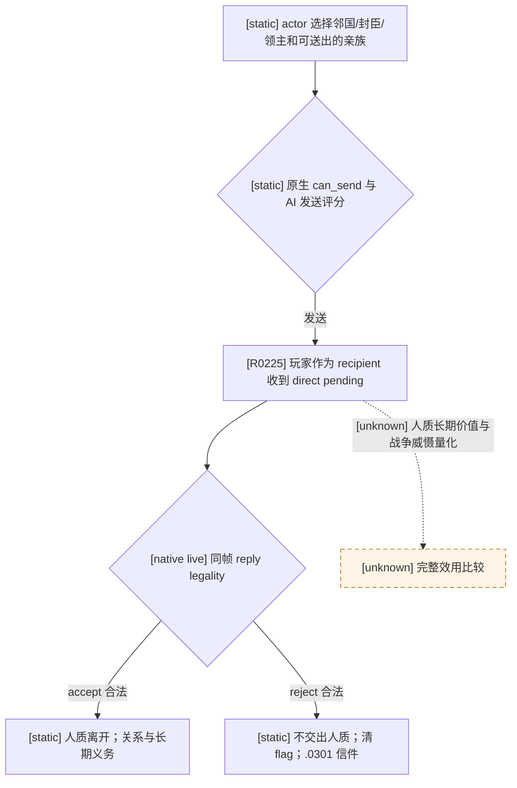

# `demand_hostage_interaction`：Robert R0225 入站人质要求

## 冻结来源与实际帧

- CK3 `1.19.0.6-steam23530548`，EXE SHA-256 `2D00FF3101EF70B566F2FCBAE292F09263199C80E9DC8F139B82D7D96F83DB86`。
- 原版 `game/common/character_interactions/05_bp2_interactions.txt:593-1282`，完整文件 SHA-256 `78526C7BBC520B4F8D8713DC80BF8C089655A3000B661FC104FA1AF139AD7E94`；拒绝通知在 `game/events/interaction_events/character_interaction_events.txt:2469-2510`，完整文件 SHA-256 `D238E0A3442F41C35AF35157D47A754CB200B72AB2A0184BAEFC86E63347A150`。[static-confirmed]
- R0225 的独立 Robert R0149 冷配对在候选 `g2-robert-nonwar-prewar-r0149-20260926-c2` turn 3 读到 signed pending ID `771752055`；turn 4 paused `native:7`、public revision 8、native revision 7、date raw `53154192`，actor/sender `37011`、player recipient `29829`、secondary recipient/被要求送出的人质 `36077`，direct local recipient，age/expiration/remaining `1/60/59`。[production-live observation]
- Native accept/reject 均合法且可达，block/acknowledge 不合法；唯一 send option 的 numeric flag 49 未选择。`special_data_present=false`，special-war binding 明确 not applicable。现有策略因为 definition 未分类而提交零 reply，`run_status=blocked`；checkpoint 仍是 R0149 h90，窗口已最小化且进程树清理完成。[production-live RED]

## 原版路径与后果

该 definition 是 `interaction_category_diplomacy`，收到时弹窗并暂停。`is_valid_showing_failures_only` 排除双方正在互相战争或已结盟；AI 发送前仍受目标、角色、亲族资格、冷却和 `can_send` 约束。`ai_will_do` 从 base 0 加 opinion、领地关系、相对军力、文化及邻居等修正；`ai_accept` 还使用人物关系、dread、人质重要性和政治力量。文化/信仰修正只作为原版 AI 评分输入记录，本包不读取或实现通用宗教策略。[static-confirmed]

`on_accept` 把 `secondary_recipient` 作为人质送往 actor 宫廷，启动人质关系/潜在停战义务，并给 actor 发 `.0331` 信件；玩家的人物承诺价值和长期成本尚未量化。`on_decline` 不调用 `hostage_depart_effect`，清除该人物的 `under_offer_as_hostage_flag`，给 actor 发 `char_interaction.0301`。该信件只有一个无效果选项；若 recipient 是 actor 的封臣，其 immediate 分支可给 actor 增加小额暴政，并按 AI 条件调整好感。是否为该关系要以实际角色状态判断，不从人名猜测。[static-confirmed；具体关系未查明]

## 我方最小决策与验收边界

这一条 exact key 的拒绝路径是非宗教外交决定，直接后置不提交战争或花费资源；接受会给玩家绑定未定价的人质义务。已有 `ordinary-reject-unique-accept-v1` 的降级规则可在完整同帧身份、reply legality 与命令可达时选择 typed reject。分类只能加 `demand_hostage_interaction` 这一条及冻结源 SHA，不能推广到其它 hostage/exchange/offer 定义，也不能从 `special-war not applicable` 推出任何其它定义安全。记录 `war_sensitive=true`，因人质长期影响战争关系；这不是战争公式研究。[counter-policy design]

验收必须另有正式 typed reply、旧 signed ID 在独立 paused frame 消失、下一 turn 不重复、合同规定 checkpoint/cold restore；拒绝 ACK 不能证明人质关系或暴政后果。当前 R0225 只证明阻塞帧与原生合法性，新策略尚未实机验证。[live pending]
